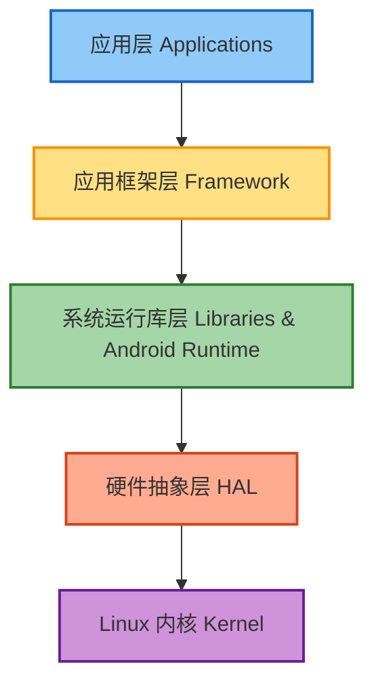
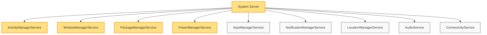
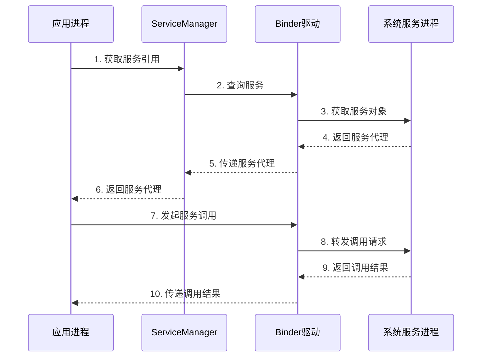
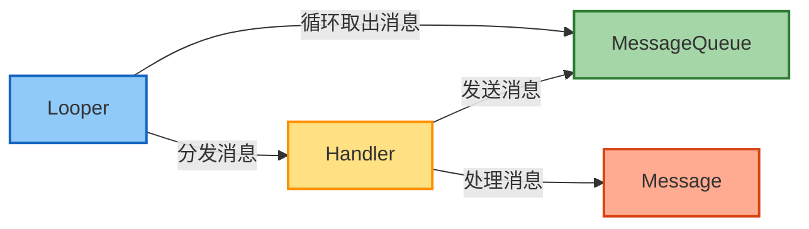
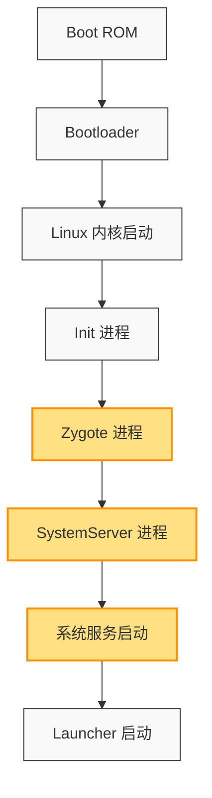
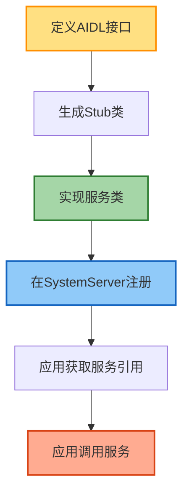

# Android Framework 基础入门

## Framework 概述

Android Framework 是 Android 操作系统的核心框架层，它提供了一套完整的系统 API 和服务，使应用开发者能够访问底层系统功能。Framework 层位于应用层和 Native 库层之间，是连接应用与底层系统的桥梁。

### Android 系统架构图



## Framework 层的重要性

1. **统一的系统服务接口**：提供标准化的系统功能访问方式
2. **应用程序的运行环境**：管理应用的生命周期和资源
3. **系统稳定性保障**：隔离应用与底层系统，提高系统鲁棒性
4. **开发效率提升**：封装复杂的底层实现，提供简洁的 API

## Framework 层的核心组成部分

### 1. 核心服务（Core Services）

Framework 层包含多个核心系统服务，每个服务负责特定的系统功能：



#### ActivityManagerService (AMS)
- 管理所有应用程序的 Activity 生命周期
- 处理应用程序的启动、切换和关闭
- 管理应用的任务栈（Task Stack）
- 监控应用 ANR（Application Not Responding）状态

#### WindowManagerService (WMS)
- 管理应用窗口的显示和叠加顺序
- 处理窗口的添加、移除和更新
- 协调输入事件的分发
- 与 SurfaceFlinger 配合完成界面渲染

#### PackageManagerService (PMS)
- 管理应用的安装、卸载和更新
- 解析应用的 AndroidManifest.xml 文件
- 维护已安装应用的信息和权限
- 处理应用间的组件调用和权限检查

#### PowerManagerService
- 管理设备的电源状态
- 控制屏幕点亮和熄灭
- 处理休眠和唤醒
- 管理电源相关的锁（WakeLock）

#### 其他重要服务
- InputManagerService：输入事件处理
- NotificationManagerService：通知管理
- LocationManagerService：位置服务
- AudioService：音频服务
- ConnectivityService：网络连接服务

### 2. 系统通信机制

#### Binder IPC 机制
Binder 是 Android 特有的进程间通信（IPC）机制，是 Framework 层最核心的通信方式：



- **高效性**：相比传统 IPC 机制，Binder 只需一次数据拷贝
- **安全性**：Binder 可以识别通信双方的身份
- **面向对象**：Binder 支持面向对象的接口设计

Binder 通信的主要组件：
- ServiceManager：系统服务的注册表
- Binder Driver：内核驱动，负责跨进程数据传输
- AIDL：Android 接口定义语言，简化 Binder 接口开发

#### Handler 消息机制
Handler 机制是 Framework 中另一个重要的通信方式，主要用于线程间通信：



- Looper：消息循环，从 MessageQueue 中取出消息并分发
- Handler：消息处理器，发送和处理消息
- Message：消息载体，包含要处理的数据和操作
- MessageQueue：消息队列，存储待处理的消息

### 3. 系统启动流程

了解 Android 系统的启动流程对理解 Framework 至关重要：



1. **Boot ROM → Bootloader**：加载并启动系统
2. **Kernel 初始化**：启动设备驱动和内存管理
3. **Init 进程**：第一个用户空间进程，解析 init.rc
4. **Zygote 进程**：所有 Java 进程的父进程，预加载资源
5. **SystemServer 进程**：启动所有系统服务
6. **启动 Launcher**：显示应用图标，完成系统启动

## Framework 开发入门指南

### 开发环境搭建

#### 1. 获取 AOSP 源码
```bash
# 安装 Repo 工具
mkdir ~/bin
curl https://storage.googleapis.com/git-repo-downloads/repo > ~/bin/repo
chmod a+x ~/bin/repo

# 初始化仓库
mkdir AOSP
cd AOSP
repo init -u https://android.googlesource.com/platform/manifest
repo sync -j8
```

#### 2. 编译环境准备
```bash
# 安装依赖（Ubuntu 为例）
sudo apt-get install git-core gnupg flex bison build-essential zip curl zlib1g-dev gcc-multilib g++-multilib libc6-dev-i386 lib32ncurses5-dev x11proto-core-dev libx11-dev lib32z1-dev libgl1-mesa-dev libxml2-utils xsltproc unzip fontconfig

# 设置环境
source build/envsetup.sh
lunch aosp_arm-eng  # 选择编译目标
```

#### 3. 编译系统
```bash
# 完整编译
make -j8

# 单独编译模块
make <module_name> -j8
```

### 调试技巧

#### 1. 日志分析
使用 `logcat` 查看系统日志：
```bash
adb logcat | grep <TAG>
```

常见日志级别：
- V (Verbose)：详细信息
- D (Debug)：调试信息
- I (Info)：一般信息
- W (Warning)：警告信息
- E (Error)：错误信息

#### 2. 源码调试
使用 Android Studio 进行源码调试：
1. 导入 AOSP 源码
2. 配置远程调试
3. 设置断点
4. 连接设备并启动调试

#### 3. 性能分析
- Systrace：分析系统性能和时序
- Perfetto：系统级性能分析工具
- simpleperf：CPU 分析工具

### 开始修改 Framework

#### 1. 修改系统服务
以修改 PowerManagerService 为例：

1. 定位源码位置：`frameworks/base/services/core/java/com/android/server/power/PowerManagerService.java`
2. 修改服务实现
3. 编译并刷入设备：`make updateapi && make -j8`

#### 2. 添加系统属性
在 `system/core/rootdir/init.rc` 中添加新的系统属性。

#### 3. 创建自定义系统服务
1. 定义服务接口（AIDL）
2. 实现服务类
3. 在 SystemServer 中注册服务
4. 在应用中调用服务

## 实例：创建简单的系统服务

下面通过一个简单的例子说明如何创建系统服务：

### 1. 定义 AIDL 接口

```java
// IMyService.aidl
package com.android.server;

interface IMyService {
    void setData(String data);
    String getData();
}
```

### 2. 实现服务类

```java
// MyService.java
package com.android.server;

import android.content.Context;
import android.util.Slog;

public class MyService extends IMyService.Stub {
    private static final String TAG = "MyService";
    private String mData = "";
    
    public MyService(Context context) {
        Slog.d(TAG, "MyService constructed");
    }
    
    @Override
    public void setData(String data) {
        mData = data;
        Slog.d(TAG, "Data set to: " + data);
    }
    
    @Override
    public String getData() {
        Slog.d(TAG, "Returning data: " + mData);
        return mData;
    }
}
```

### 3. 在 SystemServer 中注册服务

```java
// 在 SystemServer.java 的 startOtherServices() 方法中添加
try {
    Slog.i(TAG, "My Service");
    ServiceManager.addService("my_service", new MyService(context));
} catch (Throwable e) {
    reportWtf("starting My Service", e);
}
```

### 4. 在应用中调用服务

```java
// 在应用中调用系统服务
IMyService service = IMyService.Stub.asInterface(
    ServiceManager.getService("my_service"));
service.setData("Hello from app");
String data = service.getData();
```

### 自定义系统服务工作流程



## 学习路径建议

1. **掌握基础**：Java/Kotlin、Linux 基础
2. **理解架构**：Android 系统架构和组件交互
3. **阅读源码**：从简单服务开始，逐步深入
4. **动手实践**：修改和扩展现有功能
5. **解决问题**：分析和修复实际问题

## 推荐资源

### 书籍
- 《深入理解 Android 内核设计思想》
- 《Android 系统源代码情景分析》

### 在线资源
- [Android 源码在线浏览](https://cs.android.com/)
- [Android 开源项目](https://source.android.com/)

### 社区
- XDA Developers
- Android 源码分析社区

## 结语

Android Framework 的学习是一个渐进的过程，需要理论学习和实践相结合。通过本文的介绍，希望能够帮助你迈出 Android Framework 开发的第一步。随着不断学习和实践，你将能够更深入地理解 Android 系统的工作原理，并开发出更加高效、稳定的应用和系统功能。

---

*本文档仅为入门指南，随着学习的深入，建议参考更详细的技术文档和书籍。* 