# Android Binder 机制详解

## 概述

Binder 是 Android 系统中的一种进程间通信（IPC）机制，也是 Android 系统服务的核心支柱。与传统 Linux IPC 机制（如管道、消息队列、共享内存、信号量）相比，Binder 机制更加高效、安全，且支持面向对象的接口设计，使其成为 Android 系统中最重要的通信方式。

### IPC 机制对比

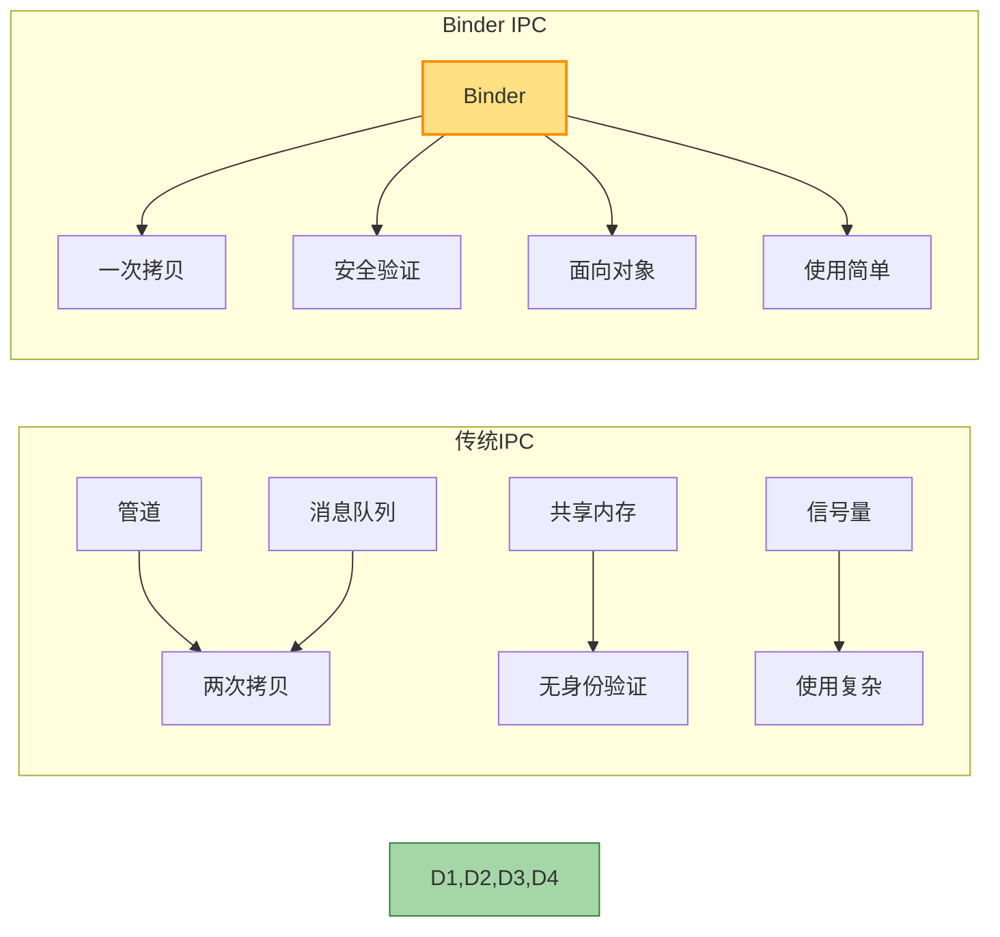

## Binder 的基本概念

### Binder 的本质

从本质上讲，Binder 是一种基于内存映射的跨进程通信机制：

1. **内核层面**：Binder 是一个 Linux 内核驱动（`/dev/binder`）
2. **用户层面**：Binder 提供了一套完整的面向对象的 IPC 编程接口
3. **功能层面**：Binder 同时支持同步调用和异步调用

### Binder 的优势

与传统 IPC 机制相比，Binder 具有以下优势：

1. **性能高效**：只需一次内存拷贝，而传统 IPC 需要两次
2. **安全可靠**：Binder 通信双方可以获取对方的 UID/PID，进行身份验证
3. **面向对象**：支持面向对象的接口设计，调用方式更加自然
4. **适合移动设备**：相比其他 IPC 机制，资源占用更小，更适合移动设备

## Binder 架构

Binder 的架构分为四个关键部分：

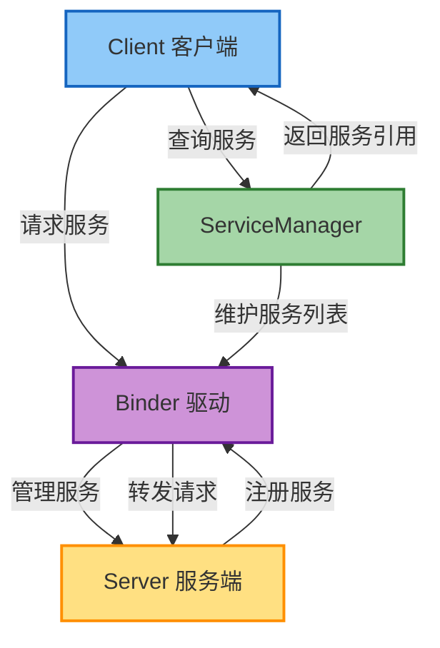

### 1. Client（客户端）

客户端是服务的调用方，通常是应用程序。客户端通过获取服务的代理对象（Proxy）发起远程调用。

### 2. Server（服务端）

服务端提供具体的功能实现，通常是系统服务或其他应用提供的服务。服务端需要实现 Binder 接口并注册到 ServiceManager。

### 3. ServiceManager

ServiceManager 是整个 Binder 通信机制的核心管理者，相当于 Binder 通信的"总线"。它负责：

- 注册服务（由服务端调用）
- 查询服务（由客户端调用）
- 维护已注册服务的列表

ServiceManager 本身也是一个 Binder 服务，但它的句柄固定为 0，是其他服务的"管理者"。

### 4. Binder 驱动

Binder 驱动是整个机制的核心，运行在内核空间，负责：

- 管理进程间数据传输
- 实现地址空间映射
- 维护 Binder 对象的引用计数
- 线程管理和调度

## Binder 通信流程

一次完整的 Binder 通信流程如下：

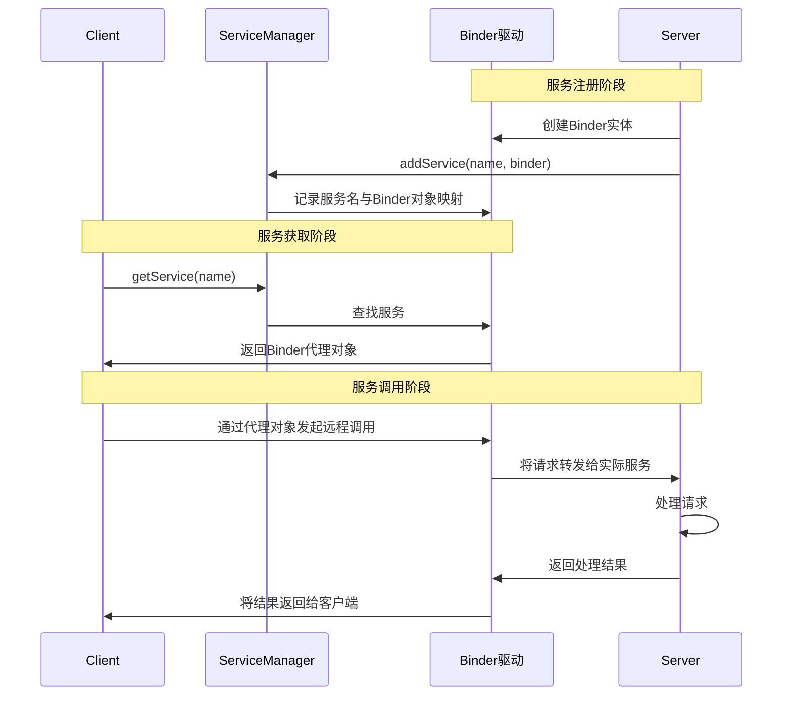

1. **服务注册**：Server 通过 ServiceManager 注册自己的服务
2. **获取服务**：Client 通过 ServiceManager 获取服务的代理对象
3. **请求服务**：Client 通过代理对象发起远程调用
4. **处理请求**：Binder 驱动将请求转发给 Server
5. **返回结果**：Server 处理完成后，通过 Binder 驱动将结果返回给 Client

### Binder 通信实例

以获取 PackageManagerService 为例：

```java
// 1. 获取系统服务
IBinder b = ServiceManager.getService("package");
// 2. 将 IBinder 对象转换为接口
IPackageManager pm = IPackageManager.Stub.asInterface(b);
// 3. 调用接口方法
PackageInfo info = pm.getPackageInfo("com.example.app", 0);
```

## Binder 机制的核心实现

### 1. 内存映射与单次拷贝

Binder 使用内存映射实现了数据的高效传输：

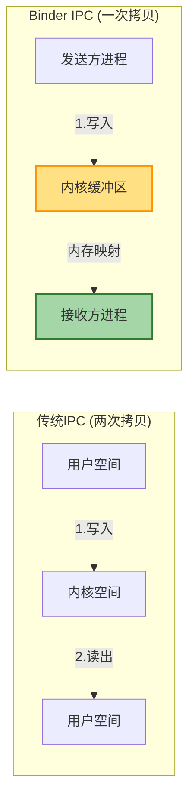

1. 发送方（Client）将数据复制到内核缓冲区
2. 接收方（Server）与内核缓冲区建立内存映射
3. 接收方直接访问映射后的内存，无需再次拷贝

这种方式只需一次数据拷贝，而传统 IPC 需要先拷贝到内核空间，再从内核空间拷贝到接收进程的用户空间，共两次拷贝。

### 2. Binder 线程池

服务端会创建一个 Binder 线程池来处理并发的请求：

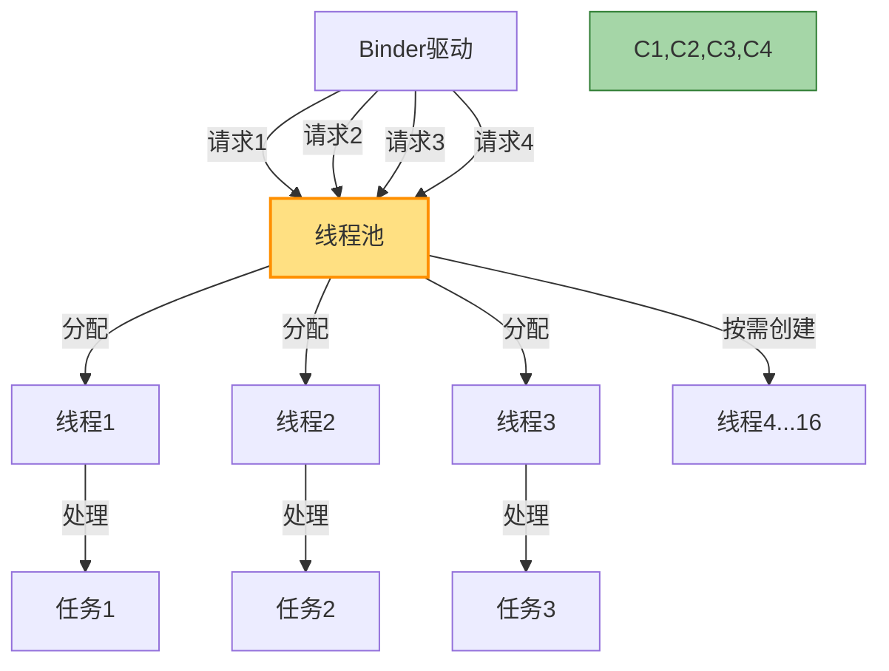

1. 线程池初始大小默认为 1，最大为 16（可通过属性配置）
2. 当请求增多时，Binder 驱动会唤醒等待的线程或创建新线程
3. 线程处理完请求后返回线程池等待新的请求

### 3. 身份验证机制

Binder 驱动为每个进程分配一个全局唯一的 PID，通信双方可以通过 Binder 获取对方的 UID/PID，从而验证对方身份，增强了通信的安全性。

## AIDL（Android Interface Definition Language）

AIDL 是 Android 提供的一种接口定义语言，用于生成 Binder 通信的代码，简化了 Binder 接口的开发。

### AIDL 工作原理

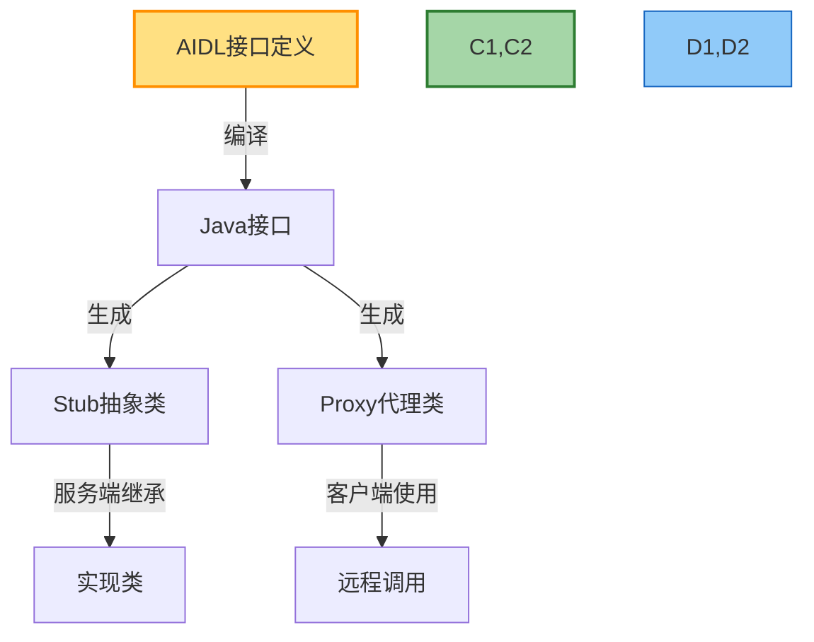

### AIDL 文件结构

一个标准的 AIDL 文件如下：

```java
// IMyService.aidl
package com.example.service;

// 导入其他 AIDL 接口或自定义数据类型
import com.example.service.MyData;

interface IMyService {
    // 定义方法
    void basicTypes(int anInt, long aLong, boolean aBoolean, 
                    float aFloat, double aDouble, String aString);
    
    // 自定义方法
    MyData getData();
    void setData(in MyData data);
}
```

### AIDL 数据类型支持

AIDL 支持以下数据类型：

1. **基本数据类型**：int, long, char, boolean, float, double
2. **String 和 CharSequence**
3. **List 和 Map**：元素必须是 AIDL 支持的类型
4. **自定义的 Parcelable 类型**：必须实现 Parcelable 接口
5. **其他 AIDL 接口**：可以在接口间传递 Binder 对象

### AIDL 指向标记

AIDL 方法参数可以有三种指向标记：

1. **in**：数据只从客户端传递到服务端
2. **out**：数据只从服务端传递到客户端，传入的参数会被服务端修改
3. **inout**：数据双向传递，客户端的修改会影响服务端，服务端的修改也会影响客户端

默认为 **in**。

### AIDL 生成的代码

当编译 AIDL 文件时，Android 构建系统会生成一个 Java 接口，其中包含：

1. **接口定义**：与 AIDL 文件中定义的接口相同
2. **Stub 抽象类**：服务端需要继承的基类，实现接口方法
3. **Proxy 内部类**：客户端使用的代理类，封装了 Binder 通信细节

## 实践：创建和使用 Binder 服务

下面通过一个简单的例子演示如何创建和使用 Binder 服务：

### 完整服务创建流程

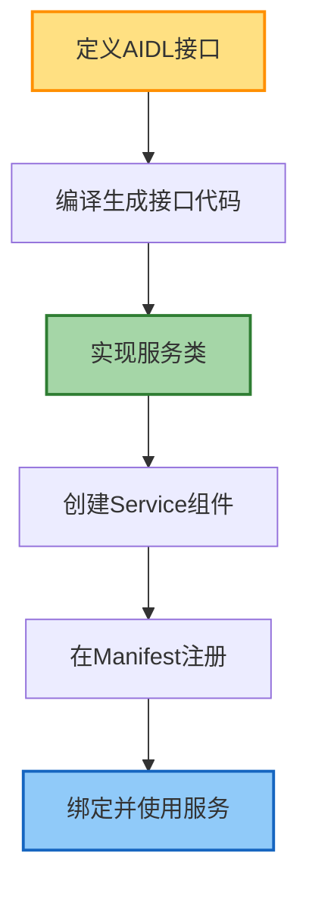

### 1. 定义 AIDL 接口

```java
// IDataService.aidl
package com.example.service;

interface IDataService {
    String getData();
    void setData(String data);
}
```

### 2. 实现服务端

```java
// DataService.java
package com.example.service;

import android.app.Service;
import android.content.Intent;
import android.os.IBinder;
import android.util.Log;

public class DataService extends Service {
    private static final String TAG = "DataService";
    private String mData = "Default data";
    
    // 实现 AIDL 接口
    private final IDataService.Stub mBinder = new IDataService.Stub() {
        @Override
        public String getData() {
            Log.d(TAG, "getData() called");
            return mData;
        }
        
        @Override
        public void setData(String data) {
            Log.d(TAG, "setData() called with: data = [" + data + "]");
            mData = data;
        }
    };
    
    @Override
    public IBinder onBind(Intent intent) {
        return mBinder;
    }
}
```

### 3. 在 AndroidManifest.xml 中注册服务

```xml
<service
    android:name=".DataService"
    android:enabled="true"
    android:exported="true">
    <intent-filter>
        <action android:name="com.example.service.DataService" />
    </intent-filter>
</service>
```

### 4. 客户端调用服务

```java
// MainActivity.java
package com.example.client;

import android.content.ComponentName;
import android.content.Context;
import android.content.Intent;
import android.content.ServiceConnection;
import android.os.IBinder;
import android.os.Bundle;
import android.util.Log;
import android.view.View;
import android.widget.Button;
import android.widget.TextView;

import androidx.appcompat.app.AppCompatActivity;

import com.example.service.IDataService;

public class MainActivity extends AppCompatActivity {
    private static final String TAG = "MainActivity";
    private IDataService mService;
    private boolean mBound = false;
    private TextView mDataTextView;
    
    private ServiceConnection mConnection = new ServiceConnection() {
        @Override
        public void onServiceConnected(ComponentName name, IBinder service) {
            // 将返回的 IBinder 对象转换为接口
            mService = IDataService.Stub.asInterface(service);
            mBound = true;
            try {
                // 获取服务数据
                String data = mService.getData();
                mDataTextView.setText(data);
            } catch (Exception e) {
                Log.e(TAG, "Error calling service", e);
            }
        }
        
        @Override
        public void onServiceDisconnected(ComponentName name) {
            mService = null;
            mBound = false;
        }
    };
    
    @Override
    protected void onCreate(Bundle savedInstanceState) {
        super.onCreate(savedInstanceState);
        setContentView(R.layout.activity_main);
        
        mDataTextView = findViewById(R.id.dataTextView);
        Button getButton = findViewById(R.id.getButton);
        Button setButton = findViewById(R.id.setButton);
        
        // 绑定按钮点击事件
        getButton.setOnClickListener(new View.OnClickListener() {
            @Override
            public void onClick(View v) {
                if (mBound) {
                    try {
                        String data = mService.getData();
                        mDataTextView.setText(data);
                    } catch (Exception e) {
                        Log.e(TAG, "Error calling getData()", e);
                    }
                }
            }
        });
        
        setButton.setOnClickListener(new View.OnClickListener() {
            @Override
            public void onClick(View v) {
                if (mBound) {
                    try {
                        mService.setData("New data: " + System.currentTimeMillis());
                    } catch (Exception e) {
                        Log.e(TAG, "Error calling setData()", e);
                    }
                }
            }
        });
    }
    
    @Override
    protected void onStart() {
        super.onStart();
        // 绑定服务
        Intent intent = new Intent();
        intent.setAction("com.example.service.DataService");
        intent.setPackage("com.example.service");
        bindService(intent, mConnection, Context.BIND_AUTO_CREATE);
    }
    
    @Override
    protected void onStop() {
        super.onStop();
        // 解绑服务
        if (mBound) {
            unbindService(mConnection);
            mBound = false;
        }
    }
}
```

## 深入理解 Binder 原理

### 1. Binder 对象标识

每个 Binder 对象都有一个全局唯一的标识，由三部分组成：

1. **进程 ID**：创建 Binder 对象的进程
2. **对象指针**：Binder 对象在进程内存中的地址
3. **引用计数**：对象被引用的次数，用于生命周期管理

### 2. Binder 传输原理

当一个进程传递 Binder 对象给另一个进程时：

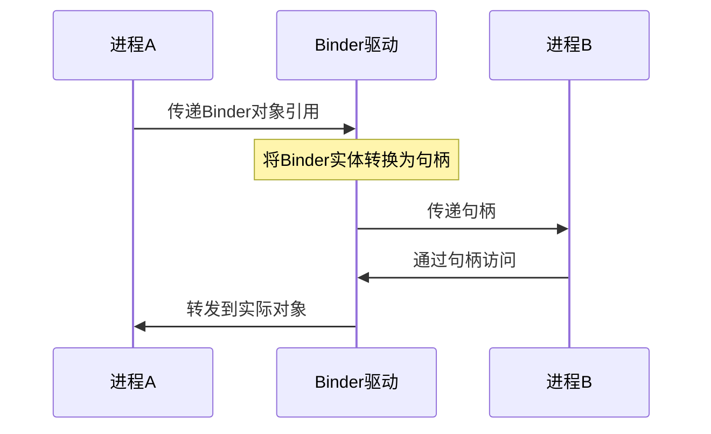

1. 发送方将 Binder 对象的引用打包为 flat_binder_object
2. Binder 驱动将该引用转换为目标进程中的句柄
3. 接收方通过句柄访问 Binder 对象

### 3. Binder 死亡通知

Binder 提供了死亡通知机制，当服务进程意外终止时，客户端可以收到通知并做相应处理：

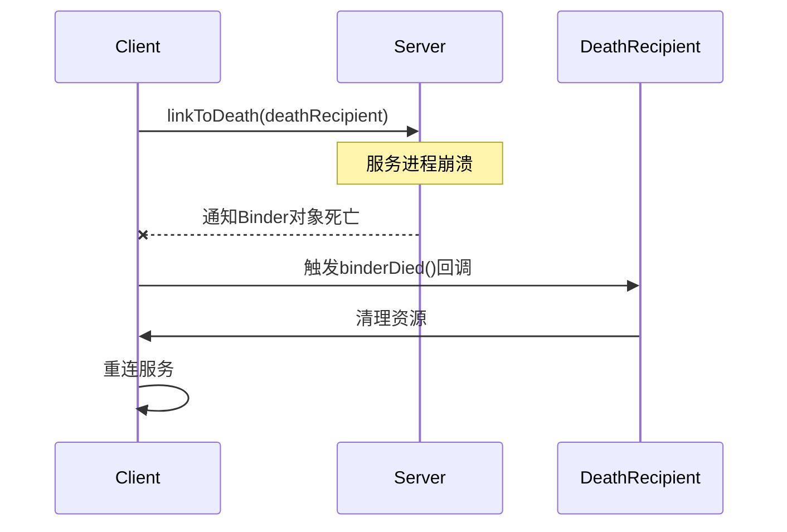

```java
// 设置死亡通知
private IBinder.DeathRecipient mDeathRecipient = new IBinder.DeathRecipient() {
    @Override
    public void binderDied() {
        // 服务已死亡，进行清理
        if (mService != null) {
            mService.asBinder().unlinkToDeath(this, 0);
            mService = null;
        }
        // 重新连接服务
        reconnectService();
    }
};

// 在服务连接后设置
IBinder binder = mService.asBinder();
try {
    binder.linkToDeath(mDeathRecipient, 0);
} catch (RemoteException e) {
    e.printStackTrace();
}
```

## Binder 在系统中的应用

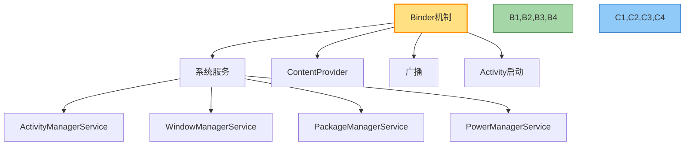

### 1. 系统服务

Android 系统的大多数核心服务都是通过 Binder 机制实现的，如：
- ActivityManagerService
- WindowManagerService
- PackageManagerService
- PowerManagerService

### 2. ContentProvider

ContentProvider 内部使用 Binder 进行跨进程通信，实现数据共享。

### 3. 广播

当一个进程发送广播时，ActivityManagerService 会将广播消息通过 Binder 传递给目标接收者。

### 4. Activity 启动

当一个应用启动 Activity 时，请求通过 Binder 传递给 ActivityManagerService，后者管理 Activity 的创建和生命周期。

## Binder 调试与分析

### 1. dumpsys 命令

通过 `adb shell dumpsys` 命令可以查看系统服务的状态信息：

```bash
# 显示所有服务
adb shell dumpsys

# 显示特定服务
adb shell dumpsys activity
adb shell dumpsys window
```

### 2. Binder 调试

通过读取 `/sys/kernel/debug/binder` 目录下的文件，可以查看 Binder 相关的调试信息：

```bash
# 查看所有 Binder 事务
adb shell cat /sys/kernel/debug/binder/transactions

# 查看 Binder 状态
adb shell cat /sys/kernel/debug/binder/stats
```

### 3. systrace 工具

使用 systrace 可以捕获和分析 Binder 通信：

```bash
python systrace.py --time=10 -o trace.html binder_driver
```

## 总结

Binder 机制是 Android 系统的核心通信方式，它通过一次内存拷贝提高了通信效率，通过身份验证增强了安全性，并提供了面向对象的编程接口简化了开发。理解 Binder 机制对于深入掌握 Android 系统至关重要，也是进行系统级开发的基础。

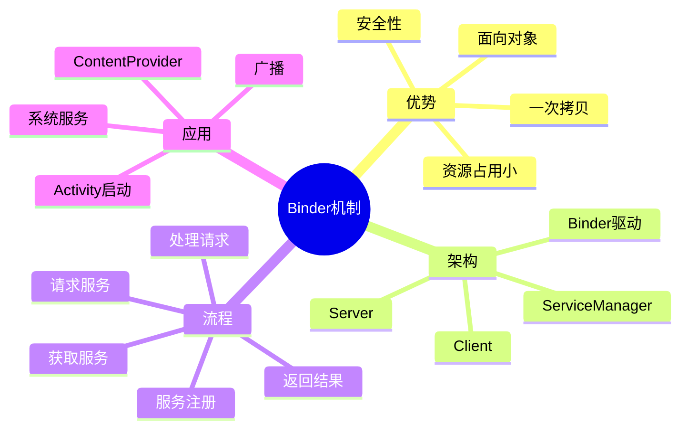

## 参考资源

- [Android Binder 设计与实现](https://source.android.com/devices/architecture/hidl/binder-ipc)
- [Binder 内核驱动源码](https://android.googlesource.com/kernel/common/+/android-4.9/drivers/android/binder.c)
- 《深入理解 Android 内核设计思想》第 7 章 Binder 进程间通信
- 《Android 系统源代码情景分析》第 4 章 Binder 通信原理

---

*本文档仅作学习参考，随着 Android 系统的更新，部分内容可能会发生变化。* 