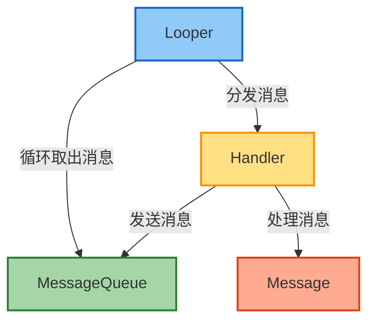
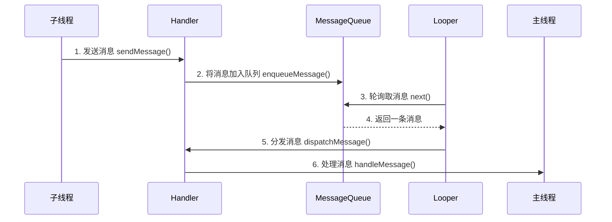
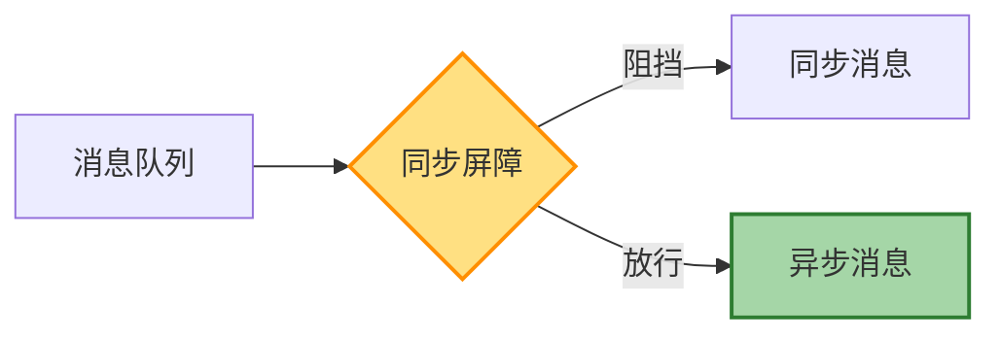

# Handler 消息机制详解

## 概述

Handler 消息机制是 Android 系统中一套用于线程间通信的框架，主要用于处理异步消息。在 Android 应用开发和系统开发中，Handler 机制扮演着极其重要的角色，它是确保 UI 操作线程安全的基础，也是 Android 系统服务实现异步操作的关键机制。

## 核心组件

Handler 消息机制主要由以下几个核心组件组成：



### 1. Message

Message 是消息的载体，包含以下主要字段：

- **what**: 消息的标识
- **arg1 / arg2**: 消息的整型参数
- **obj**: 消息的任意对象参数
- **target**: 指向处理此消息的 Handler
- **callback**: 消息的回调方法
- **next**: 指向消息队列中的下一个消息

### 2. MessageQueue

MessageQueue 是消息队列，负责存储和管理 Message 对象。它采用单链表结构，按照 Message 的执行时间排序。主要功能有：

- **enqueueMessage()**: 将消息插入队列
- **next()**: 取出下一条要执行的消息
- **removeMessages()**: 移除特定消息

### 3. Looper

Looper 用于创建消息循环，每个线程最多只能有一个 Looper。主要功能有：

- **prepare()**: 为当前线程创建 Looper 对象
- **loop()**: 启动消息循环，不断从 MessageQueue 中取出消息并分发
- **quit()**: 退出消息循环

### 4. Handler

Handler 是消息处理者，负责发送和处理消息。主要功能有：

- **sendMessage()**: 发送消息
- **post()**: 发送 Runnable 对象
- **handleMessage()**: 处理消息的回调方法
- **dispatchMessage()**: 分发消息

## 工作流程

Handler 消息机制的工作流程如下：



1. **准备阶段**：线程通过 `Looper.prepare()` 创建 Looper 对象和 MessageQueue 对象
2. **启动循环**：线程通过 `Looper.loop()` 启动消息循环
3. **发送消息**：调用 Handler 的 `sendMessage()` 或 `post()` 方法发送消息
4. **入队**：消息被加入 MessageQueue
5. **出队**：Looper 不断从 MessageQueue 中取出消息
6. **处理消息**：Looper 将消息分发给对应的 Handler 处理

## 主线程消息循环

Android 应用的主线程（UI 线程）在启动时就自动创建了 Looper 对象和消息循环，这是在 ActivityThread 的 `main()` 方法中完成的：

```java
public static void main(String[] args) {
    // ...
    
    Looper.prepareMainLooper();
    
    // ...
    
    Looper.loop();
    
    throw new RuntimeException("Main thread loop unexpectedly exited");
}
```

这就是为什么在主线程中可以直接创建 Handler 对象，而无需手动调用 `Looper.prepare()` 和 `Looper.loop()`。

## Handler 的典型用法

### 1. 基本用法

```java
// 在主线程中创建 Handler
private Handler mHandler = new Handler() {
    @Override
    public void handleMessage(Message msg) {
        switch (msg.what) {
            case MSG_UPDATE_UI:
                // 更新 UI
                textView.setText((String) msg.obj);
                break;
            // ...
        }
    }
};

// 在子线程中发送消息
new Thread(new Runnable() {
    @Override
    public void run() {
        // 执行耗时操作
        String result = performLongRunningTask();
        
        // 通过 Handler 发送消息到主线程
        Message msg = Message.obtain();
        msg.what = MSG_UPDATE_UI;
        msg.obj = result;
        mHandler.sendMessage(msg);
    }
}).start();
```

### 2. 使用 post 方法

```java
// 在子线程中通过 Handler 的 post 方法执行 UI 操作
new Thread(new Runnable() {
    @Override
    public void run() {
        // 执行耗时操作
        final String result = performLongRunningTask();
        
        // 在主线程更新 UI
        mHandler.post(new Runnable() {
            @Override
            public void run() {
                textView.setText(result);
            }
        });
    }
}).start();
```

### 3. 延时消息

```java
// 发送延时消息
mHandler.sendMessageDelayed(msg, 1000); // 延时 1 秒

// 或使用 postDelayed
mHandler.postDelayed(new Runnable() {
    @Override
    public void run() {
        // 要执行的操作
    }
}, 1000); // 延时 1 秒
```

## 消息屏障机制

### 同步屏障

Android 系统中有一种特殊的消息叫做同步屏障（Synchronization Barrier），它可以拦截所有的同步消息，只让异步消息通过。这个特性主要用于优先处理一些高优先级的消息，如 UI 绘制消息。



设置同步屏障的方法：

```java
// 需要通过反射获取
MessageQueue queue = getMessageQueue();
Method method = MessageQueue.class.getDeclaredMethod("postSyncBarrier");
method.setAccessible(true);
int token = (int) method.invoke(queue);

// 稍后移除屏障
queue.removeSyncBarrier(token);
```

### 异步消息

要发送异步消息，需要创建一个异步 Handler：

```java
Handler handler = new Handler(Looper.getMainLooper(), null, true);  // 最后一个参数为 async
```

或者将普通消息标记为异步：

```java
Message msg = Message.obtain();
msg.setAsynchronous(true);
```

## Handler 中的内存泄漏

由于 Handler 通常作为 Activity 的内部类使用，它持有对 Activity 的引用。如果发送了延时消息，而 Activity 已经被销毁，就会造成内存泄漏。

### 避免内存泄漏的方法

1. **使用静态内部类 + 弱引用**：

```java
private static class MyHandler extends Handler {
    private final WeakReference<MainActivity> mActivity;
    
    public MyHandler(MainActivity activity) {
        mActivity = new WeakReference<>(activity);
    }
    
    @Override
    public void handleMessage(Message msg) {
        MainActivity activity = mActivity.get();
        if (activity == null || activity.isFinishing()) {
            return;
        }
        
        // 处理消息
    }
}

private final MyHandler mHandler = new MyHandler(this);
```

2. **在 Activity 销毁时移除所有消息**：

```java
@Override
protected void onDestroy() {
    super.onDestroy();
    mHandler.removeCallbacksAndMessages(null);
}
```

## HandlerThread

HandlerThread 是 Android 提供的一个便捷类，它是一个包含 Looper 的线程，可以轻松创建带有消息循环的工作线程。

```java
// 创建 HandlerThread
HandlerThread handlerThread = new HandlerThread("MyHandlerThread");
handlerThread.start();

// 创建绑定到 HandlerThread 的 Handler
Handler handler = new Handler(handlerThread.getLooper());

// 使用 handler 发送消息或任务
handler.post(new Runnable() {
    @Override
    public void run() {
        // 将在 HandlerThread 线程中执行
    }
});

// 不再需要时关闭 HandlerThread
handlerThread.quitSafely();
```

## 源码分析

### 1. Handler 构造方法

```java
public Handler() {
    this(null, false);
}

public Handler(Callback callback, boolean async) {
    // ...
    mLooper = Looper.myLooper();
    if (mLooper == null) {
        throw new RuntimeException(
            "Can't create handler inside thread " + Thread.currentThread()
                    + " that has not called Looper.prepare()");
    }
    mQueue = mLooper.mQueue;
    mCallback = callback;
    mAsynchronous = async;
}
```

这解释了为什么在没有 Looper 的线程中直接创建 Handler 会抛出异常。

### 2. 消息发送流程

```java
public final boolean sendMessage(Message msg) {
    return sendMessageDelayed(msg, 0);
}

public final boolean sendMessageDelayed(Message msg, long delayMillis) {
    if (delayMillis < 0) {
        delayMillis = 0;
    }
    return sendMessageAtTime(msg, SystemClock.uptimeMillis() + delayMillis);
}

public boolean sendMessageAtTime(Message msg, long uptimeMillis) {
    MessageQueue queue = mQueue;
    if (queue == null) {
        return false;
    }
    return enqueueMessage(queue, msg, uptimeMillis);
}

private boolean enqueueMessage(MessageQueue queue, Message msg, long uptimeMillis) {
    msg.target = this;
    msg.workSourceUid = ThreadLocalWorkSource.getUid();
    
    if (mAsynchronous) {
        msg.setAsynchronous(true);
    }
    return queue.enqueueMessage(msg, uptimeMillis);
}
```

### 3. Looper.loop() 方法

```java
public static void loop() {
    final Looper me = myLooper();
    if (me == null) {
        throw new RuntimeException("No Looper; Looper.prepare() wasn't called on this thread.");
    }
    
    final MessageQueue queue = me.mQueue;
    
    for (;;) {
        Message msg = queue.next(); // 可能会阻塞
        if (msg == null) {
            // 队列已关闭
            return;
        }
        
        try {
            msg.target.dispatchMessage(msg);
        } finally {
            // ...
        }
        
        // 回收消息对象
        msg.recycleUnchecked();
    }
}
```

## ANR 与 Handler

ANR（Application Not Responding）是 Android 系统中的一种错误状态，当应用的主线程长时间被阻塞时会触发。Handler 机制与 ANR 有密切关系：

1. **主线程 Looper 循环**：主线程运行在一个无限循环中，通过 Handler 处理各种消息
2. **消息处理耗时**：如果在主线程的 Handler 中处理消息耗时太长，将导致后续消息无法及时处理
3. **ANR 监控**：系统使用 Handler 发送延时消息来检测可能的 ANR
4. **解决方案**：将耗时操作放到工作线程中，通过 Handler 将结果发回主线程

## 总结

Handler 消息机制是 Android 系统中非常重要的一部分，它不仅用于实现线程间通信、UI 更新，也是 Android 系统服务实现异步操作的基础。深入理解 Handler 机制，有助于编写高效、稳定、响应迅速的 Android 应用和系统组件。

---

## 参考资源

- [Android 开发者文档 - Handler](https://developer.android.com/reference/android/os/Handler)
- [Android 源码 - Handler.java](https://android.googlesource.com/platform/frameworks/base/+/master/core/java/android/os/Handler.java)
- [Android 源码 - Looper.java](https://android.googlesource.com/platform/frameworks/base/+/master/core/java/android/os/Looper.java)
- [Android 源码 - MessageQueue.java](https://android.googlesource.com/platform/frameworks/base/+/master/core/java/android/os/MessageQueue.java)
- 《Android 开发艺术探索》 