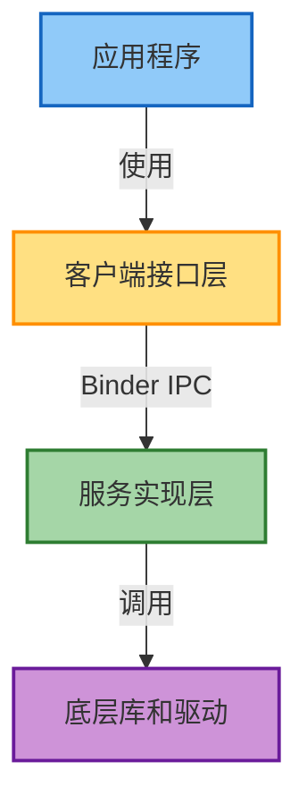
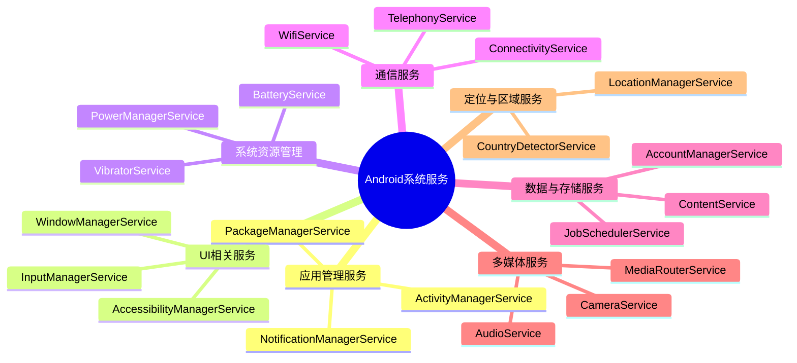
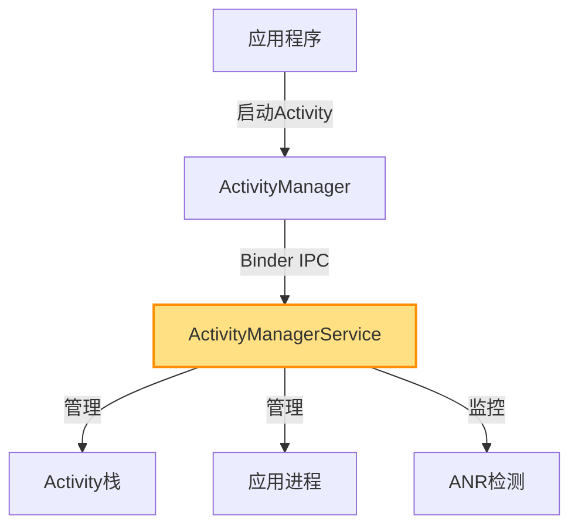
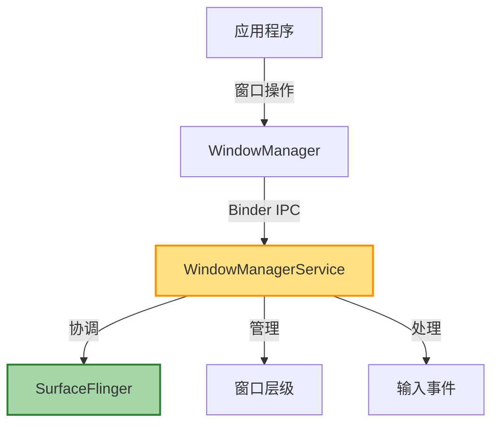
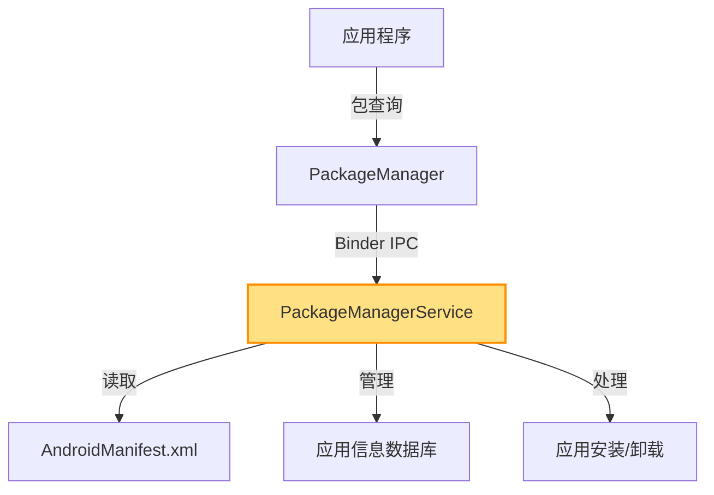
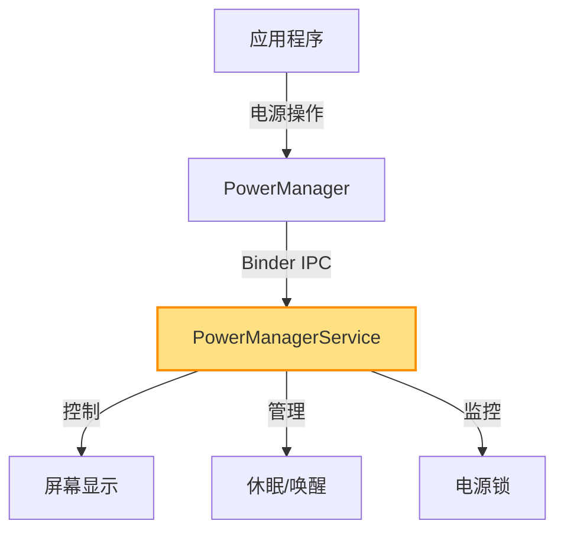
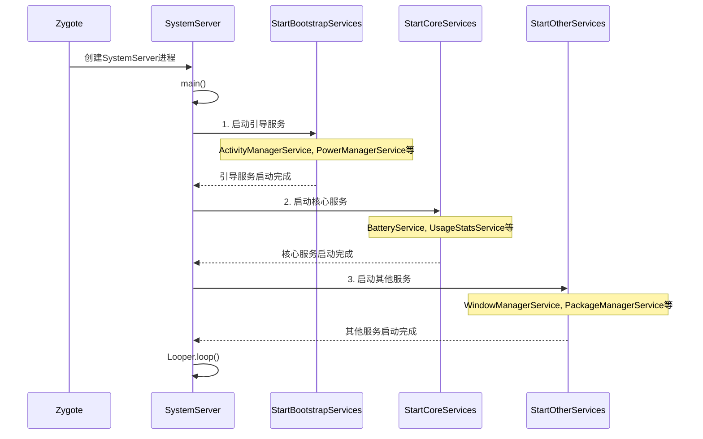
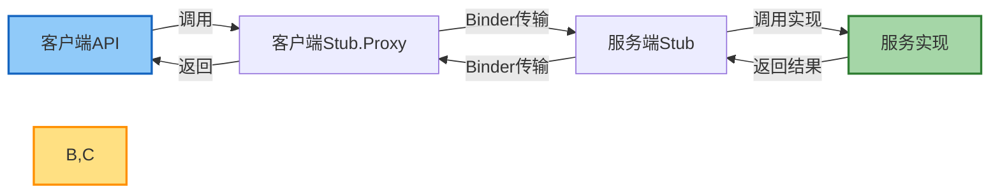
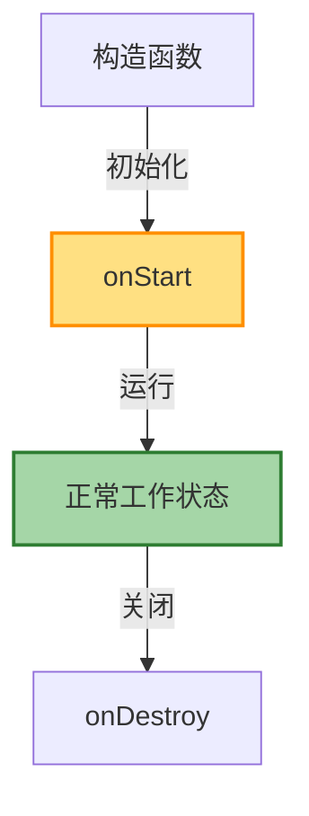

# Android 系统服务概览

## 概述

Android 系统服务是 Framework 层的核心组成部分，为应用开发者提供了丰富的系统功能接口。这些系统服务运行在特权进程中（通常是 System Server 进程），通过 Binder IPC 机制向应用提供跨进程服务。系统服务是 Android 操作系统功能的实际实现者，管理着从界面显示到电源管理、从数据库访问到网络连接等各方面的功能。

## 系统服务架构

Android 系统服务采用分层架构，主要分为客户端接口层和服务实现层：



### 客户端接口层

客户端接口层是面向应用开发者的 API，通常位于 `android.*` 包中，如：
- `android.app.ActivityManager`
- `android.view.WindowManager`
- `android.content.pm.PackageManager`

### 服务实现层

服务实现层是系统服务的具体实现，通常位于 `com.android.server.*` 包中，如：
- `com.android.server.am.ActivityManagerService`
- `com.android.server.wm.WindowManagerService`
- `com.android.server.pm.PackageManagerService`

## 系统服务的分类

Android 系统服务可以按照功能和启动时机进行分类。

### 按功能分类




### 按启动时机分类

系统服务根据启动时机可以分为三类：

1. **引导服务（Bootstrap Services）**：系统启动早期阶段就需要运行的基础服务
2. **核心服务（Core Services）**：系统核心功能相关的服务
3. **其他服务（Other Services）**：在前两类服务启动后才启动的服务

## 重要系统服务详解

### ActivityManagerService (AMS)

ActivityManagerService 是 Android 系统中最核心的服务之一，负责管理应用程序的活动和生命周期。



**主要功能**：
- 管理所有应用程序的 Activity 生命周期
- 处理应用程序的启动、切换和关闭
- 管理应用的任务栈（Task Stack）
- 监控应用 ANR（Application Not Responding）状态
- 管理进程优先级和内存回收

### WindowManagerService (WMS)

WindowManagerService 负责管理所有窗口的显示和布局。



**主要功能**：
- 管理应用窗口的显示和叠加顺序
- 处理窗口的添加、移除和更新
- 协调输入事件的分发
- 与 SurfaceFlinger 配合完成界面渲染
- 实现屏幕旋转和多显示设备支持

### PackageManagerService (PMS)

PackageManagerService 负责管理所有应用程序包相关的信息。



**主要功能**：
- 管理应用的安装、卸载和更新
- 解析应用的 AndroidManifest.xml 文件
- 维护已安装应用的信息和权限
- 处理应用间的组件调用和权限检查
- 管理应用的签名验证

### PowerManagerService

PowerManagerService 负责管理设备的电源状态。



**主要功能**：
- 管理设备的电源状态
- 控制屏幕点亮和熄灭
- 处理休眠和唤醒
- 管理电源相关的锁（WakeLock）
- 实现电源按键行为

## 系统服务的启动流程

Android 系统服务的启动流程遵循一定的顺序，确保各服务之间的依赖关系得到满足。



系统服务的启动主要在 SystemServer 的 `main()` 方法中，按照以下顺序：

1. **准备阶段**：创建系统上下文、加载本地库等
2. **启动引导服务**：`startBootstrapServices()`
3. **启动核心服务**：`startCoreServices()`
4. **启动其他服务**：`startOtherServices()`
5. **进入消息循环**：`Looper.loop()`

## 系统服务的注册与获取

### 服务注册

系统服务在启动时，会将自己注册到 ServiceManager 中：

```java
// 在SystemServer.java中
ServiceManager.addService(Context.ACTIVITY_SERVICE, new ActivityManagerService(context));
```

### 服务获取

应用获取系统服务的方式：

```java
// 通过Context获取
ActivityManager am = (ActivityManager) context.getSystemService(Context.ACTIVITY_SERVICE);

// 或者直接通过ServiceManager获取
IBinder binder = ServiceManager.getService(Context.ACTIVITY_SERVICE);
IActivityManager am = IActivityManager.Stub.asInterface(binder);
```

## 系统服务工作原理

Android 系统服务工作原理基于 Binder IPC 机制，其流程如下：



1. **客户端 API 调用**：应用程序调用系统提供的客户端 API
2. **客户端 Proxy 处理**：将调用参数打包，通过 Binder 发送到服务端
3. **服务端 Stub 接收**：接收客户端请求，解析参数
4. **服务实现处理**：执行实际的服务实现逻辑
5. **返回结果**：将处理结果通过 Binder 返回给客户端

## 自定义系统服务

除了 Android 系统自带的服务外，开发者也可以创建自定义系统服务：

### 1. 定义服务接口（AIDL）

```java
// IMyService.aidl
package com.example.service;

interface IMyService {
    void setData(String data);
    String getData();
}
```

### 2. 实现服务类

```java
public class MyService extends IMyService.Stub {
    private static final String TAG = "MyService";
    private String mData = "";
    
    public MyService(Context context) {
        // 初始化
    }
    
    @Override
    public void setData(String data) {
        mData = data;
    }
    
    @Override
    public String getData() {
        return mData;
    }
}
```

### 3. 注册到 SystemServer

修改 `SystemServer.java` 的 `startOtherServices()` 方法：

```java
try {
    Slog.i(TAG, "My Service");
    myService = new MyService(context);
    ServiceManager.addService("my_service", myService);
} catch (Throwable e) {
    reportWtf("starting My Service", e);
}
```

### 4. 客户端调用

```java
// 获取服务
IBinder binder = ServiceManager.getService("my_service");
IMyService service = IMyService.Stub.asInterface(binder);

// 调用方法
service.setData("Hello");
String data = service.getData();
```

## 系统服务的生命周期

系统服务通常在系统启动时创建，在系统关闭时销毁，具有以下生命周期阶段：



1. **创建阶段**：服务对象被创建，进行初始化
2. **启动阶段**：调用 `onStart()` 方法，注册到 ServiceManager
3. **工作阶段**：响应客户端请求，执行服务逻辑
4. **销毁阶段**：系统关闭时，调用 `onDestroy()` 方法释放资源

## 系统服务的调试

### 1. dumpsys 命令

通过 `adb shell dumpsys` 命令可以查看系统服务的状态信息：

```bash
# 显示所有服务
adb shell dumpsys

# 显示特定服务
adb shell dumpsys activity
adb shell dumpsys window
adb shell dumpsys package
```

### 2. 查看服务日志

```bash
# 过滤特定服务的日志
adb logcat | grep ActivityManager
adb logcat | grep WindowManager
```

### 3. 监控 Binder 通信

```bash
# 查看 Binder 事务
adb shell cat /sys/kernel/debug/binder/transactions

# 查看 Binder 状态
adb shell cat /sys/kernel/debug/binder/stats
```

## 常见问题与解决方案

### 1. 服务无响应（ANR）

系统服务处理请求时间过长可能导致 ANR：

- **原因**：服务方法中执行耗时操作
- **解决方案**：将耗时操作放到工作线程中处理

### 2. 权限问题

某些系统服务需要特殊权限才能访问：

- **原因**：服务有权限保护
- **解决方案**：在 Manifest 中声明所需权限，或使用签名级别权限

### 3. 进程间通信失败

Binder 通信可能因各种原因失败：

- **原因**：服务进程已死亡，Binder 缓冲区已满等
- **解决方案**：添加错误处理，使用死亡通知机制

## 总结

系统服务是 Android Framework 层的核心组成部分，为整个系统提供基础功能支持。深入理解系统服务的工作原理和实现细节，对于进行系统级开发、解决系统问题和优化应用性能都有很大帮助。通过本文的介绍，希望读者能对 Android 系统服务有一个全面的了解。

---

## 参考资源

- [Android 开源项目](https://source.android.com/)
- [Android 源码](https://android.googlesource.com/)
- 《深入理解 Android 内核设计思想》
- 《Android 系统源代码情景分析》 