# Android UI 渲染机制

## 概述

Android 的 UI 渲染机制是指将应用界面从布局到在屏幕上显示的整个过程。这是 Android 系统中最核心的部分之一，它涉及视图系统、硬件加速渲染以及与 GPU 交互的一系列复杂流程。理解 UI 渲染机制对于开发高性能、流畅的应用界面至关重要，也是解决界面卡顿、闪烁等问题的基础。

## 渲染流程概览

Android UI 的渲染流程可以概括为以下几个主要阶段：

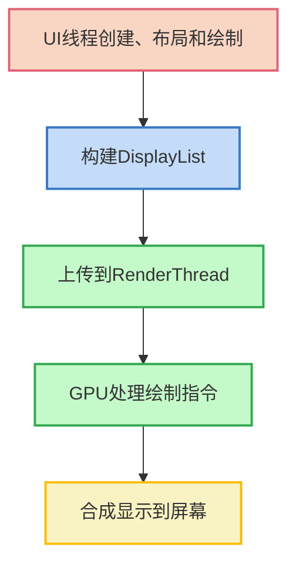

1. **测量、布局和绘制**：UI 线程负责测量和布局视图，然后绘制可见内容
2. **构建渲染树**：将视图层次转换为 DisplayList（渲染指令列表）
3. **渲染线程处理**：将渲染数据传递给渲染线程
4. **GPU 处理**：通过 OpenGL/Vulkan 命令由 GPU 执行实际绘制
5. **合成与显示**：合成最终图像并显示到屏幕上

## 视图渲染基础

### View 层次结构

Android 的视图系统采用树形结构，每个视图都可以包含子视图，形成一个层次结构：

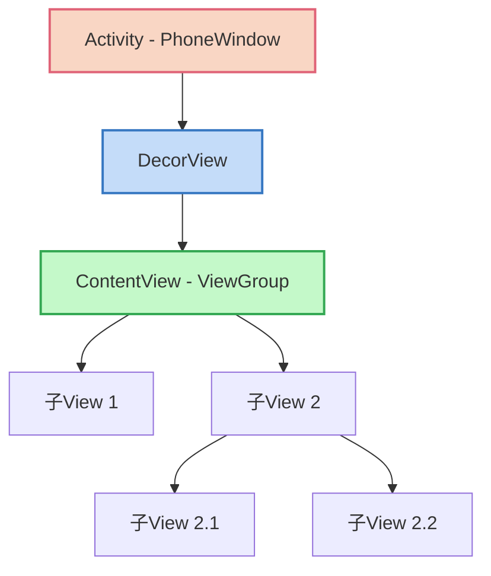

### 视图绘制三个阶段

Android 视图的绘制过程分为三个主要阶段：

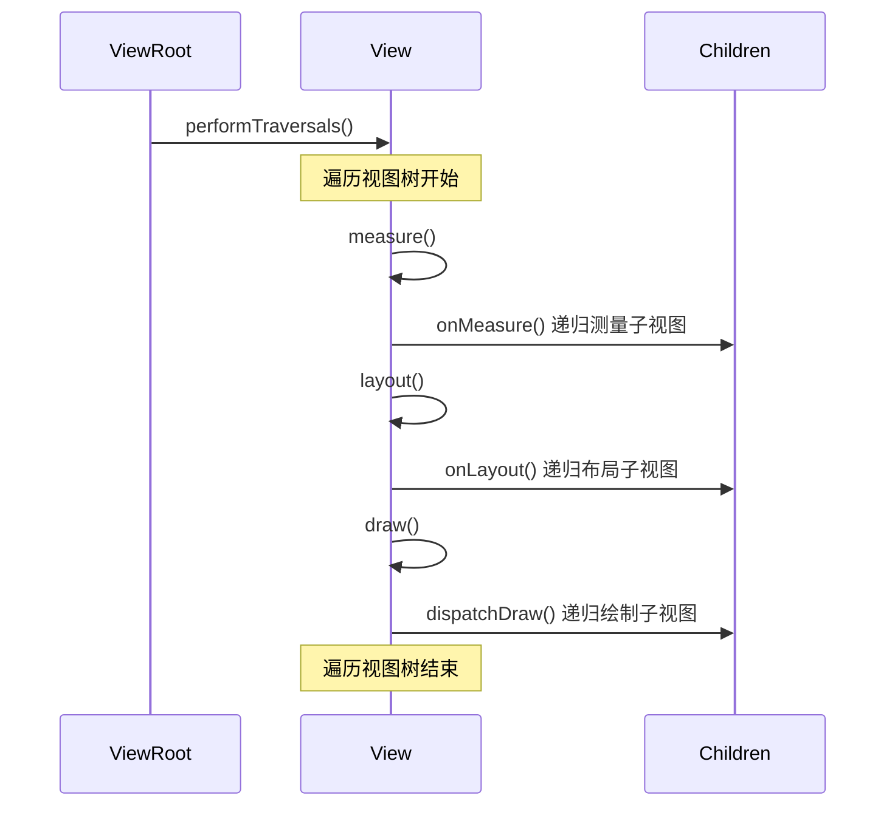

#### 1. 测量阶段 (Measure)

测量阶段确定视图的大小：

```java
protected void onMeasure(int widthMeasureSpec, int heightMeasureSpec) {
    // 默认实现
    setMeasuredDimension(
        getDefaultSize(getSuggestedMinimumWidth(), widthMeasureSpec),
        getDefaultSize(getSuggestedMinimumHeight(), heightMeasureSpec)
    );
}
```

MeasureSpec 是一个32位的整数，包括测量模式和大小：
- **EXACTLY**：视图大小确定值，对应 `match_parent` 或具体尺寸
- **AT_MOST**：视图大小最大值，对应 `wrap_content`
- **UNSPECIFIED**：视图无限制，通常在滚动容器中使用

#### 2. 布局阶段 (Layout)

布局阶段确定视图的位置：

```java
protected void onLayout(boolean changed, int left, int top, int right, int bottom) {
    // 默认实现为空，ViewGroup需要重写此方法安排子视图
    // 例如线性布局的实现：
    for (int i = 0; i < count; i++) {
        final View child = getChildAt(i);
        if (child.getVisibility() != GONE) {
            // 安排子视图位置
            child.layout(childLeft, childTop, childRight, childBottom);
        }
    }
}
```

#### 3. 绘制阶段 (Draw)

绘制阶段将视图内容绘制到画布上：

```java
public void draw(Canvas canvas) {
    // 绘制背景
    drawBackground(canvas);
    
    // 保存图层
    if (saveCount >= 0) {
        canvas.saveLayer(...);
    }
    
    // 绘制自身内容
    onDraw(canvas);
    
    // 递归绘制子视图
    dispatchDraw(canvas);
    
    // 绘制装饰（例如滚动条）
    onDrawScrollBars(canvas);
    
    // 恢复图层
    if (saveCount >= 0) {
        canvas.restoreToCount(saveCount);
    }
}
```

## 硬件加速渲染

### 软件渲染 vs 硬件加速

```mermaid
graph TD
    subgraph 软件渲染
        A1[UI线程 - View.draw] --> B1[画到CPU内存中的Canvas]
        B1 --> C1[发送到Surface]
        C1 --> D1[SurfaceFlinger合成]
    end
    
    subgraph 硬件加速
        A2[UI线程 - View.draw] --> B2[构建DisplayList]
        B2 --> C2[RenderThread执行渲染]
        C2 --> D2[GPU绘制]
        D2 --> E2[SurfaceFlinger合成]
    end
    
    style A1,A2 fill:#f9d6c4,stroke:#e06377,stroke-width:2px
    style B1,B2 fill:#c4dcf9,stroke:#3778c2,stroke-width:2px
    style C2,D2 fill:#c4f9c9,stroke:#34a853,stroke-width:2px
    style D1,E2 fill:#f9f3c4,stroke:#fbbc04,stroke-width:2px
```

#### 软件渲染

在软件渲染模式下，Android 的绘制过程完全由 CPU 完成：
- 所有绘制操作直接在内存中的位图上执行
- 每次重绘都需要重新计算整个视图树
- 资源消耗较大，性能有限

#### 硬件加速

硬件加速渲染由 GPU 完成绘制工作：
- 将视图绘制操作转换为 GPU 可理解的指令
- 使用 DisplayList 缓存视图结构和绘制命令
- 只有更改的部分才会被重新绘制
- 提高渲染性能和动画流畅度

### 硬件加速渲染流程

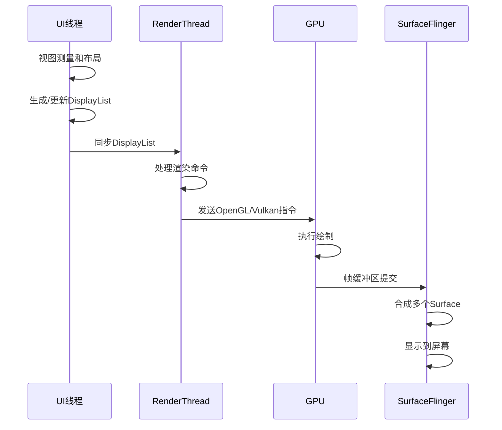

## 核心渲染组件

### ViewRootImpl

ViewRootImpl 是视图层次结构与渲染系统的连接点：

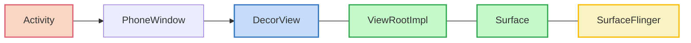

ViewRootImpl 的主要职责：
- 作为 View 和 WindowManager 的中间人
- 协调视图绘制过程
- 处理输入事件分发
- 管理与 Surface 的交互

关键方法：`performTraversals()` 协调测量、布局和绘制过程。

### RenderNode 和 DisplayList

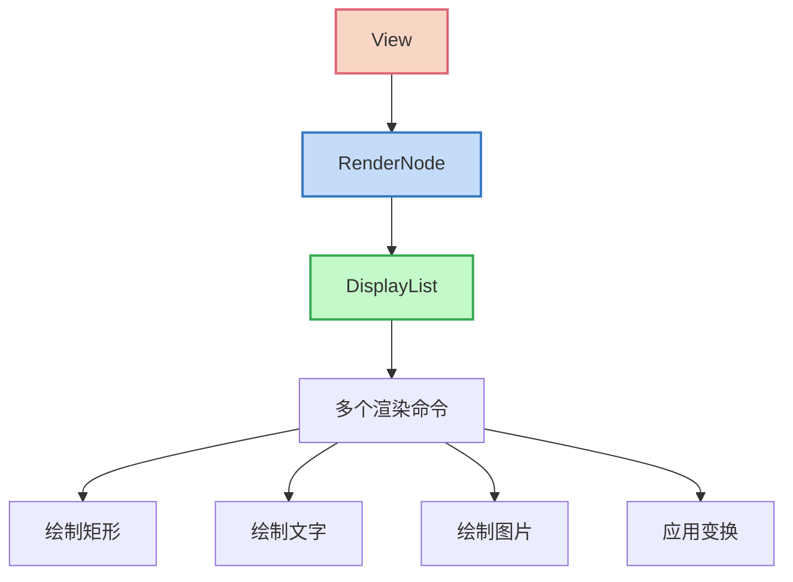

在硬件加速渲染模型中：
- 每个 View 都有一个对应的 RenderNode
- RenderNode 包含一个 DisplayList（渲染指令列表）
- 绘制命令被记录而不是立即执行
- 只有在视图内容变化时才需要重新记录

### RenderThread

从 Android 5.0 开始，引入了专门的渲染线程（RenderThread）:

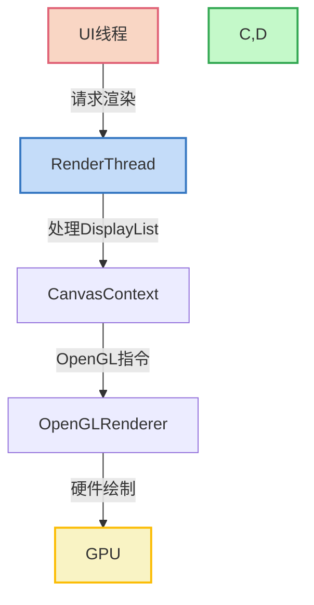

RenderThread 的优势：
- 解耦 UI 线程和实际渲染过程
- 允许 UI 线程在提交渲染工作后立即处理下一帧
- 即使 UI 线程被阻塞，动画也能继续执行
- 提高渲染性能和界面流畅度

### Surface 和 SurfaceFlinger

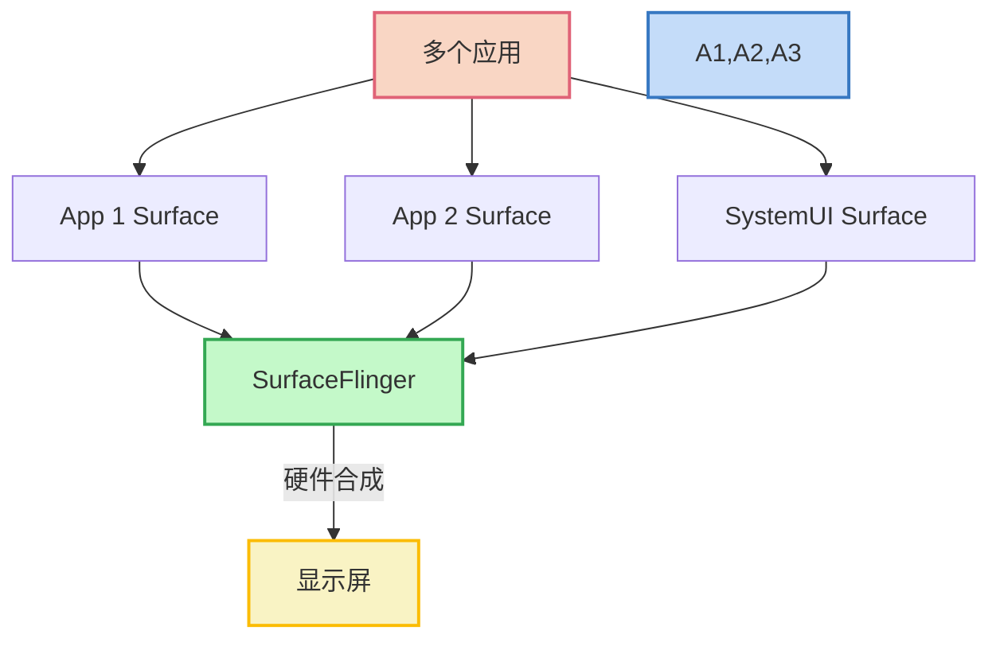

- **Surface**：一个可绘制的缓冲区，每个窗口都有一个 Surface
- **SurfaceFlinger**：系统服务，负责将多个 Surface 合成显示到屏幕

## 渲染流水线详解

### 垂直同步与刷新率

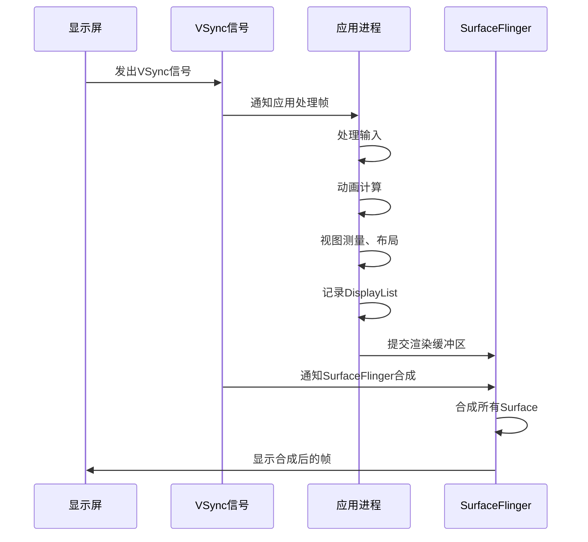

垂直同步（VSync）是确保渲染流畅的关键机制：
- 显示器按固定频率刷新（如 60Hz）
- VSync 信号同步应用渲染和屏幕刷新
- 避免屏幕撕裂和丢帧现象

### Choreographer

Choreographer 是协调渲染时机的核心组件：

```java
private void scheduleFrameLocked(long now) {
    if (mFrameScheduled) {
        return;
    }
    
    // 向显示子系统注册接收下一个VSync信号
    mFrameScheduled = true;
    mLastFrameTimeNanos = System.nanoTime();
    mDisplayEventReceiver.scheduleVsync();
}

private void doFrame(long frameTimeNanos) {
    // 处理输入事件
    doCallbacks(Choreographer.CALLBACK_INPUT, frameTimeNanos);
    
    // 处理动画
    doCallbacks(Choreographer.CALLBACK_ANIMATION, frameTimeNanos);
    
    // 处理遍历
    doCallbacks(Choreographer.CALLBACK_TRAVERSAL, frameTimeNanos);
    
    // 处理提交
    doCallbacks(Choreographer.CALLBACK_COMMIT, frameTimeNanos);
}
```

Choreographer 负责：
- 接收 VSync 信号
- 按优先级顺序安排各种回调
- 确保视图更新在合适的时机进行

### Triple Buffering

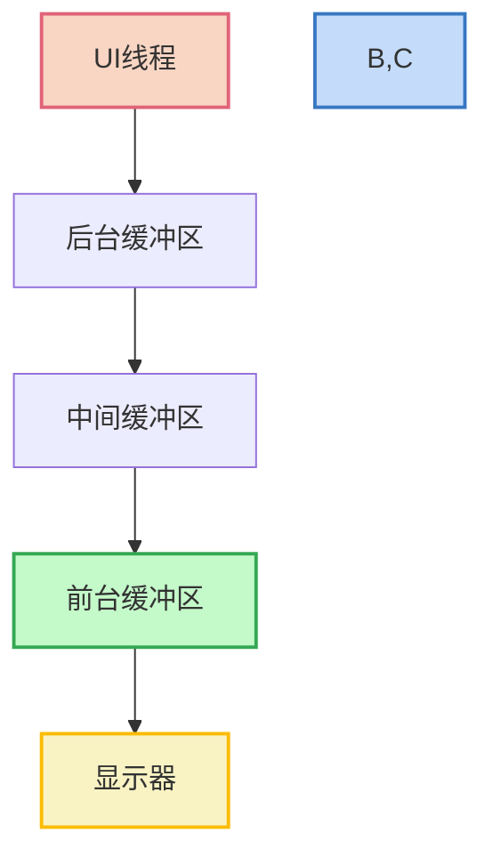

为了提高渲染性能，Android 采用多缓冲机制：
- 前台缓冲区（Front Buffer）：当前显示的内容
- 后台缓冲区（Back Buffer）：正在准备的下一帧
- 中间缓冲区：额外的缓冲区，减少等待

多缓冲可以提高界面流畅度，但会增加内存使用和显示延迟。

## 常见性能问题及优化

### 过度绘制

过度绘制（Overdraw）是指同一个像素被多次绘制的情况：

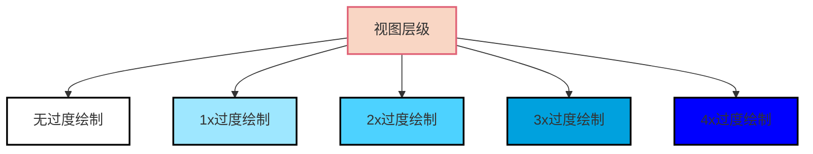

减少过度绘制的方法：
- 移除不必要的背景
- 减少视图层级嵌套
- 使用 `clipRect()` 和 `quickReject()` 避免绘制不可见区域
- 使用 `setLayerType()` 合理设置图层类型

### 布局优化

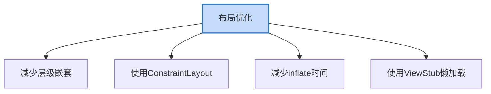

布局优化关键点：
- 使用 Hierarchy Viewer 和 Layout Inspector 分析视图层级
- 使用 `<merge>` 标签合并布局层级
- 使用 `<include>` 复用布局
- 使用 ViewStub 延迟加载不常用视图
- 使用 ConstraintLayout 创建扁平布局

### 离屏缓冲

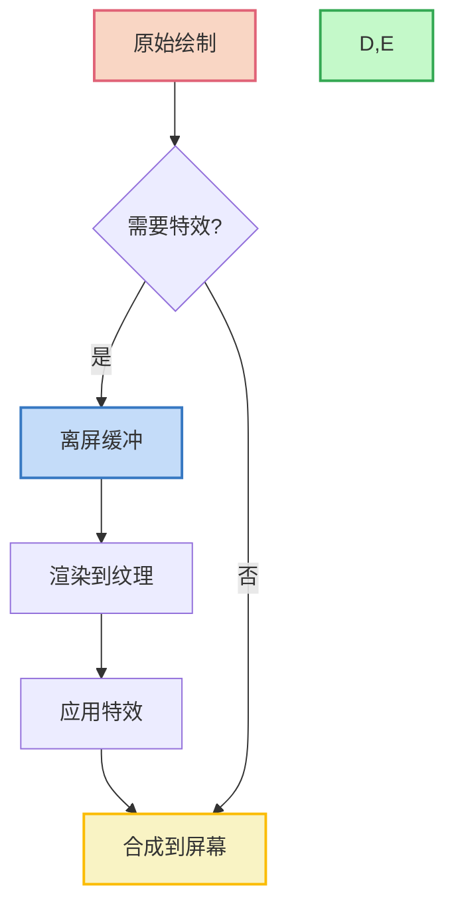

离屏缓冲（Off-screen Rendering）是指在非显示缓冲区中进行绘制：
- 用于实现复杂视觉效果（如阴影、模糊、动画）
- 可能导致性能下降，特别是在低端设备上
- 应用透明度、旋转、动画等效果时会触发

优化离屏缓冲：
- 减少半透明层叠
- 避免设置多个复杂的图层特效
- 使用 `setLayerType(LAYER_TYPE_HARDWARE)` 合理设置图层渲染类型

### 自定义 View 优化

```java
class EfficientCustomView extends View {
    
    // 减少对象分配
    private final Paint mPaint = new Paint();
    private final Rect mBounds = new Rect();
    
    @Override
    protected void onDraw(Canvas canvas) {
        // 1. 避免在onDraw中创建对象
        // 错误: Paint paint = new Paint();
        
        // 2. 使用canvas的裁剪方法减少绘制区域
        canvas.clipRect(mBounds);
        
        // 3. 仅绘制可见部分
        if (!canvas.quickReject(mBounds, Canvas.EdgeType.AA)) {
            // 执行绘制
        }
        
        // 4. 使用硬件加速特性
        if (canvas.isHardwareAccelerated()) {
            // 利用硬件加速特性优化绘制
        }
    }
    
    // 5. 仅在必要时调用invalidate
    private void updateAndInvalidateOnlyIfNeeded() {
        if (contentChanged) {
            // 计算需要重绘的区域
            invalidate(dirtyRect);
            // 不要用 invalidate() 重绘整个视图
        }
    }
}
```

## 新一代图形渲染技术

### Compose 渲染模型

Jetpack Compose 采用了全新的声明式 UI 模型和渲染机制：

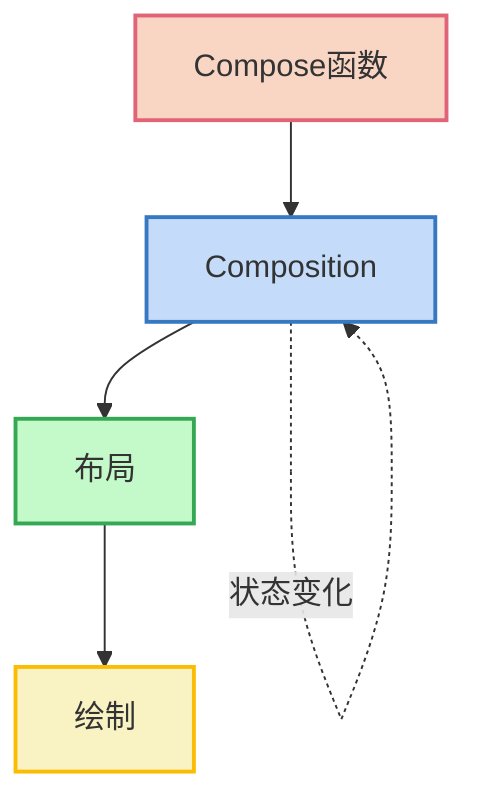

Compose 的渲染特点：
- 声明式 UI，无需直接操作视图树
- 高效的增量重组（只更新变化的部分）
- 内置动画和过渡效果
- 仍然基于 Android 的硬件加速渲染系统

### Vulkan

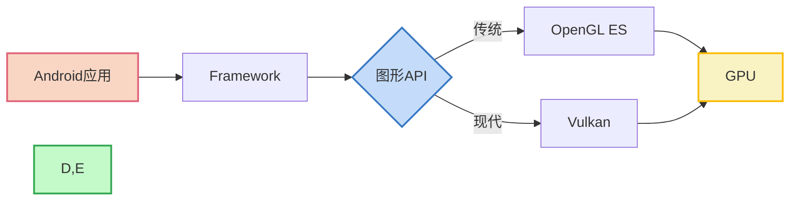

Vulkan 是新一代低开销图形 API：
- 更低的 CPU 开销
- 更好的多线程支持
- 更精细的控制
- 用于游戏和高性能图形应用
- 从 Android 7.0 开始支持

## 调试与分析工具

### Profile GPU Rendering

通过 `adb shell dumpsys gfxinfo` 可以获取帧渲染信息：

```bash
# 查看指定应用的帧信息
adb shell dumpsys gfxinfo com.example.app
```

在开发者选项中开启 "Profile GPU Rendering" 可以直观地查看渲染性能：
- 绿色：测量和布局时间
- 蓝色：绘制操作执行时间
- 紫色：GPU 处理时间
- 橙色：交换缓冲区时间

### Systrace

Systrace 工具可以深入分析系统性能，包括渲染：

```bash
# 收集渲染相关的性能数据
python systrace.py -b 10000 -o trace.html gfx view res sched
```

Systrace 提供：
- 精确的时间线图表
- CPU 使用情况
- 帧渲染细节
- UI 线程和渲染线程活动

### Layout Inspector

Layout Inspector 可以在运行时检查应用的视图层次：
- 可视化视图层级
- 查看各个视图的属性
- 分析布局性能问题
- 识别过度绘制区域

## 总结

Android 的 UI 渲染机制是一个复杂的多阶段过程，从视图的测量、布局和绘制，到硬件加速渲染和最终显示，每个环节都至关重要。理解这些机制不仅有助于开发高性能的应用界面，还能帮助诊断和解决渲染相关的问题。

渲染性能优化的关键点：
1. 减少视图层级和过度绘制
2. 优化布局结构和绘制操作
3. 合理使用硬件加速特性
4. 避免在 UI 线程进行耗时操作
5. 使用专业工具分析和优化渲染性能

随着 Android 渲染技术的不断发展，特别是 Jetpack Compose 和 Vulkan 等新技术的引入，UI 渲染的效率和灵活性将进一步提高，为用户带来更流畅、更丰富的交互体验。

---

## 参考资源

- [Android 开发者文档 - 渲染](https://developer.android.com/topic/performance/rendering)
- [Android 图形渲染原理](https://source.android.com/devices/graphics)
- 《Android 开发艺术探索》第 3 章 View 的工作原理
- 《深入理解 Android 内核设计思想》第 10 章 图形显示系统 