# Android 应用启动流程

## 概述

Android 应用启动流程是指从用户点击应用图标到应用界面显示的整个过程。这个过程涉及多个系统组件的协作，包括 Launcher、ActivityManagerService、Zygote、ApplicationThread 等。理解应用启动流程对于优化应用启动速度、解决启动问题以及深入理解 Android 系统架构都有重要意义。

## 启动流程概览

Android 应用的启动流程可以大致分为以下几个阶段：

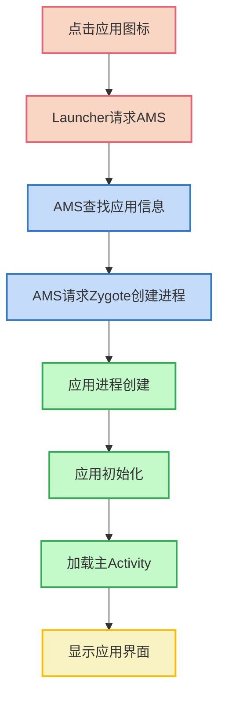

下面我们将详细介绍应用启动的每个阶段。

## 详细启动流程

### 第一阶段：点击应用图标

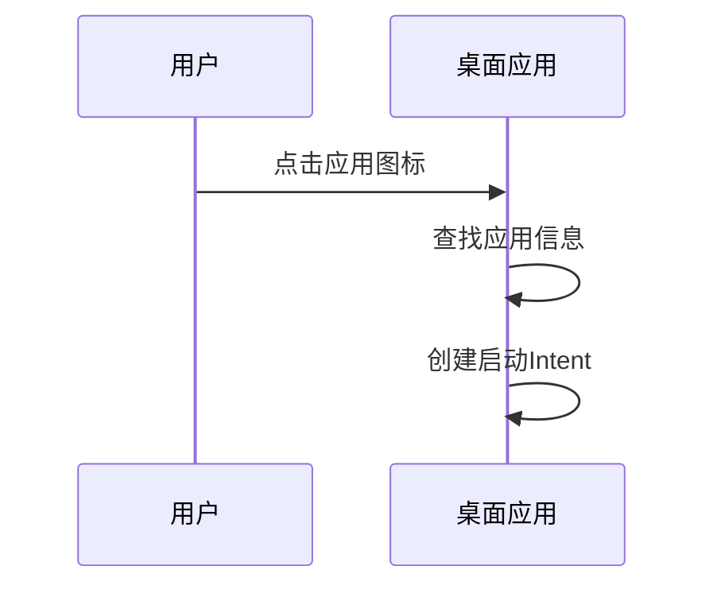

当用户点击应用图标时：
1. Launcher 接收到点击事件
2. 根据点击位置找到对应的应用信息（包名、主 Activity 等）
3. 创建一个带有 `ACTION_MAIN` 和 `CATEGORY_LAUNCHER` 的 Intent

关键代码（Launcher 中）：
```java
Intent intent = new Intent(Intent.ACTION_MAIN);
intent.addCategory(Intent.CATEGORY_LAUNCHER);
intent.setComponent(new ComponentName(packageName, className));
intent.setFlags(Intent.FLAG_ACTIVITY_NEW_TASK | Intent.FLAG_ACTIVITY_RESET_TASK_IF_NEEDED);
startActivity(intent);
```

### 第二阶段：Launcher 请求 AMS 启动应用

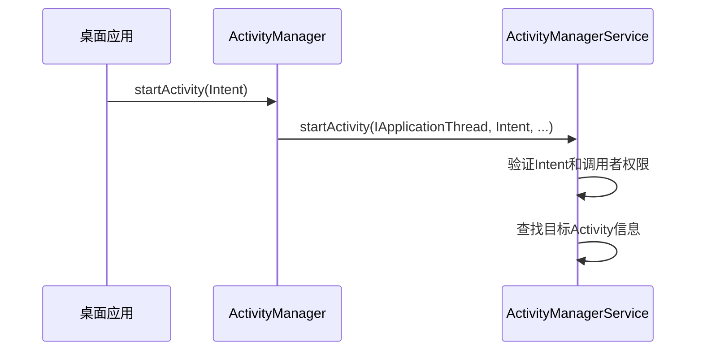

1. Launcher 调用 `startActivity()` 方法请求启动应用
2. 该请求通过 Binder IPC 传递给 ActivityManagerService
3. ActivityManagerService 验证 Intent 和调用者权限
4. ActivityManagerService 查找目标 Activity 的信息

### 第三阶段：AMS 处理启动请求

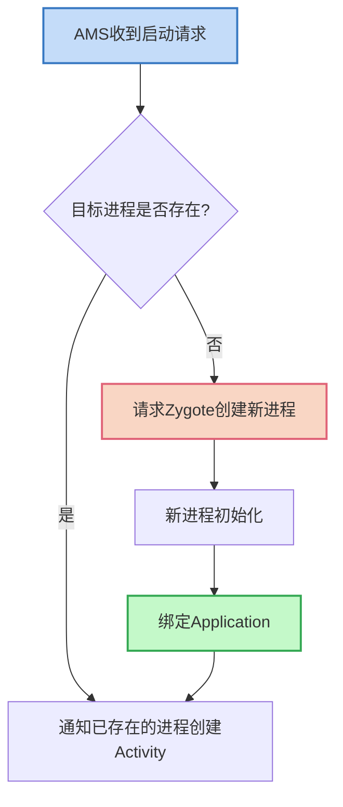

ActivityManagerService 处理启动请求的步骤：
1. 检查目标应用进程是否已存在
2. 如果进程不存在，需要创建新进程
3. 如果进程已存在，直接通知该进程创建 Activity

### 第四阶段：创建应用进程

如果应用进程不存在，AMS 会请求 Zygote 创建一个新进程：

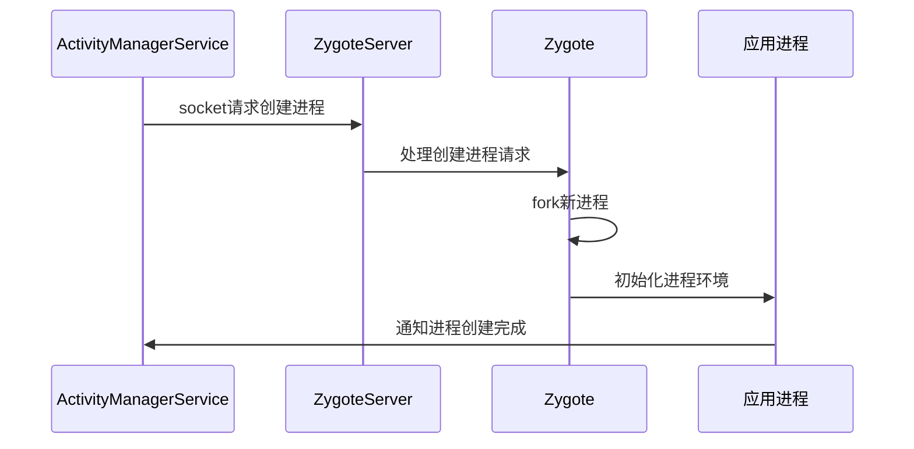

进程创建的关键步骤：
1. AMS 通过 Socket 连接 Zygote 进程
2. 发送创建进程的请求，包含进程名、UID、GID 等信息
3. Zygote fork 出新进程
4. 新进程初始化运行环境（虚拟机、线程等）
5. 执行 ActivityThread 的 main() 方法

关键代码（Zygote 中的 fork 部分）：
```java
private static Runnable forkAndSpecialize(int uid, int gid, int[] gids,
        int runtimeFlags, int mountExternal, String seInfo, String niceName,
        int[] fdsToClose, int[] fdsToIgnore, boolean startChildZygote,
        String instructionSet, String appDataDir, boolean isTopApp) {
    // 通过JNI调用fork创建新进程
    int pid = nativeForkAndSpecialize(...);
    if (pid == 0) {
        // 子进程逻辑
        return handleChildProc(...);
    } else {
        // 父进程逻辑
        return null;
    }
}
```

### 第五阶段：应用进程初始化

新创建的应用进程执行 ActivityThread 的 main() 方法，初始化应用环境：

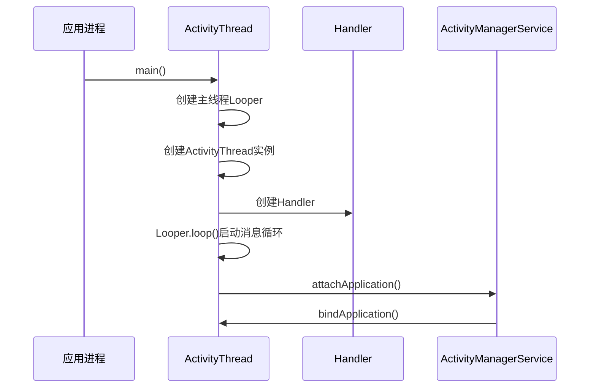

ActivityThread main() 方法的主要工作：
1. 创建主线程的 Looper 和消息队列
2. 创建 ActivityThread 实例
3. 创建 Handler 处理消息
4. 调用 Looper.loop() 开始消息循环
5. 通过 Binder 调用 AMS 的 attachApplication() 方法

关键代码（ActivityThread 的 main 方法）：
```java
public static void main(String[] args) {
    Looper.prepareMainLooper();
    
    ActivityThread thread = new ActivityThread();
    thread.attach(false);
    
    Looper.loop();
    
    throw new RuntimeException("Main thread loop unexpectedly exited");
}
```

### 第六阶段：绑定 Application

进程创建后，AMS 通知应用进程绑定 Application：

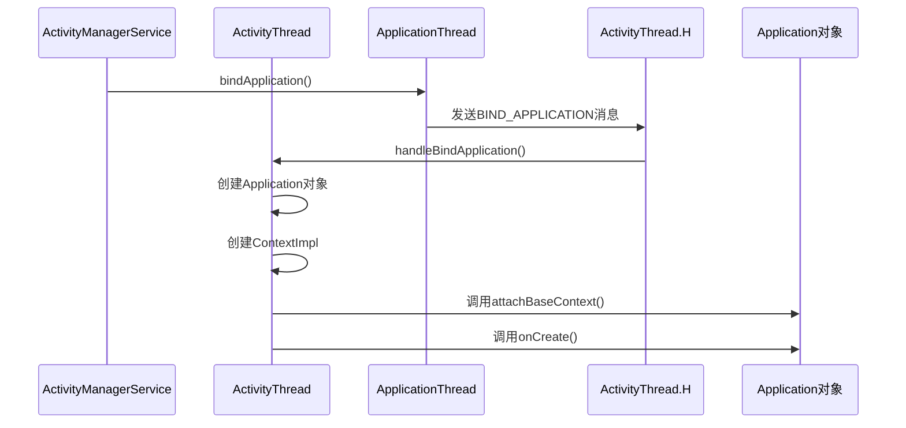

绑定 Application 的主要步骤：
1. AMS 通过 IApplicationThread 接口通知应用进程绑定 Application
2. ApplicationThread 收到请求后，通过 Handler 发送 BIND_APPLICATION 消息
3. Handler 处理消息，调用 ActivityThread 的 handleBindApplication() 方法
4. 创建 Application 对象和 ContextImpl 对象
5. 调用 Application 的 attachBaseContext() 和 onCreate() 方法

关键代码（handleBindApplication 方法）：
```java
private void handleBindApplication(AppBindData data) {
    // 创建LoadedApk对象
    data.info = getPackageInfoNoCheck(data.appInfo);
    
    // 创建ContextImpl
    final ContextImpl appContext = ContextImpl.createAppContext(this, data.info);
    
    // 创建Application对象
    Application app = data.info.makeApplication(data.restrictedBackupMode, null);
    
    // 初始化Application
    app.onCreate();
}
```

### 第七阶段：创建启动 Activity

Application 初始化完成后，AMS 通知应用进程创建启动 Activity：

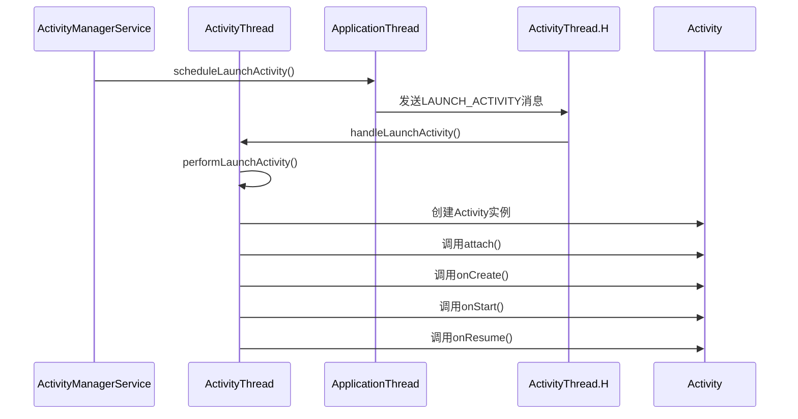

启动 Activity 的主要步骤：
1. AMS 通过 IApplicationThread 接口通知应用进程启动 Activity
2. ApplicationThread 收到请求后，通过 Handler 发送 LAUNCH_ACTIVITY 消息
3. Handler 处理消息，调用 ActivityThread 的 handleLaunchActivity() 方法
4. 创建 Activity 实例
5. 依次调用 Activity 的 onCreate()、onStart() 和 onResume() 方法

关键代码（performLaunchActivity 方法）：
```java
private Activity performLaunchActivity(ActivityClientRecord r, Intent customIntent) {
    // 创建Activity实例
    Activity activity = null;
    try {
        java.lang.ClassLoader cl = r.packageInfo.getClassLoader();
        activity = mInstrumentation.newActivity(cl, component.getClassName(), r.intent);
    } catch (Exception e) {
        // ...
    }
    
    // 创建Context
    Context appContext = createBaseContextForActivity(r, activity);
    
    // 初始化Activity
    activity.attach(appContext, this, getInstrumentation(), ...);
    
    // 调用onCreate
    activity.onCreate(r.state);
    
    return activity;
}
```

### 第八阶段：显示 Activity 界面

Activity 创建完成后，还需要经过测量、布局和绘制才能显示界面：

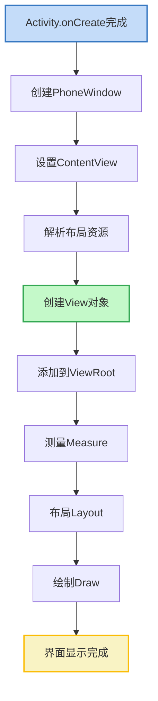

界面显示的主要步骤：
1. 在 onCreate() 方法中调用 setContentView() 设置布局
2. 解析布局文件，创建 View 对象树
3. 将根 View 添加到 ViewRoot
4. 执行测量 (measure)、布局 (layout) 和绘制 (draw) 过程
5. 界面显示完成

关键代码（Activity 设置视图）：
```java
@Override
protected void onCreate(Bundle savedInstanceState) {
    super.onCreate(savedInstanceState);
    setContentView(R.layout.activity_main);
}

public void setContentView(int layoutResID) {
    getWindow().setContentView(layoutResID);
    initWindowDecorActionBar();
}
```

## 冷启动、温启动和热启动

根据应用和进程的状态，应用启动可以分为三种类型：

### 冷启动（Cold Start）

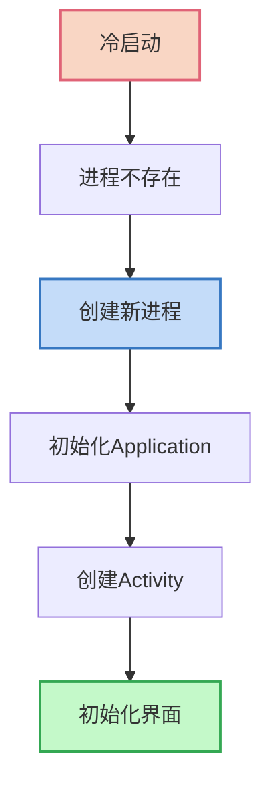

冷启动特点：
- 应用进程不存在
- 需要从头创建进程
- 初始化 Application 和主 Activity
- 耗时最长

### 温启动（Warm Start）

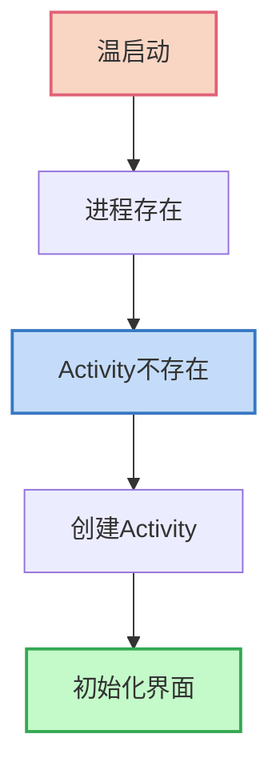

温启动特点：
- 应用进程已存在
- 但 Activity 需要重新创建
- 比冷启动快，但仍需重新初始化 Activity

### 热启动（Hot Start）

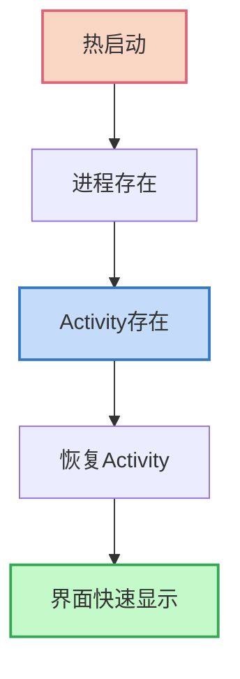

热启动特点：
- 应用进程已存在
- Activity 实例也存在（在回退栈中）
- 只需要恢复 Activity 状态
- 启动最快

## Activity 启动模式对启动流程的影响

Activity 的四种启动模式会影响应用的启动流程：

### standard（标准模式）

- 每次启动都创建新的 Activity 实例
- 新实例会加入当前任务栈顶
- 不会复用已有实例

### singleTop（栈顶复用模式）

- 如果要启动的 Activity 已在栈顶，则复用该实例，调用 onNewIntent()
- 否则创建新实例

### singleTask（栈内复用模式）

- 如果要启动的 Activity 已在栈内，则清除它上面的所有 Activity，并复用该实例
- 否则创建新任务栈和新实例

### singleInstance（单例模式）

- Activity 独占一个任务栈
- 全局唯一实例

启动模式对应的代码：
```xml
<activity
    android:name=".MainActivity"
    android:launchMode="singleTask">
    <!-- ... -->
</activity>
```

## 应用启动优化策略

了解应用启动流程后，可以采取以下优化策略加速启动：

### 1. Application 优化

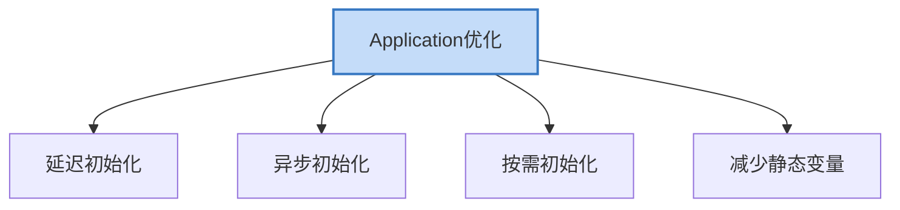

- 延迟初始化：非必要组件延迟到需要时才初始化
- 异步初始化：耗时操作放到子线程中执行
- 按需初始化：使用时才初始化的组件
- 减少静态变量：减少类加载时间

示例代码：
```java
public class MyApplication extends Application {
    @Override
    public void onCreate() {
        super.onCreate();
        
        // 必要初始化
        initCriticalComponents();
        
        // 延迟初始化
        delayInit();
    }
    
    private void delayInit() {
        new Thread(() -> {
            // 耗时操作
            initNonCriticalComponents();
            
            // 根据需要，可以通过Handler回到主线程
        }).start();
    }
}
```

### 2. 主题优化

设置启动主题，使用 windowBackground 提供视觉反馈：

```xml
<style name="SplashTheme" parent="Theme.AppCompat.Light.NoActionBar">
    <item name="android:windowBackground">@drawable/splash_background</item>
    <item name="android:windowFullscreen">true</item>
</style>
```

### 3. 布局优化

- 使用 ViewStub 延迟加载非关键视图
- 使用 merge 减少视图层级
- 使用 ConstraintLayout 减少布局嵌套

示例代码：
```xml
<ViewStub
    android:id="@+id/stub_import"
    android:inflatedId="@+id/panel_import"
    android:layout="@layout/progress_overlay"
    android:layout_width="match_parent"
    android:layout_height="wrap_content" />
```

### 4. 懒加载

- 仅加载可见区域的内容
- 列表数据分页加载
- 图片延迟加载

### 5. 预加载和缓存

- 预先加载下一步可能需要的数据
- 缓存常用数据，避免重复加载
- 使用 WorkManager 在应用未启动时预加载

## 启动时间测量工具

为了优化应用启动，首先需要准确测量启动时间：

### 1. adb 命令

```bash
adb shell am start -W com.example.app/.MainActivity
```

输出结果包含三个时间：
- ThisTime: 最后一个 Activity 启动耗时
- TotalTime: 启动一连串 Activity 总耗时
- WaitTime: 应用进程创建加上 TotalTime

### 2. Android Studio Profiler

- 使用 CPU Profiler 分析启动过程的 CPU 使用情况
- 识别启动过程中的性能瓶颈

### 3. 自定义打点

在代码中添加时间打点：

```java
public class MyApplication extends Application {
    private long startTime;
    
    @Override
    public void onCreate() {
        startTime = System.currentTimeMillis();
        super.onCreate();
        
        Log.d("AppStart", "Application onCreate time: " + (System.currentTimeMillis() - startTime));
    }
}

public class MainActivity extends AppCompatActivity {
    private long startTime;
    
    @Override
    protected void onCreate(Bundle savedInstanceState) {
        startTime = System.currentTimeMillis();
        super.onCreate(savedInstanceState);
        setContentView(R.layout.activity_main);
        
        Log.d("AppStart", "Activity onCreate time: " + (System.currentTimeMillis() - startTime));
        
        getWindow().getDecorView().post(() -> {
            Log.d("AppStart", "First frame rendered: " + (System.currentTimeMillis() - startTime));
        });
    }
}
```

## Jetpack App Startup 库

Google 提供的 Jetpack App Startup 库可以优化组件初始化：

```gradle
implementation "androidx.startup:startup-runtime:1.1.1"
```

使用示例：
```java
// 实现 Initializer 接口
public class SampleInitializer implements Initializer<SampleComponent> {
    @NonNull
    @Override
    public SampleComponent create(@NonNull Context context) {
        // 初始化组件
        SampleComponent component = new SampleComponent(context);
        return component;
    }
    
    @NonNull
    @Override
    public List<Class<? extends Initializer<?>>> dependencies() {
        // 声明依赖的其他初始化器
        return Collections.emptyList();
    }
}
```

在 AndroidManifest.xml 中注册：
```xml
<provider
    android:name="androidx.startup.InitializationProvider"
    android:authorities="${applicationId}.androidx-startup"
    android:exported="false"
    tools:node="merge">
    <meta-data
        android:name="com.example.SampleInitializer"
        android:value="androidx.startup" />
</provider>
```

## 总结

Android 应用的启动流程是一个复杂的过程，涉及多个系统组件的协作。通过深入理解启动流程中的各个环节，开发者可以有针对性地进行优化，提高应用的启动速度和用户体验。

主要优化方向包括：
1. 减少 Application 中的初始化工作
2. 优化布局层次和加载方式
3. 使用懒加载和预加载技术
4. 利用启动主题提供视觉反馈
5. 使用专业工具测量和分析启动性能

通过这些优化手段，可以显著提升应用的启动速度，降低用户等待时间，提高用户满意度。

---

## 参考资源

- [Android 开发者文档 - 应用启动时间](https://developer.android.com/topic/performance/vitals/launch-time)
- [Android 源码](https://android.googlesource.com/)
- 《Android 开发艺术探索》第 9 章
- 《深入理解 Android 内核设计思想》第 4 章 