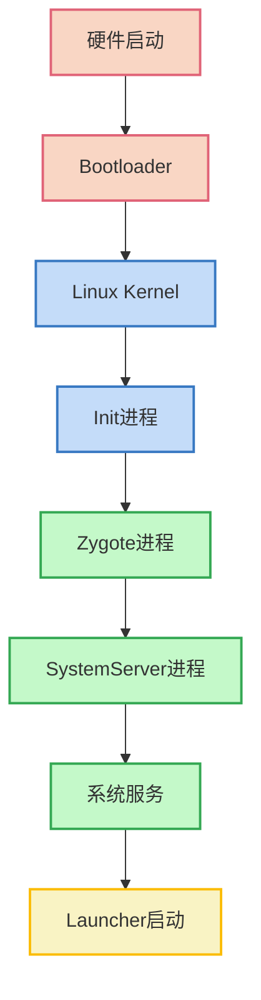
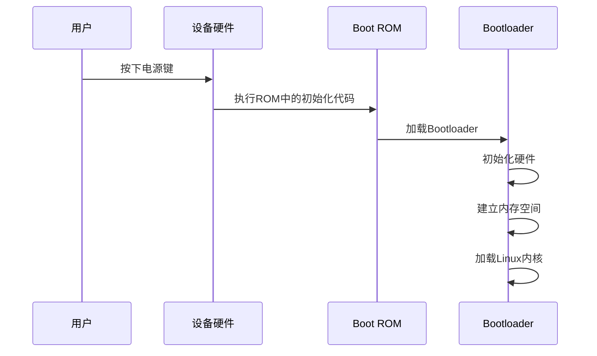
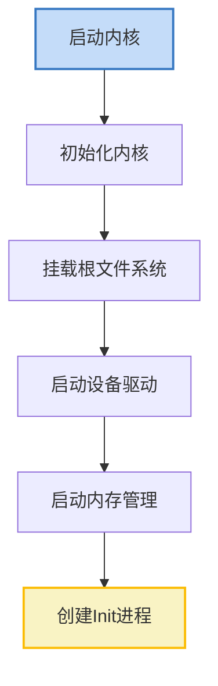
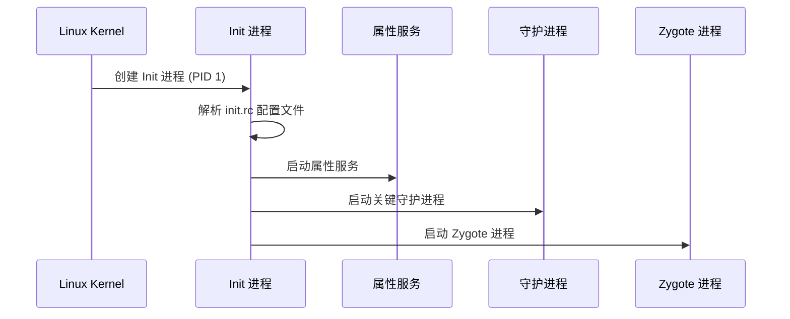
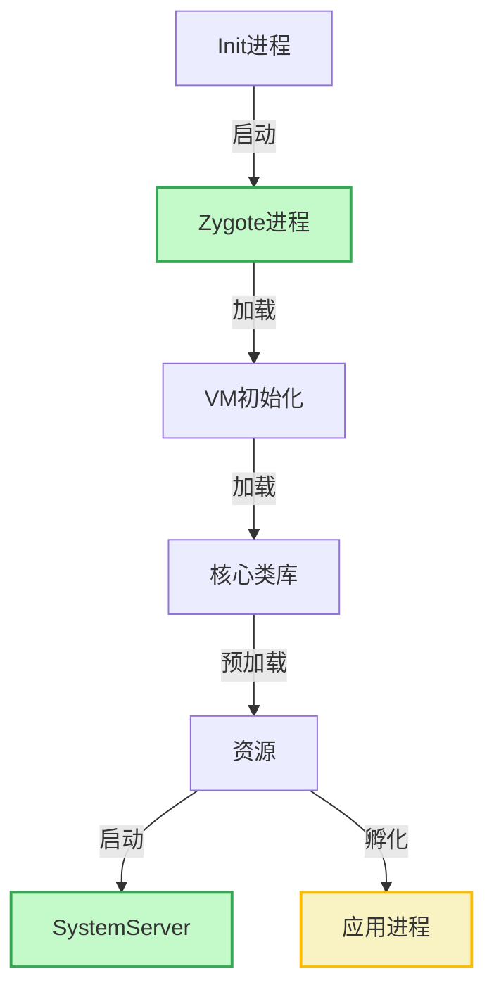
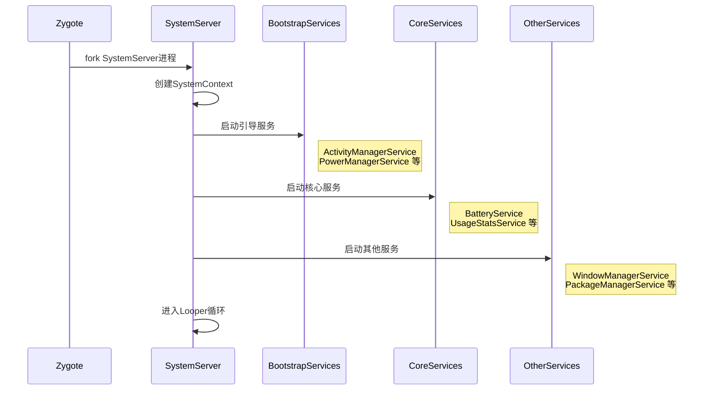
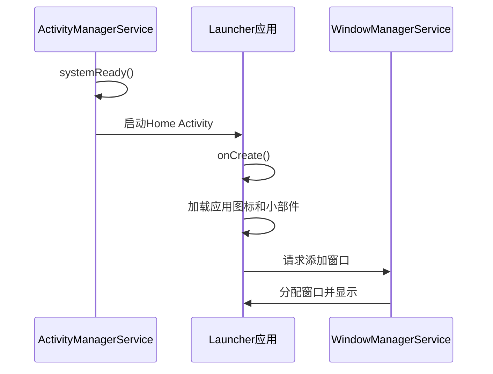

# Android 系统启动流程

## 概述

Android 系统启动是一个复杂而精密的过程，从按下电源键到显示桌面，系统经历了多个阶段和进程的启动。理解系统启动流程对于深入掌握 Android 系统架构至关重要，也是解决系统启动问题、进行启动优化的基础。本文将详细介绍 Android 系统的完整启动流程。

## 启动流程概览

Android 系统启动流程大致可分为以下几个阶段：



1. **Boot ROM**: 加载引导程序
2. **Bootloader**: 初始化硬件，加载内核
3. **Linux Kernel**: 启动内核，加载驱动
4. **Init 进程**: 第一个用户空间进程，解析 init.rc
5. **Zygote 进程**: 所有 Java 进程的父进程
6. **SystemServer 进程**: 启动系统服务
7. **系统服务**: 各种系统服务启动
8. **Launcher**: 桌面应用启动

下面我们将详细介绍每个阶段的工作内容和关键流程。

## 详细启动流程

### 第一阶段：Boot ROM 和 Bootloader

当用户按下电源键，设备首先执行存储在 ROM 中的预设代码。



#### Boot ROM

Boot ROM 是芯片厂商预置在设备中的只读代码：
- 执行系统底层硬件初始化
- 定位 Bootloader 并将其加载到 RAM
- 跳转到 Bootloader 开始执行

#### Bootloader

Bootloader 是运行 Android 之前的一个小程序：
- 初始化硬件（如 Flash、屏幕等）
- 建立内存空间
- 加载 Linux 内核到指定内存地址
- 跳转到内核入口点

### 第二阶段：Linux 内核启动

内核启动过程包括以下步骤：



1. **内核解压和初始化**: 解压内核镜像，初始化内核数据结构
2. **硬件初始化**: 识别 CPU 类型，初始化内存管理、中断管理等
3. **挂载根文件系统**: 挂载 RAM Disk 作为根文件系统
4. **启动设备驱动**: 启动各种硬件设备的驱动程序
5. **创建 Init 进程**: 创建第一个用户空间进程（PID 为 1）

### 第三阶段：Init 进程

Init 进程是 Android 系统中的第一个用户空间进程，负责初始化系统环境。



#### Init 进程主要任务

1. **挂载文件系统**: 挂载 /sys、/dev、/proc 等文件系统
2. **创建设备节点**: 在 /dev 下创建设备节点
3. **解析 init.rc**: 解析初始化配置文件
4. **启动属性服务**: 提供系统属性管理服务
5. **启动关键守护进程**: 启动 servicemanager、vold、adbd 等
6. **启动 Zygote**: 通过执行 app_process 启动 Zygote 进程

#### init.rc 文件解析

init.rc 是 Android 初始化脚本，包含四种语句类型：

```bash
# 示例 init.rc 文件结构
import /init.${ro.hardware}.rc

on early-init
    # 早期初始化动作
    start ueventd

on init
    # 初始化动作
    mkdir /system
    mount ext4 /dev/block/bootdevice/by-name/system /system ro

on post-fs
    # 文件系统挂载后的动作
    restorecon_recursive /system

service zygote /system/bin/app_process -Xzygote /system/bin --zygote --start-system-server
    class main
    socket zygote stream 660 root system
    onrestart write /sys/android_power/request_state wake
```

- **Action**: 由触发器和命令组成（如 on init）
- **Service**: 定义需要启动的服务（如 service zygote）
- **Command**: 具体执行的命令（如 mkdir、mount）
- **Option**: 服务的选项（如 socket、onrestart）

### 第四阶段：Zygote 进程

Zygote 是所有 Java 进程的父进程，负责启动 SystemServer 和应用程序。



#### Zygote 启动流程

1. **启动 app_process**: Init 进程执行 app_process 命令
2. **创建 JVM**: 创建 Java 虚拟机
3. **注册 JNI 方法**: 注册 JNI 本地方法
4. **创建 Java 运行时**: 初始化 Java 运行环境
5. **预加载类和资源**: 加载常用的 Java 类和资源
6. **启动 SystemServer**: 创建 SystemServer 进程
7. **进入监听循环**: 等待请求创建新的应用进程

关键源代码（app_main.cpp）：

```cpp
int main(int argc, char* const argv[]) {
    // ...
    AppRuntime runtime(argv[0], computeArgBlockSize(argc, argv));
    // ...
    if (zygote) {
        runtime.start("com.android.internal.os.ZygoteInit", args, zygote);
    } else if (className) {
        runtime.start("com.android.internal.os.RuntimeInit", args, zygote);
    }
    // ...
}
```

关键源代码（ZygoteInit.java）：

```java
public static void main(String argv[]) {
    // 注册Socket
    registerZygoteSocket(socketName);
    
    // 预加载类和资源
    preload();
    
    // 启动SystemServer
    if (startSystemServer) {
        startSystemServer(abiList, socketName);
    }
    
    // 进入循环，接收请求
    runSelectLoop(abiList);
}
```

### 第五阶段：SystemServer 进程

SystemServer 进程是 Android 系统服务的载体，负责启动和管理所有的系统服务。



#### SystemServer 启动流程

1. **创建进程**: Zygote fork 出 SystemServer 进程
2. **创建 Context**: 创建系统上下文环境
3. **启动各类服务**:
   - **引导服务**: ActivityManagerService、PowerManagerService 等
   - **核心服务**: BatteryService、UsageStatsService 等
   - **其他服务**: WindowManagerService、PackageManagerService 等
4. **进入消息循环**: 执行 Looper.loop() 开始消息循环

关键源代码（SystemServer.java）：

```java
public static void main(String[] args) {
    new SystemServer().run();
}

private void run() {
    // ...
    // 创建SystemContext
    createSystemContext();
    
    // 启动服务
    try {
        startBootstrapServices();
        startCoreServices();
        startOtherServices();
    } catch (Throwable ex) {
        // ...
    }
    
    // 进入消息循环
    Looper.loop();
}
```

### 第六阶段：系统服务启动

SystemServer 启动的服务按功能和启动时机可以分为三类：

#### 引导服务（Bootstrap Services）

最先启动的核心服务，如：
- **ActivityManagerService**: 管理四大组件
- **PowerManagerService**: 管理电源
- **PackageManagerService**: 管理应用包
- **DisplayManagerService**: 管理显示

#### 核心服务（Core Services）

基础功能服务，如：
- **BatteryService**: 管理电池
- **UsageStatsService**: 使用统计
- **WebViewUpdateService**: WebView 更新

#### 其他服务（Other Services）

功能性服务，如：
- **WindowManagerService**: 窗口管理
- **InputManagerService**: 输入管理
- **LocationManagerService**: 位置服务
- **NotificationManagerService**: 通知管理

### 第七阶段：Launcher 启动

Launcher 是 Android 的桌面应用，是用户看到的第一个应用界面。



#### Launcher 启动流程

1. **AMS 准备完成**: ActivityManagerService 调用 systemReady()
2. **启动 Home 应用**: 启动类别为 CATEGORY_HOME 的 Activity
3. **Launcher 初始化**: 加载桌面布局、应用图标和小部件
4. **显示桌面**: 通过 WindowManager 显示桌面界面

关键源代码（ActivityManagerService.java）：

```java
public void systemReady(final Runnable goingCallback, TimingsTraceLog traceLog) {
    // ...
    
    // 启动持久性应用
    startPersistentApps(PERSISTENT_MASK);
    
    // 启动Home应用
    startHomeActivityLocked(currentUserId, "systemReady");
    
    // ...
}
```

## 进程启动时间线

以下是 Android 系统启动的时间线图，展示了主要进程的启动顺序和依赖关系：

```mermaid
gantt
    title Android 系统启动时间线
    dateFormat  s
    
    section 引导阶段
    Boot ROM            :a1, 0, 1s
    Bootloader          :a2, after a1, 2s
    Linux Kernel        :a3, after a2, 3s
    
    section 进程启动
    Init进程            :b1, after a3, 2s
    Zygote进程          :b2, after b1, 3s
    SystemServer进程    :b3, after b2, 4s
    
    section 系统服务
    引导服务            :c1, after b3, 2s
    核心服务            :c2, after c1, 1s
    其他服务            :c3, after c2, 3s
    
    section 应用启动
    Launcher            :d1, after c3, 2s
```



## 启动调试与优化

### 启动调试方法

1. **系统日志分析**: 使用 logcat 查看启动日志

```bash
adb logcat -b all | grep "SystemServer"
```

2. **启动时间测量**: 使用 bootchart 或 systrace 工具

```bash
# 启用 bootchart
adb shell touch /data/bootchart/enabled

# 使用 systrace
python systrace.py -b 10000 -o trace.html wm am view sched freq idle load
```

3. **引导过程跟踪**: 修改 init.rc 添加调试信息

```
on boot
    exec - root root -- /system/bin/logwrapper /system/bin/sh -c "echo 'Boot completed' > /dev/kmsg"
```

### 启动优化技巧

1. **关键服务优先启动**: 调整服务启动顺序，优先启动关键服务
2. **延迟启动非关键服务**: 将非关键服务延迟到系统启动完成后启动
3. **减少启动时资源加载**: 减少预加载资源数量
4. **优化 init.rc 配置**: 精简 init.rc 文件，移除不必要的操作
5. **代码级优化**: 优化关键服务的初始化代码
6. **并行启动服务**: 将无依赖关系的服务并行启动

## 定制系统启动流程

### 修改 Bootloader

修改 Bootloader 配置可以更改启动参数：

```
# 修改启动参数
setenv bootargs "console=ttyS0,115200 root=/dev/mmcblk0p2 rw rootwait"
saveenv
```

### 修改 init.rc

通过修改 init.rc 文件可以定制初始化过程：

```
# 添加自定义服务
service custom_service /system/bin/custom_service
    class main
    user root
    group root
    oneshot
```

### 添加启动服务

在 SystemServer 中添加自定义系统服务：

```java
private void startOtherServices() {
    // ...
    
    // 添加自定义服务
    traceBeginAndSlog("StartMyService");
    try {
        Slog.i(TAG, "My Service");
        myService = new MyService(context);
        ServiceManager.addService("my_service", myService);
    } catch (Throwable e) {
        reportWtf("starting My Service", e);
    }
    traceEnd();
    
    // ...
}
```

## 总结

Android 系统启动是一个复杂而精密的过程，从底层硬件初始化到上层应用启动，经历了多个阶段和多个进程的协作。理解这一过程不仅有助于解决系统启动问题，也有助于进行系统级优化。本文详细介绍了从按下电源键到显示桌面的完整启动流程，希望能帮助读者深入理解 Android 系统架构。

---

## 参考资源

- [Android 开源项目](https://source.android.com/)
- [Android 启动流程](https://source.android.com/devices/bootloader/boot-flow)
- [Init 进程文档](https://source.android.com/devices/architecture/init)
- 《深入理解 Android 内核设计思想》第 2 章 系统启动
- 《Android 系统源代码情景分析》第 1 章 系统启动过程 