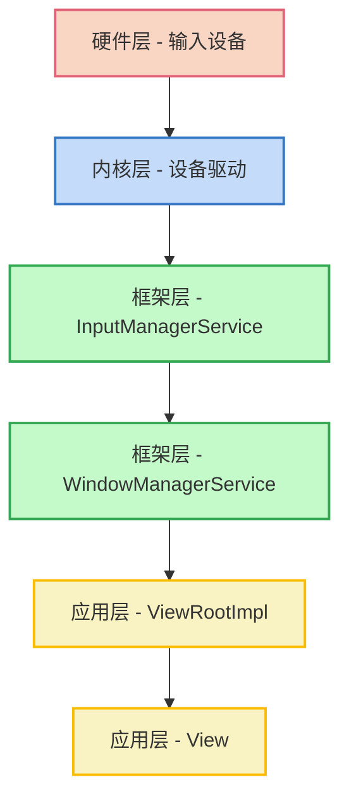
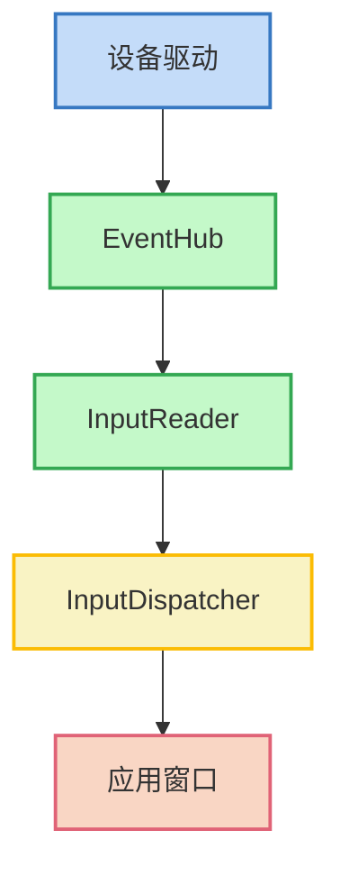
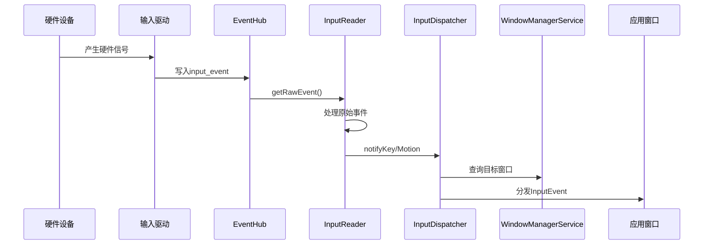
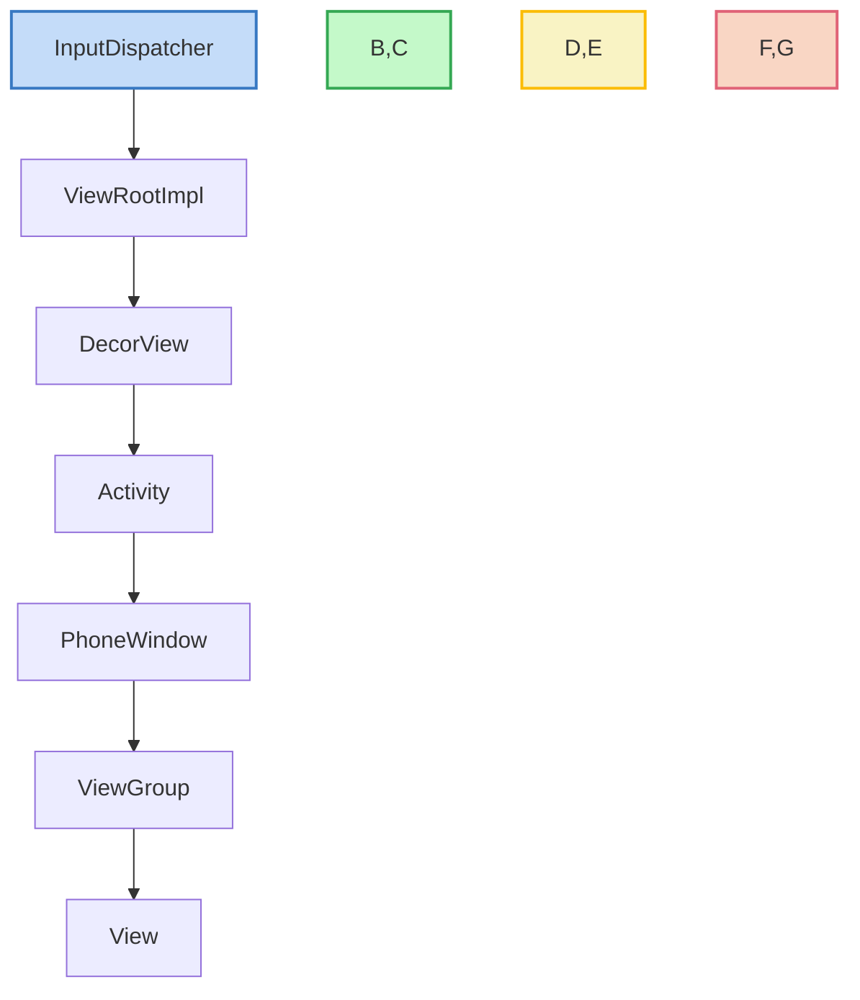
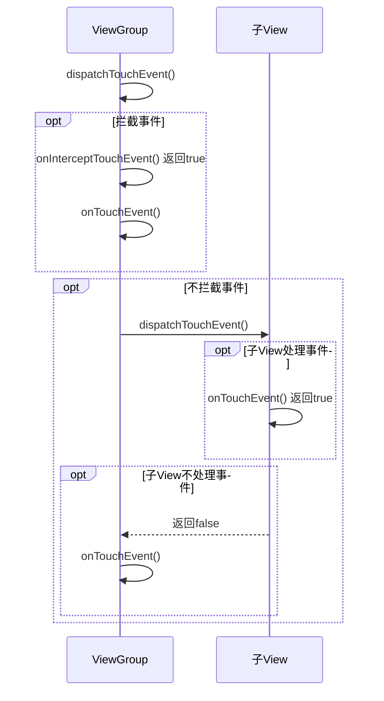
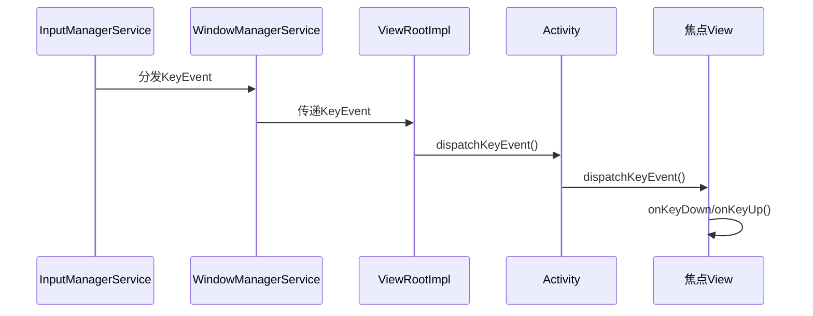

# Android 输入事件处理

## 概述

Android 输入事件处理系统是连接用户操作和应用响应的桥梁，负责处理触摸屏、键盘、按键等各类输入设备的事件。理解输入事件的处理机制对开发高响应度的应用界面、自定义交互控件以及解决常见的事件冲突问题都有重要意义。

## 输入系统架构

Android 输入系统采用分层架构设计，从底层硬件到应用层形成完整的事件处理链路：



### 架构层次说明

1. **硬件层**：物理输入设备，如触摸屏、键盘、按键等
2. **内核层**：设备驱动接收原始输入信号，转换为内核事件
3. **框架层 - InputManagerService**：接收内核事件，预处理并分发
4. **框架层 - WindowManagerService**：确定接收事件的窗口
5. **应用层 - ViewRootImpl**：接收事件并传递给视图系统
6. **应用层 - View**：具体视图处理事件或继续分发

## 输入系统底层实现

### InputManagerService

InputManagerService (IMS) 是 Android 输入系统的核心服务，负责管理输入设备和事件分发：



InputManagerService 的核心组件：

1. **EventHub**：从 `/dev/input` 设备节点读取原始输入事件
2. **InputReader**：将原始输入事件转换为 Android 输入事件
3. **InputDispatcher**：负责将输入事件分发给合适的窗口

关键代码（简化）：

```java
public final class InputManagerService extends IInputManager.Stub {
    // Native层实现
    private final long mPtr;
    
    // 构造函数
    public InputManagerService(Context context) {
        mPtr = nativeInit(this, context, mThread.getLooper().getQueue());
        // ...
    }
    
    // 启动输入系统
    public void start() {
        nativeStart(mPtr);
        // ...
    }
    
    // 事件注入（用于测试）
    public boolean injectInputEvent(InputEvent event, int mode) {
        // ...
        return nativeInjectInputEvent(mPtr, event, displayId, pid, uid, mode, timeout);
    }
    
    // 处理输入事件
    private void onInputEvent(InputEvent event, int displayId) {
        // 传递给WindowManagerService或其他处理者
    }
}
```

### EventHub

EventHub 是连接 Linux 内核和 Android 输入系统的桥梁：

- 监听 `/dev/input` 目录下的设备节点
- 使用 `inotify` 机制探测设备热插拔
- 通过 `epoll` 机制高效监听多个设备事件
- 读取原始输入数据（struct input_event 结构）

### 输入事件流向

从硬件到应用层的事件传递过程：



## 应用层事件分发机制

### 事件分发概览

从窗口接收到事件，到具体 View 处理的过程：



### ViewRootImpl 的角色

ViewRootImpl 是连接 WindowManager 和 DecorView 的桥梁：

```java
// ViewRootImpl.java
public final class ViewRootImpl implements ViewParent {
    // ...
    public void dispatchInputEvent(InputEvent event) {
        // ...
        enqueueInputEvent(event, receiver, 0, true);
    }
    
    private void deliverInputEvent(QueuedInputEvent q) {
        // ...
        stage.deliver(q);
    }
}
```

ViewRootImpl 主要负责：
- 接收 WindowManagerService 传来的输入事件
- 预处理事件（如检查窗口是否活跃）
- 将事件传递给视图层次结构的根节点（DecorView）

### 触摸事件分发流程

触摸事件（MotionEvent）在视图层次中的分发流程：



#### ViewGroup 事件分发

ViewGroup 有三个关键方法参与事件分发：

```java
// ViewGroup.java
@Override
public boolean dispatchTouchEvent(MotionEvent ev) {
    // ...
    
    // 1. 检查是否拦截
    final boolean intercepted = onInterceptTouchEvent(ev);
    
    // 2. 如果不拦截，尝试分发给子View
    if (!intercepted) {
        for (int i = childrenCount - 1; i >= 0; i--) {
            // 找到可以接收事件的子View
            if (dispatchTransformedTouchEvent(ev, false, child, idBitsToAssign)) {
                // 子View处理了事件
                handled = true;
                break;
            }
        }
    }
    
    // 3. 如果没有子View处理，或拦截了事件，自己处理
    if (!canceled && !intercepted) {
        handled = onTouchEvent(ev);
    }
    
    return handled;
}

// 是否拦截事件的判断
public boolean onInterceptTouchEvent(MotionEvent ev) {
    // 默认实现不拦截事件
    return false;
}

// 处理自己的触摸事件
@Override
public boolean onTouchEvent(MotionEvent ev) {
    // 处理事件逻辑
    // 返回true表示处理了事件，false表示未处理
}
```

#### View 事件处理

普通 View 只关注自己是否处理事件：

```java
// View.java
public boolean dispatchTouchEvent(MotionEvent event) {
    // ...
    
    boolean result = false;
    
    // ...
    
    if (onTouchEvent(event)) {
        result = true;
    }
    
    // ...
    
    return result;
}

public boolean onTouchEvent(MotionEvent event) {
    // 检查点击状态
    if (clickable || focusable) {
        switch (action) {
            case MotionEvent.ACTION_DOWN:
                // 记录按下状态
                break;
            case MotionEvent.ACTION_MOVE:
                // 处理移动
                break;
            case MotionEvent.ACTION_UP:
                // 处理点击事件
                performClick();
                break;
        }
        return true;
    }
    
    return false;
}

public boolean performClick() {
    // 执行点击监听器
    if (mOnClickListener != null) {
        mOnClickListener.onClick(this);
        return true;
    }
    return false;
}
```

### 事件分发核心要点

1. **责任链模式**：事件沿视图层级从上到下传递，直到被处理
2. **先分发后处理**：先调用 `dispatchTouchEvent`，最后才是 `onTouchEvent`
3. **拦截机制**：ViewGroup 可以通过 `onInterceptTouchEvent` 拦截事件
4. **事件序列**：从 ACTION_DOWN 开始，到 ACTION_UP 结束，中间可能有多个 ACTION_MOVE
5. **事件独占**：一旦 View 处理了 ACTION_DOWN，后续事件默认交给它处理

## 按键事件处理

除了触摸事件，Android 还处理键盘、音量键等按键事件：



KeyEvent 处理的特点：
- 通常发送给具有焦点的视图
- 可以在 Activity 级别处理全局按键
- 支持长按、组合键等场景

按键事件处理示例：
```java
@Override
public boolean onKeyDown(int keyCode, KeyEvent event) {
    if (keyCode == KeyEvent.KEYCODE_BACK) {
        // 处理返回键
        return true;
    }
    return super.onKeyDown(keyCode, event);
}
```

## 手势识别与处理

### GestureDetector

GestureDetector 是 Android 提供的手势识别工具：

```java
public class MyView extends View {
    private GestureDetector mGestureDetector;
    
    public MyView(Context context) {
        super(context);
        mGestureDetector = new GestureDetector(context, new MyGestureListener());
    }
    
    @Override
    public boolean onTouchEvent(MotionEvent event) {
        // 委托给GestureDetector处理
        boolean result = mGestureDetector.onTouchEvent(event);
        if (!result) {
            // GestureDetector未处理，自己处理
            result = super.onTouchEvent(event);
        }
        return result;
    }
    
    private class MyGestureListener extends GestureDetector.SimpleOnGestureListener {
        @Override
        public boolean onDown(MotionEvent e) {
            return true;  // 必须返回true才能接收其他手势事件
        }
        
        @Override
        public boolean onFling(MotionEvent e1, MotionEvent e2, float velocityX, float velocityY) {
            // 处理快速滑动
            return true;
        }
        
        @Override
        public boolean onScroll(MotionEvent e1, MotionEvent e2, float distanceX, float distanceY) {
            // 处理滑动
            return true;
        }
        
        @Override
        public boolean onSingleTapConfirmed(MotionEvent e) {
            // 处理单击
            return true;
        }
        
        @Override
        public boolean onDoubleTap(MotionEvent e) {
            // 处理双击
            return true;
        }
        
        @Override
        public void onLongPress(MotionEvent e) {
            // 处理长按
        }
    }
}
```

### ScaleGestureDetector

用于识别缩放手势：

```java
public class MyImageView extends ImageView {
    private ScaleGestureDetector mScaleDetector;
    private float mScaleFactor = 1f;
    
    public MyImageView(Context context) {
        super(context);
        mScaleDetector = new ScaleGestureDetector(context, new ScaleListener());
    }
    
    @Override
    public boolean onTouchEvent(MotionEvent event) {
        mScaleDetector.onTouchEvent(event);
        return true;
    }
    
    private class ScaleListener extends ScaleGestureDetector.SimpleOnScaleGestureListener {
        @Override
        public boolean onScale(ScaleGestureDetector detector) {
            mScaleFactor *= detector.getScaleFactor();
            // 限制缩放范围
            mScaleFactor = Math.max(0.1f, Math.min(mScaleFactor, 5.0f));
            // 应用缩放
            setScaleX(mScaleFactor);
            setScaleY(mScaleFactor);
            return true;
        }
    }
}
```

## 多点触控处理

Android 支持多点触控，可以同时跟踪多个手指：

```java
@Override
public boolean onTouchEvent(MotionEvent event) {
    int pointerCount = event.getPointerCount();
    
    // 循环处理每个触摸点
    for (int i = 0; i < pointerCount; i++) {
        int pointerId = event.getPointerId(i);
        float x = event.getX(i);
        float y = event.getY(i);
        
        // 处理每个触摸点的逻辑
    }
    
    // 处理特定动作
    switch (event.getActionMasked()) {
        case MotionEvent.ACTION_DOWN:
            // 第一个手指按下
            break;
        case MotionEvent.ACTION_POINTER_DOWN:
            // 非第一个手指按下
            int actionIndex = event.getActionIndex();
            int actionPointerId = event.getPointerId(actionIndex);
            break;
        case MotionEvent.ACTION_MOVE:
            // 任意手指移动
            break;
        case MotionEvent.ACTION_POINTER_UP:
            // 非最后一个手指抬起
            break;
        case MotionEvent.ACTION_UP:
            // 最后一个手指抬起
            break;
    }
    
    return true;
}
```

多点触控关键点：
- 使用 `getPointerCount()` 获取触摸点数量
- 使用 `getPointerId(index)` 获取触摸点 ID
- 使用 `getActionMasked()` 获取具体动作
- 使用 `getActionIndex()` 获取产生事件的触摸点索引

## 事件冲突解决方案

### 常见冲突场景

1. **外部滑动与内部滑动冲突**：如 ViewPager 内嵌 ListView
2. **水平滑动与垂直滑动冲突**：如水平 RecyclerView 内嵌垂直 RecyclerView
3. **同方向滑动冲突**：如 ScrollView 内嵌 WebView

### 冲突解决方法

#### 外部拦截法

在父 ViewGroup 的 `onInterceptTouchEvent()` 中根据条件拦截事件：

```java
@Override
public boolean onInterceptTouchEvent(MotionEvent ev) {
    boolean intercept = false;
    int x = (int) ev.getX();
    int y = (int) ev.getY();
    
    switch (ev.getAction()) {
        case MotionEvent.ACTION_DOWN:
            // 不拦截DOWN事件，让子View先接收
            mLastX = x;
            mLastY = y;
            intercept = false;
            break;
        case MotionEvent.ACTION_MOVE:
            int deltaX = x - mLastX;
            int deltaY = y - mLastY;
            // 根据移动方向判断是否拦截
            // 例如，如果水平移动距离大于垂直移动距离，拦截事件
            if (Math.abs(deltaX) > Math.abs(deltaY)) {
                intercept = true;
            } else {
                intercept = false;
            }
            break;
        case MotionEvent.ACTION_UP:
            intercept = false;
            break;
    }
    
    mLastX = x;
    mLastY = y;
    return intercept;
}
```

#### 内部拦截法

在子 View 中通过调用父 ViewGroup 的 `requestDisallowInterceptTouchEvent()` 控制父 View 的拦截行为：

```java
// 子View中
@Override
public boolean dispatchTouchEvent(MotionEvent ev) {
    int x = (int) ev.getX();
    int y = (int) ev.getY();
    
    switch (ev.getAction()) {
        case MotionEvent.ACTION_DOWN:
            // DOWN事件时阻止父View拦截
            getParent().requestDisallowInterceptTouchEvent(true);
            break;
        case MotionEvent.ACTION_MOVE:
            int deltaX = x - mLastX;
            int deltaY = y - mLastY;
            // 根据实际需求判断
            if (Math.abs(deltaY) > Math.abs(deltaX)) {
                // 需要垂直滑动，自己处理
                getParent().requestDisallowInterceptTouchEvent(true);
            } else {
                // 需要水平滑动，让父View处理
                getParent().requestDisallowInterceptTouchEvent(false);
            }
            break;
        case MotionEvent.ACTION_UP:
            break;
    }
    
    mLastX = x;
    mLastY = y;
    return super.dispatchTouchEvent(ev);
}

// 父ViewGroup需要修改onInterceptTouchEvent:
@Override
public boolean onInterceptTouchEvent(MotionEvent ev) {
    if (ev.getAction() == MotionEvent.ACTION_DOWN) {
        return false;
    }
    return true;  // 父View总是尝试拦截除DOWN外的事件，但最终能否拦截取决于子View
}
```

### 自定义ViewGroup解决冲突

创建自定义 ViewGroup 来彻底解决特定场景下的冲突：

```java
public class CustomScrollView extends ViewGroup {
    // 自定义滑动逻辑
    private int mTouchSlop;
    private float mLastMotionX;
    private float mLastMotionY;
    private boolean mIsBeingDragged;
    
    public CustomScrollView(Context context) {
        super(context);
        init();
    }
    
    private void init() {
        ViewConfiguration config = ViewConfiguration.get(getContext());
        mTouchSlop = config.getScaledTouchSlop();
    }
    
    @Override
    public boolean onInterceptTouchEvent(MotionEvent ev) {
        final int action = ev.getAction();
        
        // 自定义拦截逻辑
        // ...
        
        return mIsBeingDragged;
    }
    
    @Override
    public boolean onTouchEvent(MotionEvent ev) {
        // 自定义处理逻辑
        // ...
        
        return true;
    }
    
    // 布局逻辑
    @Override
    protected void onLayout(boolean changed, int l, int t, int r, int b) {
        // ...
    }
}
```

## 总结与最佳实践

### 输入事件处理要点

1. **事件分发原则**：先分发，后处理；先子View，后父View
2. **返回值含义**：
   - 返回 `true` 表示事件已处理，不再传递
   - 返回 `false` 表示事件未处理，继续传递
3. **事件序列**：一个完整触摸序列从 DOWN 开始，到 UP 结束
4. **事件拦截**：父 View 可以拦截子 View 的事件，子 View 可以请求父 View 不拦截

### 最佳实践

1. **避免在事件处理方法中执行耗时操作**，保持 UI 线程流畅
2. **合理使用手势识别器**，避免自己实现复杂手势逻辑
3. **遵循事件处理规则**，不随意打断事件传递链
4. **处理事件冲突**时优先考虑标准控件的特性，再考虑自定义解决方案
5. **优先使用现成控件**，如 NestedScrollView、CoordinatorLayout 等已经处理好嵌套滑动冲突的控件
6. **自定义 View 要实现无障碍支持**，兼容键盘和辅助设备操作

## 深入阅读资源

- [Android 开发者文档 - 处理触摸事件](https://developer.android.com/training/gestures/detector)
- [Android 源码 - InputManagerService](https://android.googlesource.com/platform/frameworks/base/+/master/services/core/java/com/android/server/input/InputManagerService.java)
- [Android 源码 - ViewGroup](https://android.googlesource.com/platform/frameworks/base/+/master/core/java/android/view/ViewGroup.java)
- 《Android 开发艺术探索》第 3 章
- 《深入理解 Android 内核设计思想》第 11 章

---

*注：本文档中的源码片段为简化版本，实际实现会更复杂，建议结合源码阅读理解。*
