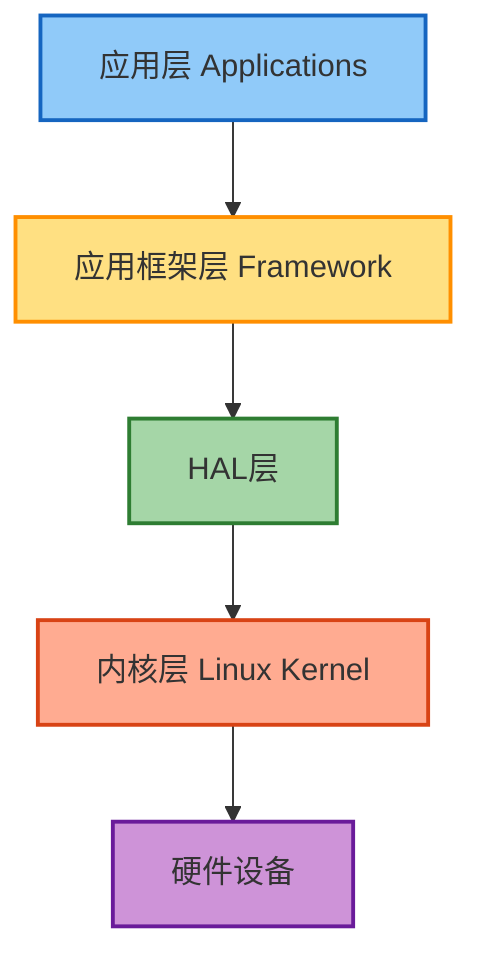
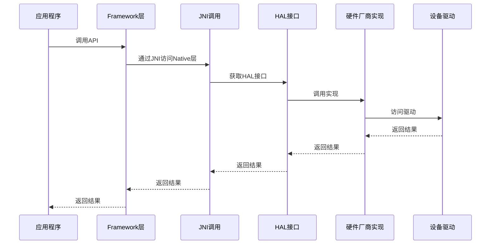
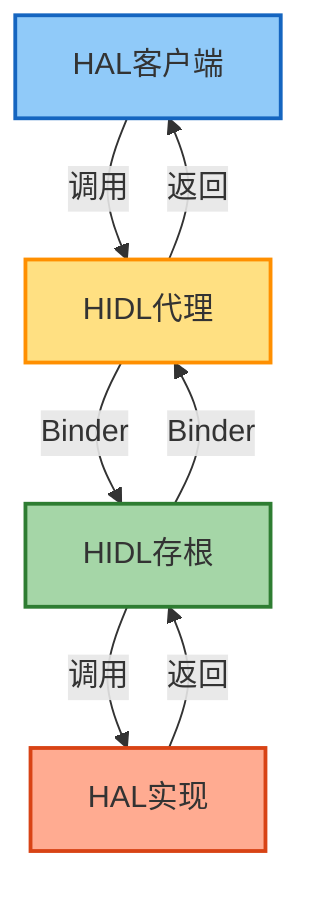
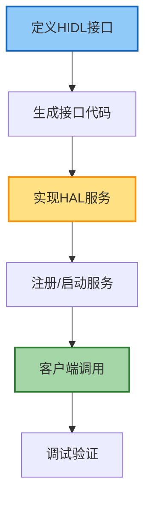

# Android HAL 层开发与 HIDL

## 概述

硬件抽象层（Hardware Abstraction Layer，HAL）是 Android 架构中连接上层框架和底层硬件的关键接口层，它为上层 Framework 提供了统一的硬件访问接口，同时隔离了硬件实现的具体细节。从 Android 8.0 开始，Google 引入了 HIDL（Hardware Interface Definition Language，硬件接口定义语言）作为标准化 HAL 接口的方式，使得硬件厂商能够更加灵活地更新其 HAL 实现，而无需修改整个系统。

本文档将详细介绍 HAL 层开发的基本概念、HIDL 的工作原理，以及如何开发和调试自定义 HAL 模块。

## HAL 层基础

### Android 架构中的 HAL 层



### HAL 的发展历程

1. **传统 HAL（Android 8.0 之前）**：
   - 基于共享库实现（.so 文件）
   - 通过 dlopen 加载到 Framework 进程中
   - 紧密耦合在系统中，难以独立更新

2. **Project Treble 和 HIDL（Android 8.0 及以后）**：
   - HAL 实现运行在独立进程中
   - 使用 Binder/HIDL 进行进程间通信
   - 支持模块化更新

### HAL 访问流程



## HIDL 介绍

### HIDL 的基本概念

HIDL（Hardware Interface Definition Language）是一种接口定义语言，用于描述 HAL 接口。其主要特点包括：

1. **接口标准化**：定义清晰的接口契约
2. **版本控制**：支持多版本并行运行
3. **进程隔离**：HAL 在独立进程中运行
4. **绑定方式**：支持同步和异步调用方式
5. **类型安全**：强类型系统确保安全通信

### HIDL 的工作原理



HIDL 接口定义被编译成 C++ 代码，生成：
- 客户端代理类（Proxy）
- 服务端存根类（Stub）
- 接口基类（Base）

### HIDL 文件结构

一个典型的 HIDL 接口定义如下：

```java
// 包名和版本声明
package android.hardware.example@1.0;

// 导入其他HIDL定义
import android.hardware.example@1.0::types;

// 接口定义
interface IExample {
    // 方法声明
    doSomething(string data) generates (bool success);
    
    // 常量定义
    enum Status : uint32_t {
        OK,
        ERROR
    };
    
    // 结构体定义
    struct Result {
        Status status;
        string message;
    };
};
```

## 开发环境准备

### 工具链安装

确保你的 AOSP 环境已经正确设置，包含必要的编译工具：

```bash
source build/envsetup.sh
lunch aosp_arm64-eng  # 或其他目标
```

### HIDL 生成工具

AOSP 提供了 HIDL 接口生成工具：

```bash
# 检查工具是否可用
which hidl-gen

# 如果不可用，需要编译
make hidl-gen
```

## HIDL 开发流程



### 1. 定义 HIDL 接口

首先，创建 HIDL 接口定义文件：

```bash
# 创建接口文件目录
mkdir -p hardware/interfaces/example/1.0/default/
```

创建接口定义文件 `hardware/interfaces/example/1.0/IExample.hal`：

```java
package android.hardware.example@1.0;

interface IExample {
    /**
     * 这是一个示例方法
     * @param input 输入字符串
     * @return 处理结果
     */
    hello(string input) generates (string result);
    
    /**
     * 获取设备信息
     * @return status 操作状态，true表示成功
     * @return info 设备信息
     */
    getDeviceInfo() generates (bool status, DeviceInfo info);
};
```

创建类型定义文件 `hardware/interfaces/example/1.0/types.hal`：

```java
package android.hardware.example@1.0;

/**
 * 设备信息结构体
 */
struct DeviceInfo {
    /** 设备名称 */
    string name;
    
    /** 设备ID */
    uint32_t id;
    
    /** 设备状态 */
    DeviceStatus status;
};

/**
 * 设备状态枚举
 */
enum DeviceStatus : uint32_t {
    /** 正常 */
    NORMAL = 0,
    
    /** 忙 */
    BUSY = 1,
    
    /** 错误 */
    ERROR = 2
};
```

### 2. 生成接口代码

编写 `hardware/interfaces/example/1.0/Android.bp` 文件：

```
// HIDL包
hidl_package_root {
    name: "android.hardware",
    path: "hardware/interfaces",
}

hidl_interface {
    name: "android.hardware.example@1.0",
    root: "android.hardware",
    srcs: [
        "IExample.hal",
        "types.hal",
    ],
    interfaces: [
        "android.hidl.base@1.0",
    ],
    gen_java: true,
}
```

生成接口代码：

```bash
# 手动生成
hidl-gen -o hardware/interfaces/example/1.0/default -Lc++-impl -randroid.hardware:hardware/interfaces -randroid.hidl:system/libhidl/transport android.hardware.example@1.0

# 或使用编译系统自动生成
make android.hardware.example@1.0-impl-gen
```

### 3. 实现 HAL 服务

创建实现文件 `hardware/interfaces/example/1.0/default/Example.h`：

```cpp
#pragma once

#include <android/hardware/example/1.0/IExample.h>
#include <hidl/MQDescriptor.h>
#include <hidl/Status.h>

namespace android {
namespace hardware {
namespace example {
namespace V1_0 {
namespace implementation {

using ::android::hardware::hidl_string;
using ::android::hardware::Return;
using ::android::sp;

class Example : public IExample {
public:
    // 构造函数
    Example();

    // 析构函数
    virtual ~Example();

    // 实现IExample接口方法
    Return<void> hello(const hidl_string& input, hello_cb _hidl_cb) override;
    Return<void> getDeviceInfo(getDeviceInfo_cb _hidl_cb) override;

private:
    // 成员变量
    std::string mDeviceName;
    uint32_t mDeviceId;
};

}  // namespace implementation
}  // namespace V1_0
}  // namespace example
}  // namespace hardware
}  // namespace android
```

创建实现文件 `hardware/interfaces/example/1.0/default/Example.cpp`：

```cpp
#include "Example.h"
#include <android-base/logging.h>

namespace android {
namespace hardware {
namespace example {
namespace V1_0 {
namespace implementation {

Example::Example() : mDeviceName("Example Device"), mDeviceId(12345) {
    LOG(INFO) << "Example HAL service constructed";
}

Example::~Example() {
    LOG(INFO) << "Example HAL service destructed";
}

Return<void> Example::hello(const hidl_string& input, hello_cb _hidl_cb) {
    LOG(INFO) << "Hello method called with: " << input;
    
    std::string result = "You said: " + std::string(input);
    _hidl_cb(result);
    return Void();
}

Return<void> Example::getDeviceInfo(getDeviceInfo_cb _hidl_cb) {
    LOG(INFO) << "GetDeviceInfo method called";
    
    DeviceInfo info;
    info.name = mDeviceName;
    info.id = mDeviceId;
    info.status = DeviceStatus::NORMAL;
    
    _hidl_cb(true, info);
    return Void();
}

}  // namespace implementation
}  // namespace V1_0
}  // namespace example
}  // namespace hardware
}  // namespace android
```

### 4. 创建服务入口

创建服务入口文件 `hardware/interfaces/example/1.0/default/service.cpp`：

```cpp
#include <hidl/HidlTransportSupport.h>
#include <utils/Errors.h>
#include <utils/StrongPointer.h>
#include <utils/Log.h>

#include "Example.h"

using android::hardware::configureRpcThreadpool;
using android::hardware::joinRpcThreadpool;
using android::hardware::example::V1_0::IExample;
using android::hardware::example::V1_0::implementation::Example;
using android::sp;
using android::status_t;
using android::OK;

int main() {
    // 配置RPC线程池，设置为单线程
    configureRpcThreadpool(1, true);

    // 创建服务实例
    sp<IExample> service = new Example();

    // 注册服务到系统
    status_t status = service->registerAsService();
    if (status != OK) {
        ALOGE("Failed to register Example HAL service, status: %d", status);
        return 1;
    }

    ALOGI("Example HAL service is ready");

    // 加入RPC线程池，阻塞当前进程
    joinRpcThreadpool();
    
    // joinRpcThreadpool()不会返回，除非发生错误
    ALOGE("Example HAL service unexpectedly exited");
    return 1;
}
```

### 5. 配置编译文件

创建 `hardware/interfaces/example/1.0/default/Android.bp` 文件：

```
cc_library_shared {
    name: "android.hardware.example@1.0-impl",
    relative_install_path: "hw",
    proprietary: true,
    srcs: [
        "Example.cpp",
    ],
    shared_libs: [
        "libhidlbase",
        "libhidltransport",
        "libutils",
        "liblog",
        "android.hardware.example@1.0",
    ],
}

cc_binary {
    name: "android.hardware.example@1.0-service",
    relative_install_path: "hw",
    proprietary: true,
    init_rc: ["android.hardware.example@1.0-service.rc"],
    vintf_fragments: ["android.hardware.example@1.0-service.xml"],
    srcs: ["service.cpp"],
    shared_libs: [
        "libhidlbase",
        "libhidltransport",
        "libutils",
        "liblog",
        "android.hardware.example@1.0",
        "android.hardware.example@1.0-impl",
    ],
}
```

### 6. 创建初始化脚本

创建 `hardware/interfaces/example/1.0/default/android.hardware.example@1.0-service.rc` 文件：

```
service vendor.example-1-0 /vendor/bin/hw/android.hardware.example@1.0-service
    class hal
    user system
    group system
```

### 7. 创建VINTF配置

创建 `hardware/interfaces/example/1.0/default/android.hardware.example@1.0-service.xml` 文件：

```xml
<manifest version="1.0" type="device">
    <hal format="hidl">
        <name>android.hardware.example</name>
        <transport>hwbinder</transport>
        <version>1.0</version>
        <interface>
            <name>IExample</name>
            <instance>default</instance>
        </interface>
    </hal>
</manifest>
```

## 编译测试流程

### 编译 HAL 模块

```bash
# 切换到AOSP根目录
cd $ANDROID_BUILD_TOP

# 编译HAL接口和实现
make android.hardware.example@1.0
make android.hardware.example@1.0-impl
make android.hardware.example@1.0-service
```

### 安装到设备

```bash
# 安装HAL服务
adb root
adb remount
adb push $OUT/vendor/lib64/hw/android.hardware.example@1.0-impl.so /vendor/lib64/hw/
adb push $OUT/vendor/bin/hw/android.hardware.example@1.0-service /vendor/bin/hw/
adb push $OUT/vendor/etc/init/android.hardware.example@1.0-service.rc /vendor/etc/init/

# 重启设备
adb reboot
```

### 验证服务

```bash
# 检查服务是否在运行
adb shell ps -A | grep example

# 查看hwbinder服务
adb shell lshal | grep example
```

## 开发客户端调用 HAL

### 创建 Native 客户端

创建 `development/samples/ExampleHalClient/Android.bp` 文件：

```
cc_binary {
    name: "example_hal_client",
    srcs: ["main.cpp"],
    shared_libs: [
        "liblog",
        "libutils",
        "libhidlbase",
        "libhidltransport",
        "android.hardware.example@1.0",
    ],
}
```

创建 `development/samples/ExampleHalClient/main.cpp` 文件：

```cpp
#include <android/hardware/example/1.0/IExample.h>
#include <hidl/Status.h>
#include <hidl/HidlSupport.h>
#include <utils/Log.h>
#include <iostream>

using android::hardware::example::V1_0::IExample;
using android::hardware::example::V1_0::DeviceInfo;
using android::hardware::example::V1_0::DeviceStatus;
using android::sp;
using android::hardware::Return;
using android::hardware::Void;

int main() {
    // 获取HAL服务
    sp<IExample> service = IExample::getService();
    if (service == nullptr) {
        std::cerr << "Failed to get example HAL service" << std::endl;
        return 1;
    }
    
    std::cout << "Successfully got example HAL service" << std::endl;
    
    // 调用hello方法
    service->hello("Hello from client", [](const std::string& result) {
        std::cout << "Received hello response: " << result << std::endl;
    });
    
    // 调用getDeviceInfo方法
    service->getDeviceInfo([](bool status, const DeviceInfo& info) {
        if (status) {
            std::cout << "Device info - Name: " << info.name
                      << ", ID: " << info.id 
                      << ", Status: " << static_cast<uint32_t>(info.status) << std::endl;
        } else {
            std::cout << "Failed to get device info" << std::endl;
        }
    });
    
    return 0;
}
```

### 创建 Java 客户端

在应用中调用 HAL 接口：

```java
import android.hardware.example.V1_0.DeviceInfo;
import android.hardware.example.V1_0.DeviceStatus;
import android.hardware.example.V1_0.IExample;
import android.os.RemoteException;
import android.util.Log;

public class ExampleHalClient {
    private static final String TAG = "ExampleHalClient";
    private IExample mExampleHal;
    
    public ExampleHalClient() {
        try {
            // 获取HAL服务
            mExampleHal = IExample.getService(true /* retry */);
            Log.i(TAG, "Successfully connected to Example HAL");
        } catch (RemoteException e) {
            Log.e(TAG, "Failed to get Example HAL service", e);
            mExampleHal = null;
        }
    }
    
    public String hello(String input) {
        if (mExampleHal == null) return "Service not available";
        
        try {
            final String[] result = {null};
            
            // 调用HAL方法
            mExampleHal.hello(input, (String response) -> {
                result[0] = response;
            });
            
            return result[0];
        } catch (RemoteException e) {
            Log.e(TAG, "Failed to call hello", e);
            return "Error: " + e.getMessage();
        }
    }
    
    public DeviceInfo getDeviceInfo() {
        if (mExampleHal == null) return null;
        
        try {
            final boolean[] status = {false};
            final DeviceInfo[] info = {null};
            
            // 调用HAL方法
            mExampleHal.getDeviceInfo((boolean callStatus, DeviceInfo deviceInfo) -> {
                status[0] = callStatus;
                info[0] = deviceInfo;
            });
            
            return status[0] ? info[0] : null;
        } catch (RemoteException e) {
            Log.e(TAG, "Failed to get device info", e);
            return null;
        }
    }
}
```

## HAL 调试技巧

### 查看日志

HAL 服务的日志可以通过 logcat 查看：

```bash
# 查看特定标签
adb logcat -s Example

# 查看HwBinder相关日志
adb logcat -s HwBinder
```

### 使用 HIDL 调试工具

```bash
# 列出所有HIDL服务
adb shell lshal

# 调用特定接口方法
adb shell lshal debug android.hardware.example@1.0::IExample/default hello "test message"
```

### 性能分析

使用 systrace 分析 HAL 调用：

```bash
# 从AOSP根目录
python external/chromium-trace/systrace.py -b 96000 -t 5 \
    hwbinder gfx input view hal \
    -o ~/example_hal_trace.html
```

### 内存泄漏检测

可以使用 HeapProfiler 等工具检测 HAL 服务中的内存泄漏：

```bash
# 启用内存分析
adb shell setprop libc.debug.malloc.program android.hardware.example@1.0-service
adb shell setprop libc.debug.malloc 1

# 重启服务
adb shell stop vendor.example-1-0
adb shell start vendor.example-1-0
```

## HIDL 进阶主题

### 版本管理与兼容性

HIDL 接口的版本管理遵循 `package@version` 格式：

```java
// 1.0版本接口
package android.hardware.example@1.0;

// 1.1版本接口，扩展1.0版本
package android.hardware.example@1.1;
import android.hardware.example@1.0;

// 继承1.0版本接口
interface IExample extends @1.0::IExample {
    // 新增方法
    newMethod(int32_t input) generates (int32_t result);
}
```

### 回调接口

HIDL 支持定义回调接口，用于 HAL 主动通知上层：

```java
// 定义回调接口
interface IExampleCallback {
    onEvent(string eventName, int32_t eventData);
};

// 在主接口中使用回调
interface IExample {
    // 注册回调
    registerCallback(IExampleCallback callback);
    
    // 注销回调
    unregisterCallback(IExampleCallback callback);
};
```

### 共享内存和内存传输

对于大块数据传输，可以使用共享内存：

```java
// 导入共享内存类型
import android.hidl.memory@1.0::IMemory;

interface IExample {
    // 使用共享内存传输数据
    processData(IMemory data) generates (bool success);
};
```

### AIDL 与 HIDL 的集成

从 Android 10 开始，Google 开始逐步使用 AIDL 替代 HIDL：

```java
// AIDL版本的接口定义
// IExample.aidl
package android.hardware.example;

interface IExample {
    String hello(String input);
    DeviceInfo getDeviceInfo();
}
```

## 常见问题与解决方案

### 服务注册失败

1. **症状**：`registerAsService` 返回失败
2. **解决方案**：
   - 检查 VINTF 清单文件
   - 确认 SELinux 权限设置
   - 检查服务名称是否重复

### 权限问题

1. **症状**：无法访问某些系统资源
2. **解决方案**：
   - 添加合适的 SELinux 权限
   - 检查 HAL 服务运行的用户和组

### 版本兼容性问题

1. **症状**：高版本系统不兼容旧的 HAL 实现
2. **解决方案**：
   - 按照接口约定实现向后兼容
   - 提供兼容层处理版本差异

## 最佳实践

1. **接口设计**：
   - 设计清晰、稳定的接口
   - 预留扩展空间
   - 考虑多版本兼容性

2. **性能优化**：
   - 最小化跨进程调用
   - 批量处理请求
   - 合理使用共享内存

3. **安全防护**：
   - 验证输入参数
   - 权限控制
   - 避免缓冲区溢出

4. **可测试性**：
   - 编写单元测试
   - 提供模拟实现（Mock）
   - 支持调试接口

## 参考资源

- [Android HAL 官方文档](https://source.android.com/docs/core/architecture/hal)
- [HIDL 参考](https://source.android.com/docs/core/architecture/hidl)
- [Project Treble](https://source.android.com/docs/core/architecture/treble)
- [AOSP 源码中的 HAL 示例](https://android.googlesource.com/platform/hardware/interfaces/)
- 《Android 系统源代码情景分析》

---

*注意：本文档基于 Android 10.0 的 HAL/HIDL 机制，不同 Android 版本可能存在差异。从 Android 10 开始，Google 逐步将新的 HAL 接口从 HIDL 迁移到 AIDL。* 