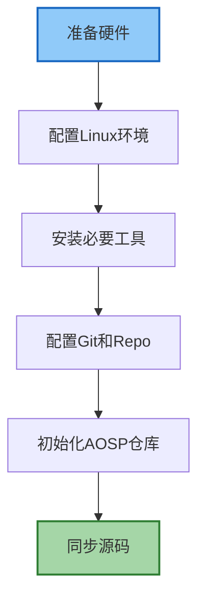
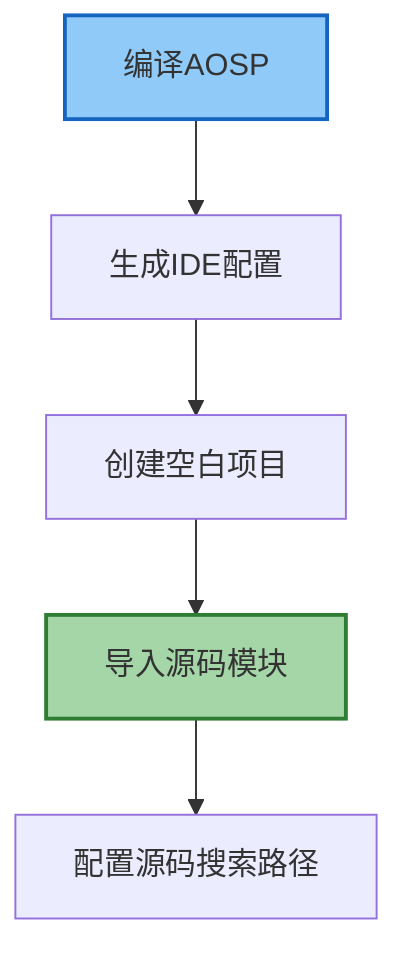

# Android Framework 开发环境搭建与调试

## 概述

Android Framework 的开发和调试需要特殊的环境配置和工具链。本文档详细介绍如何搭建 Android 系统开发环境、获取和编译 AOSP（Android Open Source Project）源码，以及如何进行系统级调试，帮助开发者深入理解 Android 系统内部运作机制。

## AOSP 源码获取

### 硬件要求

AOSP 源码体积庞大，编译过程需要消耗大量资源，因此开发机器需要满足以下最低配置：

- **CPU**：现代多核处理器（8核及以上推荐）
- **内存**：16GB 以上（推荐 32GB 或更高）
- **存储**：至少 500GB 可用空间（SSD 存储强烈推荐）
- **操作系统**：Linux（Ubuntu 推荐）或 macOS

### 准备工作



#### 安装必要工具

以 Ubuntu 为例，安装必要的依赖包：

```bash
sudo apt-get update
sudo apt-get install git-core gnupg flex bison build-essential zip curl zlib1g-dev gcc-multilib \
     g++-multilib libc6-dev-i386 libncurses5-dev lib32ncurses5-dev x11proto-core-dev \
     libx11-dev lib32z1-dev libgl1-mesa-dev libxml2-utils xsltproc unzip libssl-dev \
     python3 python3-pip
```

#### 配置 Git

```bash
git config --global user.name "Your Name"
git config --global user.email "your.email@example.com"
```

### 安装 Repo 工具

Repo 是 Google 开发的工具，用于管理多个 Git 仓库，是获取 AOSP 源码的必要工具：

```bash
mkdir -p ~/bin
curl https://storage.googleapis.com/git-repo-downloads/repo > ~/bin/repo
chmod a+x ~/bin/repo
export PATH=~/bin:$PATH
```

将上述 PATH 导出添加到你的 `~/.bashrc` 或 `~/.zshrc` 文件中：

```bash
echo 'export PATH=~/bin:$PATH' >> ~/.bashrc
source ~/.bashrc
```

### 初始化 AOSP 仓库

创建源码目录并初始化仓库：

```bash
mkdir -p ~/aosp
cd ~/aosp
```

初始化特定版本的 Android 代码（以 Android 12 为例）：

```bash
repo init -u https://android.googlesource.com/platform/manifest -b android-12.0.0_r1
```

如果需要使用最新代码，可使用 master 分支：

```bash
repo init -u https://android.googlesource.com/platform/manifest
```

### 同步源码

初始化后，开始下载源码（这一步可能需要几小时到几天时间，取决于网络状况）：

```bash
repo sync -j8
```

参数 `-j8` 表示使用 8 个并行任务，可根据机器核心数和网络带宽调整。

#### 网络问题解决方案

由于网络原因，直接从 Google 服务器下载可能会很慢，可以使用国内镜像：

```bash
# 使用清华大学镜像
repo init -u https://mirrors.tuna.tsinghua.edu.cn/git/AOSP/platform/manifest -b android-12.0.0_r1
repo sync -j8
```

## 编译环境搭建

### 设置编译环境

初始化编译环境：

```bash
cd ~/aosp
source build/envsetup.sh
```

### 选择编译目标

通过 `lunch` 命令选择编译目标：

```bash
lunch
```

系统会显示可选的编译目标列表，例如：

```
You're building on Linux

Lunch menu... pick a combo:
     1. aosp_arm-eng
     2. aosp_arm64-eng
     3. aosp_x86_64-eng
     4. aosp_x86-eng
     ...
```

常见编译目标说明：
- **arm/arm64/x86/x86_64**: 指定架构
- **eng**: 工程开发版本，包含额外调试工具
- **userdebug**: 类似用户版本，但可 root 和调试
- **user**: 正式发布版本

选择适合你的目标，例如模拟器 x86_64：

```bash
lunch aosp_x86_64-eng
```

### 编译系统

启动完整编译：

```bash
make -j8
```

同样，`-j8` 表示使用 8 个并行任务，可根据机器配置调整。

#### 常见编译命令

```bash
# 完整编译系统
make -j8

# 编译特定模块
make <module_name> -j8

# 清理编译输出
make clean

# 只编译 Framework 层
make framework -j8

# 编译并安装特定模块到设备
make <module_name> -j8
adb remount
adb sync
```

## 模拟器环境

### 启动模拟器

编译完成后，可以启动 Android 模拟器测试系统：

```bash
emulator
```

### 模拟器常用选项

```bash
# 启动特定 AVD
emulator -avd <avd_name>

# 以无界面模式启动
emulator -no-window

# 启动并设置网络速度
emulator -netspeed full

# 使用物理机 GPU 加速
emulator -gpu host
```

## 设备调试环境

### 真机调试准备

1. 在设备上启用开发者选项和 USB 调试
2. 确保设备已解锁 bootloader (某些设备不支持)
3. 安装设备厂商的 USB 驱动（Windows 环境）

### 刷入自编译系统

```bash
# 重启设备到 bootloader
adb reboot bootloader

# 刷入系统
fastboot flash system system.img
fastboot flash vendor vendor.img
fastboot flash boot boot.img
fastboot flash userdata userdata.img

# 重启设备
fastboot reboot
```

### 刷入单个模块

如果只修改了特定模块，可以只更新该模块：

```bash
# 将设备挂载为可写
adb root
adb remount

# 推送修改的文件/模块
adb push out/target/product/<device>/system/framework/framework.jar /system/framework/
adb push out/target/product/<device>/system/lib64/libandroid_runtime.so /system/lib64/

# 重启设备
adb reboot
```

## 调试技巧

### Logcat 调试

Android 系统日志是调试的主要来源：

```bash
# 查看实时日志
adb logcat

# 过滤特定标签
adb logcat ActivityManager:I *:S

# 将日志保存到文件
adb logcat > log.txt

# 清除日志缓冲区
adb logcat -c
```

#### 常用 logcat 过滤器

```bash
# 按进程 ID 过滤
adb logcat --pid=<pid>

# 按日志级别过滤
adb logcat *:W  # 只显示警告及以上级别

# 按标签过滤
adb logcat -s "ActivityManager" "WindowManager"

# 使用正则表达式过滤
adb logcat | grep -E "Exception|Error"
```

### 使用 Systrace 分析性能

Systrace 是 Android 提供的系统性能分析工具：

```bash
# 在 AOSP 源码树中使用
cd ~/aosp
python3 development/scripts/systrace.py --time 10 -o trace.html gfx input view sched freq
```

### Perfetto 性能分析

Perfetto 是新一代 Android 性能跟踪工具：

```bash
# 安装 Perfetto 命令行工具
pip3 install perfetto

# 采集 5 秒跟踪数据
perfetto --out trace.perfetto-trace -c - <<EOF
duration_ms: 5000
buffers: { size_kb: 63488 }
buffers: { size_kb: 2048 }
data_sources: { config { name: "linux.ftrace" } }
ftrace_config {
  ftrace_events: "sched/sched_switch"
  ftrace_events: "power/suspend_resume"
  ftrace_events: "sched/sched_wakeup"
}
EOF
```

### Debug Bridge 调试

对于系统级问题，可以直接进入设备执行命令：

```bash
# 获取 root 权限
adb root

# 进入设备 shell
adb shell

# 直接在设备执行命令
adb shell dumpsys activity
```

#### 常用 dumpsys 命令

```bash
# 查看系统服务列表
adb shell dumpsys -l

# 查看活动管理器状态
adb shell dumpsys activity

# 查看窗口管理器状态
adb shell dumpsys window

# 查看电池信息
adb shell dumpsys battery

# 查看内存使用
adb shell dumpsys meminfo

# 查看特定进程信息
adb shell dumpsys meminfo <package_name>
```

### Framework 调试技巧

#### 修改系统属性

```bash
# 临时修改属性
adb shell setprop <key> <value>

# 永久修改属性
# 编辑 /system/build.prop 或 /vendor/build.prop 文件
```

常用调试属性：

```
# 禁用所有 ANR (应用无响应) 对话框
adb shell setprop debug.anr.local true

# 启用严格模式可视化
adb shell setprop debug.strictmode.visual 1

# 启用额外调试日志
adb shell setprop log.tag.<TAG> VERBOSE
```

#### 系统崩溃调试

分析系统崩溃：

```bash
# 查看上次崩溃日志
adb shell dumpsys dropbox --print
```

#### 使用 GDB 调试 Native 代码

```bash
# 在主机上启动 gdbserver
adb shell gdbserver :5039 --attach <pid>

# 在另一个终端连接到 gdbserver
adb forward tcp:5039 tcp:5039
cd ~/aosp
prebuilts/gcc/linux-x86/arm/arm-linux-androideabi-4.9/bin/arm-linux-androideabi-gdb
```

## 使用 Android Studio 进行源码调试

IDE 调试通常比命令行更高效，Android Studio 提供了对 AOSP 源码的支持。

### 导入 AOSP 源码



第一步，生成 IDE 配置：

```bash
cd ~/aosp
source build/envsetup.sh
lunch aosp_x86_64-eng
mmm development/tools/idegen
development/tools/idegen/idegen.sh
```

这会生成 `android.iml` 和 `.idea` 文件，供 Android Studio 使用。

第二步，启动 Android Studio 并导入项目：

1. 打开 Android Studio
2. 选择 "Open"
3. 导航到 AOSP 根目录并选择打开

### 设置远程调试

在 Android Studio 中调试设备上运行的系统：

1. 在设备上设置调试环境：
   ```bash
   adb root
   adb shell setprop debug.debuggable 1
   adb shell stop
   adb shell start
   ```

2. 在 Android Studio 中创建远程调试配置：
   - 点击 "Run" > "Edit Configurations"
   - 点击 "+" > "Remote"
   - 设置主机为 "localhost"，端口为 "8700"
   - 命名配置并保存

3. 执行远程调试：
   ```bash
   # 设置端口转发
   adb forward tcp:8700 jdwp:<pid>
   ```

4. 在 Android Studio 中启动调试会话

## 常见问题与解决方案

### 编译错误解决

1. **内存不足**
   ```bash
   # 增加 swap 空间
   sudo fallocate -l 8G /swapfile
   sudo chmod 600 /swapfile
   sudo mkswap /swapfile
   sudo swapon /swapfile
   # 永久启用 swap
   echo '/swapfile none swap sw 0 0' | sudo tee -a /etc/fstab
   ```

2. **编译工具链问题**
   ```bash
   # 重新安装开发工具
   sudo apt-get install --reinstall build-essential
   ```

3. **找不到特定模块**
   ```bash
   # 更新模块路径
   source build/envsetup.sh
   lunch <target>
   ```

### 网络问题

1. **下载源码失败**
   - 使用镜像站点
   - 启用代理
   - 使用 `repo sync --fetch-submodules -j4 -c`，失败后可继续同步

2. **API 请求超时**
   ```bash
   # 设置更长的超时
   export GIT_HTTP_LOW_SPEED_LIMIT=1000
   export GIT_HTTP_LOW_SPEED_TIME=60
   ```

## 持续集成与开发实践

### 使用分支管理修改

```bash
repo start my-feature --all
# 进行修改
repo status
repo upload .
```

### 本地修改管理

```bash
# 保存本地修改
repo diff > my-changes.patch

# 应用保存的修改
patch -p1 < my-changes.patch
```

## 结语

Android Framework 开发环境的搭建是进入系统开发的第一步，熟练掌握调试技巧可以极大提高开发效率。本文档提供了基础的环境搭建和调试方法，建议结合实际项目和最新的 Android 文档来优化你的开发工作流。

---

## 参考资源

- [Android 源码官方文档](https://source.android.com/)
- [Android 源码下载](https://source.android.com/setup/build/downloading)
- [Android 编译系统](https://source.android.com/setup/build)
- [Android Debugging](https://source.android.com/devices/tech/debug)
- [Systrace 文档](https://developer.android.com/topic/performance/tracing/command-line)
- [Perfetto 文档](https://perfetto.dev/docs/) 