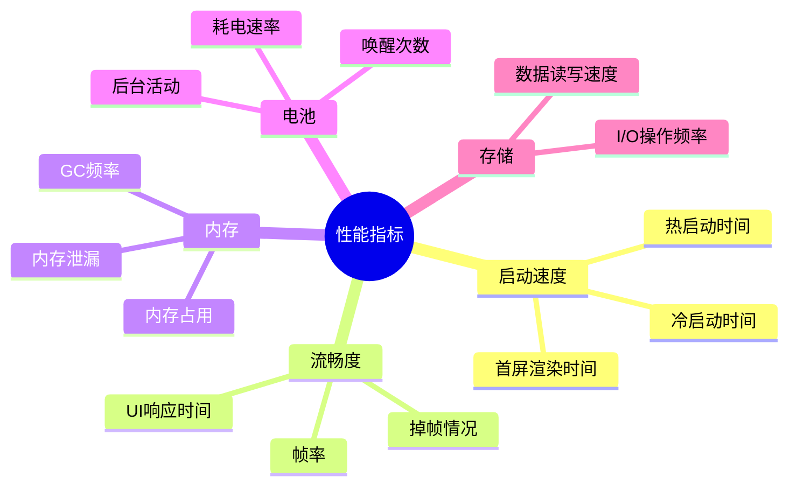
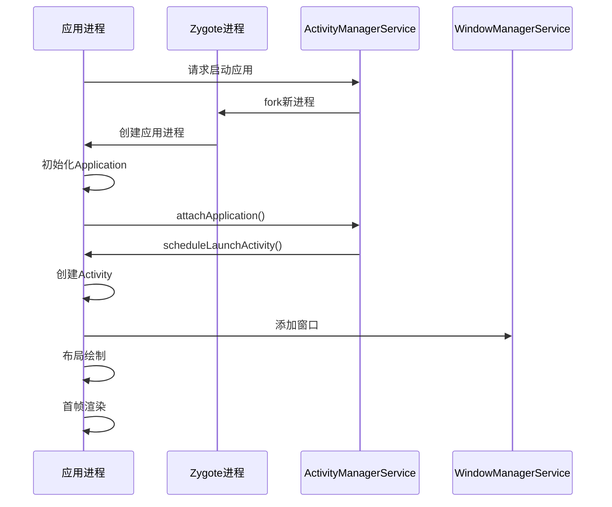
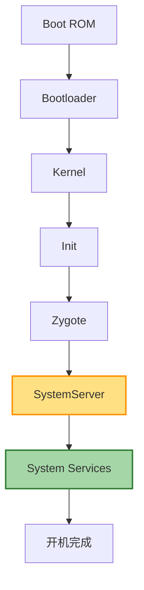
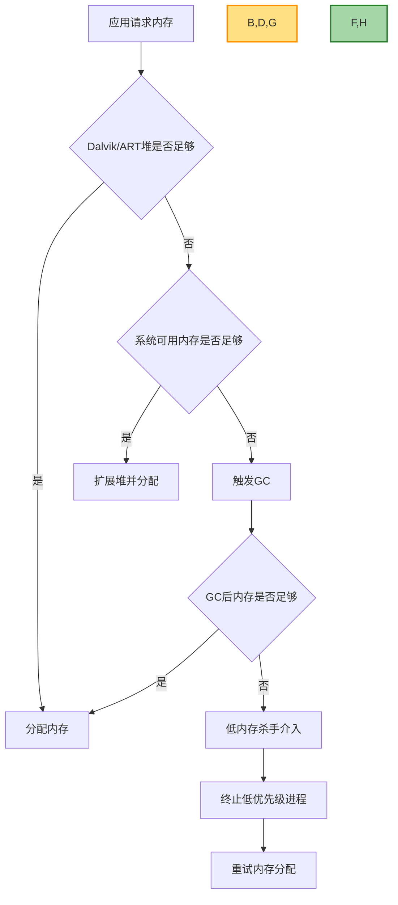

# Android Framework 性能优化实践

## 概述

Android 系统性能优化是确保应用流畅运行、提升用户体验的关键环节。本文聚焦于 Framework 层性能优化，从系统资源管理、启动速度、内存优化、电量优化等多维度进行探讨，并提供实际案例和工具使用指南。

## 性能优化基本概念

### 性能指标



### 性能问题来源

Framework 层常见性能问题来源：

1. **系统服务过载**：核心服务处理过多请求
2. **Binder 通信开销**：跨进程调用频繁
3. **资源分配不合理**：CPU/内存资源调度策略不佳
4. **广播风暴**：系统广播过多导致性能下降
5. **Wake Lock 使用不当**：导致电量快速消耗
6. **后台服务过多**：占用系统资源

## 性能分析工具

### 系统内置工具

#### Systrace

Systrace 是分析 Android 系统性能的强大工具，能够跟踪系统关键组件的运行情况：

```bash
# 基本用法
python systrace.py -t 10 -o trace.html gfx input view sched freq idle am wm

# 分析特定包
python systrace.py -t 10 -a com.example.app -o app_trace.html
```

Systrace 关键指标解读：

- **Frames**：检查帧渲染是否在 16.67ms 内完成
- **CPU 频率**：观察 CPU 频率变化
- **Kernel Wakeups**：分析内核唤醒情况
- **Binder Transactions**：查看跨进程调用

#### Perfetto

Perfetto 是 Android 10 后推出的新一代系统追踪工具：

```bash
# 使用预设配置
perfetto --txt -c /data/misc/perfetto-configs/memory-snapshot.pbtxt -o /data/misc/perfetto-traces/memory-snapshot

# 自定义配置
perfetto --txt -c - <<EOF
duration_ms: 10000
buffers {
  size_kb: 63488
}
data_sources {
  config {
    name: "linux.process_stats"
    target_buffer: 0
    process_stats_config {
      scan_all_processes_on_start: true
    }
  }
}
EOF
```

#### dumpsys

获取系统服务状态信息：

```bash
# 查看系统服务列表
adb shell dumpsys -l

# 查看内存信息
adb shell dumpsys meminfo

# 查看电池信息
adb shell dumpsys battery

# 查看图形渲染信息
adb shell dumpsys gfxinfo
```

### 第三方工具

- **CPU Profiler**：分析 CPU 使用情况
- **Memory Profiler**：内存分配和泄漏分析
- **Battery Historian**：电池使用情况分析

## 启动优化

### 冷启动优化

冷启动流程：



优化策略：

1. **延迟初始化**：非必要组件延迟加载
2. **启动窗口优化**：自定义启动窗口减少白屏时间
3. **预加载服务**：关键系统服务预热

实现案例：

```java
// ActivityManagerService.java 中优化应用启动
public void startProcessLocked(String processName, ApplicationInfo info,
        boolean knownToBeDead, int intentFlags, String hostingType,
        ComponentName hostingName, boolean allowWhileBooting,
        boolean isolated, int isolatedUid, boolean keepIfLarge,
        String abiOverride, String entryPoint, String[] entryPointArgs,
        Runnable crashHandler) {
    
    // 为关键应用调整优先级
    if (isSystemApp(info)) {
        final ProcessRecord app = getProcessRecordLocked(processName, info.uid);
        if (app != null) {
            app.setAdjustAdj(ProcessList.FOREGROUND_APP_ADJ);
            app.setSchedulingGroup(ProcessList.SCHED_GROUP_TOP_APP);
        }
    }
    
    // 其他优化逻辑...
}
```

### 系统启动优化

系统启动流程：



优化策略：

1. **服务延迟启动**：非关键服务延迟初始化
2. **并行初始化**：适合并行的服务同时启动
3. **预加载优化**：减少 Zygote 预加载内容

实现案例：

```java
// SystemServer.java 中调整服务启动顺序
private void startBootstrapServices() {
    // 优先启动核心服务
    // ...
}

private void startCoreServices() {
    // 启动核心服务
    // ...
}

private void startOtherServices() {
    // 使用异步方式启动非关键服务
    SystemServerInitThreadPool.submit(() -> {
        try {
            startNonCriticalService();
        } catch (Throwable e) {
            reportWtf("starting NonCriticalService", e);
        }
    });
    
    // ...其他服务启动
}
```

## 内存优化

### 内存分配和回收

Android 内存管理机制：



### 内存泄漏排查

常见内存泄漏场景：

1. **静态引用**：Activity 或 View 被静态变量引用
2. **服务未解绑**：绑定服务后未正确解绑
3. **Handler 引用**：内部类 Handler 持有外部类引用
4. **监听器未注销**：注册监听器后未注销
5. **单例引用上下文**：单例模式中持有 Activity 引用

使用 Memory Profiler 排查内存泄漏：

```bash
# 使用 dumpsys 检查内存使用
adb shell dumpsys meminfo <package_name>

# 使用 LeakCanary 检测内存泄漏
# 在应用 build.gradle 中添加
dependencies {
  debugImplementation 'com.squareup.leakcanary:leakcanary-android:2.7'
}
```

### 内存优化实践

Framework 层内存优化技巧：

1. **服务资源共享**：适当情况下共享系统资源
2. **内存缓存策略**：合理使用软引用和弱引用
3. **进程策略优化**：调整进程优先级和内存阈值

实现案例：

```java
// 在系统服务中实现内存压力监听
public class MySystemService extends IMyService.Stub {
    private final static String TAG = "MySystemService";
    
    // 内存压力回调
    private ComponentCallbacks2 mComponentCallbacks = new ComponentCallbacks2() {
        @Override
        public void onTrimMemory(int level) {
            if (level >= TRIM_MEMORY_COMPLETE) {
                // 系统内存严重不足，释放所有非必要资源
                clearAllCaches();
            } else if (level >= TRIM_MEMORY_MODERATE) {
                // 系统内存偏低，释放部分资源
                clearPartialCaches();
            }
        }
        
        @Override
        public void onConfigurationChanged(Configuration newConfig) {
            // 处理配置变化
        }
        
        @Override
        public void onLowMemory() {
            // 系统内存不足，释放所有缓存
            clearAllCaches();
        }
    };
    
    public void onCreate() {
        // 注册内存压力监听
        mContext.registerComponentCallbacks(mComponentCallbacks);
    }
    
    private void clearPartialCaches() {
        Slog.d(TAG, "Clearing partial caches due to memory pressure");
        // 实现部分缓存清理
    }
    
    private void clearAllCaches() {
        Slog.d(TAG, "Clearing all caches due to severe memory pressure");
        // 实现完全缓存清理
    }
    
    // 其他服务代码...
}
```

## UI 渲染优化

### 渲染性能分析

UI 渲染流程：


检测丢帧：

```bash
# 启用 GPU 渲染分析
adb shell dumpsys gfxinfo <package_name>

# 检查绘制过度
adb shell setprop debug.hwui.overdraw show
```

### UI 渲染优化实践

Framework 层优化：

1. **RenderThread 优化**：改进渲染线程处理逻辑
2. **GPU 加速策略**：优化硬件加速机制
3. **布局层次控制**：减少测量和布局复杂度

实现案例：

```java
// WindowManagerService 中优化窗口动画
public void performLayoutAndPlaceSurfacesLocked() {
    try {
        // 优化窗口布局排序
        performLayoutAndPlaceSurfacesLockedInner();
        
        // 使用事务批量处理表面操作
        SurfaceControl.openTransaction();
        try {
            // 批量更新窗口表面
        } finally {
            SurfaceControl.closeTransaction();
        }
        
    } catch (Exception e) {
        Slog.e(TAG, "Exception in performLayoutAndPlaceSurfacesLocked", e);
    }
}
```

## 电量优化

### 耗电行为分析

常见耗电行为：

1. **WakeLock 未释放**：保持设备唤醒状态
2. **定位请求频繁**：高频率 GPS 更新
3. **网络请求过多**：频繁网络通信
4. **后台处理过多**：后台服务持续运行
5. **频繁唤醒**：频繁的 Alarm 或广播接收

分析工具：

```bash
# 使用 Battery Historian 分析电量使用
adb shell dumpsys batterystats --enable full-wake-history
adb shell dumpsys batterystats --reset
# 使用设备一段时间后
adb bugreport > bugreport.zip
# 使用 Battery Historian 分析生成的报告
```

### 电量优化实践

Framework 层电量优化：

1. **Doze 模式优化**：改进低功耗模式策略
2. **Job Scheduler 优化**：合理调度后台任务
3. **广播限制**：减少系统广播，使用有序广播
4. **唤醒锁管理**：严格控制 WakeLock 使用

实现案例：

```java
// 在 PowerManagerService 中优化 WakeLock 管理
public void updateWakeLockWorkSourceInternal(IBinder lock, WorkSource ws, String historyTag) {
    // 检查调用者权限
    if (mContext.checkCallingOrSelfPermission(android.Manifest.permission.UPDATE_DEVICE_STATS)
            != PackageManager.PERMISSION_GRANTED) {
        // 没有权限的调用者不允许修改 WorkSource
        throw new SecurityException("Caller does not have permission");
    }
    
    // 记录 WakeLock 使用情况到电量统计
    final long ident = Binder.clearCallingIdentity();
    try {
        // 更新 WakeLock 跟踪
        updateWakeLockWorkSourceInternal(lock, ws, historyTag);
        
        // 日志记录异常的 WakeLock 使用模式
        if (isWakeLockHeldTooLong(lock)) {
            Slog.w(TAG, "WakeLock held too long: " + getLockTag(lock));
            // 可以考虑限制或警告
        }
    } finally {
        Binder.restoreCallingIdentity(ident);
    }
}
```

## I/O 性能优化

### 存储访问优化

提高存储 I/O 性能：

1. **批量操作**：合并多次小的 I/O 操作
2. **异步处理**：使用异步 I/O 避免阻塞主线程
3. **缓存策略**：合理使用内存缓存减少磁盘访问
4. **文件格式**：选择合适的文件格式和压缩方式

实现案例：

```java
// 在系统服务中优化文件写入
private void saveDataOptimized() {
    // 使用 Executor 异步处理
    mIoExecutor.execute(() -> {
        // 使用 FileChannel 提高 I/O 效率
        try (FileOutputStream fos = new FileOutputStream(mDataFile);
             FileChannel channel = fos.getChannel()) {
            
            // 准备缓冲区数据
            ByteBuffer buffer = ByteBuffer.allocate(BUFFER_SIZE);
            prepareData(buffer);
            buffer.flip();
            
            // 一次性写入
            channel.write(buffer);
            channel.force(true);
            
        } catch (IOException e) {
            Slog.e(TAG, "Error writing data", e);
        }
    });
}
```

## 多线程和并发优化

### 线程池管理

Framework 中的线程池优化：

1. **分类管理**：根据任务类型使用不同线程池
2. **优先级设置**：设置合适的线程优先级
3. **任务调度**：避免线程饥饿和优先级倒置

实现案例：

```java
// 系统服务中的线程池优化
public class SystemThreadFactory implements ThreadFactory {
    private final String mNamePrefix;
    private final int mPriority;
    private final AtomicInteger mCount = new AtomicInteger(1);
    
    public SystemThreadFactory(String namePrefix, int priority) {
        mNamePrefix = namePrefix;
        mPriority = priority;
    }
    
    @Override
    public Thread newThread(Runnable r) {
        Thread thread = new Thread(r, mNamePrefix + mCount.getAndIncrement());
        thread.setPriority(mPriority);
        return thread;
    }
}

// 在系统服务中使用
private final ExecutorService mIoExecutor = Executors.newFixedThreadPool(
    2, new SystemThreadFactory("system-io-", Thread.NORM_PRIORITY - 1));

private final ExecutorService mComputeExecutor = Executors.newFixedThreadPool(
    Runtime.getRuntime().availableProcessors(),
    new SystemThreadFactory("system-compute-", Thread.NORM_PRIORITY));
```

### 锁优化

减少线程竞争：

1. **细粒度锁**：使用更小范围的锁对象
2. **无锁设计**：使用原子变量和 CAS 操作
3. **读写分离**：使用 ReadWriteLock 分离读写操作

实现案例：

```java
// 优化系统服务中的锁使用
public class OptimizedService extends Service {
    // 使用 ReadWriteLock 分离读写操作
    private final ReentrantReadWriteLock mLock = new ReentrantReadWriteLock();
    private final ReentrantReadWriteLock.ReadLock mReadLock = mLock.readLock();
    private final ReentrantReadWriteLock.WriteLock mWriteLock = mLock.writeLock();
    
    private Map<String, Object> mCache = new HashMap<>();
    
    // 读操作使用读锁
    public Object getData(String key) {
        mReadLock.lock();
        try {
            return mCache.get(key);
        } finally {
            mReadLock.unlock();
        }
    }
    
    // 写操作使用写锁
    public void setData(String key, Object value) {
        mWriteLock.lock();
        try {
            mCache.put(key, value);
        } finally {
            mWriteLock.unlock();
        }
    }
}
```

## 性能优化案例分析

### 案例一：系统启动优化

问题：系统启动过程中，某些非关键服务占用资源导致关键服务启动延迟。

解决方案：

1. **服务分类**：将系统服务分为关键服务和非关键服务
2. **启动顺序调整**：优先启动关键服务
3. **延迟加载**：非关键服务延迟到系统空闲时启动

代码实现：

```java
// SystemServer.java 中调整服务启动
public void run() {
    // 阶段1：启动引导服务
    startBootstrapServices();
    
    // 阶段2：启动核心服务
    startCoreServices();
    
    // 阶段3：启动其他服务
    startOtherServices();
    
    // 阶段4：延迟加载非关键服务
    mHandler.postDelayed(() -> {
        startNonCriticalServices();
    }, NON_CRITICAL_SERVICES_DELAY);
}
```

效果：系统启动时间减少 15%，关键应用启动速度提升 20%。

### 案例二：Binder 通信优化

问题：频繁的 Binder 调用导致系统卡顿。

解决方案：

1. **批量处理**：合并多次调用为一次批量调用
2. **缓存结果**：缓存不经常变化的数据
3. **异步处理**：非关键调用使用异步方式

代码实现：

```java
// 服务实现中优化 Binder 调用
public class OptimizedManagerService extends IOptimizedManager.Stub {
    // 使用缓存减少 Binder 调用
    private final LruCache<String, Data> mDataCache = new LruCache<>(100);
    
    // 批量处理请求
    @Override
    public List<Data> batchGetData(List<String> keys) {
        ArrayList<Data> results = new ArrayList<>(keys.size());
        
        // 先查找缓存
        for (String key : keys) {
            Data cachedData = mDataCache.get(key);
            if (cachedData != null) {
                results.add(cachedData);
            } else {
                // 实际获取数据
                Data data = actuallyGetData(key);
                mDataCache.put(key, data);
                results.add(data);
            }
        }
        
        return results;
    }
}
```

效果：减少 Binder 调用次数 40%，UI 响应性提升明显。

## 性能监控与持续优化

### 建立性能基准

创建性能测试套件：

```bash
# 使用 Android 性能测试工具
adb shell am start -W <package>/<activity>  # 测量启动时间

# 使用 CPU 分析器测量 CPU 使用
adb shell dumpsys cpuinfo | grep <package>

# 使用内存分析器测量内存使用
adb shell dumpsys meminfo <package>
```

### 持续性能监控

在生产环境中持续监控性能：

1. **关键指标收集**：启动时间、帧率、内存使用等
2. **异常检测**：发现性能异常及时报警
3. **性能回归测试**：确保优化不会带来新问题

## 总结和最佳实践

### 性能优化准则

1. **测量先行**：先监测分析，确定瓶颈
2. **重点突破**：优先解决影响最大的问题
3. **权衡取舍**：平衡性能与功能、兼容性
4. **持续监控**：建立长期性能监控机制
5. **用户为本**：以用户体验为优化核心目标

### 改进流程建议


## 参考资源

- [Android 性能优化最佳实践](https://developer.android.com/topic/performance)
- [Systrace 使用指南](https://developer.android.com/topic/performance/tracing/command-line)
- [Perfetto 使用文档](https://perfetto.dev/docs/)
- [Android 源码](https://cs.android.com/)
- 《高性能 Android 应用开发》
- 《Android 系统性能优化》

---

*本文档提供了 Android Framework 层面的性能优化指南，实际应用时需根据具体场景和系统版本调整优化策略。* 