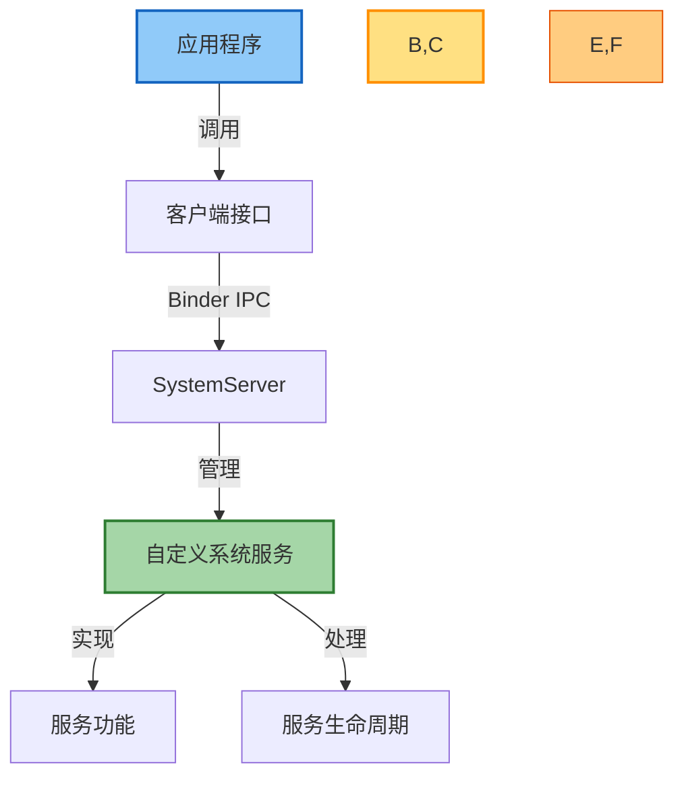
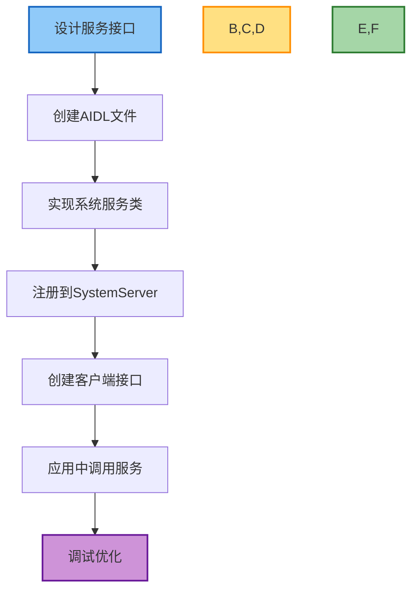

# Android 系统服务开发实践

## 概述

系统服务（System Service）是 Android 系统的核心组件，为应用提供基础功能。本文将详细介绍如何从零开始设计、实现和调试自定义系统服务，包括服务框架搭建、生命周期管理、与应用通信等实践内容。本指南面向具有一定 Android 开发经验，希望深入理解和扩展 Android 系统功能的开发者。

## 前置知识

开始系统服务开发前，请确保了解以下基础知识：

1. **Binder IPC 机制**：系统服务通过 Binder 与应用通信
2. **AIDL 接口定义**：定义服务对外提供的功能接口
3. **Android 系统架构**：了解 Framework 层在系统中的位置和作用
4. **Java/Kotlin 语言**：系统服务主要使用 Java/Kotlin 实现

## 开发环境准备

### 1. 获取 AOSP 源码

参考[开发环境搭建与调试](./开发环境搭建与调试.md)文档完成 AOSP 环境配置。

### 2. 了解系统服务结构

在开始开发前，熟悉系统服务的基本结构：



## 系统服务开发流程

开发一个系统服务通常包括以下步骤：



## 实践一：设计系统服务接口

### 确定服务功能

首先确定你的系统服务要提供什么功能。本示例将实现一个简单的数据存储服务，用于在系统级别保存和获取键值对数据。

主要功能：
- 保存字符串键值对
- 获取保存的值
- 删除指定键的数据
- 监听数据变化

### 设计 AIDL 接口

创建 AIDL 接口文件，定义服务提供的方法：

1. 在 AOSP 源码中创建目录和文件：
   ```bash
   cd frameworks/base/core/
   mkdir -p java/android/datastore/
   touch java/android/datastore/IDataStoreService.aidl
   touch java/android/datastore/IDataChangeListener.aidl
   ```

2. 定义数据变化监听器接口：

```java
// IDataChangeListener.aidl
package android.datastore;

/** 数据变化监听接口 */
interface IDataChangeListener {
    /** 当数据发生变化时调用 */
    void onDataChanged(String key, String value);
}
```

3. 定义主服务接口：

```java
// IDataStoreService.aidl
package android.datastore;

import android.datastore.IDataChangeListener;

/** 数据存储服务接口 */
interface IDataStoreService {
    /** 保存数据 */
    void putString(String key, String value);
    
    /** 获取数据 */
    String getString(String key, String defaultValue);
    
    /** 删除数据 */
    void remove(String key);
    
    /** 检查是否包含指定键 */
    boolean contains(String key);
    
    /** 注册数据变化监听器 */
    void registerListener(IDataChangeListener listener);
    
    /** 注销数据变化监听器 */
    void unregisterListener(IDataChangeListener listener);
}
```

## 实践二：实现系统服务

### 创建服务实现类

接下来实现系统服务类：

1. 创建实现文件：
   ```bash
   touch java/com/android/server/DataStoreService.java
   ```

2. 实现服务类：

```java
package com.android.server;

import android.content.Context;
import android.datastore.IDataStoreService;
import android.datastore.IDataChangeListener;
import android.os.RemoteCallbackList;
import android.os.RemoteException;
import android.util.ArrayMap;
import android.util.Slog;

import java.io.File;
import java.io.FileInputStream;
import java.io.FileOutputStream;
import java.io.IOException;
import java.util.Map;
import java.util.Properties;

/**
 * 数据存储系统服务实现
 */
public class DataStoreService extends IDataStoreService.Stub {
    private static final String TAG = "DataStoreService";
    
    // 存储上下文
    private final Context mContext;
    
    // 数据存储
    private final ArrayMap<String, String> mDataStore = new ArrayMap<>();
    
    // 监听器列表
    private final RemoteCallbackList<IDataChangeListener> mListeners = new RemoteCallbackList<>();
    
    // 数据文件
    private final File mDataFile;
    
    /**
     * 构造函数
     */
    public DataStoreService(Context context) {
        mContext = context;
        mDataFile = new File(context.getDataDir(), "datastore.properties");
        loadData();
        
        Slog.d(TAG, "DataStoreService constructed");
    }
    
    /**
     * 系统服务生命周期 - 启动
     */
    public void onStart() {
        Slog.d(TAG, "DataStoreService started");
    }
    
    /**
     * 从文件加载数据
     */
    private void loadData() {
        if (!mDataFile.exists()) {
            Slog.d(TAG, "Data file does not exist, creating empty store");
            return;
        }
        
        Properties props = new Properties();
        try (FileInputStream fis = new FileInputStream(mDataFile)) {
            props.load(fis);
            for (Map.Entry<Object, Object> entry : props.entrySet()) {
                mDataStore.put((String) entry.getKey(), (String) entry.getValue());
            }
            Slog.d(TAG, "Loaded " + mDataStore.size() + " items from data file");
        } catch (IOException e) {
            Slog.e(TAG, "Failed to load data", e);
        }
    }
    
    /**
     * 将数据保存到文件
     */
    private void saveData() {
        Properties props = new Properties();
        for (Map.Entry<String, String> entry : mDataStore.entrySet()) {
            props.put(entry.getKey(), entry.getValue());
        }
        
        try (FileOutputStream fos = new FileOutputStream(mDataFile)) {
            props.store(fos, "DataStoreService Data");
            Slog.d(TAG, "Saved " + mDataStore.size() + " items to data file");
        } catch (IOException e) {
            Slog.e(TAG, "Failed to save data", e);
        }
    }
    
    /**
     * 通知所有监听器数据变化
     */
    private void notifyDataChanged(String key, String value) {
        final int count = mListeners.beginBroadcast();
        for (int i = 0; i < count; i++) {
            try {
                mListeners.getBroadcastItem(i).onDataChanged(key, value);
            } catch (RemoteException e) {
                Slog.e(TAG, "Failed to notify listener", e);
            }
        }
        mListeners.finishBroadcast();
    }
    
    // 实现IDataStoreService接口方法
    
    @Override
    public void putString(String key, String value) {
        if (key == null) {
            Slog.w(TAG, "Ignoring null key");
            return;
        }
        
        synchronized (mDataStore) {
            mDataStore.put(key, value);
            saveData();
        }
        
        notifyDataChanged(key, value);
        Slog.d(TAG, "Value set: " + key + " = " + value);
    }
    
    @Override
    public String getString(String key, String defaultValue) {
        if (key == null) {
            return defaultValue;
        }
        
        synchronized (mDataStore) {
            return mDataStore.getOrDefault(key, defaultValue);
        }
    }
    
    @Override
    public void remove(String key) {
        if (key == null) {
            return;
        }
        
        synchronized (mDataStore) {
            if (mDataStore.containsKey(key)) {
                mDataStore.remove(key);
                saveData();
                notifyDataChanged(key, null);
                Slog.d(TAG, "Removed key: " + key);
            }
        }
    }
    
    @Override
    public boolean contains(String key) {
        if (key == null) {
            return false;
        }
        
        synchronized (mDataStore) {
            return mDataStore.containsKey(key);
        }
    }
    
    @Override
    public void registerListener(IDataChangeListener listener) {
        if (listener != null) {
            mListeners.register(listener);
            Slog.d(TAG, "Listener registered");
        }
    }
    
    @Override
    public void unregisterListener(IDataChangeListener listener) {
        if (listener != null) {
            mListeners.unregister(listener);
            Slog.d(TAG, "Listener unregistered");
        }
    }
}
```

## 实践三：注册系统服务

系统服务需要注册到 SystemServer 才能被系统管理和访问。

### 修改 SystemServer 类

1. 在 `SystemServer.java` 文件中添加服务：

```bash
cd frameworks/base/services/java/com/android/server
```

2. 修改 `SystemServer.java` 文件，添加自定义服务：

```java
// 在SystemServer.java中添加

// 1. 添加导入
import com.android.server.DataStoreService;

public final class SystemServer {
    // 2. 添加服务变量
    private DataStoreService mDataStoreService;

    // 3. 在startOtherServices方法中注册服务
    private void startOtherServices() {
        // ...现有代码...

        try {
            Slog.i(TAG, "Data Store Service");
            mDataStoreService = new DataStoreService(context);
            ServiceManager.addService(Context.DATA_STORE_SERVICE, mDataStoreService);
            mDataStoreService.onStart();
        } catch (Throwable e) {
            reportWtf("starting DataStore Service", e);
        }

        // ...现有代码...
    }
}
```

### 在 Context 中定义服务名称

在 `frameworks/base/core/java/android/content/Context.java` 中添加服务名称常量：

```java
// 在Context.java中添加
/**
 * 数据存储服务的名称
 * @hide
 */
public static final String DATA_STORE_SERVICE = "datastore";
```

### 添加权限定义

在 `frameworks/base/core/res/AndroidManifest.xml` 中添加权限定义：

```xml
<!-- 添加权限定义 -->
<permission
    android:name="android.permission.DATA_STORE_SERVICE"
    android:protectionLevel="signature|privileged" />
```

### 修改 SELinux 配置

为确保系统服务在 SELinux 环境中正常工作，需要添加相应策略：

1. 在 `system/sepolicy/private/service_contexts` 中添加：

```
datastore                                  u:object_r:datastore_service:s0
```

2. 在 `system/sepolicy/private/service.te` 中添加：

```
type datastore_service, service_manager_type;
```

## 实践四：创建客户端接口

为了方便应用调用系统服务，通常会为服务创建易用的客户端接口。

### 创建客户端类

在 `frameworks/base/core/java/android/datastore/` 目录下创建 `DataStoreManager.java` 文件：

```java
package android.datastore;

import android.annotation.SystemService;
import android.content.Context;
import android.os.RemoteException;
import android.os.ServiceManager;
import android.util.Log;

/**
 * 数据存储服务的客户端接口
 */
@SystemService(Context.DATA_STORE_SERVICE)
public class DataStoreManager {
    private static final String TAG = "DataStoreManager";
    
    // 服务接口
    private final IDataStoreService mService;
    
    // 应用上下文
    private final Context mContext;
    
    /**
     * 构造函数，通常通过Context.getSystemService获取实例
     * @hide 
     */
    public DataStoreManager(Context context) {
        mContext = context;
        mService = IDataStoreService.Stub.asInterface(
                ServiceManager.getService(Context.DATA_STORE_SERVICE));
        if (mService == null) {
            Log.e(TAG, "Failed to get data store service");
        }
    }
    
    /**
     * 保存字符串值
     */
    public void putString(String key, String value) {
        if (mService == null) {
            Log.e(TAG, "Service not available");
            return;
        }
        
        try {
            mService.putString(key, value);
        } catch (RemoteException e) {
            Log.e(TAG, "Failed to put string", e);
        }
    }
    
    /**
     * 获取字符串值
     */
    public String getString(String key, String defaultValue) {
        if (mService == null) {
            Log.e(TAG, "Service not available");
            return defaultValue;
        }
        
        try {
            return mService.getString(key, defaultValue);
        } catch (RemoteException e) {
            Log.e(TAG, "Failed to get string", e);
            return defaultValue;
        }
    }
    
    /**
     * 删除键值对
     */
    public void remove(String key) {
        if (mService == null) {
            Log.e(TAG, "Service not available");
            return;
        }
        
        try {
            mService.remove(key);
        } catch (RemoteException e) {
            Log.e(TAG, "Failed to remove key", e);
        }
    }
    
    /**
     * 检查是否包含键
     */
    public boolean contains(String key) {
        if (mService == null) {
            Log.e(TAG, "Service not available");
            return false;
        }
        
        try {
            return mService.contains(key);
        } catch (RemoteException e) {
            Log.e(TAG, "Failed to check key", e);
            return false;
        }
    }
    
    /**
     * 数据变化监听器
     */
    public interface OnDataChangeListener {
        void onDataChanged(String key, String value);
    }
    
    /**
     * 注册数据变化监听器
     */
    public void registerListener(final OnDataChangeListener listener) {
        if (mService == null || listener == null) {
            Log.e(TAG, "Service or listener not available");
            return;
        }
        
        try {
            IDataChangeListener.Stub stub = new IDataChangeListener.Stub() {
                @Override
                public void onDataChanged(String key, String value) {
                    listener.onDataChanged(key, value);
                }
            };
            
            mService.registerListener(stub);
        } catch (RemoteException e) {
            Log.e(TAG, "Failed to register listener", e);
        }
    }
    
    /**
     * 注销数据变化监听器
     */
    public void unregisterListener(OnDataChangeListener listener) {
        // 实际应用中需要维护Stub与Listener的映射关系
        Log.w(TAG, "Unregister not fully implemented");
    }
}
```

### 注册客户端接口到系统服务管理器

修改 `frameworks/base/core/java/android/app/SystemServiceRegistry.java` 文件，添加服务注册：

```java
// 在SystemServiceRegistry.java中添加
import android.datastore.DataStoreManager;

public final class SystemServiceRegistry {
    // ...现有代码...

    static {
        // ...现有注册...
        
        registerService(Context.DATA_STORE_SERVICE, DataStoreManager.class,
                new CachedServiceFetcher<DataStoreManager>() {
            @Override
            public DataStoreManager createService(ContextImpl ctx) {
                return new DataStoreManager(ctx);
            }
        });
    }
}
```

## 实践五：编译与调试

### 编译系统

修改完成后，需要重新编译系统：

```bash
cd ~/aosp
source build/envsetup.sh
lunch aosp_x86_64-eng  # 或其他目标
make -j8
```

### 启动测试

使用模拟器或设备测试系统服务：

```bash
emulator  # 启动模拟器
```

### 系统服务调试技巧

1. **查看服务日志**

```bash
adb logcat -s DataStoreService DataStoreManager
```

2. **检查服务是否注册成功**

```bash
adb shell service list | grep datastore
```

3. **使用 dumpsys 检查服务状态**

如果服务实现了 dump 方法，可以使用：

```bash
adb shell dumpsys datastore
```

4. **测试服务功能**

创建一个简单的测试应用，调用系统服务：

```java
// 在应用中获取服务
DataStoreManager manager = (DataStoreManager) context.getSystemService(Context.DATA_STORE_SERVICE);

// 测试保存数据
manager.putString("test_key", "test_value");

// 测试获取数据
String value = manager.getString("test_key", "default");
Log.d(TAG, "Value: " + value);

// 注册监听器
manager.registerListener(new DataStoreManager.OnDataChangeListener() {
    @Override
    public void onDataChanged(String key, String value) {
        Log.d(TAG, "Data changed: " + key + " = " + value);
    }
});
```

## 实践六：提升系统服务稳定性

### 异常处理与恢复

在系统服务中应特别注意异常处理，防止服务崩溃导致系统不稳定：

```java
// 在服务方法中添加try-catch保护
@Override
public void putString(String key, String value) {
    try {
        // 原有实现代码
    } catch (Exception e) {
        Slog.e(TAG, "Error in putString", e);
        // 可能的恢复操作
    }
}
```

### 死锁预防

避免长时间持有锁或嵌套锁，防止死锁：

```java
// 减少同步块范围
public void putString(String key, String value) {
    // 局部变量准备
    String oldValue;
    
    // 缩小同步范围
    synchronized (mDataStore) {
        oldValue = mDataStore.get(key);
        mDataStore.put(key, value);
    }
    
    // 同步块外执行耗时操作
    saveData();
    
    // 通知监听器
    notifyDataChanged(key, value);
}
```

### 性能优化

1. **延迟写入**：批量保存数据而不是每次修改都写入文件
2. **缓存机制**：缓存频繁使用的数据
3. **异步处理**：将耗时操作放到工作线程

```java
// 使用Handler实现延迟保存
private final Handler mHandler = new Handler(Looper.getMainLooper());
private final Runnable mSaveTask = this::saveData;
private static final long SAVE_DELAY_MS = 1000; // 1秒延迟

private void scheduleSave() {
    mHandler.removeCallbacks(mSaveTask);
    mHandler.postDelayed(mSaveTask, SAVE_DELAY_MS);
}
```

## 实践七：系统服务安全加固

### 权限检查

在服务方法中添加权限检查：

```java
@Override
public void putString(String key, String value) {
    // 检查调用者权限
    if (mContext.checkCallingOrSelfPermission(
            "android.permission.DATA_STORE_SERVICE") 
            != PackageManager.PERMISSION_GRANTED) {
        throw new SecurityException("Caller does not have permission");
    }
    
    // 原有实现
}
```

### 数据加密

敏感数据应该加密存储：

```java
private String encrypt(String value) {
    // 实现加密逻辑
    return encryptedValue;
}

private String decrypt(String encryptedValue) {
    // 实现解密逻辑
    return originalValue;
}
```

## 最佳实践总结

1. **遵循系统设计模式**：参考现有系统服务的实现方式
2. **最小权限原则**：只授予必要的权限
3. **异常防护**：防止服务崩溃影响系统
4. **性能意识**：避免主线程中的耗时操作
5. **兼容性考虑**：服务接口设计应考虑向后兼容
6. **安全加固**：验证调用者权限，保护敏感数据
7. **良好的文档**：为服务接口提供详细文档

## 参考资源

- [Android 系统服务开发官方文档](https://source.android.com/devices/architecture/aidl/services)
- [Binder IPC 机制详解](./Binder机制详解.md)
- [Android Framework 源码](https://android.googlesource.com/platform/frameworks/base/)
- 《深入理解 Android 内核设计思想》
- 《Android 系统源代码情景分析》

---

*本文档提供了系统服务开发的基本指南，实际开发中还需根据具体需求和最新 Android 版本进行调整。*