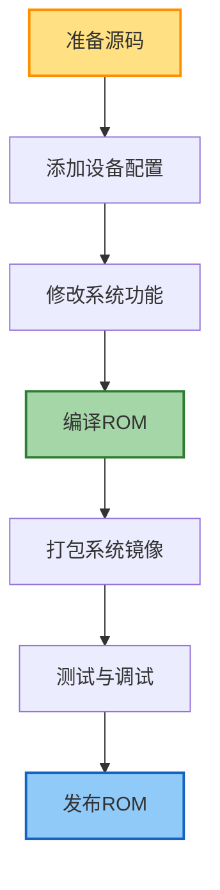

# Android定制ROM开发

## 简介

定制ROM(Read-Only Memory)是指基于Android开源项目(AOSP)进行修改后，形成具有特色功能和界面的Android系统版本。本文将深入讲解Android定制ROM的开发流程、关键技术点、常见定制方向以及最佳实践，帮助开发者构建自己的定制Android系统。

## 定制ROM基础

### 什么是定制ROM

定制ROM是对原始Android系统进行二次开发后的产物，主要包括以下特点：

1. **基于AOSP**：以Android开源项目代码为基础
2. **界面定制**：自定义系统UI、主题和交互方式
3. **功能扩展**：添加原生系统不具备的功能
4. **性能优化**：针对特定硬件进行性能调优
5. **预装应用**：集成第三方应用或自研应用

### 定制ROM的种类

市场上常见的定制ROM主要有以下几类：

1. **厂商ROM**：手机厂商定制（如MIUI、EMUI、ColorOS等）
2. **社区ROM**：开发者社区维护（如LineageOS、Paranoid Android等）
3. **行业ROM**：面向特定行业的定制系统（如车载Android、POS机系统等）
4. **企业ROM**：企业级设备定制系统（如工业平板、智能终端等）

## 开发环境搭建

### 硬件要求

开发定制ROM需要较高配置的开发机器：

- **处理器**：至少8核心CPU
- **内存**：最低16GB，推荐32GB以上
- **存储**：至少500GB可用空间，SSD存储
- **网络**：高速稳定的网络连接
- **操作系统**：Linux (Ubuntu/Debian)或macOS

### 软件环境配置

```bash
# 安装基本依赖(Ubuntu为例)
sudo apt-get update
sudo apt-get install git-core gnupg flex bison build-essential zip curl zlib1g-dev gcc-multilib g++-multilib libc6-dev-i386 lib32ncurses5-dev x11proto-core-dev libx11-dev lib32z1-dev libgl1-mesa-dev libxml2-utils xsltproc unzip fontconfig

# 安装repo工具
mkdir ~/bin
curl https://storage.googleapis.com/git-repo-downloads/repo > ~/bin/repo
chmod a+x ~/bin/repo
```

### 获取AOSP源码

```bash
# 创建工作目录
mkdir -p ~/android/rom
cd ~/android/rom

# 初始化仓库
repo init -u https://android.googlesource.com/platform/manifest -b android-12.0.0_r1

# 下载源码(耗时较长)
repo sync -j8
```

### 设备专用代码获取

为特定设备构建ROM还需要设备专用代码：

```bash
# 获取设备树
git clone https://github.com/device-vendor/device_codename.git device/vendor/codename

# 获取内核源码
git clone https://github.com/device-vendor/kernel_codename.git kernel/vendor/codename

# 获取专有二进制文件
git clone https://github.com/device-vendor/proprietary_vendor_codename.git vendor/vendor/codename
```

## ROM开发基本流程

### 系统构建流程



### 构建配置

首先需要创建设备专用配置文件：

```bash
# 设备配置文件位置
device/vendor/codename/device.mk
device/vendor/codename/BoardConfig.mk
```

设备配置示例：

```makefile
# device.mk
PRODUCT_NAME := lineage_codename
PRODUCT_DEVICE := codename
PRODUCT_BRAND := vendor
PRODUCT_MODEL := Device Model
PRODUCT_MANUFACTURER := Vendor

# 包含通用配置
$(call inherit-product, device/vendor/codename/device-common.mk)
$(call inherit-product, vendor/lineage/config/common_full_phone.mk)

# 定义产品特性
PRODUCT_PROPERTY_OVERRIDES += \
    ro.config.ringtone=CustomRing.ogg \
    ro.config.notification_sound=CustomNotification.ogg

# 包含额外应用
PRODUCT_PACKAGES += \
    CustomApp \
    CustomSettings
```

```makefile
# BoardConfig.mk
# 架构配置
TARGET_ARCH := arm64
TARGET_ARCH_VARIANT := armv8-a
TARGET_CPU_ABI := arm64-v8a
TARGET_CPU_VARIANT := generic

# 内核配置
BOARD_KERNEL_BASE := 0x00000000
BOARD_KERNEL_PAGESIZE := 4096
BOARD_KERNEL_CMDLINE := console=ttyMSM0,115200n8 earlycon=msm_geni_serial,0xa90000 androidboot.hardware=qcom

# 分区大小
BOARD_BOOTIMAGE_PARTITION_SIZE := 67108864
BOARD_SYSTEMIMAGE_PARTITION_SIZE := 3221225472
BOARD_VENDORIMAGE_PARTITION_SIZE := 1073741824
BOARD_FLASH_BLOCK_SIZE := 131072
```

### 编译ROM

```bash
# 初始化构建环境
source build/envsetup.sh

# 选择目标设备
lunch lineage_codename-userdebug

# 开始编译
make -j8
```

编译完成后，产物通常位于`out/target/product/codename/`目录下。

## 系统核心定制

### 系统UI定制

定制SystemUI是ROM开发的重要环节：

1. **状态栏定制**：
   - 修改状态栏布局
   - 自定义状态栏图标
   - 添加快速设置面板功能

```java
// frameworks/base/packages/SystemUI/src/com/android/systemui/statusbar/phone/StatusBar.java
// 添加自定义状态栏功能
public void addCustomStatusBarFeature() {
    // 实现自定义功能
    CustomStatusBarFeature feature = new CustomStatusBarFeature(mContext);
    feature.initialize();
    mStatusBarFeatures.add(feature);
}
```

2. **锁屏定制**：
   - 自定义锁屏界面
   - 添加锁屏小部件
   - 修改解锁方式

```java
// 自定义锁屏实现
public class CustomLockscreen extends Lockscreen {
    @Override
    protected void onFinishInflate() {
        super.onFinishInflate();
        // 添加自定义锁屏元素
        addCustomLockscreenElements();
    }
    
    private void addCustomLockscreenElements() {
        // 实现自定义锁屏元素
    }
}
```

### 系统主题定制

创建系统级主题定制：

1. **资源覆盖**：
   - 创建自定义主题目录
   - 替换系统默认资源文件

```xml
<!-- 自定义主题资源 -->
<resources>
    <style name="Theme.Custom" parent="@android:style/Theme.Material">
        <item name="android:colorPrimary">@color/custom_primary</item>
        <item name="android:colorAccent">@color/custom_accent</item>
        <item name="android:statusBarColor">@color/custom_status_bar</item>
    </style>
</resources>
```

2. **动态主题**：
   - 实现主题切换功能
   - 支持用户自定义主题

```java
// 主题管理服务
public class ThemeManagerService extends IThemeService.Stub {
    private final Context mContext;
    private final ThemeEngine mThemeEngine;
    
    public ThemeManagerService(Context context) {
        mContext = context;
        mThemeEngine = new ThemeEngine(context);
    }
    
    @Override
    public void applyTheme(String themeName) {
        mThemeEngine.applyTheme(themeName);
        sendThemeChangedBroadcast(themeName);
    }
}
```

### 系统设置定制

添加自定义系统设置页面和选项：

1. **创建设置页面**：

```java
// packages/apps/Settings/src/com/android/settings/custom/CustomSettings.java
public class CustomSettings extends SettingsPreferenceFragment {
    @Override
    public void onCreate(Bundle savedInstanceState) {
        super.onCreate(savedInstanceState);
        addPreferencesFromResource(R.xml.custom_settings);
        
        // 初始化自定义选项
        initCustomOptions();
    }
    
    private void initCustomOptions() {
        // 实现自定义设置选项
    }
}
```

2. **设置项XML定义**：

```xml
<!-- res/xml/custom_settings.xml -->
<PreferenceScreen
    xmlns:android="http://schemas.android.com/apk/res/android"
    xmlns:settings="http://schemas.android.com/apk/res/com.android.settings">
    
    <PreferenceCategory android:title="@string/custom_settings_category">
        <SwitchPreference
            android:key="custom_feature_enable"
            android:title="@string/custom_feature_title"
            android:summary="@string/custom_feature_summary"
            android:defaultValue="false" />
            
        <ListPreference
            android:key="custom_feature_mode"
            android:title="@string/custom_feature_mode_title"
            android:entries="@array/custom_feature_mode_entries"
            android:entryValues="@array/custom_feature_mode_values"
            android:dependency="custom_feature_enable" />
    </PreferenceCategory>
</PreferenceScreen>
```

### Framework层定制

修改Android系统核心功能：

1. **系统服务扩展**：

```java
// 创建自定义系统服务
public class CustomSystemService extends SystemService {
    private static final String TAG = "CustomSystemService";
    
    public CustomSystemService(Context context) {
        super(context);
    }
    
    @Override
    public void onStart() {
        publishBinderService(Context.CUSTOM_SERVICE, mService);
    }
    
    private final IBinder mService = new ICustomService.Stub() {
        @Override
        public void customFeature(String param) {
            // 实现自定义功能
        }
    };
}
```

2. **在SystemServer中注册服务**：

```java
// com/android/server/SystemServer.java
private void startOtherServices() {
    // ...现有代码...
    
    traceBeginAndSlog("StartCustomService");
    try {
        Slog.i(TAG, "Custom System Service");
        mSystemServiceManager.startService(CustomSystemService.class);
    } catch (Throwable e) {
        reportWtf("starting Custom Service", e);
    }
    
    // ...现有代码...
}
```

## 常见定制方向

### 性能优化

1. **内核优化**：
   - 调整CPU调度器
   - 优化内存管理
   - 修改I/O调度策略

```bash
# 内核编译配置示例
cd kernel/vendor/codename
make ARCH=arm64 vendor_defconfig
```

```c
// kernel/sched/fair.c
// 修改CPU调度参数
static void update_task_rq_fair(struct rq *rq, struct task_struct *p) {
    // 优化任务调度逻辑
}
```

2. **系统性能调优**：
   - 调整系统进程优先级
   - 优化启动速度
   - 减少后台进程

```java
// 服务优先级调整
@Override
public void onCreate() {
    super.onCreate();
    // 提高服务优先级
    Process.setThreadPriority(Process.THREAD_PRIORITY_FOREGROUND);
}
```

### 电池优化

1. **耗电监控**：
   - 创建电池使用统计
   - 识别高耗电应用

```java
// 电池监控服务
public class BatteryMonitorService extends Service {
    private BatteryStatsImpl mBatteryStats;
    
    @Override
    public void onCreate() {
        super.onCreate();
        mBatteryStats = new BatteryStatsImpl();
        registerBatteryReceiver();
    }
    
    private void monitorAppPowerUsage() {
        // 实现应用电量监控
    }
}
```

2. **省电模式增强**：
   - 定制深度省电模式
   - 智能管理后台活动

```java
// 增强省电模式实现
public class EnhancedPowerSaveMode {
    public void enable() {
        // 限制后台进程
        restrictBackgroundProcesses();
        
        // 降低性能
        reduceCpuPerformance();
        
        // 减少网络活动
        limitNetworkActivity();
    }
}
```

### 系统安全增强

1. **权限管理**：
   - 增强隐私保护
   - 细粒度权限控制

```java
// 增强权限管理
public class EnhancedPermissionManager {
    public void enforcePermission(String permission, int pid, int uid, String message) {
        // 基础权限检查
        mContext.enforcePermission(permission, pid, uid, message);
        
        // 增强权限检查
        if (isEnhancedProtection(permission)) {
            performEnhancedCheck(permission, pid, uid);
        }
    }
}
```

2. **安全功能添加**：
   - 应用加密
   - 隐私空间
   - 防追踪功能

```java
// 应用隐私空间实现
public class PrivateSpaceManager {
    public void createPrivateSpace(String spaceId, String password) {
        // 创建加密空间
        createEncryptedStorage(spaceId, password);
        
        // 设置隐私空间的应用
        setupPrivateSpaceApps(spaceId);
    }
}
```

## 定制案例分析

### 案例一：启动器定制

定制系统启动器（Launcher）是常见的ROM定制方向：

```java
// 自定义启动器组件
public class CustomLauncher extends Launcher {
    @Override
    protected void onCreate(Bundle savedInstanceState) {
        super.onCreate(savedInstanceState);
        
        // 初始化自定义功能
        initCustomFeatures();
    }
    
    private void initCustomFeatures() {
        // 添加特殊桌面手势
        mWorkspace.setCustomGestureListener(new CustomGestureListener());
        
        // 添加自定义桌面部件
        addCustomWidgets();
    }
}
```

### 案例二：通知系统增强

增强系统通知功能：

```java
// 增强通知管理
public class EnhancedNotificationManagerService extends NotificationManagerService {
    @Override
    public void enqueueNotificationWithTag(String pkg, String opPkg, String tag,
            int id, Notification notification, int userId) {
        
        // 应用通知分类
        categorizeNotification(pkg, notification);
        
        // 智能通知优先级
        adjustNotificationPriority(pkg, notification);
        
        // 调用原始方法
        super.enqueueNotificationWithTag(pkg, opPkg, tag, id, notification, userId);
    }
}
```

### 案例三：相机功能增强

定制相机应用和Framework相机接口：

```java
// 增强相机功能
public class EnhancedCameraService extends CameraService {
    @Override
    public ICameraDeviceUser connectDevice(
            ICameraDeviceCallbacks callbacks,
            int cameraId,
            String clientPackageName,
            int clientUid,
            int clientPid) {
            
        // 添加自定义相机功能
        applyCustomCameraFeatures(cameraId);
        
        return super.connectDevice(
                callbacks, cameraId, clientPackageName, clientUid, clientPid);
    }
}
```

## 工具与测试

### 调试工具

ROM开发常用调试工具：

1. **adb与fastboot**：基本设备通信工具
2. **logcat**：日志抓取与分析
3. **systrace**：系统性能分析
4. **TraceView**：性能追踪

使用systrace示例：

```bash
# 使用systrace捕获系统性能数据
python $ANDROID_HOME/platform-tools/systrace/systrace.py \
  --time=10 \
  -o ~/trace.html \
  sched gfx view wm
```

### 常见问题排查

编译和运行过程中常见问题与解决方法：

1. **编译错误**：
   - 检查依赖库是否完整
   - 解决代码冲突
   - 确认API兼容性

2. **启动问题**：
   - 检查内核日志
   - 分析开机过程
   - 排查关键服务

```bash
# 获取引导日志
adb shell dmesg

# 查看系统日志
adb logcat *:E

# 查看启动服务日志
adb shell dumpsys activity services
```

### 自动化测试

为ROM开发建立测试框架：

```java
// ROM功能测试
public class RomFeatureTest extends InstrumentationTestCase {
    public void testCustomFeature() {
        // 测试自定义功能
        CustomFeature feature = new CustomFeature();
        assertTrue("Custom feature failed to initialize", feature.initialize());
        
        // 测试功能操作
        boolean result = feature.performOperation();
        assertTrue("Custom feature operation failed", result);
    }
}
```

## 打包与发布

### OTA更新系统

为定制ROM构建OTA更新系统：

```bash
# 生成增量OTA包
./build/tools/releasetools/ota_from_target_files \
  -i previous_target_files.zip \
  current_target_files.zip \
  incremental_ota_update.zip
```

### ROM发布流程

建立标准ROM发布流程：

1. **构建发布版本**：
   - 使用`make -j8 bacon`生成最终ROM包
   - 确保签名正确

2. **文档准备**：
   - 编写更新日志
   - 准备安装说明
   - 列出已知问题

3. **发布渠道**：
   - 官方网站
   - 论坛（如XDA）
   - OTA服务器

### 社区支持

维护ROM社区的最佳实践：

1. **问题跟踪**：
   - 使用问题跟踪系统（如GitHub Issues）
   - 建立问题报告模板

2. **收集反馈**：
   - 创建反馈渠道
   - 定期分析用户反馈

3. **开源协作**：
   - 接受社区贡献
   - 明确贡献指南

## 高级主题

### 构建系统定制

修改Android编译系统：

```makefile
# 自定义编译规则
define my-custom-rule
    # 自定义构建逻辑
endef

# 扩展现有模块类型
$(call record-module-type,CUSTOM_EXECUTABLE)
define CUSTOM_EXECUTABLE
    $(eval LOCAL_MODULE_CLASS := EXECUTABLES)
    $(eval LOCAL_MODULE_TAGS := optional)
    
    # 应用自定义构建规则
    $(call my-custom-rule)
    
    include $(BUILD_EXECUTABLE)
endef
```

### 驱动集成

集成专有硬件驱动：

```c
// 自定义驱动实现
static struct platform_driver custom_driver = {
    .probe  = custom_driver_probe,
    .remove = custom_driver_remove,
    .driver = {
        .name = "custom-hardware",
        .owner = THIS_MODULE,
    },
};

static int custom_driver_probe(struct platform_device *pdev) {
    // 驱动初始化代码
    return 0;
}

static void __init custom_driver_init(void) {
    platform_driver_register(&custom_driver);
}
```

### 多ROM共存

实现多ROM并存方案：

```bash
# 多ROM启动配置
menuentry "Custom ROM" {
    linux /custom-rom/boot/kernel
    initrd /custom-rom/boot/initrd.img
    options root=/dev/mmcblk0p2 androidboot.hardware=qcom
}

menuentry "Stock ROM" {
    linux /stock-rom/boot/kernel
    initrd /stock-rom/boot/initrd.img
    options root=/dev/mmcblk0p3 androidboot.hardware=qcom
}
```

## 最佳实践

### 可维护性建议

保持ROM项目可维护：

1. **代码组织**：
   - 遵循AOSP代码风格
   - 使用适当的包结构
   - 独立维护定制功能

2. **版本控制**：
   - 使用Git管理源码
   - 制定分支策略
   - 规范提交信息

3. **文档维护**：
   - 记录设计决策
   - 编写开发指南
   - 更新用户手册

### 从AOSP更新

高效地从AOSP更新代码：

```bash
# 更新AOSP代码
repo init -u https://android.googlesource.com/platform/manifest -b android-12.0.0_r2
repo sync

# 合并自定义更改
repo forall -c 'if [ -d .git ] && git status | grep -q "modified:" ; then echo "$REPO_PATH has local changes"; fi'
```

### 性能与稳定性平衡

平衡ROM的性能和稳定性：

1. **渐进式优化**：
   - 一次专注一个方面
   - 测量优化效果
   - 评估稳定性影响

2. **测试驱动开发**：
   - 为每个功能编写测试
   - 建立基准性能测试
   - 进行回归测试

## 结论

定制ROM开发是一项复杂但富有成就感的工作，需要对Android系统有深入理解，同时具备系统编程、性能优化和用户体验设计能力。通过本文介绍的技术和实践，开发者可以构建功能丰富、性能优秀、体验一流的定制Android系统。

## 参考资源

- [Android 开源项目 (AOSP)](https://source.android.com/)
- [LineageOS 开发文档](https://wiki.lineageos.org/development.html)
- [XDA 开发者论坛](https://forum.xda-developers.com/)
- [Android 构建系统文档](https://source.android.com/setup/build)
- [Android Framework 架构](https://source.android.com/devices/architecture) 