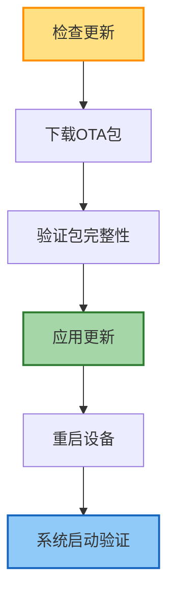
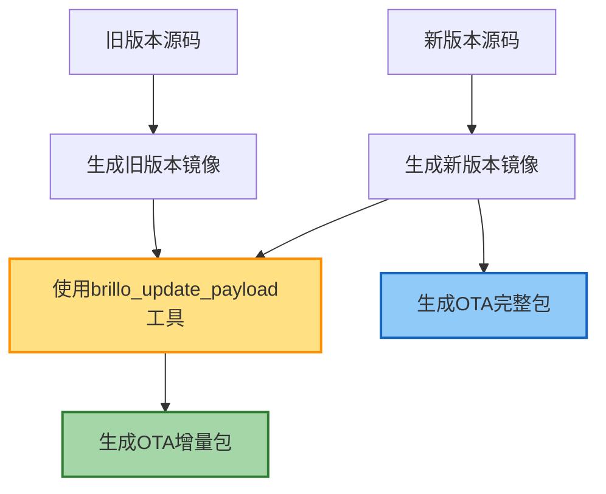
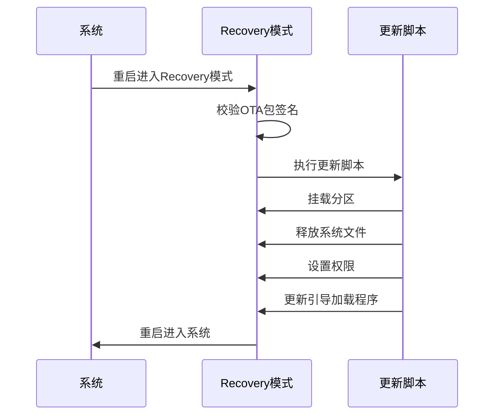
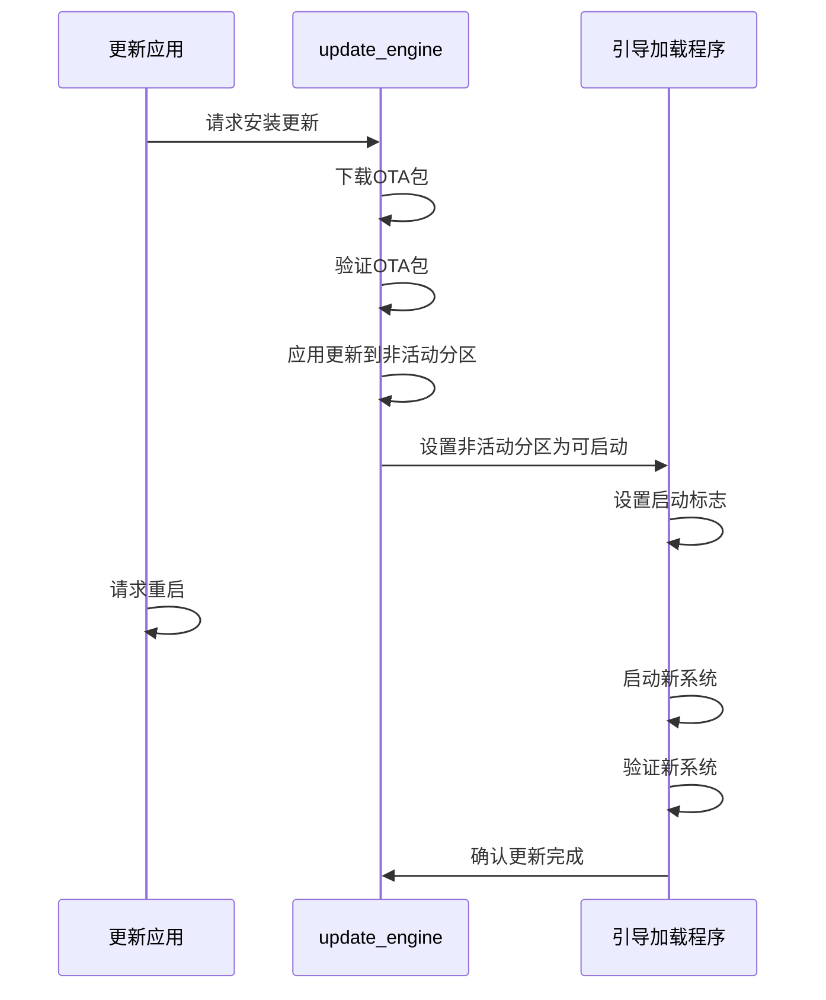
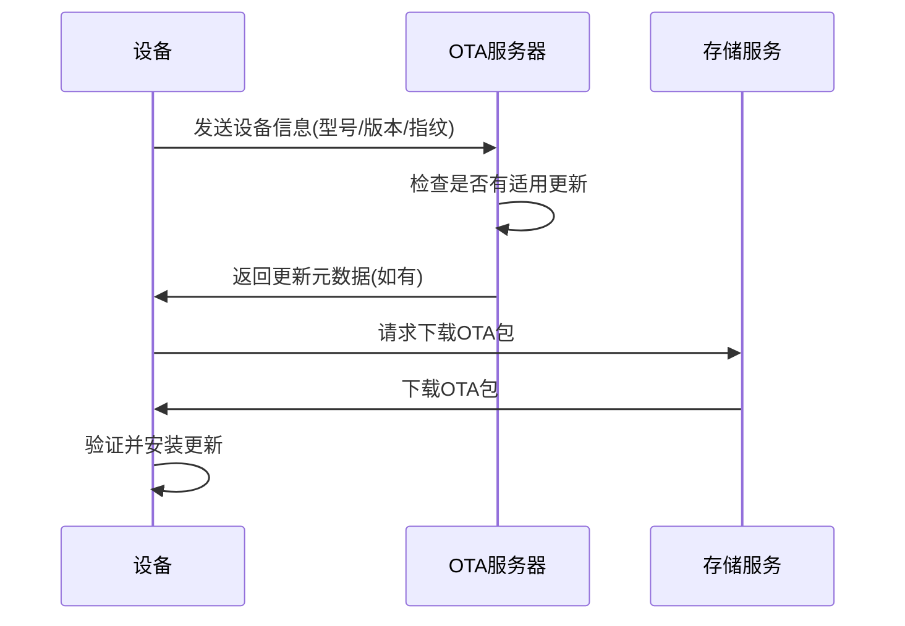

# Android系统更新与OTA机制

## 简介

Android系统更新（Over-The-Air，简称OTA）是指通过无线网络向设备推送系统升级的技术。本文将深入探讨Android系统更新的原理、实现机制、升级流程以及开发者如何定制OTA功能，帮助系统开发者更好地理解和应用Android的系统更新能力。

## OTA更新基本概念

### OTA更新类型

Android系统支持多种OTA更新方式：

1. **完整包更新（Full OTA）**：包含完整系统镜像的更新包
2. **增量更新（Incremental OTA）**：仅包含系统变化部分的更新包
3. **A/B系统更新**：后台下载安装，重启后切换到新系统
4. **动态分区更新**：通过动态分区实现更灵活的系统更新

### OTA更新流程

标准OTA更新流程包括以下步骤：

1. **检查更新**：设备向服务器查询是否有新版本
2. **下载更新包**：从服务器下载OTA包
3. **验证包完整性**：验证OTA包的签名和完整性
4. **应用更新**：安装OTA包并更新系统
5. **重启设备**：重启以激活新系统



## OTA包结构

### OTA包内容

标准OTA包包含以下组件：

1. **更新脚本（update-script）**：执行更新操作的指令集
2. **更新二进制（update-binary）**：执行脚本的解释器
3. **系统镜像或补丁**：新系统或与旧系统的差异内容
4. **元数据**：版本信息、兼容性检查数据等
5. **签名**：验证包来源和完整性

### OTA包制作流程



OTA包制作命令示例：

```bash
# 生成完整OTA包
./build/tools/releasetools/ota_from_target_files \
  -k build/target/product/security/testkey \
  dist_output/targets_files.zip ota_update.zip

# 生成增量OTA包
./build/tools/releasetools/ota_from_target_files \
  -k build/target/product/security/testkey \
  -i old_target_files.zip new_target_files.zip incremental_ota_update.zip
```

## Recovery模式

### Recovery作用

Recovery是Android设备的一个特殊模式，主要功能包括：

1. **系统更新**：应用OTA更新包
2. **恢复出厂设置**：擦除用户数据
3. **分区维护**：修复损坏的分区
4. **备份与恢复**：备份和恢复用户数据

### Recovery组件

Recovery模式由以下核心组件构成：

1. **恢复内核**：专用Linux内核
2. **恢复ramdisk**：包含更新工具的根文件系统
3. **更新程序**：处理OTA包的程序（recovery或update_engine）
4. **命令接口**：处理命令和显示UI

### Recovery更新流程



### update_engine

在A/B系统中，Google引入了update_engine替代传统Recovery进行更新：

```cpp
// update_engine中的更新流程示例
status_t UpdateEngine::applyPayload(
    const std::string& payload_url,
    size_t payload_size,
    const std::vector<std::string>& payload_headers) {
    
    // 初始化更新处理
    update_attempter_->InitializeUpdate();
    
    // 应用更新
    int error_code = update_attempter_->StartUpdateFromString(
        payload_url, payload_size, payload_headers);
    
    if (error_code != ErrorCode::kSuccess) {
        LOG(ERROR) << "Update failed with error code: " << error_code;
        return BAD_VALUE;
    }
    
    return OK;
}
```

## A/B系统更新

### A/B系统原理

A/B系统(无缝更新)使用两套系统分区实现更新：

1. **当前使用分区(槽位A)**：用户正在使用的系统
2. **后台更新分区(槽位B)**：下载安装更新的系统
3. **更新完成后**：重启切换到新分区

优势：
- 更新过程中系统可以正常使用
- 更新失败可立即回滚到之前系统
- 无需Recovery分区参与更新

### A/B分区设计

A/B系统的分区设计：

```
boot_a, boot_b            # 内核和ramdisk
system_a, system_b        # 系统分区
vendor_a, vendor_b        # 厂商分区
product_a, product_b      # 产品分区
```

### A/B更新流程



A/B更新的关键代码实现：

```java
// SystemUpdateManagerService.java中的A/B更新处理
public void applyUpdate() {
    try {
        // 绑定到update_engine服务
        mUpdateEngine.bind(mUpdateEngineCallback);
        
        // 应用OTA包
        String packageUrl = "file://" + mUpdatePackagePath;
        String[] headerKeyValuePairs = new String[0];
        
        mUpdateEngine.applyPayload(
            packageUrl, 
            0, // offset
            mUpdatePackageSize, 
            headerKeyValuePairs);
            
    } catch (Exception e) {
        Log.e(TAG, "Failed to apply update", e);
    }
}

// 回调监听更新进度和结果
private final UpdateEngineCallback mUpdateEngineCallback = 
    new UpdateEngineCallback() {
    
    @Override
    public void onStatusUpdate(int status, float percent) {
        // 更新状态和进度
        Log.d(TAG, "Update status: " + status + ", " + percent + "%");
    }
    
    @Override
    public void onPayloadApplicationComplete(int errorCode) {
        if (errorCode == UpdateEngine.ErrorCode.SUCCESS) {
            Log.i(TAG, "Update successful, requesting reboot");
            // 请求重启
            PowerManager pm = getContext().getSystemService(PowerManager.class);
            pm.reboot(null);
        } else {
            Log.e(TAG, "Update failed with code: " + errorCode);
        }
    }
};
```

## 动态分区更新

### 动态分区原理

Android 10引入的动态分区技术改进了系统分区管理：

1. **Super分区**：包含所有系统分区的容器分区
2. **动态调整大小**：分区大小可以动态调整
3. **根据需求分配**：更灵活地分配存储空间

### 动态分区更新流程

动态分区在OTA过程中的工作流程：

1. 读取分区表，确定现有分区大小和位置
2. 根据OTA包中的分区信息，创建新的分区表
3. 重新调整分区大小，必要时可扩大分区
4. 将新系统写入调整后的分区

```java
// 动态分区更新示例代码
public void updateWithDynamicPartitions() {
    try {
        // 第一步：连接到update_engine
        IUpdateEngine updateEngine = getUpdateEngineService();
        
        // 第二步：注册回调
        updateEngine.bind(createUpdateCallback());
        
        // 第三步：应用动态分区更新
        String url = "file://" + mUpdatePackagePath;
        updateEngine.applyPayload(url, 0, mPayloadSize, new String[0]);
        
    } catch (RemoteException e) {
        Log.e(TAG, "Dynamic partition update failed", e);
    }
}
```

## 系统更新服务

### UpdateEngine服务

Android的系统更新由UpdateEngine服务负责，它是OTA流程的核心组件：

1. **下载管理**：管理OTA包的下载
2. **验证机制**：验证OTA包的签名和完整性
3. **应用更新**：将OTA包应用到系统
4. **状态报告**：报告更新进度和结果

### SystemUpdateService

SystemUpdateService是Framework层负责系统更新的服务：

```java
// SystemUpdateService.java核心功能示例
public class SystemUpdateService extends ISystemUpdateManager.Stub {
    private static final String TAG = "SystemUpdateService";
    
    // 存储系统更新配置
    private final SystemUpdatePolicy mUpdatePolicy;
    
    // 更新引擎接口
    private final UpdateEngine mUpdateEngine;
    
    // 检查是否有可用更新
    @Override
    public boolean isUpdateAvailable() {
        // 连接服务器检查
        // ...
        return updateAvailable;
    }
    
    // 下载更新
    @Override
    public void downloadUpdate() {
        // 实现更新下载逻辑
        // ...
    }
    
    // 安装更新
    @Override
    public void installUpdate() {
        try {
            // 安装更新逻辑
            applyUpdate();
        } catch (Exception e) {
            Log.e(TAG, "Failed to install update", e);
        }
    }
}
```

## OTA服务器实现

### OTA服务器架构

典型OTA服务器架构包括：

1. **设备管理**：跟踪设备型号和当前版本
2. **更新包管理**：存储和提供OTA包
3. **版本控制**：管理不同版本和升级路径
4. **部署控制**：控制更新的分阶段推送

### 更新检查流程



### 自定义OTA服务器

构建自定义OTA服务器的关键步骤：

1. **创建API端点**：处理设备更新检查请求
2. **存储OTA包**：安全存储不同版本的OTA包
3. **设备认证**：确保只有授权设备能获取更新
4. **部署策略**：实现灰度发布等高级功能

服务器API示例：

```json
// 设备请求结构
{
  "device": "device_model",
  "buildId": "current_build_id",
  "buildFingerprint": "current_fingerprint",
  "buildVersion": "current_version"
}

// 服务器响应结构
{
  "updateAvailable": true,
  "buildId": "new_build_id",
  "buildVersion": "new_version",
  "packageUrl": "https://ota-server.com/updates/package.zip",
  "packageSize": 1073741824,
  "packageHash": "sha256_hash_of_package"
}
```

## 安全性考虑

### 签名验证

OTA包必须经过签名以确保其来源和完整性：

1. **签名过程**：使用私钥对OTA包签名
2. **验证过程**：设备使用公钥验证签名
3. **密钥保护**：签名私钥必须严格保护

签名命令示例：

```bash
# 使用签名密钥签名OTA包
./build/tools/releasetools/sign_target_files_apks \
  -o \
  -d build/target/product/security \
  unsigned_target_files.zip signed_target_files.zip
```

### 回滚保护

防止降级攻击的回滚保护机制：

1. **版本追踪**：记录设备已安装的系统版本
2. **版本验证**：拒绝安装低于当前安全补丁级别的更新
3. **Bootloader锁定**：防止未授权的系统修改

```java
// VintfObject中的回滚保护实现示例
public boolean checkCompatibility(XmlSerializable constraint) {
    // 检查新系统版本是否高于当前版本
    // 如果是降级版本则拒绝
    if (constraint.getSchemaVersion() < getCurrentVersion()) {
        Log.e(TAG, "Downgrade detected, rejecting update");
        return false;
    }
    
    // 其他兼容性检查
    // ...
    
    return true;
}
```

## 自定义OTA实现

### 定制OTA客户端

定制OTA客户端的关键步骤：

1. **创建更新应用**：开发检查和下载更新的应用
2. **集成UpdateEngine**：使用系统UpdateEngine API
3. **自定义UI**：开发更新通知和进度界面
4. **权限设置**：确保应用有必要的权限

关键权限要求：

```xml
<!-- AndroidManifest.xml权限设置 -->
<uses-permission android:name="android.permission.ACCESS_CACHE_FILESYSTEM" />
<uses-permission android:name="android.permission.REBOOT" />
<uses-permission android:name="android.permission.RECOVERY" />
<uses-permission android:name="android.permission.WRITE_MEDIA_STORAGE" />
```

### 集成示例

自定义OTA应用的核心代码示例：

```java
public class CustomOtaService extends Service {
    private static final String TAG = "CustomOtaService";
    
    // UpdateEngine实例
    private UpdateEngine mUpdateEngine;
    // 更新回调
    private UpdateEngineCallback mUpdateCallback;
    
    @Override
    public void onCreate() {
        super.onCreate();
        
        // 初始化UpdateEngine
        mUpdateEngine = new UpdateEngine();
        
        // 创建回调
        mUpdateCallback = new UpdateEngineCallback() {
            @Override
            public void onStatusUpdate(int status, float percent) {
                // 更新UI显示进度
                notifyUpdateProgress(status, percent);
            }
            
            @Override
            public void onPayloadApplicationComplete(int errorCode) {
                if (errorCode == UpdateEngine.ErrorCode.SUCCESS) {
                    // 更新成功，提示用户重启
                    notifyUpdateComplete(true);
                } else {
                    // 更新失败，显示错误
                    notifyUpdateComplete(false);
                    Log.e(TAG, "Update failed: " + errorCode);
                }
            }
        };
        
        // 绑定回调
        mUpdateEngine.bind(mUpdateCallback);
    }
    
    // 开始更新过程
    public void startUpdate(String packagePath, long packageSize) {
        try {
            String url = "file://" + packagePath;
            mUpdateEngine.applyPayload(url, 0, packageSize, new String[0]);
        } catch (Exception e) {
            Log.e(TAG, "Failed to apply update", e);
        }
    }
    
    // 其他服务方法...
}
```

## 最佳实践与优化

### 增量更新优化

优化增量更新包大小：

1. **智能差分算法**：使用高效的差分算法
2. **块级差分**：只更新变化的块
3. **压缩处理**：优化压缩参数减小包大小

### 可靠性优化

提高OTA更新可靠性：

1. **更新前检查**：验证系统状态和可用空间
2. **断点续传**：支持下载中断后继续
3. **更新验证**：安装前和安装后验证
4. **自动回滚**：更新失败时自动回滚

### 企业级OTA部署

企业设备OTA最佳实践：

1. **批次发布**：分批次推送更新控制风险
2. **时间窗口**：在指定时间窗口内更新
3. **网络条件**：仅在WiFi条件下更新
4. **电量要求**：要求设备电量充足

## 故障排除

### 常见问题解决

1. **签名验证失败**：
   - 检查签名密钥是否正确
   - 确认OTA包未被修改

2. **空间不足**：
   - 清理临时文件
   - 优化OTA包大小

3. **更新失败回滚**：
   - 检查日志确定失败原因
   - 修复问题后重新生成OTA包

### 日志分析

关键日志位置：

```bash
# recovery日志
adb shell cat /cache/recovery/last_log

# update_engine日志
adb shell logcat -b all | grep update_engine

# 系统更新服务日志
adb shell logcat | grep SystemUpdateService
```

## 未来趋势

1. **模块化系统更新**：通过Project Mainline实现组件级更新
2. **智能更新调度**：基于用户行为模式安排更新
3. **差分优化**：更小的增量更新包
4. **安全增强**：更强的签名和验证机制

## 参考资源

- [Android OTA更新官方文档](https://source.android.com/devices/tech/ota)
- [A/B系统更新实现](https://source.android.com/devices/tech/ota/ab)
- [动态分区设计](https://source.android.com/devices/tech/ota/dynamic_partitions)
- [AOSP中的update_engine源码](https://android.googlesource.com/platform/system/update_engine/)
- [Recovery源代码分析](https://android.googlesource.com/platform/bootable/recovery/) 