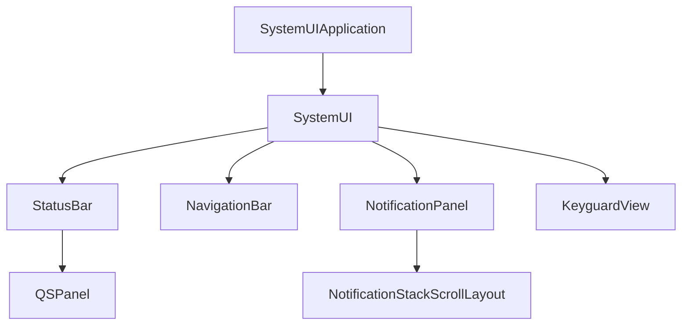

# SystemUI定制项目实践

## 项目概述

SystemUI是Android系统中负责显示状态栏、导航栏、通知面板等系统界面元素的关键组件。本项目将通过实践指导开发者如何修改和定制SystemUI，实现个性化的系统界面，同时保持良好的用户体验和系统一致性。

## 项目目标

1. 理解SystemUI的架构和工作原理
2. 修改状态栏和快速设置面板
3. 自定义通知样式与交互
4. 定制锁屏界面

## 开发环境准备

### 所需工具

- Android Studio 4.2+
- AOSP源码
- 可调试的Android设备（必须有root权限）

### 源码获取

```bash
# 初始化仓库
repo init -u https://android.googlesource.com/platform/manifest -b android-12.0.0_r1

# 仅下载SystemUI相关代码
repo sync -c -j8 frameworks/base/packages/SystemUI
repo sync -c -j8 frameworks/base/core/java/android/app
repo sync -c -j8 frameworks/base/core/res
```

## SystemUI架构分析

SystemUI的核心架构：



主要组件说明：

1. **SystemUIApplication**: 应用入口
2. **StatusBar**: 状态栏管理
3. **NavigationBar**: 导航栏管理
4. **NotificationPanel**: 通知面板
5. **KeyguardView**: 锁屏界面
6. **QSPanel**: 快速设置面板
7. **NotificationStackScrollLayout**: 通知列表布局管理

## 项目实践一：状态栏定制

### 任务目标

修改状态栏外观和行为，包括：
- 更改状态栏颜色和透明度
- 添加自定义状态图标
- 修改状态栏高度

### 实现步骤

#### 1. 修改状态栏颜色

```xml
<!-- frameworks/base/core/res/res/values/colors.xml -->
<color name="system_bar_background_semi_transparent">#80000000</color>
```

```java
// frameworks/base/packages/SystemUI/src/com/android/systemui/statusbar/phone/StatusBar.java
private void updateStatusBarColor() {
    // 设置状态栏颜色
    int color = mColorExtractor.getColor(WallpaperManager.FLAG_SYSTEM);
    // 应用颜色到状态栏
    mStatusBarWindowController.setStatusBarColor(color);
}
```

#### 2. 添加自定义状态图标

创建一个新的状态栏图标：

```java
// 创建自定义状态栏图标服务
public class CustomStatusIconService extends SystemUI {
    private static final String TAG = "CustomStatusIcon";
    
    private StatusBarIconController mIconController;
    private CustomIconView mIconView;
    
    @Override
    public void start() {
        mIconController = Dependency.get(StatusBarIconController.class);
        mIconView = new CustomIconView(mContext);
        
        // 注册图标
        StatusBarIconController.IconManager iconManager = 
            mIconController.getIconManager(StatusBarManager.DISABLE_NONE);
        StatusBarIcon icon = createStatusBarIcon();
        iconManager.setIcon("custom_icon", icon);
    }
    
    private StatusBarIcon createStatusBarIcon() {
        StatusBarIcon icon = new StatusBarIcon();
        icon.icon = Icon.createWithResource(mContext, R.drawable.ic_custom);
        icon.visible = true;
        return icon;
    }
}
```

将服务添加到SystemUI配置中：

```xml
<!-- frameworks/base/packages/SystemUI/res/values/config.xml -->
<string-array name="config_systemUIServiceComponents" translatable="false">
    <!-- 其他服务 -->
    <item>com.android.systemui.custom.CustomStatusIconService</item>
</string-array>
```

#### 3. 修改状态栏高度

```xml
<!-- frameworks/base/core/res/res/values/dimens.xml -->
<dimen name="status_bar_height">28dp</dimen>
```

### 测试验证

编译并刷入设备：

```bash
cd $ANDROID_BUILD_TOP
mmm frameworks/base/packages/SystemUI
adb root
adb remount
adb sync
adb shell pkill -TERM -f com.android.systemui
```

## 项目实践二：快速设置定制

### 任务目标

定制快速设置面板，包括：
- 添加自定义快速设置瓷贴
- 修改快速设置布局
- 自定义快速设置交互行为

### 实现步骤

#### 1. 创建自定义快速设置瓷贴

```java
// 自定义快速设置瓷贴实现
@SysUISingleton
public class CustomQSTile extends QSTileImpl<BooleanState> {
    private static final String TAG = "CustomQSTile";
    
    private final Icon mIcon;
    private boolean mIsActive = false;
    
    @Inject
    public CustomQSTile(
            QSHost host,
            @Background Looper backgroundLooper,
            @Main Handler mainHandler,
            FalsingManager falsingManager,
            MetricsLogger metricsLogger,
            StatusBarStateController statusBarStateController,
            ActivityStarter activityStarter,
            QSLogger qsLogger
    ) {
        super(host, backgroundLooper, mainHandler, falsingManager, metricsLogger,
                statusBarStateController, activityStarter, qsLogger);
        mIcon = ResourceIcon.get(R.drawable.ic_custom_tile);
    }
    
    @Override
    public BooleanState newTileState() {
        return new BooleanState();
    }
    
    @Override
    protected void handleClick(@Nullable View view) {
        mIsActive = !mIsActive;
        refreshState();
        
        // 处理点击行为
        if (mIsActive) {
            // 激活功能
            activateCustomFunction();
        } else {
            // 停用功能
            deactivateCustomFunction();
        }
    }
    
    @Override
    public Intent getLongClickIntent() {
        // 长按打开设置页面
        return new Intent(Settings.ACTION_CUSTOM_SETTINGS);
    }
    
    @Override
    public CharSequence getTileLabel() {
        return mContext.getString(R.string.custom_tile_label);
    }
    
    @Override
    protected void handleUpdateState(BooleanState state, Object arg) {
        state.value = mIsActive;
        state.icon = mIcon;
        state.label = getTileLabel();
        state.contentDescription = state.label;
        state.state = mIsActive ? Tile.STATE_ACTIVE : Tile.STATE_INACTIVE;
    }
    
    @Override
    public int getMetricsCategory() {
        return MetricsEvent.CUSTOM_TILE;
    }
    
    private void activateCustomFunction() {
        // 实现自定义功能启用逻辑
        Log.d(TAG, "Custom function activated");
    }
    
    private void deactivateCustomFunction() {
        // 实现自定义功能停用逻辑
        Log.d(TAG, "Custom function deactivated");
    }
}
```

注册瓷贴：

```java
// frameworks/base/packages/SystemUI/src/com/android/systemui/qs/tileimpl/QSFactoryImpl.java
@Override
public QSTile createTile(String tileSpec) {
    switch (tileSpec) {
        // 现有代码
        case "custom":
            return mCustomTileProvider.get();
        default:
            return null;
    }
}
```

#### 2. 修改快速设置布局

自定义布局：

```xml
<!-- frameworks/base/packages/SystemUI/res/layout/qs_panel.xml -->
<com.android.systemui.qs.QSPanel
    xmlns:android="http://schemas.android.com/apk/res/android"
    android:id="@+id/quick_settings_panel"
    android:layout_width="match_parent"
    android:layout_height="wrap_content"
    android:background="@drawable/qs_background"
    android:padding="@dimen/qs_panel_padding">
    
    <!-- 修改快速设置布局 -->
    <GridLayout
        android:id="@+id/qs_tiles_container"
        android:layout_width="match_parent"
        android:layout_height="wrap_content"
        android:columnCount="4"
        android:rowCount="3" />
    
    <!-- 自定义分隔线 -->
    <View
        android:layout_width="match_parent"
        android:layout_height="1dp"
        android:background="@color/custom_divider_color" />
    
    <!-- 自定义底部区域 -->
    <LinearLayout
        android:id="@+id/qs_footer"
        android:layout_width="match_parent"
        android:layout_height="48dp"
        android:orientation="horizontal"
        android:gravity="center_vertical" />
</com.android.systemui.qs.QSPanel>
```

### 测试验证

编译并测试定制的快速设置：

```bash
mmm frameworks/base/packages/SystemUI
adb root
adb remount
adb sync
adb shell am force-stop com.android.systemui
adb shell am start -n com.android.systemui/.SystemUIService
```

## 项目实践三：通知面板定制

### 任务目标

定制通知面板，包括：
- 修改通知样式
- 添加通知分组功能
- 自定义通知交互

### 实现步骤

#### 1. 修改通知样式

```xml
<!-- frameworks/base/packages/SystemUI/res/layout/notification_template_material.xml -->
<FrameLayout
    xmlns:android="http://schemas.android.com/apk/res/android"
    android:id="@+id/status_bar_latest_event_content"
    android:layout_width="match_parent"
    android:layout_height="wrap_content">
    
    <!-- 自定义通知背景 -->
    <LinearLayout
        android:layout_width="match_parent"
        android:layout_height="wrap_content"
        android:orientation="vertical"
        android:background="@drawable/custom_notification_background">
        
        <!-- 通知内容 -->
        <include layout="@layout/notification_template_header" />
        
        <LinearLayout
            android:id="@+id/notification_content"
            android:layout_width="match_parent"
            android:layout_height="wrap_content"
            android:orientation="vertical"
            android:padding="16dp">
            
            <!-- 内容在这里 -->
        </LinearLayout>
        
        <!-- 自定义通知操作栏 -->
        <LinearLayout
            android:id="@+id/custom_actions_container"
            android:layout_width="match_parent"
            android:layout_height="48dp"
            android:orientation="horizontal"
            android:gravity="end" />
    </LinearLayout>
</FrameLayout>
```

#### 2. 自定义通知交互

```java
// 扩展NotificationManager处理通知交互
public class CustomNotificationManager {
    private final Context mContext;
    
    public CustomNotificationManager(Context context) {
        mContext = context;
    }
    
    // 自定义通知分组逻辑
    public void applyCustomGrouping(List<StatusBarNotification> notifications) {
        Map<String, List<StatusBarNotification>> groups = new HashMap<>();
        
        // 根据自定义规则对通知进行分组
        for (StatusBarNotification sbn : notifications) {
            String groupKey = determineGroupKey(sbn);
            if (!groups.containsKey(groupKey)) {
                groups.put(groupKey, new ArrayList<>());
            }
            groups.get(groupKey).add(sbn);
        }
        
        // 应用分组结果
        applyGroups(groups);
    }
    
    private String determineGroupKey(StatusBarNotification sbn) {
        // 实现自定义分组逻辑
        // 例如根据应用类别、通知优先级等进行分组
        return "group_" + sbn.getPackageName().hashCode() % 5;
    }
    
    private void applyGroups(Map<String, List<StatusBarNotification>> groups) {
        // 将分组结果应用到通知系统
        NotificationManager nm = mContext.getSystemService(NotificationManager.class);
        
        // 实现分组应用逻辑
    }
}
```

### 测试验证

发送测试通知以验证效果：

```java
// 发送测试通知
private void sendTestNotification() {
    NotificationManager nm = getSystemService(NotificationManager.class);
    
    // 创建通知渠道
    NotificationChannel channel = new NotificationChannel(
            "test_channel", "Test Channel", NotificationManager.IMPORTANCE_HIGH);
    nm.createNotificationChannel(channel);
    
    // 构建通知
    Notification notification = new Notification.Builder(this, "test_channel")
            .setContentTitle("测试通知")
            .setContentText("这是一条用于测试自定义通知样式的通知")
            .setSmallIcon(R.drawable.ic_notification)
            .build();
    
    // 发送通知
    nm.notify(1001, notification);
}
```

## 项目实践四：锁屏定制

### 任务目标

定制锁屏界面，包括：
- 自定义锁屏样式
- 添加自定义锁屏小部件
- 修改解锁动画

### 实现步骤

#### 1. 自定义锁屏样式

修改锁屏布局：

```xml
<!-- frameworks/base/packages/SystemUI/res/layout/keyguard_status_view.xml -->
<com.android.keyguard.KeyguardStatusView
    xmlns:android="http://schemas.android.com/apk/res/android"
    android:id="@+id/keyguard_status_view"
    android:layout_width="match_parent"
    android:layout_height="match_parent"
    android:orientation="vertical"
    android:gravity="center_horizontal">
    
    <!-- 自定义时钟样式 -->
    <com.android.keyguard.CustomDigitalClock
        android:id="@+id/custom_clock_view"
        android:layout_width="wrap_content"
        android:layout_height="wrap_content"
        android:layout_gravity="center_horizontal"
        android:layout_marginTop="@dimen/custom_clock_margin_top" />
    
    <!-- 自定义日期和天气 -->
    <LinearLayout
        android:layout_width="match_parent"
        android:layout_height="wrap_content"
        android:orientation="horizontal"
        android:gravity="center"
        android:layout_marginTop="8dp">
        
        <TextView
            android:id="@+id/date_view"
            android:layout_width="wrap_content"
            android:layout_height="wrap_content"
            android:textColor="@color/keyguard_text_color"
            android:textSize="14sp" />
        
        <TextView
            android:id="@+id/weather_view"
            android:layout_width="wrap_content"
            android:layout_height="wrap_content"
            android:layout_marginStart="8dp"
            android:textColor="@color/keyguard_text_color"
            android:textSize="14sp" />
    </LinearLayout>
    
    <!-- 自定义通知区域 -->
    <FrameLayout
        android:id="@+id/custom_notification_area"
        android:layout_width="match_parent"
        android:layout_height="0dp"
        android:layout_weight="1"
        android:layout_marginTop="16dp" />
    
    <!-- 自定义快捷操作区域 -->
    <LinearLayout
        android:id="@+id/custom_shortcut_area"
        android:layout_width="match_parent"
        android:layout_height="48dp"
        android:orientation="horizontal"
        android:gravity="center"
        android:layout_marginBottom="16dp" />
</com.android.keyguard.KeyguardStatusView>
```

#### 2. 添加自定义锁屏小部件

```java
// 创建自定义锁屏小部件
public class CustomLockscreenWidget extends FrameLayout {
    private static final String TAG = "CustomLockWidget";
    
    private TextView mInfoView;
    private ImageView mIconView;
    private Button mActionButton;
    
    public CustomLockscreenWidget(Context context) {
        this(context, null);
    }
    
    public CustomLockscreenWidget(Context context, AttributeSet attrs) {
        this(context, attrs, 0);
    }
    
    public CustomLockscreenWidget(Context context, AttributeSet attrs, int defStyleAttr) {
        super(context, attrs, defStyleAttr);
        init();
    }
    
    private void init() {
        LayoutInflater.from(getContext()).inflate(
                R.layout.custom_lockscreen_widget, this, true);
        
        mInfoView = findViewById(R.id.widget_info);
        mIconView = findViewById(R.id.widget_icon);
        mActionButton = findViewById(R.id.widget_action);
        
        mActionButton.setOnClickListener(v -> performWidgetAction());
        
        // 更新小部件内容
        updateWidgetContent();
    }
    
    private void updateWidgetContent() {
        // 实现小部件内容更新逻辑
        mInfoView.setText("自定义信息");
        mIconView.setImageResource(R.drawable.ic_widget);
        mActionButton.setText("操作");
    }
    
    private void performWidgetAction() {
        // 实现小部件操作逻辑
        Log.d(TAG, "Widget action performed");
        
        // 示例：启动特定活动
        Intent intent = new Intent();
        intent.setComponent(ComponentName.unflattenFromString(
                "com.example.app/.WidgetActionActivity"));
        intent.addFlags(Intent.FLAG_ACTIVITY_NEW_TASK);
        
        try {
            getContext().startActivity(intent);
        } catch (Exception e) {
            Log.e(TAG, "Failed to start activity", e);
        }
    }
}
```

将小部件添加到锁屏：

```java
// KeyguardStatusView.java
private void addCustomWidget() {
    CustomLockscreenWidget widget = new CustomLockscreenWidget(mContext);
    LayoutParams lp = new LayoutParams(
            ViewGroup.LayoutParams.MATCH_PARENT,
            getResources().getDimensionPixelSize(R.dimen.custom_widget_height));
    lp.topMargin = getResources().getDimensionPixelSize(R.dimen.custom_widget_margin_top);
    
    mCustomWidgetArea.addView(widget, lp);
}
```

### 测试验证

编译并测试锁屏定制：

```bash
mmm frameworks/base/packages/SystemUI
adb root
adb remount
adb sync
adb shell am force-stop com.android.systemui
```

重启设备或重启SystemUI服务，并锁定屏幕查看效果。

## 项目挑战与解决方案

### 常见问题

1. **SystemUI崩溃**
   - 问题：修改后SystemUI频繁崩溃
   - 解决：使用`adb logcat -b crash`查看崩溃日志，修复空指针等问题

2. **样式不一致**
   - 问题：定制的UI与系统风格不匹配
   - 解决：遵循Material Design规范，使用系统提供的样式和主题

3. **内存泄漏**
   - 问题：长时间运行后内存占用增加
   - 解决：使用Android Profiler检测并修复内存泄漏

### 性能优化

1. **渲染优化**
   - 减少过度绘制
   - 使用硬件加速
   - 避免在主线程执行复杂操作

2. **启动速度优化**
   - 延迟初始化非关键组件
   - 减少启动时的I/O操作

## 项目成果展示

实现完成后，我们定制的SystemUI将具有以下特性：

1. 个性化状态栏和自定义状态图标
2. 定制的快速设置面板和瓷贴
3. 美观的通知样式和分组逻辑
4. 独特的锁屏界面和实用小部件

## 发布与部署

### 编译完整的SystemUI

```bash
cd $ANDROID_BUILD_TOP
mmm frameworks/base/packages/SystemUI
```

### 生成APK

```bash
cp $OUT/system/priv-app/SystemUI/SystemUI.apk ./CustomSystemUI.apk
```

### 安装到设备

```bash
adb root
adb remount
adb push CustomSystemUI.apk /system/priv-app/SystemUI/
adb shell chmod 644 /system/priv-app/SystemUI/SystemUI.apk
adb shell stop
adb shell start
```

## 学习资源

- [Android SystemUI源码](https://android.googlesource.com/platform/frameworks/base/+/refs/heads/master/packages/SystemUI/)
- [Material Design指南](https://material.io/design)
- [Android开发者文档](https://developer.android.com/guide)
- [XDA开发者论坛](https://forum.xda-developers.com/) - SystemUI定制相关讨论

## 结语

通过本项目实践，开发者可以全面了解SystemUI的架构和定制方法，掌握系统级UI开发技能。随着Android系统的不断发展，SystemUI定制将持续成为提升用户体验和打造差异化产品的重要手段。最重要的是，要在定制过程中平衡创新与用户体验，确保修改后的SystemUI保持高效、稳定的运行。 