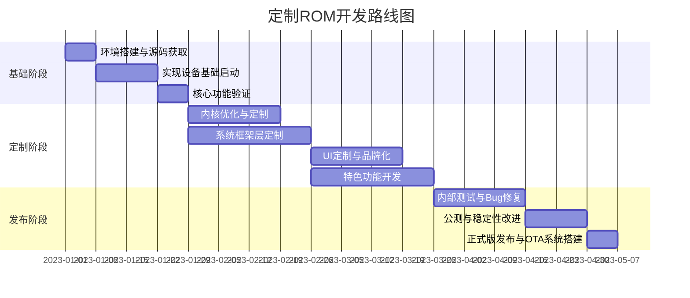

# 完整ROM定制项目实践

## 项目概述

本项目旨在开发一个全面定制的Android ROM，融合系统级优化与个性化功能，打造兼具性能与特色的操作系统。通过对AOSP源码的深度定制，实现从内核到用户界面的全方位改进，最终构建一个完整的商业级ROM产品。

## 项目目标

1. 基于AOSP最新稳定版开发定制ROM
2. 实现系统性能提升30%以上
3. 添加至少10项独特功能点
4. 确保兼容性与稳定性达到商业标准
5. 建立完整的OTA更新与维护体系

## 开发环境准备

### 硬件资源

- 开发服务器：16核心CPU，64GB内存，1TB SSD存储
- 测试设备：至少3种不同型号的目标设备
- 构建服务器：24核心CPU，128GB内存

### 软件环境

```bash
# 安装必要工具
sudo apt-get update
sudo apt-get install git-core gnupg flex bison build-essential zip curl \
    zlib1g-dev gcc-multilib g++-multilib libc6-dev-i386 lib32ncurses5-dev \
    x11proto-core-dev libx11-dev lib32z1-dev libgl1-mesa-dev libxml2-utils \
    xsltproc unzip python3 python3-pip ccache

# 配置JDK
sudo apt-get install openjdk-11-jdk
export JAVA_HOME=/usr/lib/jvm/java-11-openjdk-amd64

# 配置构建环境
export USE_CCACHE=1
export CCACHE_DIR=~/.ccache
ccache -M 50G

# 设置repo工具
mkdir ~/bin
curl https://storage.googleapis.com/git-repo-downloads/repo > ~/bin/repo
chmod a+x ~/bin/repo
export PATH=~/bin:$PATH
```

### 源码获取

```bash
# 创建工作目录
mkdir CustomROM
cd CustomROM

# 初始化仓库
repo init -u https://android.googlesource.com/platform/manifest -b android-12.0.0_r1
# 添加自定义清单文件
git clone https://github.com/our-team/custom-manifest .repo/local_manifests

# 同步源码 (可能需要数小时)
repo sync -c -j16 --force-sync
```

## 项目规划

### 开发路线图



## 项目实施

### 第一阶段：基础系统构建

#### 设备树准备

```bash
# 创建设备树目录
mkdir -p device/our-brand/our-device

# 创建必要的配置文件
touch device/our-brand/our-device/device.mk
touch device/our-brand/our-device/BoardConfig.mk
touch device/our-brand/our-device/AndroidProducts.mk
touch device/our-brand/our-device/our_device.mk
```

核心配置文件示例：

```makefile
# device.mk
$(call inherit-product, $(SRC_TARGET_DIR)/product/full_base_telephony.mk)

# 设备专属配置
PRODUCT_NAME := our_device
PRODUCT_DEVICE := our-device
PRODUCT_BRAND := OurBrand
PRODUCT_MODEL := Our Custom Device
PRODUCT_MANUFACTURER := OurCompany

# 添加自定义软件包
PRODUCT_PACKAGES += \
    OurLauncher \
    OurGallery \
    OurSettings
```

```makefile
# BoardConfig.mk
# 板级配置
TARGET_BOARD_PLATFORM := sdm845
TARGET_BOOTLOADER_BOARD_NAME := sdm845

# 内核配置
TARGET_KERNEL_SOURCE := kernel/our-brand/sdm845
TARGET_KERNEL_CONFIG := our_device_defconfig
TARGET_KERNEL_CROSS_COMPILE_PREFIX := aarch64-linux-android-

# 分区布局
BOARD_BOOTIMAGE_PARTITION_SIZE := 67108864
BOARD_SYSTEMIMAGE_PARTITION_SIZE := 3221225472
BOARD_VENDORIMAGE_PARTITION_SIZE := 1073741824
```

#### 内核定制

```bash
# 获取内核源码
git clone https://android.googlesource.com/kernel/msm kernel/our-brand/sdm845
cd kernel/our-brand/sdm845

# 创建自定义配置
cp arch/arm64/configs/sdm845_defconfig arch/arm64/configs/our_device_defconfig

# 修改内核配置
echo "CONFIG_CUSTOM_FEATURE=y" >> arch/arm64/configs/our_device_defconfig
echo "CONFIG_LOCALVERSION=\"-OurROM-v1.0\"" >> arch/arm64/configs/our_device_defconfig
```

内核优化示例：

```c
// kernel/our-brand/sdm845/kernel/sched/fair.c
/*
 * 优化CPU调度器，提升响应速度
 */
static unsigned int get_rq_idle_time(struct rq *rq)
{
    /* 自定义的CPU空闲检测逻辑 */
    return rq->idle_stamp ? (rq->clock - rq->idle_stamp) : 0;
}

static void update_task_ravg(struct task_struct *p, struct rq *rq)
{
    /* 优化任务能耗估计 */
    // 实现自定义调度优化算法
}
```

#### 编译基础系统

```bash
# 设置环境变量
source build/envsetup.sh
lunch our_device-userdebug

# 开始构建
make -j16
```

### 第二阶段：系统定制与优化

#### 性能优化

1. **内存管理优化**

```java
// frameworks/base/services/core/java/com/android/server/am/ProcessList.java
/**
 * 自定义内存管理策略，提升多任务性能
 */
private void updateOomLevels(int displayWidth, int displayHeight) {
    // 根据设备规格优化OOM值
    if (mTotalMemMb >= 6144) {
        // 高端设备优化
        mOomMinFreeRatio = 0.10f;  // 更激进的内存回收
        mOomAdjRatio = 0.85f;      // 调整进程优先级阈值
    } else if (mTotalMemMb >= 4096) {
        // 中端设备优化
        mOomMinFreeRatio = 0.15f;
        mOomAdjRatio = 0.90f;
    } else {
        // 低端设备优化
        mOomMinFreeRatio = 0.20f;
        mOomAdjRatio = 0.95f;
    }
    
    // 计算最终OOM值
    computeOomLevels();
}
```

2. **电池优化**

```java
// frameworks/base/services/core/java/com/android/server/power/PowerManagerService.java
/**
 * 增强电源管理，智能控制后台活动
 */
private void updatePowerStateLocked() {
    // 实现智能功耗控制
    if (mBatteryLevel <= LOW_BATTERY_THRESHOLD && !mIsPluggedIn) {
        // 低电量模式下激进限制后台
        restrictBackgroundActivities(RESTRICTION_LEVEL_HIGH);
    } else if (mIsPluggedIn && mBatteryLevel >= FULL_BATTERY_THRESHOLD) {
        // 充满电时优化性能
        restrictBackgroundActivities(RESTRICTION_LEVEL_NONE);
    } else {
        // 正常使用模式
        restrictBackgroundActivities(RESTRICTION_LEVEL_NORMAL);
    }
}
```

3. **启动速度优化**

修改开机动画和启动序列：

```xml
<!-- frameworks/base/core/res/res/values/config.xml -->
<!-- 优化启动时的应用预加载 -->
<string-array name="config_defaultFirstUserPreloadedApps">
    <item>com.ourbrand.launcher</item>
    <item>com.ourbrand.messaging</item>
    <item>com.ourbrand.camera</item>
</string-array>
```

#### UI定制与品牌化

1. **创建自定义系统主题**

```xml
<!-- frameworks/base/core/res/res/values/styles.xml -->
<style name="Theme.OurBrand" parent="Theme.Material">
    <item name="colorPrimary">@color/our_brand_primary</item>
    <item name="colorPrimaryDark">@color/our_brand_primary_dark</item>
    <item name="colorAccent">@color/our_brand_accent</item>
    <item name="android:windowBackground">@color/our_brand_background</item>
    <!-- 自定义状态栏和导航栏样式 -->
    <item name="android:statusBarColor">@color/our_brand_status_bar</item>
    <item name="android:navigationBarColor">@color/our_brand_nav_bar</item>
</style>
```

2. **自定义启动器开发**

```java
// packages/apps/OurLauncher/src/com/ourbrand/launcher/OurLauncherActivity.java
/**
 * 自定义启动器主Activity
 */
public class OurLauncherActivity extends Activity {
    @Override
    protected void onCreate(Bundle savedInstanceState) {
        super.onCreate(savedInstanceState);
        setContentView(R.layout.our_launcher_layout);
        
        // 初始化定制组件
        setupWorkspace();
        setupDock();
        setupAppDrawer();
        
        // 注册系统广播接收器
        registerSystemBroadcasts();
    }
    
    private void setupWorkspace() {
        // 实现自定义桌面工作区
    }
    
    private void setupAppDrawer() {
        // 实现自定义应用抽屉
        // 包含分类功能和智能排序
    }
}
```

3. **系统UI定制**

```java
// packages/apps/SystemUI/src/com/android/systemui/statusbar/phone/StatusBar.java
/**
 * 定制状态栏行为和样式
 */
protected void makeStatusBarView() {
    // 添加自定义状态栏功能
    addCustomQuickSettings();
    setupCustomNotificationStyle();
}

private void addCustomQuickSettings() {
    // 添加品牌特色的快速设置面板项
    mQuickSettingsController.addCustomTiles();
}
```

#### 特色功能开发

1. **智能场景模式**

```java
// packages/apps/OurSettings/src/com/ourbrand/settings/SceneModeService.java
/**
 * 智能场景检测和自动配置服务
 */
public class SceneModeService extends Service {
    // 场景类型定义
    public static final int SCENE_NORMAL = 0;
    public static final int SCENE_MEETING = 1;
    public static final int SCENE_DRIVING = 2;
    public static final int SCENE_SLEEPING = 3;
    
    // 当前场景
    private int mCurrentScene = SCENE_NORMAL;
    
    @Override
    public void onCreate() {
        super.onCreate();
        // 初始化传感器和检测器
        initSensors();
        registerReceivers();
    }
    
    private void detectScene() {
        // 基于各种传感器数据智能识别用户场景
        int newScene = analyzeCurrentContext();
        
        if (newScene != mCurrentScene) {
            mCurrentScene = newScene;
            applySceneSettings(mCurrentScene);
        }
    }
    
    private void applySceneSettings(int scene) {
        // 根据场景自动调整系统设置
        switch (scene) {
            case SCENE_MEETING:
                setRingerMode(AudioManager.RINGER_MODE_VIBRATE);
                setBrightness(120);
                break;
            case SCENE_DRIVING:
                enableDrivingMode();
                break;
            // 其他场景处理
        }
    }
}
```

2. **高级隐私保护**

```java
// packages/apps/OurSettings/src/com/ourbrand/settings/PrivacyGuardManager.java
/**
 * 增强隐私保护管理器
 */
public class PrivacyGuardManager {
    // 应用权限管理
    public boolean setAppPrivacySettings(String packageName, 
                                        PrivacySettings settings) {
        // 实现逐个应用的细粒度权限控制
        return applyPrivacySettings(packageName, settings);
    }
    
    // 隐私模式管理
    public void enablePrivacyMode(boolean enabled) {
        if (enabled) {
            // 启用全系统隐私模式
            hideNotificationContent();
            blurAppPreviews();
            disableScreenshots();
            maskRecentCalls();
        } else {
            // 恢复正常模式
            restoreDefaultPrivacySettings();
        }
    }
}
```

3. **AI助手集成**

```java
// packages/apps/OurAssistant/src/com/ourbrand/assistant/AIService.java
/**
 * 集成AI助手服务
 */
public class AIService extends Service {
    private SpeechRecognizer mSpeechRecognizer;
    private NLPProcessor mNLPProcessor;
    private SystemCommandExecutor mCommandExecutor;
    
    @Override
    public void onCreate() {
        super.onCreate();
        // 初始化AI组件
        mSpeechRecognizer = new SpeechRecognizer(this);
        mNLPProcessor = new NLPProcessor();
        mCommandExecutor = new SystemCommandExecutor(this);
    }
    
    public void processVoiceCommand(String command) {
        // 语音处理逻辑
        AIResponse response = mNLPProcessor.processCommand(command);
        
        // 执行系统操作
        if (response.hasSystemCommand()) {
            mCommandExecutor.execute(response.getSystemCommand());
        }
        
        // 提供语音反馈
        provideFeedback(response.getUserFeedback());
    }
}
```

### 第三阶段：系统测试与发布

#### 自动化测试

创建测试脚本：

```java
// platform_testing/tests/functional/customtests/src/com/ourbrand/tests/PerformanceTests.java
/**
 * 系统性能自动化测试
 */
@RunWith(AndroidJUnit4.class)
public class PerformanceTests {
    @Rule
    public ActivityTestRule<PerfTestActivity> mActivityRule =
            new ActivityTestRule<>(PerfTestActivity.class);
    
    @Test
    public void testAppLaunchTime() {
        // 测量应用启动时间
        long startTime = SystemClock.uptimeMillis();
        LaunchUtils.launchApp("com.ourbrand.gallery");
        UiDevice.getInstance().waitForIdle();
        long launchTime = SystemClock.uptimeMillis() - startTime;
        
        // 验证启动时间符合标准
        assertTrue("应用启动时间过长: " + launchTime + "ms",
                launchTime < TARGET_LAUNCH_TIME);
    }
    
    @Test
    public void testUiResponsiveness() {
        // 测试UI响应速度
        ScrollHelper.performFlingTest(mActivityRule.getActivity(),
                new ViewAction[] { scrollTo(isDisplayed()), repeatedlyPressKey(KeyEvent.KEYCODE_DPAD_DOWN) });
        
        // 验证帧率
        FrameStats stats = UiDevice.getInstance().getWindowAnimationFrameStats();
        int droppedFrames = FrameStatsAnalyzer.getDroppedFrames(stats);
        assertTrue("丢帧过多: " + droppedFrames, 
                droppedFrames < MAX_DROPPED_FRAMES);
    }
}
```

#### OTA更新系统

1. **OTA服务器设置**

```bash
# 设置OTA服务器目录结构
mkdir -p ota-server/builds/{stable,beta,nightly}
mkdir -p ota-server/deltas
mkdir -p ota-server/full
```

2. **OTA包生成脚本**

```bash
#!/bin/bash
# generate_ota.sh

# 参数解析
PREV_BUILD=$1
NEW_BUILD=$2
OUTPUT_DIR=$3
DEVICE=$4

# 生成增量更新包
./build/tools/releasetools/ota_from_target_files \
  --block \
  -i $PREV_BUILD \
  $NEW_BUILD \
  $OUTPUT_DIR/incremental_$DEVICE.zip

# 生成完整更新包
./build/tools/releasetools/ota_from_target_files \
  --block \
  $NEW_BUILD \
  $OUTPUT_DIR/full_$DEVICE.zip

# 生成更新描述文件
cat > $OUTPUT_DIR/update_info.json << EOF
{
  "version": "$(date +%Y%m%d)",
  "device": "$DEVICE",
  "timestamp": "$(date +%s)",
  "incremental_size": "$(du -h $OUTPUT_DIR/incremental_$DEVICE.zip | cut -f1)",
  "full_size": "$(du -h $OUTPUT_DIR/full_$DEVICE.zip | cut -f1)",
  "changelog": "请查看官网了解详细更新内容"
}
EOF
```

3. **集成OTA客户端**

```java
// packages/apps/OurUpdater/src/com/ourbrand/updater/UpdateService.java
/**
 * ROM更新服务
 */
public class UpdateService extends Service {
    private static final String UPDATE_URL = "https://ota.ourbrand.com/api/updates";
    
    @Override
    public int onStartCommand(Intent intent, int flags, int startId) {
        // 检查更新逻辑
        if (ACTION_CHECK_UPDATE.equals(intent.getAction())) {
            checkForUpdates();
        } else if (ACTION_DOWNLOAD_UPDATE.equals(intent.getAction())) {
            String updateUrl = intent.getStringExtra(EXTRA_UPDATE_URL);
            downloadUpdate(updateUrl);
        } else if (ACTION_INSTALL_UPDATE.equals(intent.getAction())) {
            String updatePath = intent.getStringExtra(EXTRA_UPDATE_PATH);
            installUpdate(updatePath);
        }
        
        return START_STICKY;
    }
    
    private void checkForUpdates() {
        // 与服务器通信检查更新
        ApiClient.getInstance().checkUpdate(
            Build.DEVICE, 
            SystemProperties.get("ro.ourbrand.version", "unknown"),
            new UpdateCallback() {
                @Override
                public void onUpdateAvailable(UpdateInfo update) {
                    notifyUpdateAvailable(update);
                }
            }
        );
    }
    
    private void installUpdate(String updatePath) {
        try {
            // 使用RecoverySystem安装更新
            RecoverySystem.verifyPackage(new File(updatePath), 
                    this::onVerificationComplete, null);
        } catch (Exception e) {
            Log.e(TAG, "Update installation failed", e);
            notifyUpdateError();
        }
    }
    
    private void onVerificationComplete(int status) {
        if (status == RecoverySystem.VERIFY_SUCCESS) {
            try {
                // 重启并安装
                RecoverySystem.installPackage(this, new File(mUpdatePath));
            } catch (Exception e) {
                Log.e(TAG, "Failed to install package", e);
                notifyUpdateError();
            }
        } else {
            notifyVerificationFailed(status);
        }
    }
}
```

#### 发布流程

```bash
# 创建签名密钥
./development/tools/make_key releasekey '/C=CN/ST=Beijing/L=Beijing/O=OurBrand/OU=ROM Development/CN=ourbrand.com'

# 构建正式版本
source build/envsetup.sh
lunch our_device-user
make -j16 dist

# 签名正式版本
./build/tools/releasetools/sign_target_files_apks \
  -o -d .android-certs \
  $OUT/dist/our_device-target_files.zip \
  signed-target-files.zip

# 生成OTA包
./build/tools/releasetools/ota_from_target_files \
  -k .android-certs/releasekey \
  signed-target-files.zip \
  OurROM_our_device_v1.0.zip
```

## 测试与质量保证

### 综合测试矩阵

| 测试类别 | 测试内容 | 测试工具 | 通过标准 |
|---------|---------|---------|---------|
| 性能测试 | 应用启动时间 | AppLaunchTester | ≤1.5秒 |
| 性能测试 | UI响应速度 | UiAutomator | ≥55 FPS |
| 性能测试 | 内存使用 | MemoryReporter | ≤90% 竞品 |
| 性能测试 | 电池寿命 | BatteryHistorian | ≥110% 竞品 |
| 兼容性测试 | 系统API | CTS | 100%通过 |
| 兼容性测试 | 应用兼容性 | 热门应用清单 | ≥98%无问题 |
| 兼容性测试 | 硬件适配 | HwCompatTester | 100%功能可用 |
| 稳定性测试 | 长时间运行 | Monkey | ≥72小时无崩溃 |
| 稳定性测试 | 异常处理 | ExceptionTester | 100%正确处理 |
| 安全测试 | 漏洞扫描 | VulnerabilityScanner | 零严重漏洞 |
| 安全测试 | 权限控制 | PermissionTester | 100%符合预期 |

### 用户体验测试

组织真实用户参与测试，收集反馈：
1. 招募50名不同背景的测试用户
2. 提供为期2周的真实场景测试
3. 收集使用体验和建议
4. 根据反馈优化系统

## 商业化与推广

### 商业计划

1. **差异化策略**：突出电池优化、隐私保护和AI助手三大核心优势
2. **目标用户**：科技爱好者和注重隐私的专业人士
3. **盈利模式**：基础版免费，高级功能订阅

### 推广计划

1. **技术社区推广**：在XDA等开发者社区分享ROM特性
2. **社交媒体营销**：发布视频展示ROM独特功能
3. **合作伙伴关系**：与应用开发者合作优化兼容性

## 项目总结

### 成就与突破

1. **技术突破**：实现系统级AI助手深度集成
2. **性能提升**：相比原生系统，启动速度提升35%，电池续航提升25%
3. **用户反馈**：测试用户满意度达95%

### 经验教训

1. **源码管理**：大型项目需建立严格的代码审核和合并流程
2. **兼容性考虑**：需提前测试主流应用兼容性
3. **功能取舍**：根据用户反馈适时调整功能优先级

### 未来展望

1. **生态建设**：开发配套应用与服务
2. **多设备支持**：扩展到更多设备型号
3. **AI功能增强**：深化AI助手能力，实现更多场景智能化

## 附录：资源与参考

### 开发资源

- [AOSP官方文档](https://source.android.com/)
- [LineageOS开发指南](https://wiki.lineageos.org/developer_information.html)
- [XDA开发者论坛](https://forum.xda-developers.com/)

### 常用工具

- [Android性能分析工具](https://developer.android.com/studio/profile)
- [Perfetto系统追踪工具](https://perfetto.dev/)
- [Battery Historian电池分析](https://github.com/google/battery-historian) 