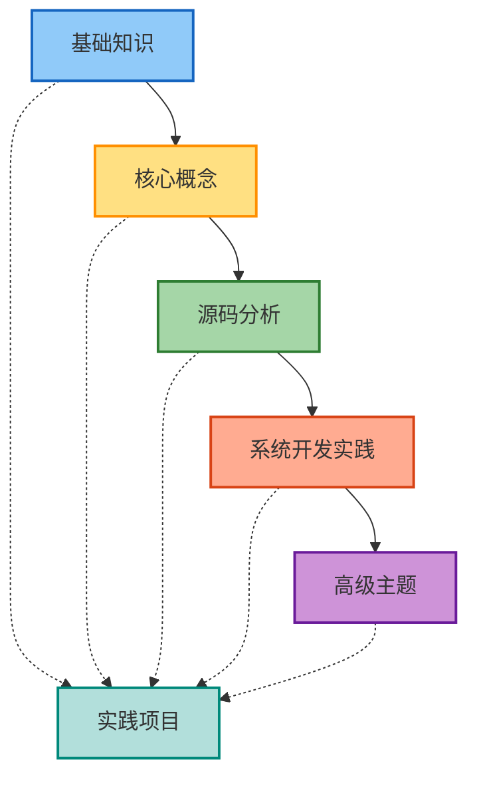

# Android Framework 开发学习进阶体系

> 本体系采用"父子文档"结构，主文档负责导航与总览，详细内容请参见各阶段/专题子文档。

---

## 学习路径与文档导航

### 第一阶段：基础知识准备
- [Framework基础入门](./Framework基础入门.md)

### 第二阶段：Framework 核心概念
- [Binder机制详解](./Binder机制详解.md)
- [Handler消息机制](./Handler消息机制.md)
- [系统服务概览](./系统服务概览.md)

### 第三阶段：Framework 源码分析
- [系统启动流程](./系统启动流程.md)
- [应用启动流程](./应用启动流程.md)
- [UI渲染机制](./UI渲染机制.md)
- [输入事件处理](./输入事件处理.md)

### 第四阶段：系统开发实践
- [开发环境搭建与调试](./开发环境搭建与调试.md)
- [系统服务开发实践](./系统服务开发实践.md)
- [HAL层开发与HIDL](./HAL层开发与HIDL.md)
- [性能优化实践](./性能优化实践.md)

### 第五阶段：高级主题
- [系统安全机制](./系统安全机制.md)
- [系统更新与OTA](./系统更新与OTA.md)
- [定制ROM开发](./定制ROM开发.md)

---

## 实践项目
- [自定义系统服务项目实践](./自定义系统服务项目实践.md)
- [SystemUI定制项目实践](./SystemUI定制项目实践.md)
- [系统优化项目实践](./系统优化项目实践.md)
- [完整ROM定制项目实践](./完整ROM定制项目实践.md)

---

## 进阶路线图

---

## 学习建议

1. **循序渐进**：建议按阶段逐步学习，打好基础再进阶。
2. **动手实践**：每学一阶段，结合实践项目加深理解。
3. **多读源码**：AOSP源码是最权威的学习资料。
4. **问题导向**：遇到问题时深入查阅相关子文档。
5. **持续更新**：体系会根据Android发展持续完善。

---

## 贡献与反馈

欢迎对本学习体系提出建议和改进意见，可以通过以下方式：
- 提交 Issue
- 发起 Pull Request
- 联系项目维护者

---

*注意：本主文档仅作导航与总览，详细内容请参见各子文档。* 