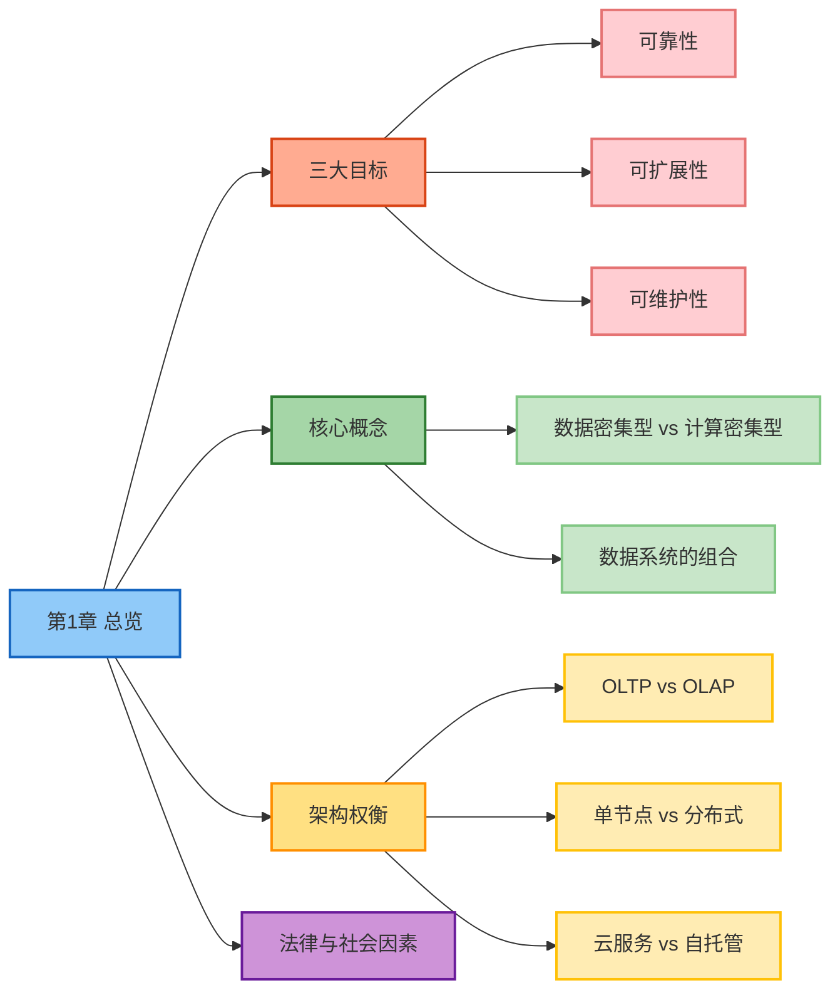
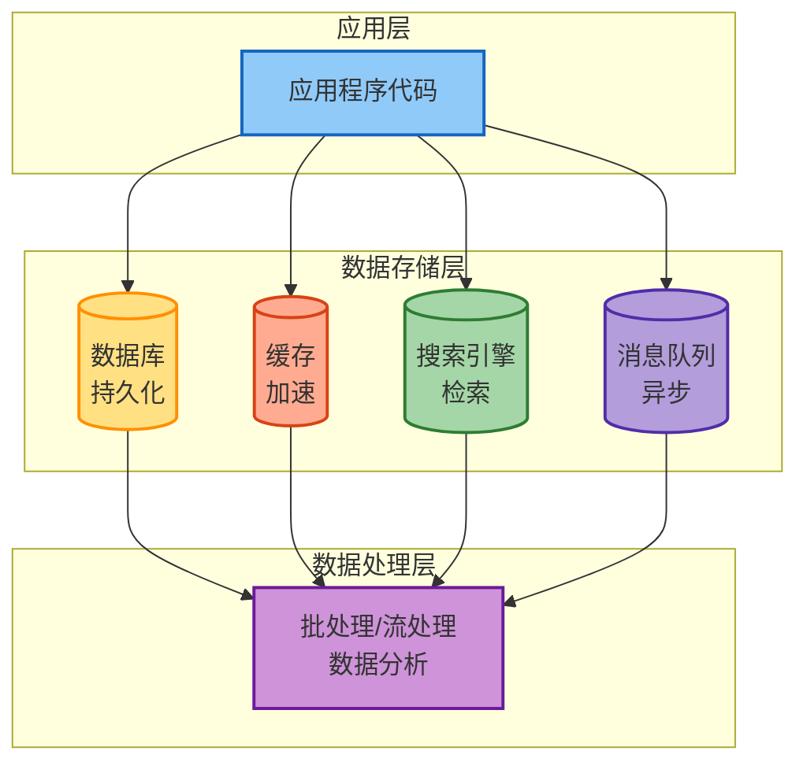
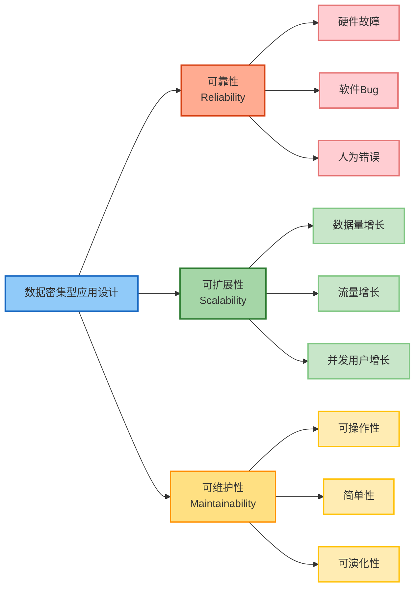

# 第1章 可靠性、可扩展性与可维护性

> 本章基于 [DDIA 中文翻译](https://ddia.vonng.com/ch1/) 整理

## 章节概览

## 核心概念

### 什么是数据密集型应用

当数据存储与处理成为系统主要挑战时，该系统就是**数据密集型**应用。与"计算密集型"不同，这类系统关注的是**大规模数据的存储、变化管理、一致性和高可用性设计**。

### 数据系统的构成

数据密集型应用通常由多个系统组合而成：

| 组件 | 作用 |
|------|------|
| 数据库 | 持久存储数据 |
| 缓存 | 加速频繁访问 |
| 搜索引擎/索引 | 支持复杂搜索 |
| 流处理 | 实时事件处理 |
| 批处理 | 周期性处理大量数据 |

## 三大设计目标

### 可靠性（Reliability）

系统在发生故障时仍能正确工作，包括应对：
- 硬件故障
- 软件 Bug
- 人为错误

> **故障（fault）不可避免，但失败（failure）是可以避免的。**

### 可扩展性（Scalability）

系统在负载增长时仍能保持性能。需要关注：
- 数据量增长
- 流量增长
- 并发用户数增长

**性能衡量指标**：推荐使用百分位延迟（p50/p95/p99）而非平均值，因为平均值会掩盖尾部延迟问题。

### 可维护性（Maintainability）

包含三个方面：
- **可操作性**：易监控、易诊断、易恢复
- **简单性**：降低系统复杂度
- **可演化性**：面对需求变化可调整

## 架构权衡

### 事务型系统 vs 分析型系统

| 特性 | OLTP（事务型） | OLAP（分析型） |
|------|---------------|---------------|
| 访问模式 | 点查询（读/写少量记录） | 聚合查询（扫描大量数据） |
| 典型用途 | 实时业务操作 | 商业分析、报表 |
| 数据大小 | 中等 | 通常很大 |
| 延迟要求 | 毫秒级 | 秒/分钟级 |
| 优化目标 | 响应时间 | 数据吞吐量 |

两者常分离部署以避免互相影响性能。

### 单节点系统 vs 分布式系统

| 维度 | 单机系统 | 分布式系统 |
|------|---------|-----------|
| 复杂性 | 低 | 高 |
| 可扩展性 | 有限 | 强 |
| 容错性 | 弱 | 强 |
| 适用场景 | 小负载 | 海量负载 |

> **不要为了"看起来高级"而做分布式。** 分布式是被"逼出来的"选择。

### 云服务 vs 自托管

**云服务**：
- 优势：自动扩缩、内建高可用、降低运维成本
- 劣势：成本不可预测、控制性有限

**自托管**：
- 优势：高可控、可自定义优化
- 劣势：运维复杂、弹性资源较弱

## 数据系统与社会

现代系统设计还需考虑：
- 数据隐私与安全合规（如 GDPR）
- 用户权利与审计要求
- 社会影响与伦理问题

## 核心理念

- 系统设计的核心是理解各种选择的利弊，在需求和资源之间找到最合适的平衡点
- 没有完美方案，只有权衡
- 简单，是一种长期竞争力
