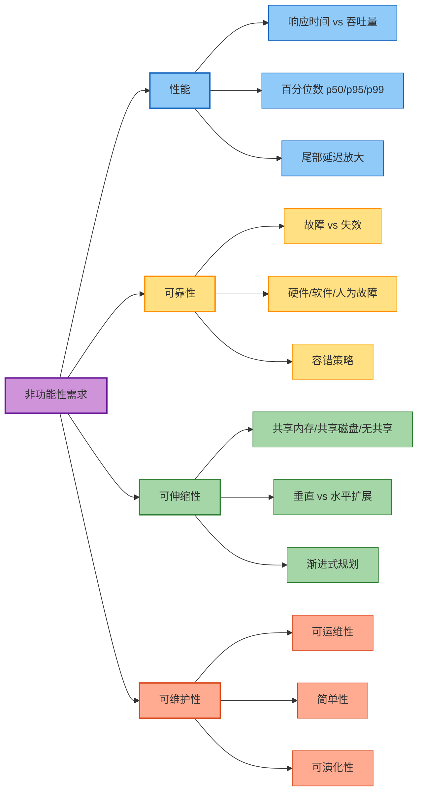
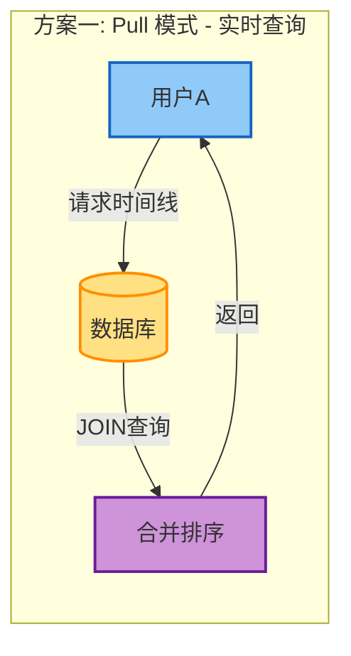
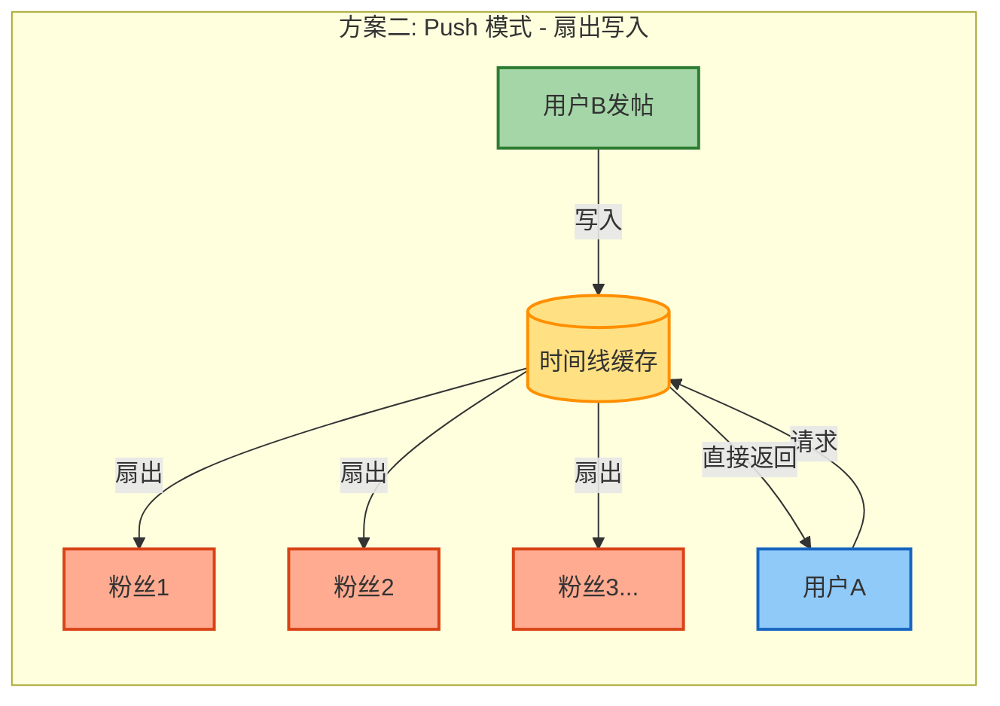
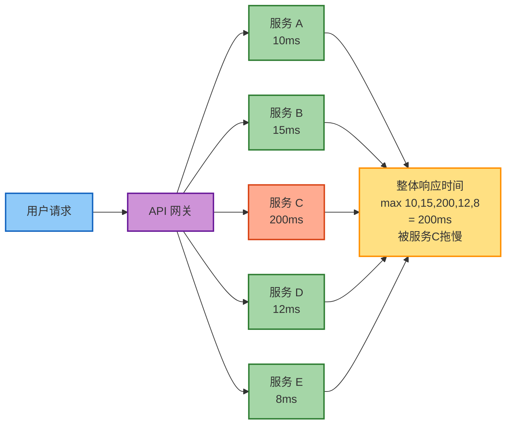
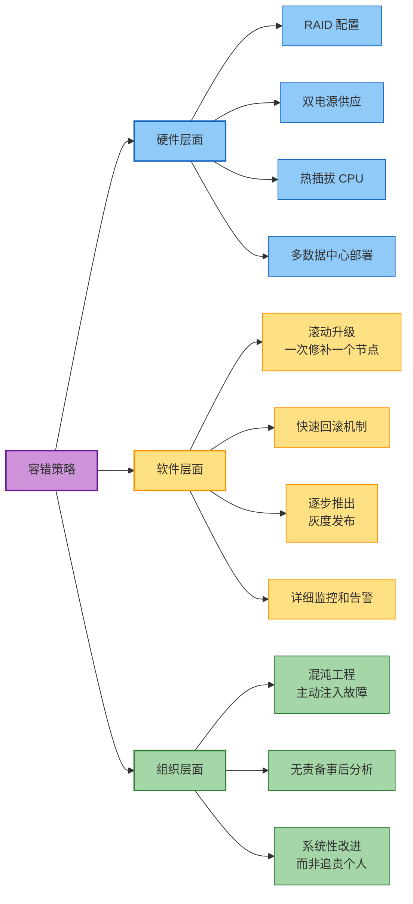
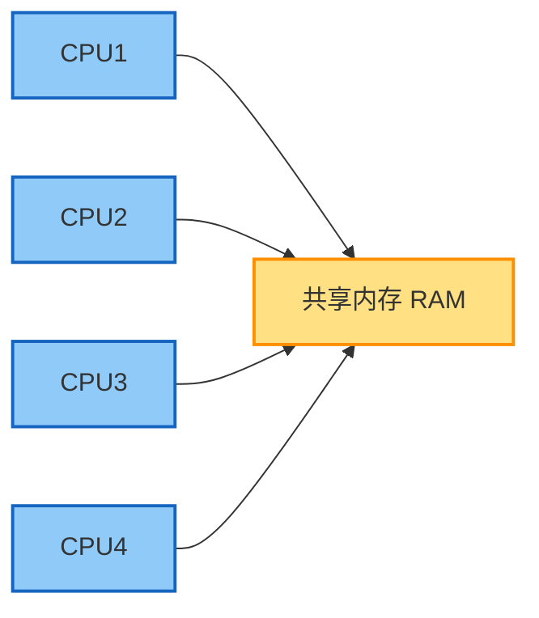
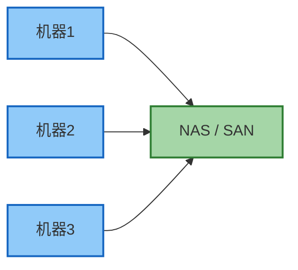
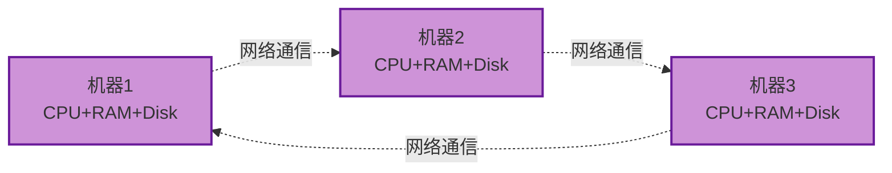
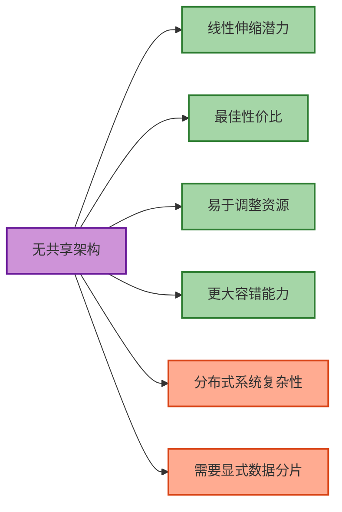
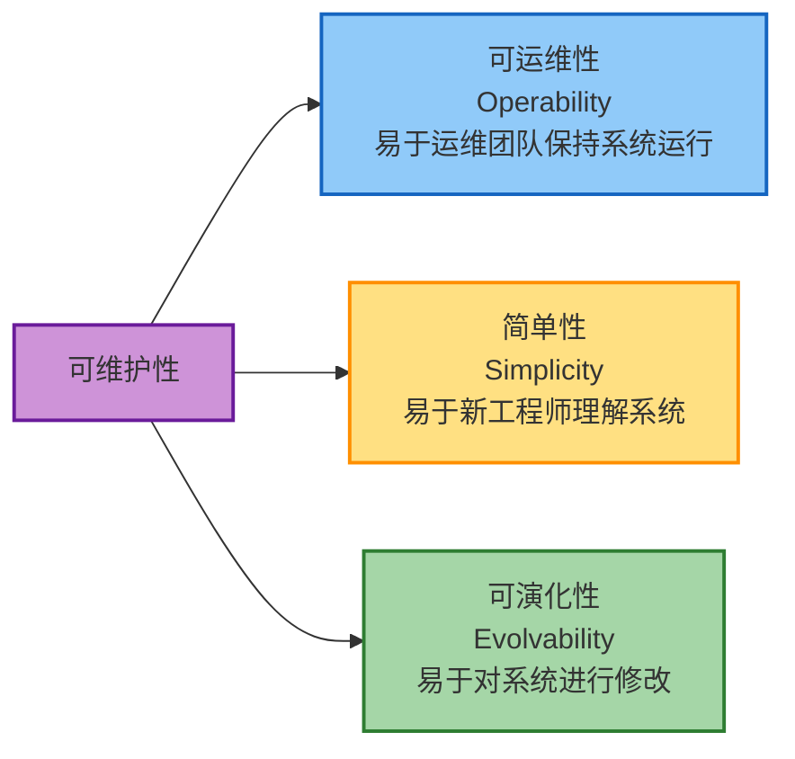

# 第2章 定义非功能性需求

> 本章基于 [DDIA 中文翻译](https://ddia.vonng.com/ch2/) 整理

## 章节概览



**核心理念**：
- 用百分位数而非平均值衡量性能
- 构建能容忍故障的系统，而非追求零故障
- 不要过度设计，单机能解决就不要分布式
- 简单性是长期可维护的基础

## 概述

本章通过一个社交网络案例，深入探讨数据系统的四大非功能性需求：**性能**、**可靠性**、**可伸缩性**、**可维护性**。

## 案例研究：社交网络时间线

### 问题背景

设计一个类似 Twitter 的社交网络时间线系统：

| 指标 | 数值 |
|------|------|
| 日发帖量 | 5 亿条 |
| 平均发帖速率 | 5,700 条/秒 |
| 峰值发帖速率 | 150,000 条/秒 |
| 用户平均关注数 | 200 人 |
| 用户平均粉丝数 | 200 人 |
| 极端案例 | 名人粉丝超 1 亿 |

### 两种实现方案





#### 方案一：实时查询（Pull 模式）

```
用户请求时间线 → 查询所有关注者的帖子 → 合并排序 → 返回
```

**问题分析**：
- 1000 万用户在线，每 5 秒查询一次 → 每秒 200 万次查询
- 每次查询需要 JOIN 三个表并排序
- 数据库压力：每秒 4 亿次查找

#### 方案二：物化视图（Push 模式 / 扇出）

```
用户发帖 → 写入所有粉丝的时间线缓存 → 粉丝直接读取缓存
```

**性能对比**：
- 写入负载：5,700 帖子/秒 × 200 粉丝 = 114 万次写入/秒
- 相比 4 亿次查找，显著降低读取压力

**极端情况处理**：
- 名人账户：单独存储，读取时与物化时间线合并
- 关注过多：可丢弃部分写入，只显示样本

### 核心启示

> 没有放之四海而皆准的方案，需要根据具体负载特征选择合适的架构。

## 描述性能

### 响应时间的组成

```
响应时间 = 服务时间 + 排队延迟 + 网络延迟
```

| 概念 | 定义 |
|------|------|
| 响应时间 | 客户端看到的总时间 |
| 服务时间 | 系统主动处理请求的时间 |
| 排队延迟 | 请求等待处理的时间 |
| 网络延迟 | 请求/响应在网络中传输的时间 |

### 为什么不用平均值

平均值会掩盖异常值，应使用**百分位数**：

| 百分位 | 含义 | 用途 |
|--------|------|------|
| p50（中位数） | 50% 请求低于此值 | 典型用户体验 |
| p95 | 95% 请求低于此值 | 大多数用户体验 |
| p99 | 99% 请求低于此值 | 识别严重问题 |
| p99.9 | 99.9% 请求低于此值 | 高价值用户体验 |

### 尾部延迟放大

在微服务架构中，一个用户请求可能调用多个后端服务：



> 只需一个慢调用就能拖慢整个请求。后端服务越多，出现慢调用的概率越高。

### SLA/SLO 示例

```
SLO 定义：
- 中位响应时间 < 200ms
- p99 响应时间 < 1s
- 99.9% 请求返回非错误响应
```

## 可靠性与容错

### 故障 vs 失效

| 概念 | 定义 | 示例 |
|------|------|------|
| 故障（Fault） | 单个组件偏离规格 | 一块硬盘损坏 |
| 失效（Failure） | 整个系统停止服务 | 网站无法访问 |

> **目标**：构建能容忍故障的系统，防止故障演变为失效。

### 故障类型与频率

#### 硬件故障

| 组件 | 年故障率 |
|------|----------|
| 磁性硬盘 | 2-5% |
| SSD | 0.5-1%（但不可纠正错误率更高） |
| CPU | ~0.1% 机器有偶发计算错误 |
| 内存 | >1% 机器每年遇到不可纠正的 ECC 错误 |

#### 软件故障

特点：**高度相关性**，同一 bug 可能同时影响所有节点

典型案例：
- 闰秒导致 Java 应用挂起
- SSD 在 32,768 小时后突然失效
- 级联故障：一个组件过载导致连锁反应

#### 人为错误

> 配置错误是系统故障的主要原因之一。

### 容错策略



## 可伸缩性

### 三种架构模式

#### 共享内存架构



#### 共享磁盘架构



#### 无共享架构



| 架构 | 特点 | 优势 | 劣势 |
|------|------|------|------|
| 共享内存 | 多核共享 RAM | 线程间通信简单 | 成本增长快于线性 |
| 共享磁盘 | 多机共享 NAS/SAN | 存储集中管理 | 争用和锁定开销 |
| 无共享 | 完全独立节点 | 线性伸缩、高性价比 | 需要显式分片 |

### 无共享架构的优势



### 伸缩性原则

1. **组件分解**：将系统分解为可独立运行的较小组件
2. **务实混合**：如果单机能完成工作，不要过度设计
3. **渐进规划**：通常不值得提前规划超过一个数量级的伸缩需求

> "如果单机数据库可以完成工作，它可能比复杂的分布式设置更可取。"

## 可维护性

### 三个维度



### 可运维性

系统应提供：
- 监控工具和可观测性支持
- 避免对单个机器的依赖
- 良好的文档和操作模型
- 合理的默认配置，允许管理员覆盖
- 适当的自我修复能力
- 可预测的行为，最小化意外

**自动化的平衡**：
> 大规模系统中自动化必不可少，但自动化系统出错时比手动系统更难排除故障。

### 简单性

**复杂性的代价**：
- 减慢开发速度
- 增加维护成本
- 提高错误风险

**抽象的价值**：
- 高级语言隐藏机器代码
- SQL 隐藏磁盘数据结构和并发处理
- 设计模式提供通用解决方案

> 良好的抽象隐藏实现细节，提供干净易懂的外观。

### 可演化性

**变化的必然性**：
- 学习新事实、发现新用例
- 业务优先级变化
- 新平台取代旧平台
- 法规要求变化
- 系统增长迫使架构变化

**提升可演化性**：
- 松散耦合：简单系统比紧密耦合系统更容易修改
- 最小化不可逆性：保持回退能力
- 敏捷实践：TDD、重构等

## 核心理念

- 用百分位数而非平均值衡量性能
- 构建能容忍故障的系统，而非追求零故障
- 不要过度设计，单机能解决就不要分布式
- 简单性是长期可维护的基础
