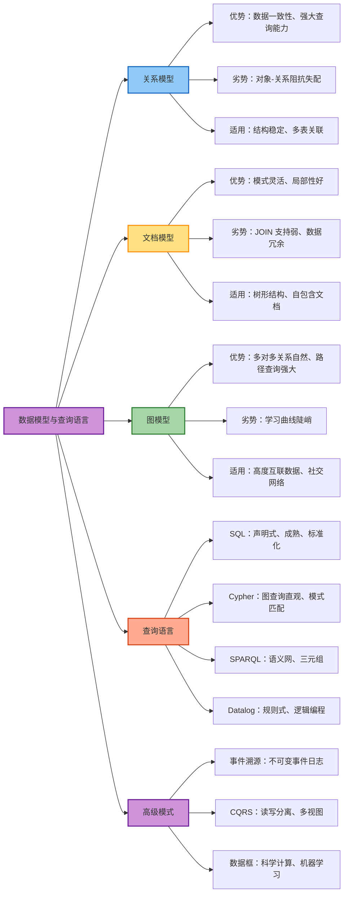
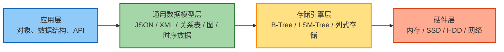
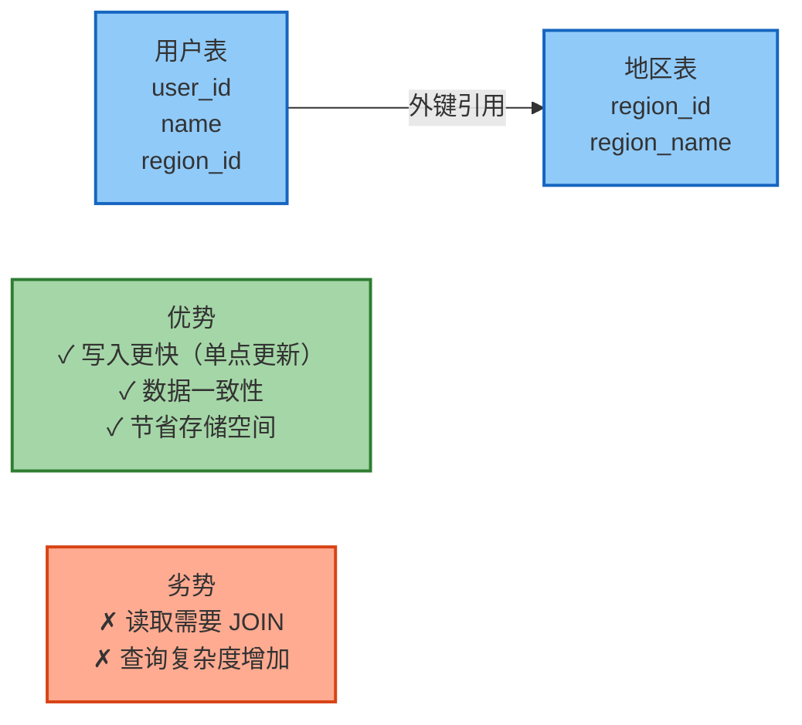
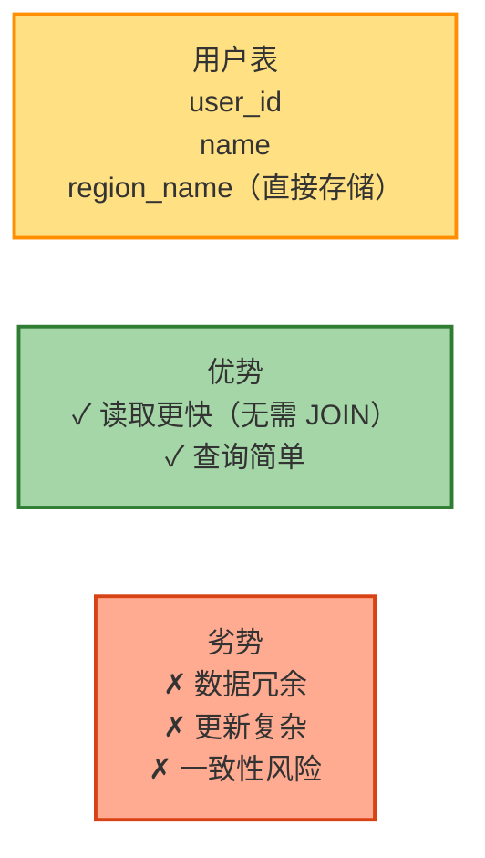
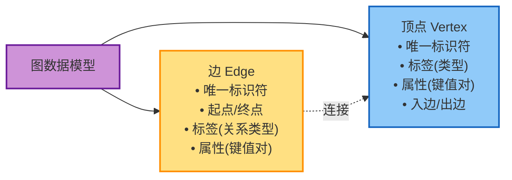
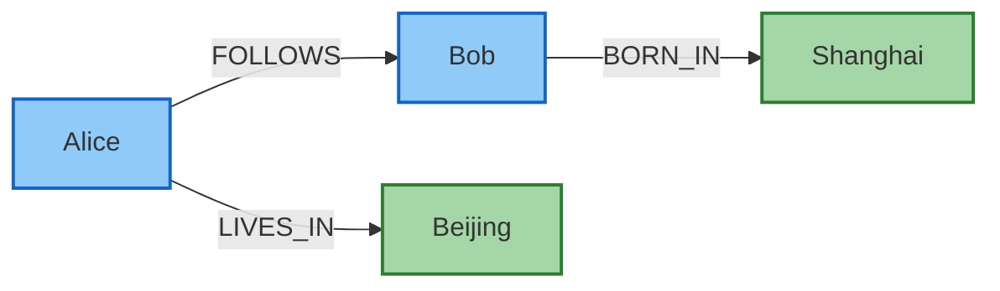
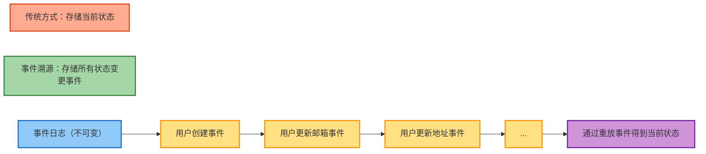
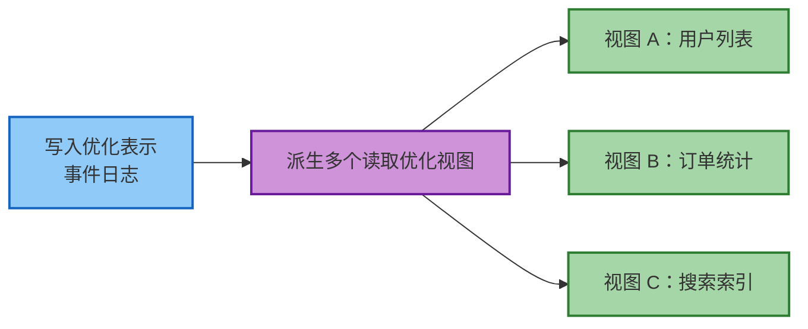
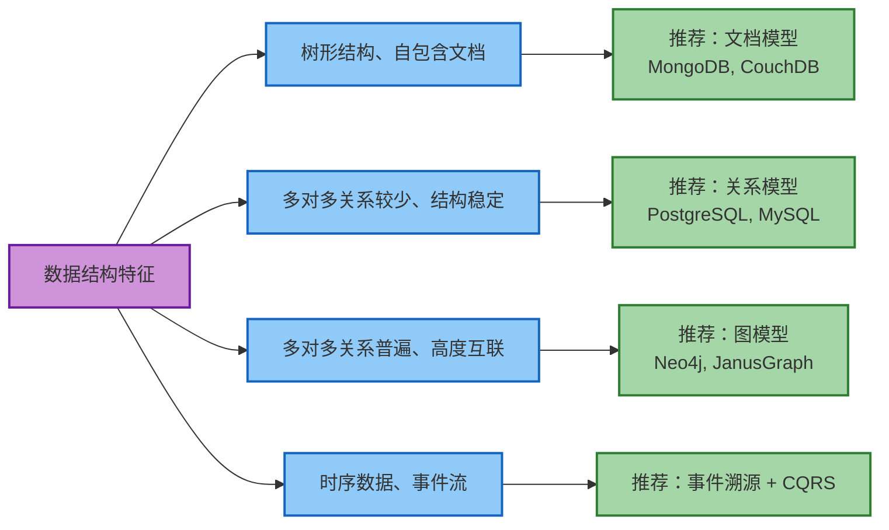
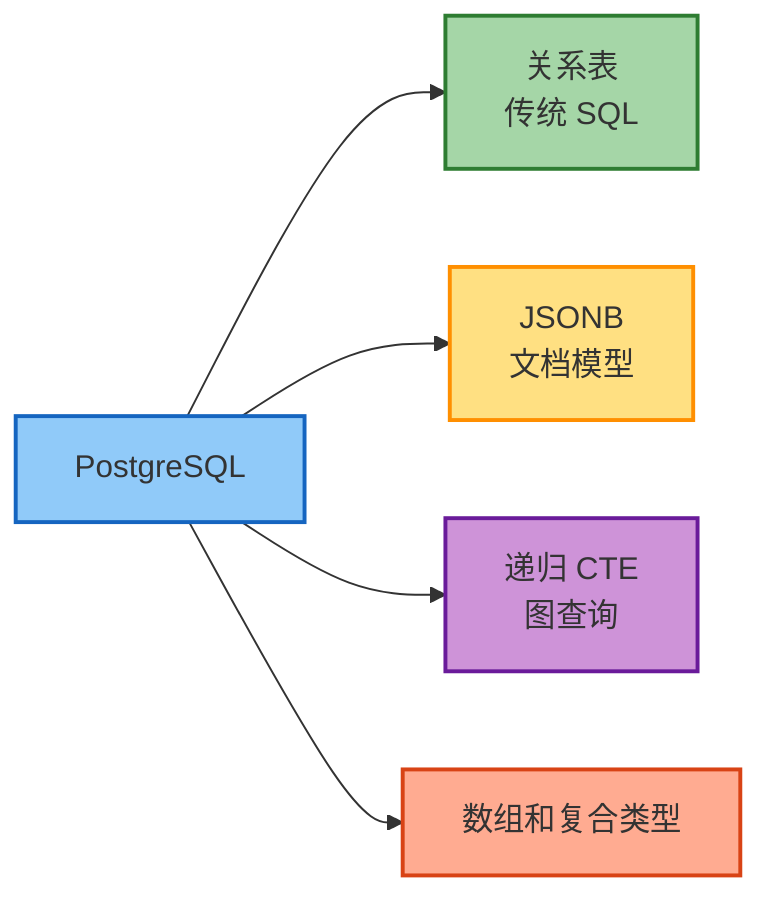

# 第3章 数据模型与查询语言

> 本章基于 [DDIA 中文翻译](https://ddia.vonng.com/ch3/) 整理

## 章节概览



## 概述

数据模型是软件开发中最重要的部分，因为它们不仅影响软件的编写方式，还影响我们思考问题的方式。

### 数据模型的抽象层次



## 关系模型 vs 文档模型

### 关系模型的特点

| 特性 | 说明 |
|------|------|
| 提出时间 | 1970 年（Edgar Codd） |
| 核心概念 | 关系（表）包含元组（行） |
| 主要应用 | 商业数据处理、事务处理、批处理 |
| 优势 | 数据一致性、强大的查询能力、成熟的生态 |
| 劣势 | 对象-关系阻抗失配 |

### 对象-关系阻抗失配

面向对象编程与关系表之间存在不匹配：


**ORM 框架的局限**：
- 无法完全隐藏模型差异
- 可能生成低效查询（N+1 问题）
- 对多样化数据系统支持有限

### 文档模型的优势

以 LinkedIn 个人资料为例：

```json
{
  "user_id": 123,
  "name": "张三",
  "positions": [
    {"company": "A公司", "title": "工程师", "years": "2020-2022"},
    {"company": "B公司", "title": "高级工程师", "years": "2022-至今"}
  ],
  "education": [
    {"school": "某大学", "degree": "学士", "year": 2020}
  ]
}
```

**优势**：
- 更好的局部性（树形结构数据）
- 减少阻抗失配
- 模式灵活性（schema-on-read）

### 规范化 vs 反规范化

#### 规范化（Normalization）



#### 反规范化（Denormalization）



### 模式灵活性对比

| 特性 | Schema-on-Write（关系型） | Schema-on-Read（文档型） |
|------|---------------------------|-------------------------|
| 模式定义 | 数据库强制执行 | 应用代码隐式处理 |
| 数据验证 | 写入时验证 | 读取时验证 |
| 灵活性 | 较低 | 较高 |
| 适用场景 | 结构稳定的数据 | 异构数据、频繁变化的结构 |
| 类比 | 静态类型语言 | 动态类型语言 |

## 图数据模型

当多对多关系非常普遍时，图模型成为自然选择。

### 图的基本组成



**示例：社交网络图**



### 属性图示例

```
顶点：
(person:Person {name: "张三", age: 30})
(location:Location {name: "北京", type: "city"})

边：
(person) -[:LIVES_IN]-> (location)
(person) -[:BORN_IN]-> (location)
```

### 图查询语言对比

#### Cypher（Neo4j）

```cypher
MATCH (person:Person) -[:BORN_IN]-> () -[:WITHIN*0..]-> (us:Location {name:'United States'})
RETURN person.name
```

**特点**：
- 使用箭头符号表示关系
- 模式匹配语法直观
- 支持可变长度路径（`*0..`）

#### SQL 递归查询

```sql
WITH RECURSIVE in_usa(vertex_id) AS (
  SELECT vertex_id FROM vertices WHERE properties->>'name' = 'United States'
  UNION
  SELECT edges.tail_vertex FROM edges
    JOIN in_usa ON edges.head_vertex = in_usa.vertex_id
    WHERE edges.label = 'within'
)
SELECT vertices.properties->>'name'
FROM vertices
  JOIN in_usa ON vertices.vertex_id = in_usa.vertex_id
WHERE vertices.label = 'Person';
```

**特点**：
- 使用递归 CTE
- 语法复杂
- 需要显式处理递归逻辑

#### SPARQL（RDF/三元组存储）

```sparql
PREFIX : <urn:example:>
SELECT ?personName WHERE {
  ?person :name ?personName.
  ?person :bornIn / :within* ?location.
  ?location :name "United States".
}
```

**特点**：
- 基于主语-谓语-宾语三元组
- 路径查询使用 `/` 和 `*`
- 语义网标准

#### Datalog

```datalog
within_recursive(Location, Name) :- name(Location, Name).
within_recursive(Location, Name) :- within(Location, Via),
                                     within_recursive(Via, Name).

born_in_usa(Person, Name) :- born_in(Person, Location),
                              within_recursive(Location, 'United States'),
                              name(Person, Name).
```

**特点**：
- 基于规则的逻辑编程
- 通过规则组合构建复杂查询
- 增量式定义查询逻辑

## 事件溯源与 CQRS

### 事件溯源（Event Sourcing）



**优势**：
- 完整的审计日志
- 时间旅行调试
- 捕获用户意图
- 可重现的视图

**挑战**：
- 外部数据处理
- 个人数据删除要求（GDPR）

### CQRS（命令查询职责分离）



**核心思想**：
- 分离写入和读取的数据表示
- 每个视图针对特定查询模式优化
- 从事件日志派生物化视图

**优势**：
- 灵活的查询优化
- 易于添加新视图
- 系统演化更容易

## 数据框与数组

### 数据框（Dataframe）

数据框是关系数据库与科学计算的桥梁：

| 特性 | 关系表 | 数据框 |
|------|--------|--------|
| 结构 | 行和列 | 行和列 |
| 列数 | 通常较少 | 可达数百列 |
| 操作 | SQL 查询 | 矩阵运算、统计分析 |
| 应用 | 业务数据处理 | 数据科学、机器学习 |

### 常见转换操作

#### 透视（Pivot）

```
原始数据：
user_id | metric | value
1       | age    | 30
1       | income | 50000
2       | age    | 25

透视后：
user_id | age | income
1       | 30  | 50000
2       | 25  | NULL
```

#### 独热编码（One-Hot Encoding）

```
原始数据：
user_id | category
1       | A
2       | B
3       | A

编码后：
user_id | category_A | category_B
1       | 1          | 0
2       | 0          | 1
3       | 1          | 0
```

## 数据模型选择指南

### 决策树



### 关键考虑因素

| 因素 | 问题 |
|------|------|
| 数据结构 | 是树形、表格还是图形？ |
| 关系复杂度 | 多对多关系有多普遍？ |
| 查询模式 | 主要是点查询、聚合还是图遍历？ |
| 写入模式 | 高写入还是高读取？ |
| 模式演化 | 结构变化频率如何？ |
| 数据一致性 | 需要强一致性还是最终一致性？ |

### 混合策略

现代数据库越来越支持多模型：



> 一个模型可以模拟另一个模型，但结果往往很笨拙。选择合适的数据模型对系统成功至关重要。

## 核心原则

- 根据数据结构和查询模式选择模型
- 规范化与反规范化需权衡读写性能
- Schema-on-read 提供灵活性，Schema-on-write 提供保证
- 一个模型可以模拟另一个，但选择合适的模型至关重要
- 现代数据库支持多模型，可针对不同部分选择最优方案
