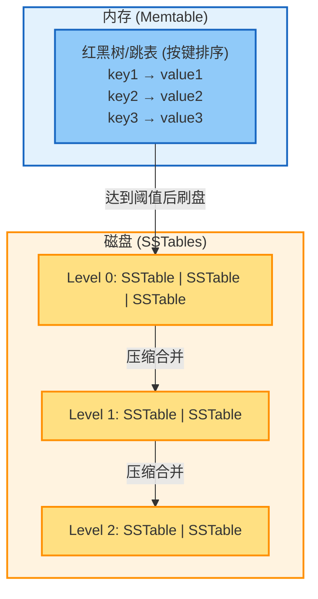
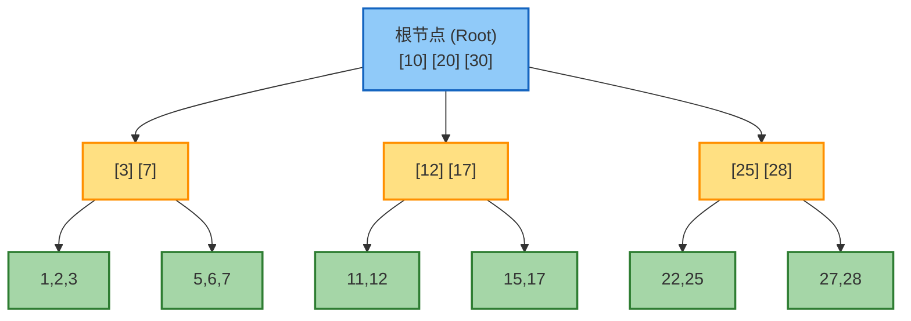
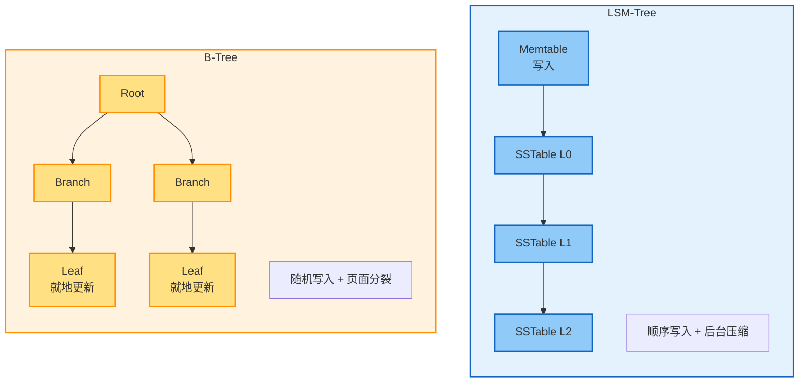
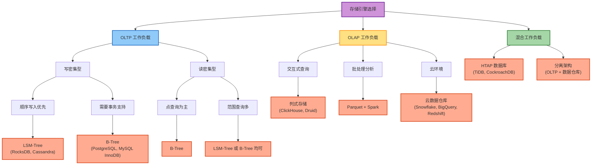
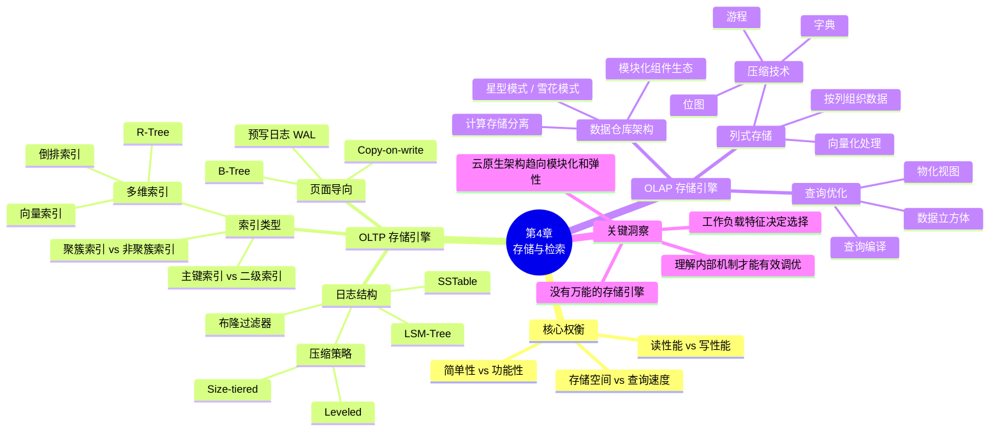

# 第4章 存储与检索

## 章节概述

本章深入探讨数据库如何存储和检索数据，重点分析面向事务处理（OLTP）和分析处理（OLAP）两类工作负载的存储引擎架构及其基本权衡。理解存储引擎内部机制有助于选择合适的数据库并有效调优性能参数。

## 核心概念

### 索引的必要性

最简单的键值存储可以用追加写入文件实现：
- 写入性能：O(1) - 追加操作非常快
- 读取性能：O(n) - 需要扫描整个文件
- 结论：需要索引来加速查询

**索引的本质权衡**：
- 加速读取操作
- 减慢写入操作（需要维护索引结构）
- 占用额外存储空间

## OLTP 存储引擎

### 日志结构存储引擎

#### SSTable（Sorted String Table）

SSTable 是按键排序的键值对文件格式，相比简单日志文件的优势：



**核心特性**：
- 键值对按键排序存储
- 支持稀疏索引（内存中只保存部分键）
- 高效的范围查询
- 块级压缩

**工作流程**：
1. 写入时追加到内存中的排序结构（memtable）
2. memtable 满时刷盘到磁盘成为 SSTable 段
3. 后台合并段文件，删除重复和过期数据
4. 使用布隆过滤器快速判断键是否存在

#### LSM-Tree（Log-Structured Merge-Tree）

LSM-Tree 是基于 SSTable 的完整存储引擎实现。

**压缩策略对比**：

| 策略类型 | 工作方式 | 优势 | 劣势 |
|---------|---------|------|------|
| Size-tiered | 合并多个小 SSTable 为大 SSTable | 实现简单 | 可能产生临时空间放大 |
| Leveled | 数据分层，每层键范围不重叠 | 空间利用率高 | 写放大较高 |

**布隆过滤器**：
- 概率型数据结构
- 快速判断键是否可能存在于段中
- 无假阴性，但有假阳性
- 显著减少不必要的磁盘读取

### B-Tree 索引

B-Tree 采用固定大小页面的就地更新策略，是最广泛使用的索引结构。



**查找示例**：查找 key=15 的路径: Root → [12,17] → [15,17] → 找到!
**时间复杂度**：O(log n)

**核心特性**：
- 页面大小：通常 4KB-16KB
- 平衡树结构：查找时间复杂度 O(log n)
- 就地更新：覆盖磁盘页面而非追加
- 预写日志（WAL）：用于崩溃恢复

**优化技术**：
- Copy-on-write：写入新页面而非覆盖，简化并发控制
- 键缩写：节省页面空间，提高分支因子
- 页面布局：尝试将相邻键的页面放在磁盘相邻位置

### LSM-Tree vs B-Tree 对比



| 维度 | LSM-Tree | B-Tree |
|-----|----------|--------|
| 写入性能 | 更快（顺序写入） | 较慢（随机写入） |
| 读取性能 | 较慢（需检查多个段） | 更快（单次查找） |
| 写放大 | 压缩过程产生 | 页面分裂和 WAL 产生 |
| 空间利用 | 压缩率更高 | 可能产生碎片 |
| 适用场景 | 写密集型工作负载 | 读密集型工作负载 |
| 事务支持 | 实现较复杂 | 天然支持锁机制 |

**经验法则**：LSM-Tree 更适合写入密集型应用，B-Tree 对读取更快。

### 其他索引结构

#### 二级索引

- 主键索引：键唯一标识一行
- 二级索引：键可能对应多行
- 实现方式：
  - 存储实际行数据（聚簇索引）
  - 存储主键引用（非聚簇索引）
  - 存储行位置引用（堆文件）

#### 多维索引

**空间索引**：
- R-Tree：用于地理空间数据
- 空间填充曲线：将多维数据映射到一维

**全文搜索索引**：
- 倒排索引：词项到文档列表的映射
- N-gram 索引：支持子串匹配
- Levenshtein 自动机：模糊匹配

**向量嵌入索引**：
- HNSW（Hierarchical Navigable Small World）
- IVF（Inverted File Index）
- 用于语义搜索的近似最近邻查询

#### 内存数据库

**特点**：
- 数据主要存储在内存中
- 性能优势来自避免序列化开销，而非避免磁盘读取
- 持久化通过快照和日志实现
- 支持反缓存：将冷数据移到磁盘

## OLAP 存储引擎

### 数据仓库架构

**传统架构**：
- ETL 流程：从 OLTP 系统提取、转换、加载数据
- 星型模式：事实表 + 维度表
- 雪花模式：维度表进一步规范化

**云原生架构**：
- 计算与存储分离
- 弹性扩展能力
- 模块化组件：
  - 查询引擎：Trino, Spark
  - 存储格式：Parquet, ORC
  - 表格式：Iceberg, Delta Lake
  - 数据目录：元数据管理

### 列式存储

**核心思想**：按列而非按行存储数据

**优势**：
1. 只加载查询需要的列
2. 相似值聚集，压缩效果更好
3. 支持向量化处理

**压缩技术**：

| 技术 | 适用场景 | 压缩比 | 查询性能 |
|-----|---------|--------|---------|
| 位图编码 | 低基数列 | 极高 | 支持位运算 |
| 游程编码 | 排序后重复值多 | 高 | 快速扫描 |
| 字典编码 | 中等基数列 | 中等 | 需解码 |

**位图索引示例**：
```
产品ID列（基数较低）：
值 29: 0 0 1 0 1 0 0 1 0
值 30: 1 0 0 0 0 0 1 0 0
值 31: 0 1 0 1 0 1 0 0 1

查询 WHERE product_id IN (29, 31)：
按位OR: 0 1 1 1 1 1 0 1 1
```

### 列式存储的写入

**挑战**：
- 就地更新困难（需重写所有列文件）
- 解决方案：LSM-Tree 思想
  - 内存中缓存写入
  - 批量刷写到磁盘
  - 后台合并列文件

### 查询执行优化

**向量化处理**：
- 批量处理多行数据
- 利用 CPU SIMD 指令
- 减少函数调用开销

**查询编译**：
- 为特定查询生成机器码
- 消除解释器开销
- 适合复杂查询

### 物化视图与数据立方体

**物化视图**：
- 预计算查询结果并存储
- 加速重复查询
- 需要在写入时更新

**数据立方体（OLAP Cube）**：
- 多维度预聚合
- 极快的聚合查询
- 灵活性受限（只能查询预定义维度）

## 存储引擎选择指南

### 工作负载特征分析

**OLTP 特征**：
- 大量小事务
- 基于主键的点查询
- 低延迟要求
- 写入频繁

**OLAP 特征**：
- 少量大查询
- 扫描大量行
- 聚合计算密集
- 读取为主

### 选择决策树



## 性能调优要点

### 写放大问题

**定义**：写入数据库的实际字节数远大于应用写入的字节数

**来源**：
- LSM-Tree：压缩过程重写数据
- B-Tree：WAL + 页面更新
- 复制：主从同步
- 备份：快照和归档

**优化策略**：
- 调整压缩策略
- 增大页面大小
- 批量写入
- 使用 SSD（随机写入性能更好）

### 读放大问题

**LSM-Tree 特有**：
- 需要检查多个 SSTable 段
- 布隆过滤器减少无效读取
- 压缩减少段数量
- 缓存热数据

### 空间放大问题

**表现**：
- B-Tree 碎片
- LSM-Tree 压缩期间临时空间
- 多版本并发控制（MVCC）的旧版本

**优化**：
- 定期重建索引
- 调整压缩触发阈值
- 及时清理旧版本

## 本章总结



## 延伸思考

1. **混合工作负载**：如何在同一系统中同时优化 OLTP 和 OLAP？
2. **新型硬件**：NVMe SSD 和持久化内存如何改变存储引擎设计？
3. **分布式存储**：本章讨论的单机存储引擎如何扩展到分布式环境？
4. **实时分析**：如何在保证 OLTP 性能的同时支持实时分析查询？

## 实践建议

1. **基准测试**：在实际工作负载下测试不同存储引擎
2. **监控指标**：关注写放大、读放大、空间放大
3. **参数调优**：根据工作负载特征调整压缩策略、缓存大小等
4. **架构演进**：从单体数据库到分离式架构的渐进式迁移
