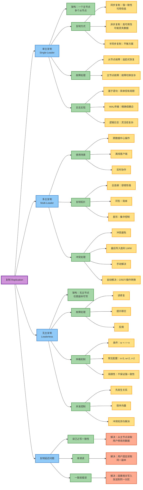
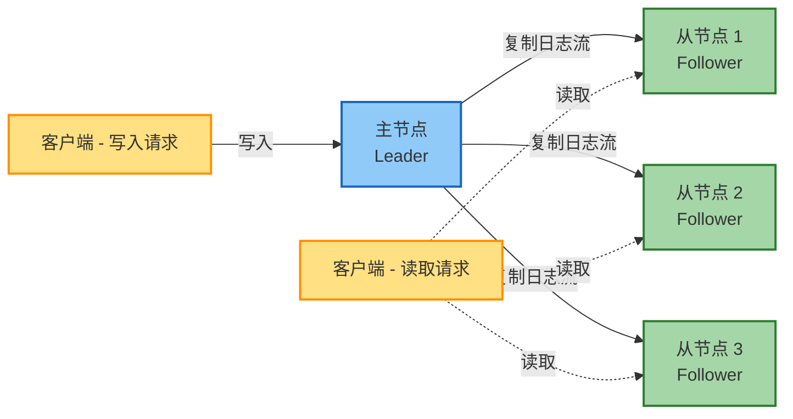
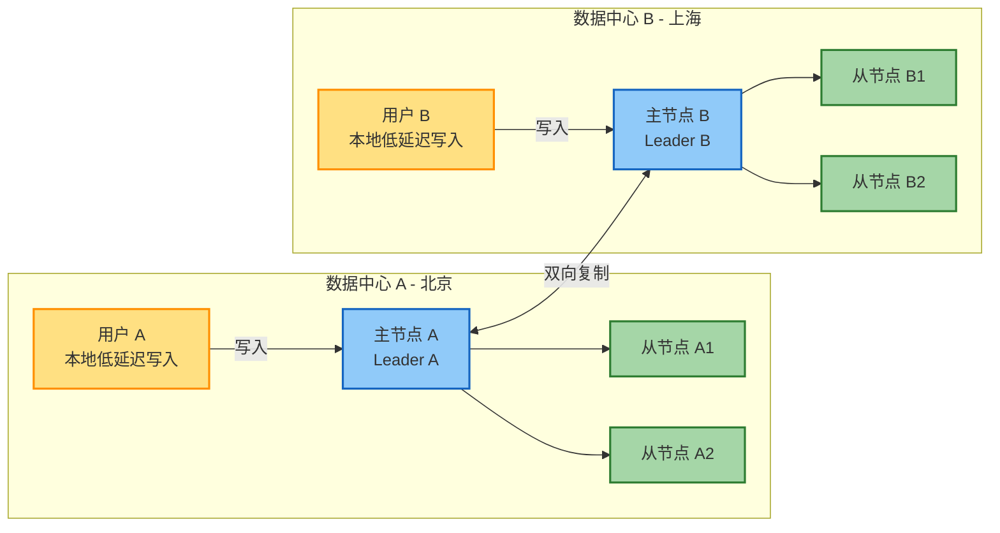

# 第6章 复制

## 章节概览

复制（Replication）是指在通过网络连接的多台机器上保存相同数据的副本。复制的主要动机包括：

- **降低延迟**：将数据在地理位置上更接近用户
- **提高可用性**：即使部分组件故障，系统仍可继续运行
- **扩展读吞吐量**：通过多台机器分担读查询负载

复制的核心挑战在于处理数据的**变更**。本章介绍三种主要的复制算法：

1. **单主复制**（Single-Leader Replication）
2. **多主复制**（Multi-Leader Replication）
3. **无主复制**（Leaderless Replication）

## 一、单主复制

### 1.1 基本架构

- **主节点（Leader/Primary）**：接受所有写入请求
- **从节点（Follower/Secondary）**：从主节点接收变更流
- 读请求可以发送到任何副本，但只有主节点接受写入
- 应用案例：PostgreSQL、MySQL、MongoDB 等

### 1.2 同步复制 vs 异步复制

| 复制方式 | 优点 | 缺点 | 适用场景 |
|---------|------|------|---------|
| **同步复制** | 从节点保证拥有最新数据副本 | 任何从节点故障都会阻塞所有写入 | 强一致性要求 |
| **异步复制** | 主节点可继续处理，即使从节点滞后 | 主节点故障可能导致数据丢失 | 高可用性要求 |
| **半同步复制** | 平衡一致性和可用性 | 需要精心配置 | 生产环境常用 |

**半同步复制**：一个从节点同步，其他从节点异步，在一致性和可用性之间取得平衡。

### 1.3 设置新副本

添加新副本的标准流程：

1. 对主节点数据库进行一致性快照
2. 将快照复制到新从节点
3. 从节点请求快照点之后的所有变更
4. 从节点处理积压的变更，完成"追赶"

### 1.4 处理节点故障

#### 从节点故障：追赶式恢复

- 从节点保存已接收变更的日志
- 恢复后，从主节点请求遗漏的变更
- 相对简单直接

#### 主节点故障：故障切换

**故障切换（Failover）流程**：

1. 确认主节点已失效（通常通过超时判断）
2. 选择新的主节点（通常选择数据最新的从节点）
3. 重新配置系统使用新主节点

**故障切换的复杂性**：

- 使用异步复制时可能导致数据丢失
- **脑裂（Split-brain）**：两个节点都认为自己是主节点
- 超时时间的确定：过短导致不必要的切换，过长影响恢复时间

### 1.5 复制日志实现方式

| 实现方式 | 描述 | 优点 | 缺点 |
|---------|------|------|------|
| **基于语句的复制** | 复制 SQL 语句 | 简单直观 | 非确定性函数、执行顺序依赖问题 |
| **预写日志（WAL）传输** | 发送物理日志条目 | 精确复制 | 与存储引擎紧密耦合，版本升级困难 |
| **逻辑日志（基于行）** | 描述行级变更 | 与存储引擎解耦，便于升级和外部消费 | 实现复杂度较高 |

## 二、复制延迟问题

异步复制可能导致**最终一致性**问题，主要表现为以下三种场景：

### 2.1 读己之写一致性

**问题**：用户可能无法看到自己刚刚提交的写入（从陈旧副本读取）。

**解决方案**：

- 对于用户可修改的数据，始终从主节点读取
- 跟踪最后更新时间，最近更新的数据从主节点读取
- 客户端记住最后写入的时间戳，确保副本至少包含该时间戳的更新

### 2.2 单调读

**问题**：用户可能看到数据"时光倒流"（从不同副本读取时看到不一致的状态）。

**解决方案**：确保每个用户始终从同一副本读取（例如，基于用户 ID 的哈希路由）。

### 2.3 一致前缀读

**问题**：因果顺序违反 - 看到结果先于原因。

**解决方案**：

- 确保因果相关的写入发送到同一分区
- 显式跟踪因果依赖关系

## 三、多主复制

### 3.1 使用场景

#### 跨数据中心操作

每个数据中心有自己的主节点：

- **性能优势**：本地写入延迟低
- **容错性**：单个数据中心故障不影响其他数据中心
- **网络容忍性**：更好地处理网络中断
- **一致性代价**：一致性保证较弱

#### 离线客户端

每个设备充当主节点（如日历应用）。

#### 实时协作

每个浏览器标签页是共享文档的副本。

### 3.2 复制拓扑

| 拓扑结构 | 描述 | 优点 | 缺点 |
|---------|------|------|------|
| **全连接（All-to-all）** | 每个主节点发送到其他所有主节点 | 容错性最强 | 可能出现顺序问题 |
| **环形（Circular）** | 每个节点转发到环中下一个节点 | 简单 | 单点故障影响大 |
| **星形（Star）** | 一个根节点转发到所有其他节点 | 集中控制 | 根节点是单点故障 |

### 3.3 处理写冲突

#### 冲突避免

尽可能将相关写入路由到同一主节点。

#### 最后写入胜利（LWW）

使用时间戳选择胜者：

- 简单但会导致数据丢失
- 对时钟同步敏感

#### 手动解决

存储冲突值作为"兄弟值"，让应用程序或用户解决。

#### 自动解决

使用算法如 CRDT 或操作转换。

### 3.4 CRDT vs 操作转换

| 技术 | 工作原理 | 应用场景 |
|------|---------|---------|
| **CRDT** | 为元素分配唯一 ID，使用 ID 进行定位 | 分布式数据结构 |
| **操作转换** | 根据并发操作转换操作索引 | 实时协作编辑 |

两者都能实现协作应用中并发编辑的自动合并。

## 四、无主复制

### 4.1 架构特点

- 没有指定的主节点 - 任何副本都可以接受写入
- 客户端并行发送写入到多个副本
- 读取也查询多个副本以检测陈旧数据
- 应用案例：Dynamo 风格数据库（Riak、Cassandra、ScyllaDB）

### 4.2 处理节点故障

当节点不可用时：

- **读修复（Read Repair）**：客户端检测到陈旧响应，将新值写回
- **提示移交（Hinted Handoff）**：为不可用节点存储写入，恢复后转发
- **反熵（Anti-entropy）**：后台进程查找并复制缺失数据

### 4.3 读写仲裁

对于 n 个副本、w 次写入、r 次读取：

- 如果 **w + r > n**，期望在读取时获得最新值
- 常见配置：n=3, w=2, r=2（容忍 1 个节点故障）
- 可针对不同工作负载调优（如读密集型：w=n, r=1）

### 4.4 仲裁的局限性

即使满足 w + r > n，一致性仍不能保证，原因包括：

- 重新平衡期间的节点故障
- 并发读写操作
- 部分副本写入失败
- 基于时间戳的冲突解决中的时钟偏差

### 4.5 检测并发写入

**先发生关系（Happens-before）**：如果操作 B 知道或依赖于操作 A，则 A 先发生于 B。

**并发操作**：两个操作都不先发生于另一个。

**版本向量（Version Vectors）**：跟踪所有副本的版本号以确定因果关系和检测冲突。

**算法原理**：

- 服务器为每个键维护版本号
- 客户端写入时包含上次读取的版本
- 服务器可确定哪些值是并发的，哪些是后继的

## 五、性能考量

### 5.1 单主复制

**优势**：
- 可实现强一致性保证
- 简单易懂和实现

**劣势**：
- 读吞吐量受主节点容量限制
- 故障切换导致临时不可用
- 对主节点性能问题敏感

### 5.2 无主复制

**优势**：
- 通过**请求对冲（Request Hedging）**对慢速/故障节点更具弹性
- 无需故障切换
- 更好地处理"灰色故障"（性能降级）

**劣势**：
- 更大的仲裁增加延迟
- 提示移交产生额外负载
- 网络分区可能阻止仲裁形成

## 六、一致性模型对比

| 一致性模型 | 保证内容 | 实现难度 | 性能影响 |
|-----------|---------|---------|---------|
| **读己之写** | 用户看到自己的更新 | 中等 | 较小 |
| **单调读** | 不会时光倒流 | 简单 | 很小 |
| **一致前缀读** | 保持因果顺序 | 困难 | 中等 |
| **线性一致性** | 全局顺序，实时保证 | 非常困难 | 较大 |
| **最终一致性** | 最终收敛到相同状态 | 简单 | 最小 |

## 核心要点

1. **复制是分布式系统的基础**：用于降低延迟、提高可用性和扩展读吞吐量。

2. **三种复制模式各有权衡**：
   - 单主：简单、强一致性，但单点故障
   - 多主：容错性好、弱一致性，冲突解决复杂
   - 无主：最具弹性、最终一致性，需要仔细管理仲裁

3. **复制延迟是异步复制的核心挑战**：需要理解并选择合适的一致性模型。

4. **一致性与可用性的权衡**：强一致性通常以牺牲可用性或性能为代价。

5. **现代系统趋势**：在提供分布式可扩展性的同时，越来越多地提供强一致性保证，但弱一致性模型在需要最大可用性和分区容忍性的特定场景中仍然有价值。
