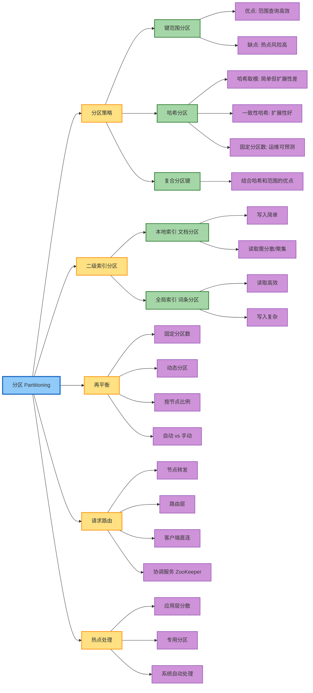
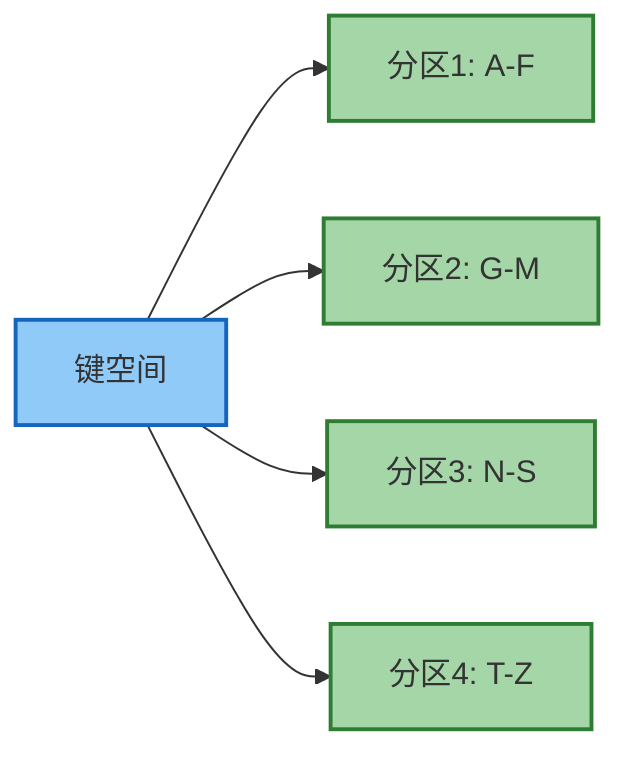
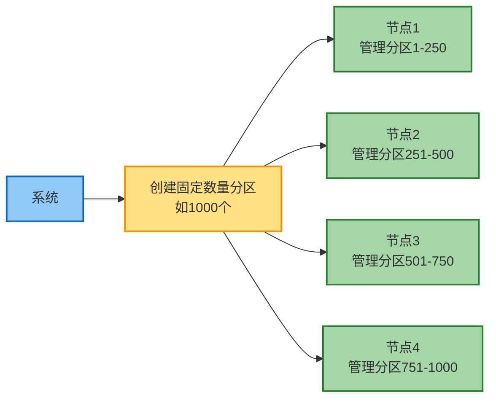
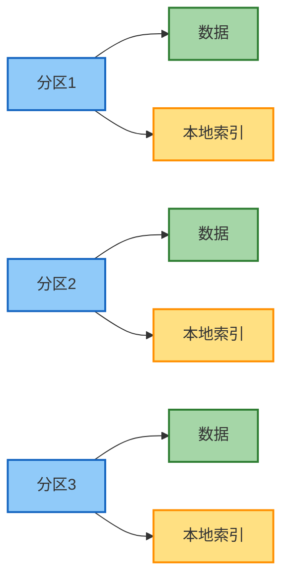
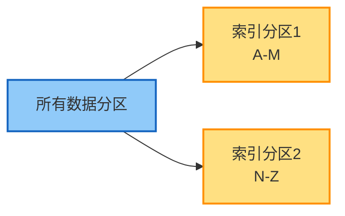
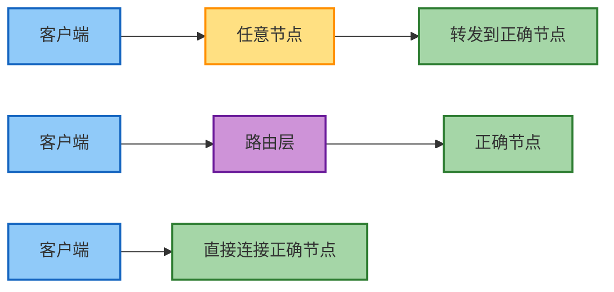
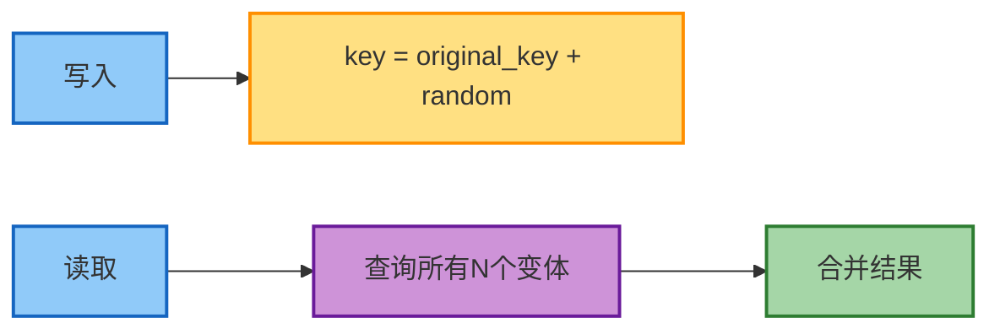
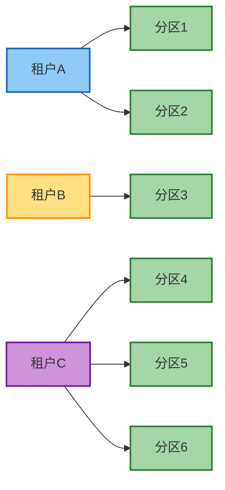

# 第7章 分区

> 本章基于 [DDIA 中文翻译](https://ddia.vonng.com/ch7/) 整理

## 章节概览

## 概述

分区（Partitioning/Sharding）是将大型数据集分割成更小部分并分布到多个节点的技术。与复制不同，分区的目标是**将数据和查询负载均匀地分布在各节点上**，实现水平扩展。

### 分区的目标

- **可扩展性**：数据量超过单机容量时，分布到多台机器
- **性能**：查询负载分散到多个节点并行处理
- **可用性**：结合复制，提高系统容错能力

## 分区策略

### 键范围分区

为每个分区分配连续的键范围：

| 优点 | 缺点 |
|------|------|
| 支持高效范围查询 | 容易产生热点 |
| 键在分区内有序存储 | 时间戳等顺序键问题严重 |
| 分区边界可动态调整 | 需要维护分区元数据 |

**热点问题示例**：如果按时间戳分区，所有当天的写入都会集中到同一分区。

### 哈希分区

使用哈希函数将键映射到分区：

#### 哈希取模

**问题**：节点数 N 变化时，几乎所有数据都需要重新分配。

#### 一致性哈希

**优点**：节点变化时只影响相邻节点的数据。

#### 固定数量分区

**优点**：
- 添加/删除节点时只需重新分配整个分区
- 分区大小相对均匀
- 运维可预测

### 分区策略对比

| 策略 | 范围查询 | 负载均衡 | 热点风险 | 实现复杂度 |
|------|---------|---------|---------|-----------|
| 键范围 | 高效 | 较差 | 高 | 中等 |
| 哈希取模 | 不支持 | 好 | 低 | 简单 |
| 一致性哈希 | 不支持 | 好 | 低 | 中等 |
| 固定分区 | 取决于键 | 好 | 中等 | 中等 |

### 复合分区键

结合哈希和范围分区的优点：

**应用场景**：社交媒体时间线、用户活动日志等。

## 分区与二级索引

### 本地索引（文档分区）

每个分区维护自己的二级索引，仅覆盖本分区数据：

| 优点 | 缺点 |
|------|------|
| 写入简单，只更新本地索引 | 查询需要分散/聚集到所有分区 |
| 分区独立，无跨分区协调 | 读取延迟高，尾延迟问题 |

### 全局索引（词条分区）

索引覆盖所有分区数据，但索引本身也需要分区：

| 优点 | 缺点 |
|------|------|
| 查询效率高，只访问相关分区 | 写入复杂，可能需要更新多个索引分区 |
| 避免分散/聚集 | 可能需要分布式事务 |

## 分区再平衡

### 再平衡策略

| 策略 | 描述 | 优点 | 缺点 |
|------|------|------|------|
| 固定分区数 | 预先创建大量分区 | 简单可预测 | 分区数难以调整 |
| 动态分区 | 分区过大时分裂 | 自适应数据量 | 实现复杂 |
| 按节点比例 | 每个节点固定分区数 | 自动扩展 | 新节点加入时数据迁移 |

### 自动 vs 手动再平衡

**自动再平衡**：
- 优点：方便，无需人工干预
- 缺点：不可预测，可能触发级联故障

**手动再平衡**：
- 优点：可控，可防止意外操作
- 缺点：较慢，需要运维介入

> 许多生产系统选择半自动方式：系统建议再平衡计划，由管理员确认执行。

## 请求路由

### 三种路由方式

### 分区发现

系统需要知道"哪个分区在哪个节点"：

| 方案 | 描述 | 示例 |
|------|------|------|
| 协调服务 | 使用 ZooKeeper/etcd 存储映射 | Kafka, HBase |
| Gossip 协议 | 节点间传播分区信息 | Cassandra, Riak |
| 配置服务 | 中心化配置管理 | MongoDB Config Server |

### ZooKeeper 在分区发现中的作用

## 热点处理

### 热点产生原因

- 某些键访问频率远高于其他键（如热门用户）
- 时间相关的键导致写入集中
- 数据分布不均匀

### 解决方案

**应用层分散**：

**专用分区**：
- 将热键放在专用分区
- 为热分区分配更多资源

**系统自动处理**：
- 一些数据库支持自动检测和分散热点

## 多租户分区

分区常用于实现多租户系统：

**优势**：
- 资源隔离和权限隔离
- 基于单元的架构实现故障隔离
- 按租户备份恢复
- 渐进式模式推出

## 核心要点

- 分区是实现水平扩展的关键技术
- 选择分区策略需要权衡范围查询和负载均衡
- 二级索引分区需要在读写效率间权衡
- 再平衡策略影响系统可用性和运维复杂度
- 热点是分区系统的常见挑战，需要专门处理
