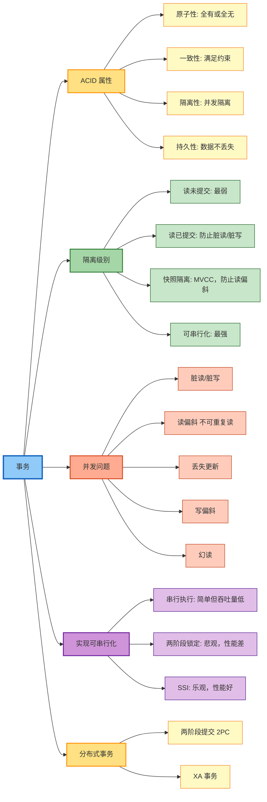
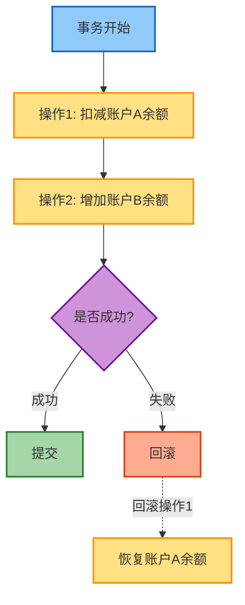
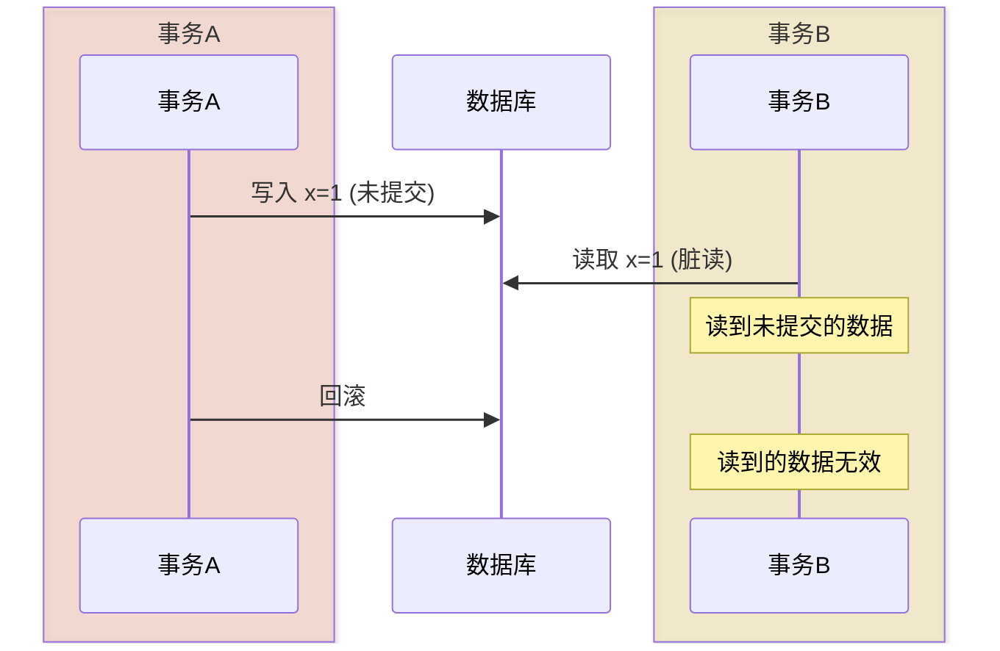
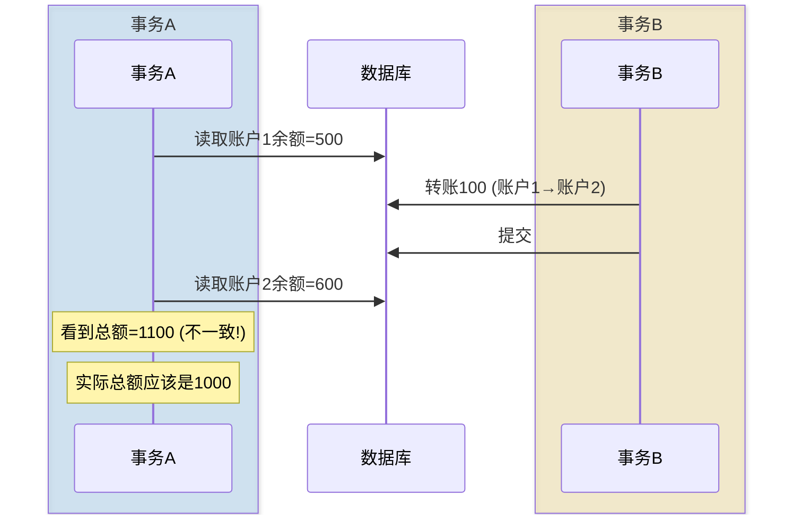
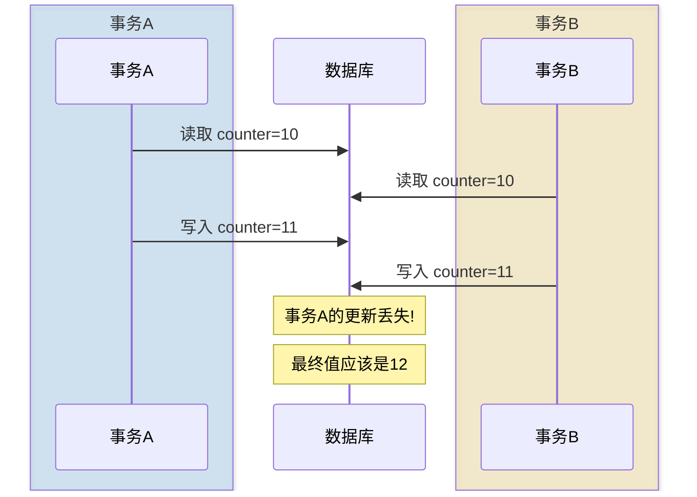
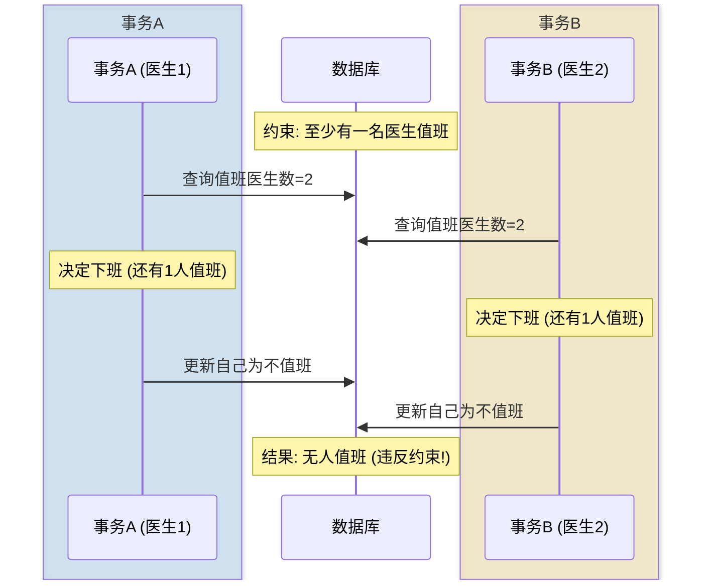
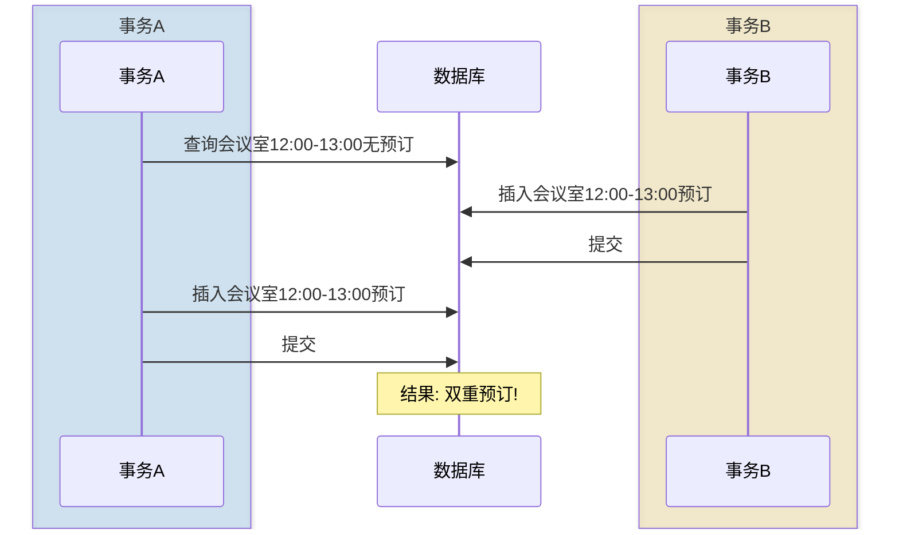
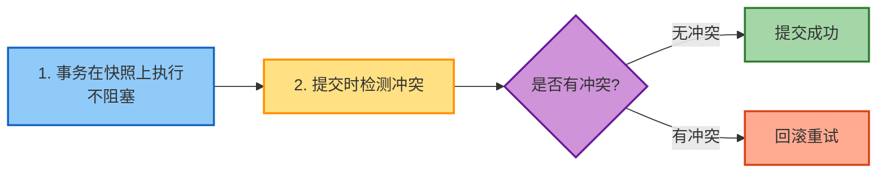
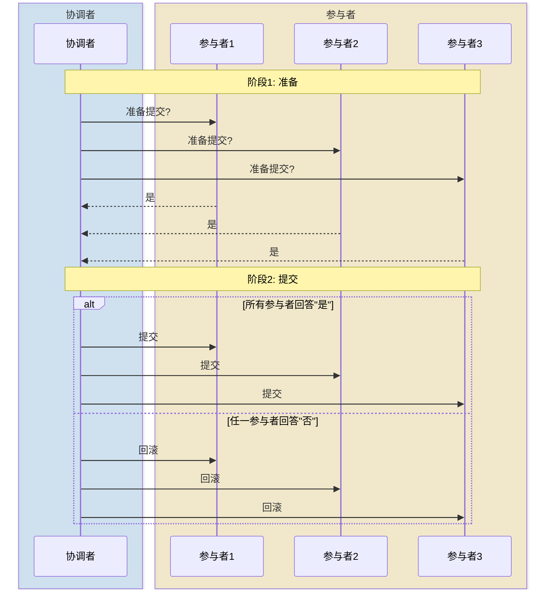

# 第8章 事务

> 本章基于 [DDIA 中文翻译](https://ddia.vonng.com/ch8/) 整理

## 章节概览

## 概述

事务是应用程序将多个读写操作组合成一个逻辑单元的方式。事务提供了简化的编程模型，让开发者可以忽略某些潜在的错误场景和并发问题。

> "事务可以大大减少你需要考虑的潜在错误情况的数量。"

## ACID 属性

### 原子性（Atomicity）

**定义**：事务中的所有操作要么全部成功，要么全部失败回滚。

**说明**：如果操作2失败，操作1也会回滚

**关键点**：
- 描述故障时的行为，而非并发
- 提供全有或全无的保证
- 失败后可以安全重试

### 一致性（Consistency）

**定义**：事务将数据库从一个有效状态转换到另一个有效状态，满足所有定义的约束。

**注意**：一致性主要依赖于应用程序如何正确定义事务，而非数据库本身。

### 隔离性（Isolation）

**定义**：并发执行的事务彼此隔离，不能相互干扰。

**理想情况**：可串行化（Serializability）—— 事务的执行结果与串行执行相同。

**现实情况**：由于性能原因，常使用较弱的隔离级别。

### 持久性（Durability）

**定义**：一旦事务成功提交，数据不会丢失。

| 环境 | 实现方式 |
|------|---------|
| 单节点 | 写入非易失性存储（磁盘、SSD） |
| 分布式 | 数据成功复制到多个节点 |

## 隔离级别

### 读未提交（Read Uncommitted）

最弱的隔离级别，允许脏读。实际中很少使用。

### 读已提交（Read Committed）

**保证**：
- **无脏读**：只能看到已提交的数据
- **无脏写**：不会覆盖未提交的数据

**实现**：
- 写入时持有行级锁直到提交
- 读取时返回已提交的旧值

**仍存在的问题**：读偏斜（不可重复读）

### 快照隔离（Snapshot Isolation）

**核心思想**：每个事务从数据库的一致快照读取。

**MVCC（多版本并发控制）**：
- 每行数据保存多个版本
- 每个版本标记创建和删除的事务ID
- 读取时根据事务ID选择可见版本

**优点**：
- 读者不阻塞写者
- 写者不阻塞读者
- 防止读偏斜

**仍存在的问题**：写偏斜

### 可串行化（Serializable）

最强的隔离级别，防止所有并发问题。

## 并发问题

### 脏读（Dirty Read）

读取到其他事务未提交的数据。

**解决**：读已提交隔离级别

### 脏写（Dirty Write）

覆盖其他事务未提交的写入。

**解决**：行级锁

### 读偏斜（Read Skew）

在同一事务中，读取到不一致的数据状态。

**解决**：快照隔离

### 丢失更新（Lost Update）

两个事务并发执行读-修改-写循环，一个更新被覆盖。

**解决方案**：

| 方案 | 描述 |
|------|------|
| 原子操作 | `UPDATE ... SET counter = counter + 1` |
| 显式锁定 | `SELECT ... FOR UPDATE` |
| 自动检测 | 数据库检测并回滚一个事务 |
| CAS 操作 | `UPDATE ... WHERE counter = old_value` |

### 写偏斜（Write Skew）

两个事务读取相同数据，根据读取结果做出决策并写入，但决策前提在写入时已不成立。

**解决**：可串行化隔离

### 幻读（Phantom Read）

一个事务的写入改变另一个事务搜索查询的结果。

**解决**：谓词锁或索引范围锁

## 实现可串行化

### 方案一：串行执行

单线程顺序执行所有事务。

**适用条件**：
- 事务简短
- 数据集可放入内存
- 写入吞吐量低

**优化**：
- 存储过程减少网络往返
- 分区并行执行

### 方案二：两阶段锁定（2PL）

**规则**：
- 读取前获取共享锁
- 写入前获取排他锁
- 持有锁直到事务结束

**问题**：
- 性能差（读写互相阻塞）
- 死锁风险
- 延迟不可预测

**谓词锁**：锁定满足条件的所有行（包括未来的行）

**索引范围锁**：锁定索引范围，是谓词锁的近似实现

### 方案三：可串行化快照隔离（SSI）

**核心思想**：乐观并发控制 + 冲突检测

**检测的冲突类型**：
- 读取被其他事务修改的数据
- 写入被其他事务读取的数据

**优点**：
- 读不阻塞写
- 写不阻塞读
- 性能好于 2PL

**缺点**：
- 高冲突时回滚率高
- 需要重试逻辑

## 隔离级别对比

| 隔离级别 | 脏读 | 脏写 | 读偏斜 | 丢失更新 | 写偏斜 | 幻读 |
|---------|------|------|--------|---------|--------|------|
| 读未提交 | 可能 | 防止 | 可能 | 可能 | 可能 | 可能 |
| 读已提交 | 防止 | 防止 | 可能 | 可能 | 可能 | 可能 |
| 快照隔离 | 防止 | 防止 | 防止 | 部分防止 | 可能 | 可能 |
| 可串行化 | 防止 | 防止 | 防止 | 防止 | 防止 | 防止 |

## 分布式事务

### 两阶段提交（2PC）

**角色**：
- 协调者（Coordinator）
- 参与者（Participants）

**流程**：

**问题**：
- 协调者单点故障
- 参与者可能"存疑"阻塞
- 性能开销大

### XA 事务

跨异构系统的分布式事务标准，问题较多，现代系统倾向于避免使用。

## 核心要点

- 事务简化了并发和故障处理的编程模型
- 隔离级别是性能和正确性的权衡
- 可串行化是最强保证，但有性能代价
- SSI 是现代数据库的首选可串行化实现
- 分布式事务复杂且有性能问题，应谨慎使用
