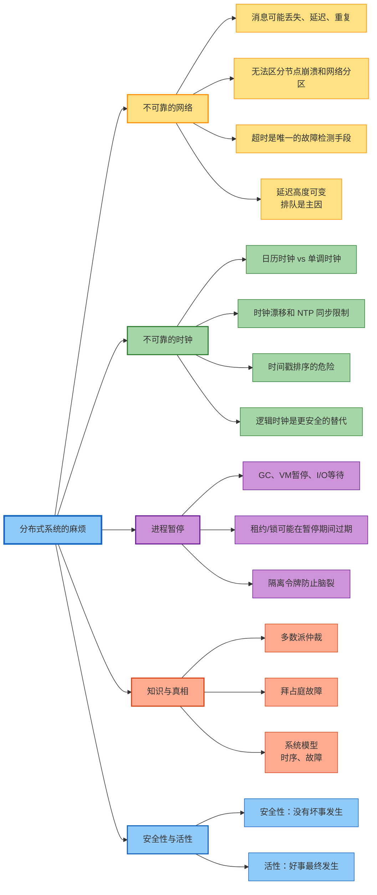
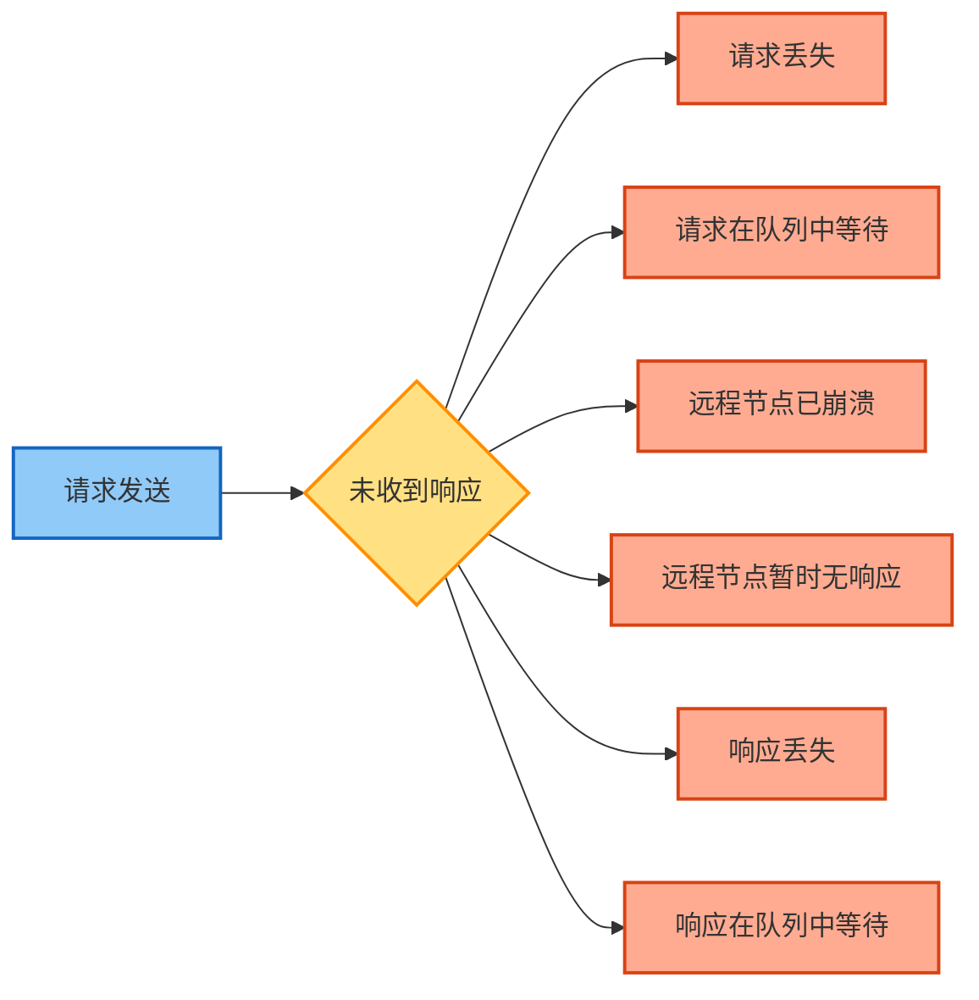
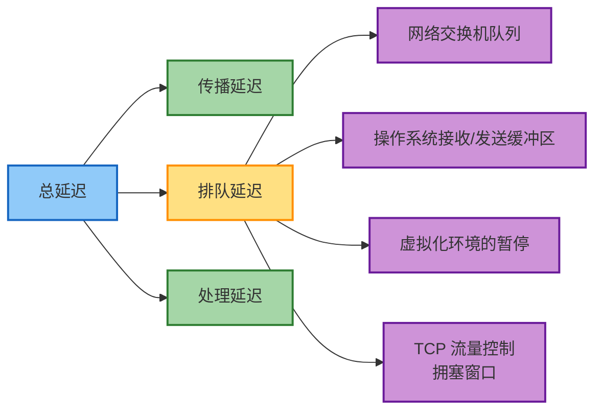
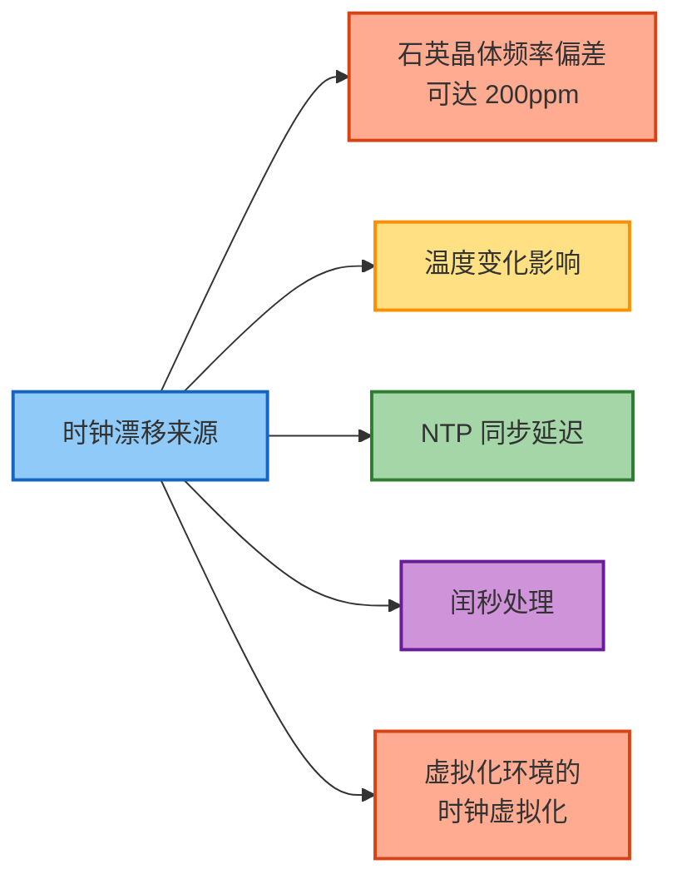
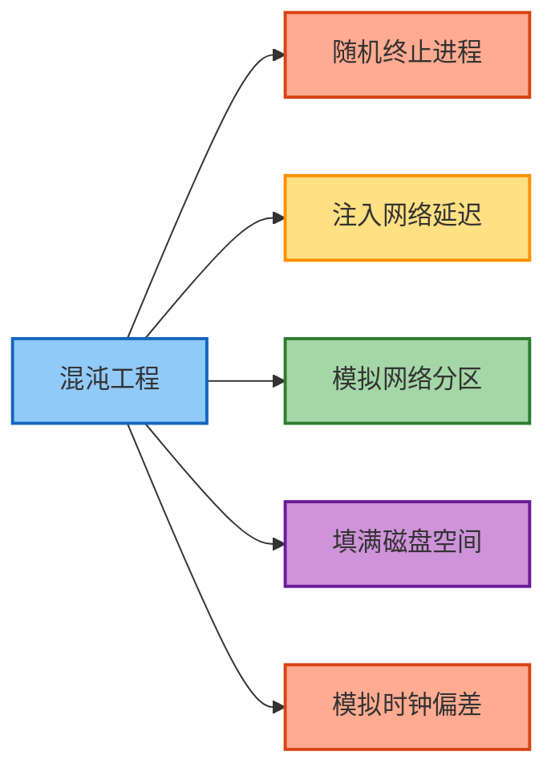

# 第9章 分布式系统的麻烦

> 本章基于 [DDIA 中文翻译](https://ddia.vonng.com/ch9/) 整理

## 章节概览



## 概述

本章深入探讨分布式系统中的核心挑战，揭示与单机系统的根本差异。分布式系统的关键特征是**部分失效**的可能性——系统的某些部分可能以不可预测的方式出现故障，而其他部分仍正常工作。

> "在分布式系统中，我们尝试将对部分失败的容忍构建到软件中，这样即使某些组成部分出现故障，整个系统也可以继续运行。"

## 不可靠的网络

### 网络通信的不确定性

在异步分组网络中，发送请求但未收到响应时，可能的原因：



> "发送方甚至无法判断数据包是否已交付：唯一的选择是让接收方发送响应消息，而响应消息本身也可能丢失或延迟。"

### 网络故障的现实

| 场景 | 频率/影响 |
|------|----------|
| 中型数据中心网络故障 | 每月约 12 次 |
| 广域光纤链路中断 | 可能由动物或人为因素造成 |
| 数据中心内网络延迟 | 可能超过一分钟 |
| 网络分区 | 可能持续数分钟到数小时 |

### TCP 的局限性

虽然 TCP 提供"可靠"交付，但它无法解决所有网络问题：
- 连接超时后，无法知道远程节点实际处理了多少数据
- 网络拥塞时，重传会加剧问题
- 无法区分节点崩溃和网络分区

### 网络延迟的来源



> "在公共云和多租户数据中心中，资源在许多客户之间共享"，导致延迟高度可变。

### 超时设置

**过短的超时**：
- 可能误判正常节点为故障
- 触发不必要的故障切换
- 增加系统负载

**过长的超时**：
- 故障检测延迟
- 用户体验差
- 资源浪费

**实践建议**：
- 使用自适应超时（基于历史延迟）
- 区分连接超时和读取超时
- 考虑使用心跳机制

## 不可靠的时钟

### 时钟类型

| 类型 | 用途 | 特点 |
|------|------|------|
| 日历时钟（Time-of-day） | 获取当前日期时间 | 可能向后跳跃，受 NTP 调整影响 |
| 单调时钟（Monotonic） | 测量时间间隔 | 保证向前移动，不受 NTP 影响 |

### 时钟同步的挑战



**NTP 同步的局限**：
- 网络延迟导致同步精度有限
- 通常只能达到几十毫秒精度
- 网络故障时可能长时间不同步

### 时钟依赖的危险

**问题场景**：使用时间戳排序事件

```
节点A: 写入 x=1，时间戳 100ms
节点B: 写入 x=2，时间戳 99ms（时钟偏差）

按时间戳排序：x=1 覆盖 x=2
实际因果顺序：x=2 应该覆盖 x=1
```

**解决方案**：使用逻辑时钟（Lamport 时间戳、向量时钟）

### Google Spanner 的 TrueTime

```
TrueTime API 返回：[earliest, latest]
- earliest: 当前时间不早于此
- latest: 当前时间不晚于此

事务提交时等待置信区间，确保时间戳反映因果关系
```

## 进程暂停

### 暂停的原因

| 原因 | 持续时间 | 可预测性 |
|------|---------|---------|
| 垃圾回收（GC） | 毫秒到秒 | 部分可预测 |
| 虚拟机暂停/恢复 | 秒到分钟 | 不可预测 |
| 操作系统上下文切换 | 微秒到毫秒 | 不可预测 |
| 磁盘 I/O 等待 | 毫秒到秒 | 部分可预测 |
| 内存交换（Swap） | 毫秒到秒 | 不可预测 |
| 信号处理 | 微秒 | 可预测 |

### 租约和分布式锁的问题

```
时间线：
0s: 节点A获取租约（有效期10s）
5s: 节点A开始GC暂停
15s: 租约过期，节点B获取租约
20s: 节点A从GC恢复，认为自己仍持有租约
    → 脑裂！两个节点都认为自己持有锁
```

### 隔离令牌（Fencing Token）

```
解决方案：
1. 锁服务每次授予锁时返回递增的令牌
2. 客户端在操作时携带令牌
3. 存储服务拒绝旧令牌的操作

节点A: 获取锁，令牌=33
节点A: 暂停...
节点B: 获取锁，令牌=34
节点B: 写入数据，令牌=34 ✓
节点A: 恢复，写入数据，令牌=33 ✗（被拒绝）
```

## 知识、真相与谎言

### 多数派原则

由于单个节点不可靠，分布式算法依赖于**仲裁（Quorum）**：

```
N 个节点的系统：
- 需要 > N/2 个节点同意才能做出决定
- 允许 < N/2 个节点故障
- 防止脑裂
```

### 拜占庭故障

当节点可能"撒谎"（发送错误或恶意信息）时：

| 故障类型 | 描述 | 容错难度 |
|---------|------|---------|
| 崩溃故障 | 节点停止响应 | 较易 |
| 遗漏故障 | 节点丢失部分消息 | 中等 |
| 拜占庭故障 | 节点发送任意错误信息 | 非常困难 |

**拜占庭容错**：需要 3f+1 个节点才能容忍 f 个拜占庭故障节点。

**应用场景**：
- 航空航天系统
- 区块链/加密货币
- 多方不信任的系统

### 系统模型

为了设计可靠算法，需要定义系统模型：

**时序假设**：

| 模型 | 假设 | 适用场景 |
|------|------|---------|
| 同步模型 | 有界延迟和暂停 | 理论分析 |
| 部分同步模型 | 大部分时间同步 | 实际系统 |
| 异步模型 | 无时序假设 | 最保守 |

**节点故障模型**：

| 模型 | 假设 |
|------|------|
| 崩溃停止 | 节点崩溃后永不恢复 |
| 崩溃恢复 | 节点可能崩溃并恢复 |
| 拜占庭 | 节点可能任意行为 |

### 安全性与活性

算法属性分为两类：

| 属性类型 | 定义 | 示例 |
|---------|------|------|
| 安全性（Safety） | "没有坏事发生" | 不会选出两个领导者 |
| 活性（Liveness） | "好事最终会发生" | 最终会选出一个领导者 |

**关键区别**：
- 安全性违反后无法撤销
- 活性通常包含"最终"的时间限定

## 测试和验证方法

### 形式化方法

| 方法 | 描述 | 工具 |
|------|------|------|
| 模型检查 | 验证算法在所有可能状态下的行为 | TLA+, Alloy |
| 定理证明 | 数学证明算法正确性 | Coq, Isabelle |

### 故障注入



### 确定性模拟测试

控制所有非确定性源（时间、网络、随机数），使测试可重现。

## 核心要点

- 分布式系统的本质挑战是**部分失效的非确定性**
- 网络、时钟、进程都不可靠，必须假设它们会出问题
- 超时和重试是处理网络故障的基本手段
- 避免依赖精确的时间同步，使用逻辑时钟
- 使用仲裁和隔离令牌防止脑裂
- 理解系统模型是设计正确算法的前提
