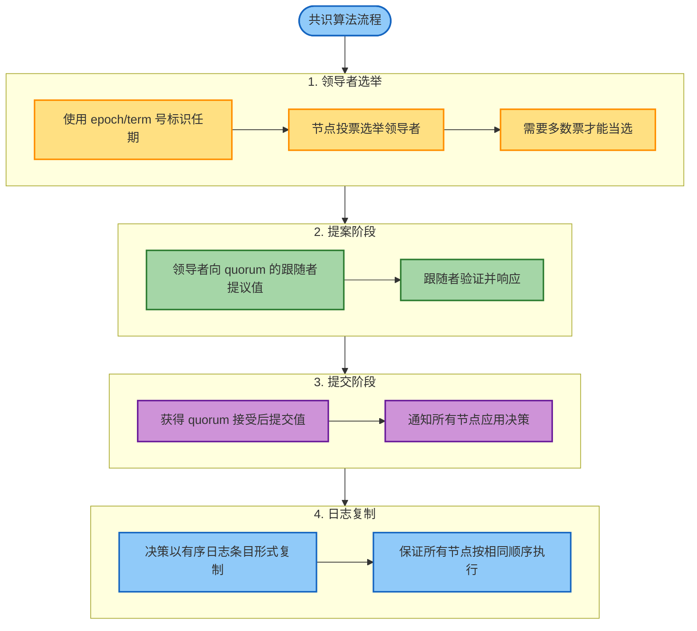

# 第10章：一致性与共识

## 章节概述

本章探讨分布式系统中的强一致性保证和共识算法，这是构建容错分布式系统的理论基础。主要内容包括：

- **线性一致性（Linearizability）**：最强的一致性模型，使分布式系统表现得像单机系统
- **因果一致性（Causal Consistency）**：通过逻辑时钟实现的弱化一致性模型
- **全序广播（Total Order Broadcast）**：保证消息有序传递的通信原语
- **共识算法（Consensus Algorithms）**：Paxos、Raft、Zab 等经典算法
- **分布式事务**：基于共识的原子提交协议

## 一致性模型

### 线性一致性（Linearizability）

**定义**：线性一致性使复制系统表现得像只有一份数据副本，所有操作都原子性地作用于这份数据。

**核心特性**：

1. **唯一性（Uniqueness）**：每个操作看起来在其开始和结束之间的某个时间点生效
2. **顺序性（Ordering）**：如果操作 A 在操作 B 开始前完成，则 B 必须看到 A 的效果
3. **原子性（Atomicity）**：从外部观察者角度，操作是瞬时完成的

**新鲜性保证**：一旦写操作完成，所有后续读操作必须返回该值或更新的值。

**典型应用场景**：

- **领导者选举和锁服务**：防止脑裂（split-brain）场景
- **唯一性约束**：确保用户名、文件路径等全局唯一
- **跨通道时序依赖**：协调不同通信渠道之间的操作

**实现挑战**：

| 复制方式 | 线性一致性 | 说明 |
|---------|-----------|------|
| 单主复制 | 可能支持 | 需要仔细处理故障切换，避免脑裂 |
| 多主复制 | 不支持 | 并发写入导致冲突，无法保证全局顺序 |
| 无主复制（Quorum） | 不一定支持 | 网络延迟可能导致读到旧值 |

### 因果一致性（Causal Consistency）

因果一致性是比线性一致性更弱但更高效的一致性模型，只保证有因果关系的操作按顺序执行。

**优势**：
- 不需要全局协调
- 性能开销更小
- 可以在分区时继续工作

## 逻辑时钟与 ID 生成

### Lamport 时间戳

**原理**：在不依赖物理时钟同步的情况下提供因果顺序。

**实现机制**：
- 每个节点维护一个计数器和唯一 ID
- 时间戳格式：`(counter, node_id)`
- 计数器在事件发生时递增
- 接收消息时，将计数器更新为 `max(local_counter, received_counter) + 1`

**特点**：
- 提供全序关系（total ordering）
- 无法区分并发事件
- 不能反向推导因果关系

### 混合逻辑时钟（Hybrid Logical Clocks）

结合物理时间和逻辑排序的优点：
- 像物理时钟一样跟踪经过的时间
- 像 Lamport 时钟一样维护因果一致性
- 最小化与物理时间的偏差

### 线性一致的 ID 生成器

**实现方式**：

1. **单节点生成器**：使用原子递增操作
2. **批量分配**：预分配 ID 范围以提高性能
3. **基于共识的分布式生成**：使用共识算法协调 ID 分配

## 共识算法

### 共识问题定义

共识解决了让分布式节点就单个值达成一致的基本问题，同时容忍节点故障。

**必须满足的属性**：

| 属性 | 说明 |
|-----|------|
| Agreement（一致性） | 没有两个节点做出不同的决定 |
| Integrity（完整性） | 节点不能改变已做出的决定 |
| Validity（有效性） | 决定的值必须是某个节点提议的 |
| Termination（终止性） | 未崩溃的节点最终会做出决定 |

### 等价问题

以下问题都可以归约为共识问题：

- 线性一致的 compare-and-set 操作
- 分布式事务中的原子提交
- 全序广播（共享日志）
- 领导者选举和分布式锁

### 主流共识算法

#### Raft

**特点**：
- 设计目标是易于理解
- 使用任期号（term number）进行领导者选举
- 强领导者模型（strong leader）

**工作流程**：
1. **领导者选举**：节点超时后发起选举，获得多数票成为领导者
2. **日志复制**：领导者接收客户端请求，复制到多数节点
3. **安全性保证**：只有包含所有已提交日志的节点才能成为领导者

#### Paxos / Multi-Paxos

**特点**：
- 经典共识算法，理论基础
- 使用提案号（proposal number）
- Multi-Paxos 优化了连续决策的性能

**阶段**：
1. **准备阶段（Prepare）**：提议者发送提案号，获取承诺
2. **接受阶段（Accept）**：提议者发送值，获取多数接受

#### Zab（ZooKeeper Atomic Broadcast）

**特点**：
- 用于 ZooKeeper 协调服务
- 保证全序广播
- 支持崩溃恢复

**核心机制**：
- 使用 epoch 号标识领导者任期
- 两阶段提交协议
- 同步阶段确保新领导者拥有最新状态

### 共识算法通用模式

## 状态机复制（State Machine Replication）

**原理**：共识算法使得状态机复制成为可能。

**工作机制**：
- 所有副本以相同顺序处理相同操作
- 确定性状态机保持一致
- 支持可序列化事务和事件溯源

**应用**：
- 分布式数据库
- 分布式配置管理
- 分布式队列和消息系统

## 全序广播（Total Order Broadcast）

**定义**：保证所有节点以相同顺序接收消息的通信原语。

**与共识的关系**：
- 全序广播等价于重复的共识
- 每条消息相当于一轮共识
- 共识可以通过全序广播实现

**实现方式**：
- 使用共识算法对消息排序
- 领导者负责分配序列号
- 日志复制确保顺序一致

## 分布式事务与原子提交

### 两阶段提交（2PC）

**角色**：
- **协调者（Coordinator）**：管理事务提交流程
- **参与者（Participants）**：执行事务操作的节点

**阶段**：

1. **准备阶段（Prepare Phase）**
   - 协调者向所有参与者发送准备请求
   - 参与者执行事务，写入日志，返回投票（Yes/No）

2. **提交阶段（Commit Phase）**
   - 如果所有参与者投 Yes，协调者发送提交命令
   - 如果任何参与者投 No，协调者发送中止命令
   - 参与者执行命令并返回确认

**问题**：
- 协调者单点故障会导致参与者阻塞
- 需要持久化日志以支持崩溃恢复
- 性能开销较大

### 三阶段提交（3PC）

在 2PC 基础上增加超时机制，减少阻塞，但仍无法完全解决网络分区问题。

## 权衡与限制

### 共识的代价

| 方面 | 限制 |
|-----|------|
| 容错能力 | 需要严格多数才能运行（3 节点容忍 1 个故障） |
| 可扩展性 | 无法通过增加节点提升吞吐量 |
| 网络敏感性 | 对网络分区和延迟变化敏感 |
| 地理分布 | 跨地域部署会增加协调开销 |

### CAP 定理的上下文

当网络分区发生时，系统必须在以下两者之间选择：

- **一致性（Consistency）**：维护线性一致性但变得不可用
- **可用性（Availability）**：继续运行但失去线性一致性

### 性能影响

线性一致性本质上需要协调，这使得它比最终一致性的替代方案更慢，特别是在跨地域场景下。

**优化策略**：
- 使用更弱的一致性模型（如因果一致性）
- 批量处理请求减少往返次数
- 使用租约（lease）减少协调频率

## 实际应用

### 协调服务

| 系统 | 用途 | 共识算法 |
|-----|------|---------|
| ZooKeeper | 分布式协调原语 | Zab |
| etcd | 键值存储，强一致性 | Raft |
| Consul | 服务发现，强一致性 | Raft |

**提供的功能**：
- 领导者选举
- 分布式锁
- 配置管理
- 服务注册与发现

### 数据库系统

**应用场景**：
- 单主数据库的自动故障切换
- 分布式数据库使用共识管理元数据
- 事务协调器实现原子提交

**示例**：
- Google Spanner：使用 Paxos 实现跨数据中心一致性
- CockroachDB：使用 Raft 实现分布式 SQL
- MongoDB：使用 Raft-like 协议进行副本集选举

## 本章总结

```mermaid
graph TB
    Root([一致性与共识])

    %% 一致性模型
    CM[一致性模型]
    L[线性一致性 - 最强]
    L1[新鲜性保证]
    L2[全局顺序]
    L3[应用：锁、选举、唯一性约束]
    C[因果一致性 - 较弱但高效]
    C1[Lamport 时间戳]
    C2[混合逻辑时钟]
    C3[向量时钟]

    %% 共识算法
    CA[共识算法]
    CP[核心属性]
    CP1[Agreement - 一致性]
    CP2[Integrity - 完整性]
    CP3[Validity - 有效性]
    CP4[Termination - 终止性]

    MA[主流算法]
    MA1[Raft - 易理解，强领导者]
    MA2[Paxos - 经典理论基础]
    MA3[Zab - ZooKeeper 专用]

    PM[通用模式]
    PM1[领导者选举 - epoch/term]
    PM2[提案阶段 - quorum 投票]
    PM3[提交阶段 - 多数接受]
    PM4[日志复制 - 有序执行]

    %% 等价问题
    EP[等价问题]
    EP1[全序广播]
    EP2[线性一致的 CAS]
    EP3[原子提交 - 2PC/3PC]
    EP4[领导者选举]

    %% 状态机复制
    SMR[状态机复制]
    SMR1[相同顺序执行相同操作]
    SMR2[确定性状态机]
    SMR3[应用：数据库、配置、队列]

    %% 权衡与限制
    TL[权衡与限制]
    TL1[性能代价 - 协调开销]
    TL2[容错能力 - 需要多数节点]
    TL3[CAP 权衡 - 分区时选择 C 或 A]
    TL4[地理分布挑战]

    %% 连接关系
    Root --> CM
    Root --> CA
    Root --> EP
    Root --> SMR
    Root --> TL

    CM --> L
    CM --> C
    L --> L1
    L --> L2
    L --> L3
    C --> C1
    C --> C2
    C --> C3

    CA --> CP
    CA --> MA
    CA --> PM
    CP --> CP1
    CP --> CP2
    CP --> CP3
    CP --> CP4
    MA --> MA1
    MA --> MA2
    MA --> MA3
    PM --> PM1
    PM --> PM2
    PM --> PM3
    PM --> PM4

    EP --> EP1
    EP --> EP2
    EP --> EP3
    EP --> EP4

    SMR --> SMR1
    SMR --> SMR2
    SMR --> SMR3

    TL --> TL1
    TL --> TL2
    TL --> TL3
    TL --> TL4

    %% 样式定义
    classDef blueStyle fill:#90CAF9,stroke:#1565C0,stroke-width:2px
    classDef orangeStyle fill:#FFE082,stroke:#FF8F00,stroke-width:2px
    classDef greenStyle fill:#A5D6A7,stroke:#2E7D32,stroke-width:2px
    classDef redStyle fill:#FFAB91,stroke:#D84315,stroke-width:2px
    classDef purpleStyle fill:#CE93D8,stroke:#6A1B9A,stroke-width:2px

    class Root blueStyle
    class CM,L,C,L1,L2,L3,C1,C2,C3 orangeStyle
    class CA,CP,MA,PM,CP1,CP2,CP3,CP4,MA1,MA2,MA3,PM1,PM2,PM3,PM4 greenStyle
    class EP,EP1,EP2,EP3,EP4 purpleStyle
    class SMR,SMR1,SMR2,SMR3 redStyle
    class TL,TL1,TL2,TL3,TL4 blueStyle
```

**核心要点**：

1. **线性一致性**是最强的一致性保证，但代价高昂
2. **共识算法**是构建容错分布式系统的理论基础
3. **全序广播**、**原子提交**、**领导者选举**本质上都是共识问题
4. **状态机复制**通过共识实现强一致性
5. **CAP 定理**说明分区时必须在一致性和可用性之间权衡
6. 实际系统中，应根据需求选择合适的一致性级别

**实践建议**：

- 不是所有场景都需要线性一致性，优先考虑更弱的一致性模型
- 使用成熟的协调服务（ZooKeeper、etcd）而非自己实现共识
- 理解共识的性能限制，避免在关键路径上过度使用
- 跨地域部署时，考虑使用多数据中心共识或最终一致性方案
